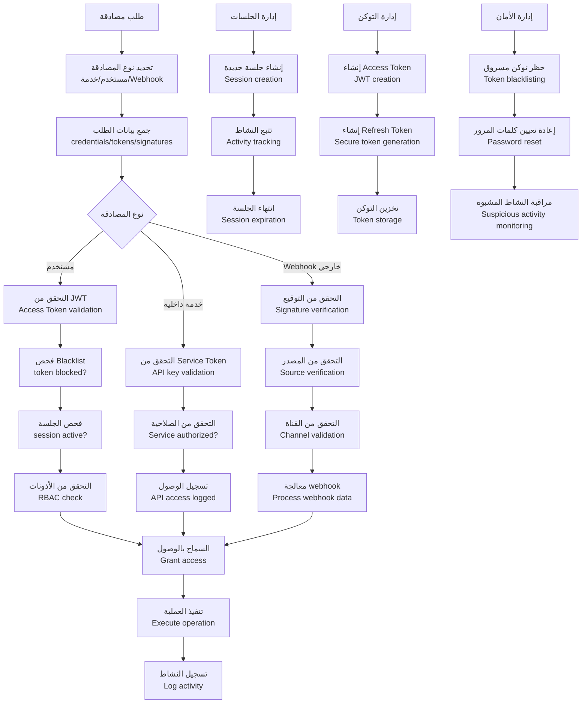
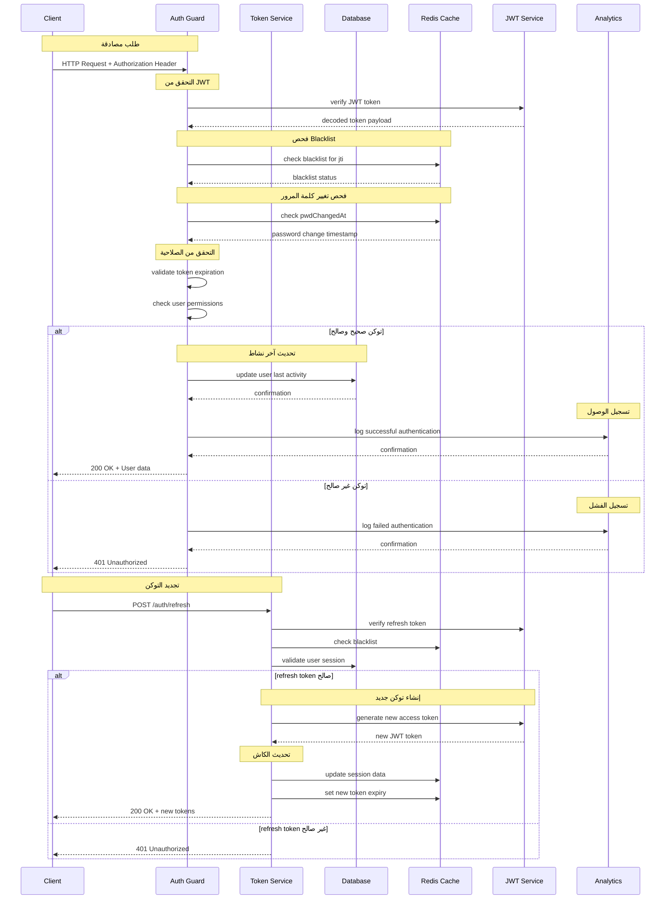
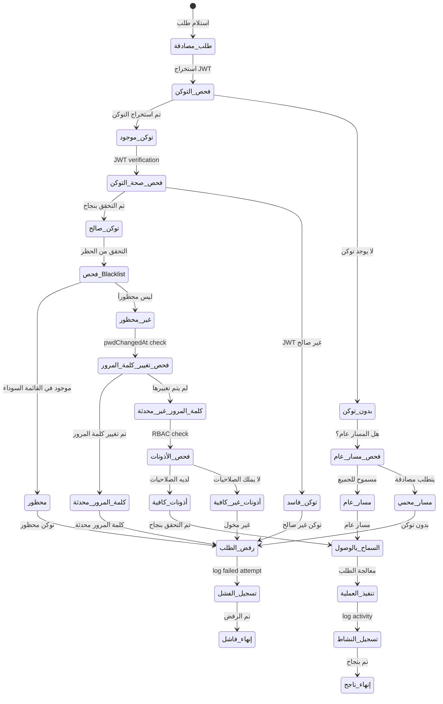
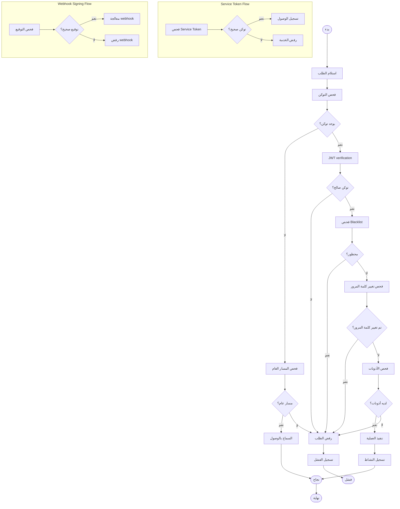

# ورك فلو المصادقة والتفويض - نظام كليم الشامل

## نظرة عامة على النظام

نظام كليم يدعم نظام مصادقة وتفويض متقدم وآمن:

- **JWT Authentication**: مصادقة المستخدمين مع Access و Refresh tokens
- **RBAC**: Role-Based Access Control للأذونات
- **Service Tokens**: مصادقة الخدمات الداخلية
- **Webhook Signing**: التحقق من صحة webhooks من المصادر الخارجية
- **Session Management**: إدارة الجلسات وانتهاء صلاحيتها
- **Blacklist Management**: حظر التوكن المسروقة
- **Password Security**: تشفير كلمات المرور وإعادة تعيينها

## 1. مخطط التدفق العام (Flowchart)



## 2. مخطط التسلسل (Sequence Diagram)



## 3. آلة الحالات (State Machine)



### تعريف الحالات

| الحالة                  | الوصف                       | الإجراءات المسموحة     |
| ----------------------- | --------------------------- | ---------------------- |
| `طلب_مصادقة`            | استلام طلب يتطلب مصادقة     | فحص التوكن والأذونات   |
| `فحص_التوكن`            | استخراج وفحص JWT token      | التحقق من وجود التوكن  |
| `بدون_توكن`             | لا يوجد توكن في الطلب       | فحص إذا كان المسار عام |
| `فحص_مسار_عام`          | التحقق من المسارات العامة   | السماح أو الرفض        |
| `مسار_عام`              | المسار مسموح للجميع         | السماح بالوصول         |
| `مسار_محمي`             | المسار يتطلب مصادقة         | رفض الطلب              |
| `فحص_صحة_التوكن`        | التحقق من صحة JWT           | verification           |
| `توكن_فاسد`             | JWT token غير صالح          | رفض الطلب              |
| `فحص_Blacklist`         | التحقق من القائمة السوداء   | blacklist check        |
| `محظور`                 | التوكن محظور                | رفض الطلب              |
| `غير_محظور`             | التوكن غير محظور            | فحص كلمة المرور        |
| `فحص_تغيير_كلمة_المرور` | فحص تاريخ تغيير كلمة المرور | pwdChangedAt check     |
| `كلمة_المرور_محدثة`     | تم تغيير كلمة المرور        | رفض الطلب              |
| `كلمة_المرور_غير_محدثة` | لم يتم تغيير كلمة المرور    | فحص الأذونات           |
| `فحص_الأذونات`          | التحقق من الأذونات          | RBAC check             |
| `أذونات_كافية`          | المستخدم مخول               | السماح بالوصول         |
| `أذونات_غير_كافية`      | المستخدم غير مخول           | رفض الطلب              |
| `السماح_بالوصول`        | تم التحقق بنجاح             | تنفيذ العملية          |
| `تنفيذ_العملية`         | معالجة الطلب                | execute operation      |
| `تسجيل_النشاط`          | تسجيل النشاط                | log activity           |

## 4. مخطط سير العمل التجاري (BPMN)



## 5. تفاصيل تقنية لكل مرحلة

### 5.1 مرحلة JWT Authentication

#### 5.1.1 إنشاء وإدارة التوكن

```typescript
// إنشاء Access Token
async function createAccessToken(
  userId: string,
  role: string,
  merchantId?: string,
) {
  const payload: JwtPayload = {
    sub: userId,
    role,
    merchantId,
    jti: randomUUID(),
    iat: Math.floor(Date.now() / 1000),
    exp: Math.floor(Date.now() / 1000) + 15 * 60, // 15 دقيقة
    iss: process.env.JWT_ISSUER,
    aud: process.env.JWT_AUDIENCE,
  };

  const token = await jwtService.signAsync(payload);
  return { token, jti: payload.jti };
}

// إنشاء Refresh Token
async function createRefreshToken(userId: string) {
  const payload = {
    sub: userId,
    typ: 'refresh',
    jti: randomUUID(),
    iat: Math.floor(Date.now() / 1000),
    exp: Math.floor(Date.now() / 1000) + 7 * 24 * 60 * 60, // 7 أيام
  };

  const token = await jwtService.signAsync(payload);
  const hashedToken = hashRefreshToken(token);

  return { token, hashedToken, jti: payload.jti };
}
```

#### 5.1.2 فحص صحة التوكن

```typescript
async function validateToken(token: string): Promise<JwtPayload | null> {
  try {
    const decoded = await jwtService.verifyAsync<JwtPayload>(token, {
      secret: process.env.JWT_SECRET,
      issuer: process.env.JWT_ISSUER,
      audience: process.env.JWT_AUDIENCE,
    });

    // فحص Blacklist
    const isBlacklisted = await cacheManager.get(`bl:${decoded.jti}`);
    if (isBlacklisted) {
      return null;
    }

    // فحص تغيير كلمة المرور
    const pwdChangedAt = await cacheManager.get<number>(
      `pwdChangedAt:${decoded.sub}`,
    );
    if (pwdChangedAt && decoded.iat && decoded.iat * 1000 < pwdChangedAt) {
      return null;
    }

    return decoded;
  } catch (error) {
    return null;
  }
}
```

### 5.2 مرحلة RBAC (Role-Based Access Control)

#### 5.2.1 تعريف الأدوار والأذونات

```typescript
enum UserRole {
  ADMIN = 'ADMIN',
  MERCHANT = 'MERCHANT',
  MEMBER = 'MEMBER',
}

const RolePermissions: Record<UserRole, string[]> = {
  [UserRole.ADMIN]: ['*'], // جميع الأذونات
  [UserRole.MERCHANT]: [
    'products:read',
    'products:write',
    'orders:read',
    'orders:write',
    'categories:read',
    'categories:write',
    'customers:read',
  ],
  [UserRole.MEMBER]: ['products:read', 'orders:read'],
};
```

#### 5.2.2 فحص الأذونات

```typescript
function hasPermission(
  userRole: UserRole,
  requiredPermission: string,
): boolean {
  const userPermissions = RolePermissions[userRole];

  if (userPermissions.includes('*')) {
    return true;
  }

  return userPermissions.includes(requiredPermission);
}
```

### 5.3 مرحلة Service Tokens

#### 5.3.1 إنشاء وإدارة Service Tokens

```typescript
async function generateServiceToken(serviceName: string): Promise<string> {
  const payload = {
    sub: serviceName,
    typ: 'service',
    jti: randomUUID(),
    iat: Math.floor(Date.now() / 1000),
    exp: Math.floor(Date.now() / 1000) + 365 * 24 * 60 * 60, // سنة واحدة
  };

  return await jwtService.signAsync(payload);
}
```

#### 5.3.2 فحص Service Token

```typescript
async function validateServiceToken(token: string): Promise<boolean> {
  try {
    const decoded = await jwtService.verifyAsync(token, {
      secret: process.env.JWT_SECRET,
    });

    return decoded.typ === 'service' && decoded.exp > Date.now() / 1000;
  } catch (error) {
    return false;
  }
}
```

### 5.4 مرحلة Webhook Signing

#### 5.4.1 WhatsApp Cloud Webhook Verification

```typescript
async function verifyWhatsAppCloudSignature(
  rawBody: Buffer,
  signature: string,
  appSecret: string,
): Promise<boolean> {
  const expectedSignature = crypto
    .createHmac('sha256', appSecret)
    .update(rawBody)
    .digest('hex');

  return signature === `sha256=${expectedSignature}`;
}
```

#### 5.4.2 Telegram Webhook Verification

```typescript
function verifyTelegramWebhook(
  body: string,
  secretToken: string,
  providedToken?: string,
): boolean {
  if (!providedToken) return false;

  return crypto.timingSafeEqual(
    Buffer.from(providedToken),
    Buffer.from(secretToken),
  );
}
```

#### 5.4.3 Evolution API Webhook Verification

```typescript
function verifyEvolutionWebhook(
  providedApiKey?: string,
  expectedApiKey?: string,
): boolean {
  if (!providedApiKey || !expectedApiKey) return false;

  return crypto.timingSafeEqual(
    Buffer.from(providedApiKey),
    Buffer.from(expectedApiKey),
  );
}
```

### 5.5 مرحلة Session Management

#### 5.5.1 إنشاء الجلسات

```typescript
async function createSession(
  userId: string,
  ip: string,
  userAgent: string,
): Promise<SessionData> {
  const sessionId = randomUUID();
  const sessionData: SessionData = {
    id: sessionId,
    userId,
    ip,
    userAgent,
    createdAt: new Date(),
    lastActivity: new Date(),
    isActive: true,
  };

  await sessionStore.set(sessionId, sessionData, 7 * 24 * 60 * 60); // 7 أيام
  return sessionData;
}
```

#### 5.5.2 تحديث النشاط

```typescript
async function updateSessionActivity(sessionId: string): Promise<void> {
  const session = await sessionStore.get(sessionId);
  if (session) {
    session.lastActivity = new Date();
    await sessionStore.set(sessionId, session, 7 * 24 * 60 * 60);
  }
}
```

#### 5.5.3 إنهاء الجلسات

```typescript
async function terminateSession(
  sessionId: string,
  reason: string,
): Promise<void> {
  const session = await sessionStore.get(sessionId);
  if (session) {
    session.isActive = false;
    session.terminatedAt = new Date();
    session.terminationReason = reason;
    await sessionStore.set(sessionId, session, 24 * 60 * 60); // احتفظ ليوم واحد
  }
}
```

### 5.6 مرحلة إدارة الأمان

#### 5.6.1 حظر التوكن

```typescript
async function blacklistToken(
  jti: string,
  reason: string,
  expirySeconds: number,
): Promise<void> {
  await cacheManager.set(
    `bl:${jti}`,
    {
      reason,
      blacklistedAt: Date.now(),
      expiry: Date.now() + expirySeconds * 1000,
    },
    expirySeconds,
  );
}
```

#### 5.6.2 إدارة تغيير كلمات المرور

```typescript
async function handlePasswordChange(userId: string): Promise<void> {
  const timestamp = Date.now();
  await cacheManager.set(
    `pwdChangedAt:${userId}`,
    timestamp,
    30 * 24 * 60 * 60,
  ); // 30 يوم

  // حظر جميع الجلسات النشطة
  const userSessions = await sessionStore.getUserSessions(userId);
  for (const session of userSessions) {
    await blacklistToken(session.jti, 'password_changed', 24 * 60 * 60);
    await terminateSession(session.id, 'password_changed');
  }
}
```

## 6. معايير الأمان والحماية

### 6.1 تشفير كلمات المرور

```typescript
async function hashPassword(password: string): Promise<string> {
  const saltRounds = 12;
  return await bcrypt.hash(password, saltRounds);
}

async function verifyPassword(
  password: string,
  hash: string,
): Promise<boolean> {
  return await bcrypt.compare(password, hash);
}
```

### 6.2 Rate Limiting

- **طلبات المصادقة**: 5 محاولات/دقيقة لكل IP
- **تجديد التوكن**: 10 طلبات/دقيقة لكل مستخدم
- **Webhook verification**: 100 طلب/دقيقة لكل مصدر

### 6.3 حماية من الهجمات

```typescript
// منع brute force
const loginAttempts = await cacheManager.get(`login_attempts:${ip}`);
if (loginAttempts > 5) {
  await cacheManager.set(`blocked:${ip}`, true, 15 * 60); // حظر 15 دقيقة
  throw new TooManyRequestsException('Too many attempts');
}
```

## 7. مسارات الخطأ والتعامل معها

### 7.1 أخطاء JWT

```javascript
INVALID_TOKEN_FORMAT; // تنسيق التوكن خاطئ
TOKEN_EXPIRED; // انتهت صلاحية التوكن
TOKEN_BLACKLISTED; // التوكن محظور
INVALID_ISSUER; // المُصدر غير صحيح
INVALID_AUDIENCE; // الجمهور غير صحيح
```

### 7.2 أخطاء RBAC

```javascript
INSUFFICIENT_PERMISSIONS; // أذونات غير كافية
ROLE_NOT_AUTHORIZED; // الدور غير مخول
RESOURCE_NOT_ACCESSIBLE; // المورد غير متاح
```

### 7.3 أخطاء Webhook

```javascript
INVALID_SIGNATURE; // التوقيع غير صحيح
UNKNOWN_SOURCE; // مصدر غير معروف
CHANNEL_DISABLED; // القناة معطلة
WEBHOOK_EXPIRED; // webhook منتهي الصلاحية
```

## 8. خطة الاختبار والتحقق

### 8.1 اختبارات الوحدة

- اختبار إنشاء وفحص JWT tokens
- اختبار نظام RBAC
- اختبار Service token validation
- اختبار Webhook signature verification

### 8.2 اختبارات التكامل

- اختبار تدفق المصادقة الكامل
- اختبار تجديد التوكن
- اختبار حظر التوكن
- اختبار معالجة الأخطاء

### 8.3 اختبارات الأداء

- اختبار أداء فحص التوكن
- اختبار أداء البحث في Blacklist
- اختبار أداء RBAC checks
- اختبار استهلاك الذاكرة

---

_تم إنشاء هذا التوثيق بواسطة نظام كليم لإدارة المتاجر الذكية_
