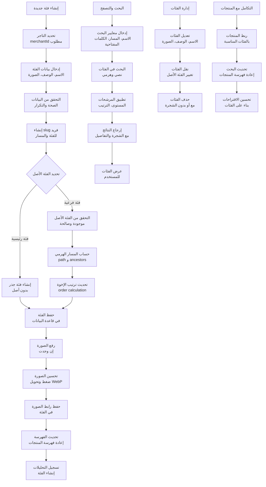
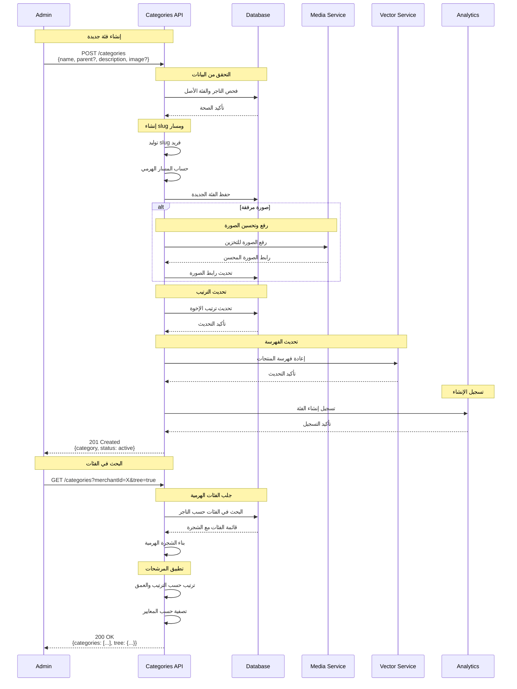
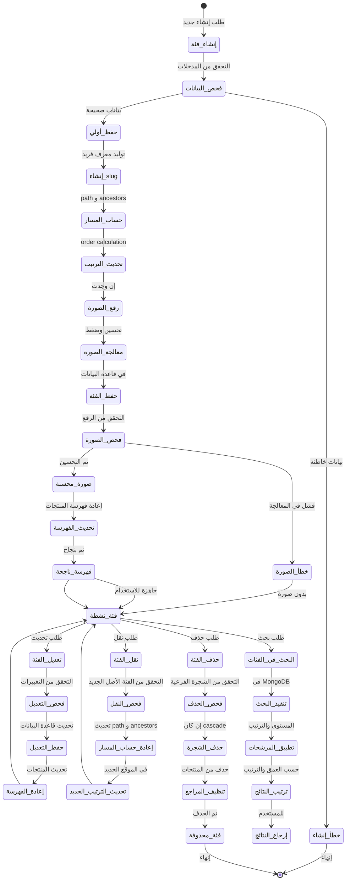
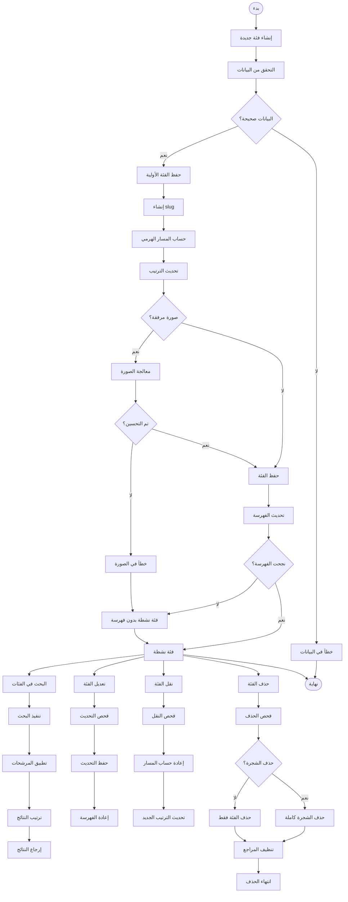

# ورك فلو إدارة الفئات - نظام كليم الشامل

## نظرة عامة على النظام

نظام كليم يدعم إدارة شاملة للفئات مع هيكل هرمي متقدم:

- **التسلسل الهرمي**: فئات رئيسية وفرعية متعددة المستويات
- **إدارة الصور**: رفع وتحسين صور الفئات
- **البحث والتصفح**: في الفئات والفئات الفرعية
- **التكامل مع المنتجات**: ربط الفئات بالمنتجات
- **التحقق من الأذونات**: للتاجر المالك فقط
- **الأداء المحسن**: فهارس متقدمة للبحث السريع

## 1. مخطط التدفق العام (Flowchart)



## 2. مخطط التسلسل (Sequence Diagram)



## 3. آلة الحالات (State Machine)



### تعريف الحالات

| الحالة            | الوصف                          | الإجراءات المسموحة      |
| ----------------- | ------------------------------ | ----------------------- |
| `إنشاء_فئة`       | بدء عملية إنشاء فئة جديدة      | جمع البيانات والتحقق    |
| `فحص_البيانات`    | التحقق من صحة البيانات المدخلة | التحقق من الاسم والتاجر |
| `حفظ_أولي`        | حفظ الفئة في قاعدة البيانات    | إدراج السجل الأولي      |
| `إنشاء_slug`      | توليد slug فريد للفئة          | slugify الاسم           |
| `حساب_المسار`     | حساب المسار الهرمي             | path و ancestors        |
| `تحديث_الترتيب`   | تحديث ترتيب الإخوة             | order calculation       |
| `رفع_الصورة`      | رفع صورة الفئة                 | للتخزين السحابي         |
| `معالجة_الصورة`   | تحسين وضغط الصورة              | WebP conversion         |
| `حفظ_الفئة`       | حفظ الفئة النهائية             | تحديث قاعدة البيانات    |
| `فحص_الصورة`      | التحقق من معالجة الصورة        | اختبار الرفع            |
| `تحديث_الفهرسة`   | تحديث فهرسة المنتجات           | إعادة الفهرسة           |
| `فئة_نشطة`        | الفئة جاهزة ومتاحة             | جميع العمليات           |
| `تعديل_الفئة`     | طلب تحديث الفئة                | تعديل البيانات          |
| `نقل_الفئة`       | طلب نقل الفئة                  | تغيير الفئة الأصل       |
| `حذف_الفئة`       | طلب حذف الفئة                  | إزالة الفئة             |
| `البحث_في_الفئات` | طلب بحث في الفئات              | تنفيذ الاستعلام         |

## 4. مخطط سير العمل التجاري (BPMN)



## 5. تفاصيل تقنية لكل مرحلة

### 5.1 مرحلة الإنشاء والإعداد

#### 5.1.1 إنشاء فئة جديدة

**Endpoint**: `POST /categories`

**البيانات المطلوبة**:

```typescript
interface CreateCategoryDto {
  name: string; // اسم الفئة (مطلوب)
  merchantId: string; // معرف التاجر (مطلوب)
  parent?: string; // معرف الفئة الأصل (اختياري)
  description?: string; // وصف الفئة (اختياري)
  image?: string; // رابط صورة الفئة (اختياري)
  keywords?: string[]; // كلمات مفتاحية (اختياري)
  slug?: string; // slug مخصص (اختياري)
  order?: number; // ترتيب الفئة (اختياري)
}
```

**عملية الإنشاء**:

```typescript
async function createCategory(categoryData: CreateCategoryDto) {
  // 1. توليد slug فريد
  const slug =
    categoryData.slug ||
    slugify(categoryData.name, { lower: true, strict: true, locale: 'ar' });

  // 2. حساب المسار الهرمي
  const { ancestors, depth, path } = await computePathAncestors(
    categoryData.merchantId,
    categoryData.parent,
    slug,
  );

  // 3. إنشاء الفئة
  const category = await categoriesRepo.createCategory({
    name: categoryData.name,
    merchantId: new Types.ObjectId(categoryData.merchantId),
    parent: categoryData.parent
      ? new Types.ObjectId(categoryData.parent)
      : null,
    description: categoryData.description,
    keywords: categoryData.keywords,
    slug,
    path,
    ancestors,
    depth,
    order: categoryData.order || 0,
  });

  // 4. تحديث ترتيب الإخوة
  await normalizeSiblingsOrders(category.merchantId, category.parent);

  return category;
}
```

#### 5.1.2 حساب المسار الهرمي

```typescript
async function computePathAncestors(
  merchantId: Types.ObjectId,
  parentId?: string | null,
  slug?: string,
): Promise<{ ancestors: Types.ObjectId[]; depth: number; path: string }> {
  let ancestors: Types.ObjectId[] = [];
  let depth = 0;
  let basePath = '';

  if (parentId) {
    const parent = await categoriesRepo.findLeanByIdForMerchant(
      parentId,
      merchantId,
    );
    if (!parent) {
      throw new BadRequestException('Parent category not found');
    }

    ancestors = [...(parent.ancestors || []), parent._id];
    depth = ancestors.length;
    basePath = parent.path || '';
  }

  const path = basePath ? `${basePath}/${slug}` : slug || '';

  return { ancestors, depth, path };
}
```

#### 5.1.3 رفع صورة الفئة

**Endpoint**: `POST /categories/{id}/image`

```typescript
async function uploadCategoryImage(
  categoryId: string,
  merchantId: string,
  file: Express.Multer.File,
) {
  // 1. التحقق من صحة الملف
  if (file.size > 2 * 1024 * 1024) {
    // 2MB
    throw new BadRequestException('File too large');
  }

  if (!['image/jpeg', 'image/png', 'image/webp'].includes(file.mimetype)) {
    throw new BadRequestException('Invalid file type');
  }

  // 2. معالجة الصورة
  const optimizedBuffer = await sharp(file.path)
    .resize(800, 600, { fit: 'cover' })
    .webp({ quality: 80 })
    .toBuffer();

  // 3. رفع للتخزين السحابي
  const fileName = `categories/${merchantId}/${Date.now()}.webp`;
  await minio.putObject(bucket, fileName, optimizedBuffer);

  // 4. تحديث الفئة
  await categoriesRepo.updateCategoryFields(
    new Types.ObjectId(categoryId),
    new Types.ObjectId(merchantId),
    { image: `https://${minioEndPoint}/${bucket}/${fileName}` },
  );

  return { url: `https://${minioEndPoint}/${bucket}/${fileName}` };
}
```

### 5.2 مرحلة البحث والتصفح

#### 5.2.1 البحث في الفئات

**Endpoint**: `GET /categories?merchantId=X&tree=true`

```typescript
async function findAllTree(merchantId: string) {
  const categories = await categoriesRepo.findAllByMerchant(
    new Types.ObjectId(merchantId),
  );

  // بناء الشجرة الهرمية
  const tree = buildCategoryTree(categories);
  return tree;
}

function buildCategoryTree(categories: CategoryDocument[]): CategoryTree[] {
  const map = new Map<string, CategoryTree>();
  const roots: CategoryTree[] = [];

  // إنشاء خريطة لجميع الفئات
  categories.forEach((category) => {
    map.set(category._id.toString(), {
      ...category.toObject(),
      children: [],
    });
  });

  // بناء الشجرة
  categories.forEach((category) => {
    const categoryNode = map.get(category._id.toString())!;

    if (category.parent) {
      const parent = map.get(category.parent.toString());
      if (parent) {
        parent.children.push(categoryNode);
      }
    } else {
      roots.push(categoryNode);
    }
  });

  return roots;
}
```

#### 5.2.2 البحث بالنص

```typescript
async function searchCategories(
  merchantId: string,
  query: string,
): Promise<CategoryDocument[]> {
  return categoriesRepo
    .find({
      merchantId: new Types.ObjectId(merchantId),
      $text: { $search: query },
    })
    .sort({ score: { $meta: 'textScore' } });
}
```

### 5.3 مرحلة إدارة الفئات

#### 5.3.1 نقل الفئة

**Endpoint**: `PATCH /categories/{id}/move`

```typescript
async function moveCategory(
  categoryId: string,
  merchantId: string,
  moveData: MoveCategoryDto,
) {
  const category = await categoriesRepo.findByIdForMerchant(
    categoryId,
    merchantId,
  );
  const newParent = moveData.parentId
    ? await categoriesRepo.findByIdForMerchant(moveData.parentId, merchantId)
    : null;

  // التحقق من عدم النقل لنفسها أو لفرع منها
  if (
    await categoriesRepo.isDescendant(categoryId, moveData.parentId, merchantId)
  ) {
    throw new BadRequestException('Cannot move category to its own subtree');
  }

  // إعادة حساب المسار الجديد
  const { ancestors, depth, path } = await computePathAncestors(
    merchantId,
    moveData.parentId,
    category.slug,
  );

  // تحديث الفئة
  await categoriesRepo.updateCategoryFields(category._id, merchantId, {
    parent: moveData.parentId ? new Types.ObjectId(moveData.parentId) : null,
    ancestors,
    depth,
    path,
  });

  // إعادة ترتيب الإخوة
  await normalizeSiblingsOrders(merchantId, category.parent);
  await normalizeSiblingsOrders(merchantId, moveData.parentId);

  return category;
}
```

#### 5.3.2 حذف الفئة

**Endpoint**: `DELETE /categories/{id}`

```typescript
async function removeCategory(
  categoryId: string,
  merchantId: string,
  cascade: boolean = false,
) {
  const category = await categoriesRepo.findByIdForMerchant(
    categoryId,
    merchantId,
  );

  if (cascade) {
    // حذف الشجرة الفرعية كاملة
    const subtreeIds = await categoriesRepo.findSubtreeIds(
      new Types.ObjectId(merchantId),
      category._id,
    );

    await categoriesRepo.deleteManyByIds(
      new Types.ObjectId(merchantId),
      subtreeIds,
    );
  } else {
    // حذف الفئة فقط (يتطلب أن تكون فارغة)
    if (
      await categoriesRepo.anyProductsInCategories(merchantId, [category._id])
    ) {
      throw new BadRequestException('Cannot delete category with products');
    }

    await categoriesRepo.deleteManyByIds(new Types.ObjectId(merchantId), [
      category._id,
    ]);
  }

  return { message: 'Category deleted successfully' };
}
```

### 5.4 مرحلة التكامل مع المنتجات

#### 5.4.1 ربط المنتجات بالفئات

```typescript
async function linkProductsToCategories(
  productIds: string[],
  categoryId: string,
) {
  await productsRepo.updateMany(
    { _id: { $in: productIds } },
    { $set: { category: new Types.ObjectId(categoryId) } },
  );

  // إعادة فهرسة المنتجات
  await vectorService.reindexProducts(productIds);
}
```

#### 5.4.2 البحث في الفئات والمنتجات

```typescript
async function searchInCategoryAndProducts(
  merchantId: string,
  categoryId: string,
  query: string,
) {
  // البحث في الفئة
  const categoryResults = await categoriesRepo.searchInCategory(
    merchantId,
    categoryId,
    query,
  );

  // البحث في المنتجات
  const productResults = await productsRepo.searchInCategory(
    merchantId,
    categoryId,
    query,
  );

  return {
    categories: categoryResults,
    products: productResults,
  };
}
```

## 6. معايير الأمان والحماية

### 6.1 التحقق من الملكية

```typescript
// التحقق من صلاحية التاجر للوصول للفئة
const category = await categoriesService.findOne(categoryId, merchantId);
const user = await getCurrentUser();

if (category.merchantId.toString() !== merchantId && user.role !== 'ADMIN') {
  throw new ForbiddenException('Access denied');
}
```

### 6.2 Rate Limiting

- **إنشاء الفئات**: 20 فئة/ساعة لكل تاجر
- **تحديث الفئات**: 50 تحديث/ساعة لكل تاجر
- **البحث في الفئات**: 200 طلب/ساعة لكل تاجر

### 6.3 منع العمليات الخطرة

```typescript
// منع نقل الفئة لفرع منها
if (await categoriesRepo.isDescendant(categoryId, newParentId, merchantId)) {
  throw new BadRequestException('Cannot move category to its own subtree');
}

// منع حذف الفئة التي تحتوي على منتجات
if (await categoriesRepo.anyProductsInCategories(merchantId, [categoryId])) {
  throw new BadRequestException('Cannot delete category with products');
}
```

## 7. مسارات الخطأ والتعامل معها

### 7.1 أخطاء الإنشاء

```javascript
INVALID_CATEGORY_DATA; // بيانات الفئة غير صحيحة
DUPLICATE_SLUG; // slug موجود مسبقاً
PARENT_NOT_FOUND; // الفئة الأصل غير موجودة
MERCHANT_NOT_FOUND; // التاجر غير موجود
```

### 7.2 أخطاء الرفع

```javascript
FILE_TOO_LARGE; // الملف كبير جداً
INVALID_FILE_TYPE; // نوع الملف غير مدعوم
IMAGE_PROCESSING_FAILED; // فشل في معالجة الصورة
```

### 7.3 أخطاء النقل والحذف

```javascript
CANNOT_MOVE_TO_SUBTREE; // لا يمكن النقل لفرع منها
CATEGORY_HAS_PRODUCTS; // الفئة تحتوي على منتجات
CATEGORY_NOT_EMPTY; // الفئة ليست فارغة
```

## 8. خطة الاختبار والتحقق

### 8.1 اختبارات الوحدة

- اختبار إنشاء الفئات الهرمية
- اختبار حساب المسار والأجداد
- اختبار رفع ومعالجة الصور
- اختبار البحث في الفئات

### 8.2 اختبارات التكامل

- اختبار التكامل مع المنتجات
- اختبار التكامل مع Qdrant
- اختبار إعادة الفهرسة
- اختبار معالجة الأخطاء

### 8.3 اختبارات الأداء

- اختبار البحث في الفئات الكبيرة
- اختبار بناء الشجرة الهرمية
- اختبار معالجة الصور بالجملة
- اختبار استهلاك الذاكرة

---

_تم إنشاء هذا التوثيق بواسطة نظام كليم لإدارة المتاجر الذكية_
