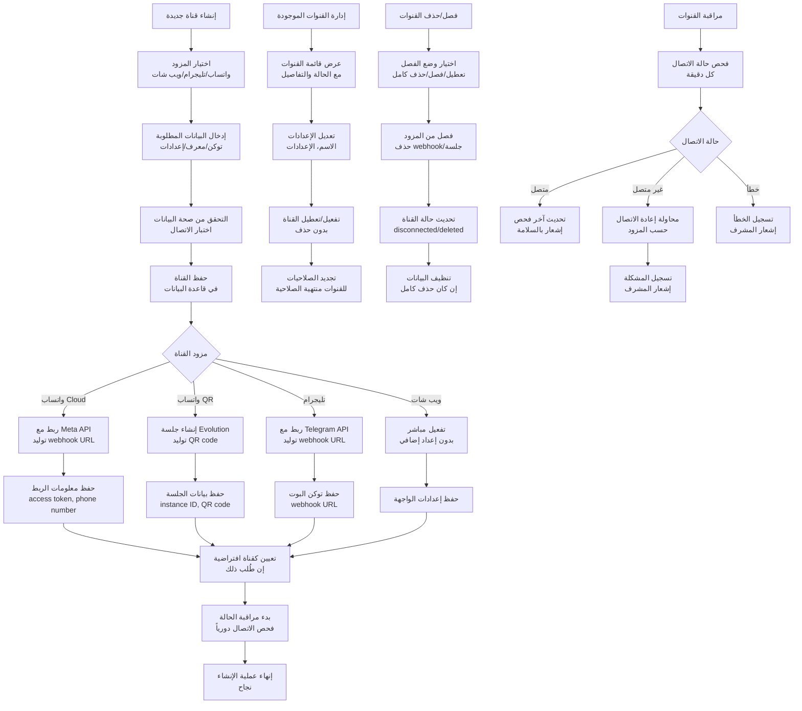
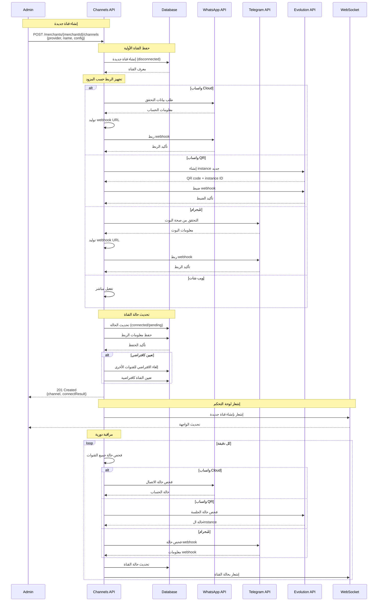
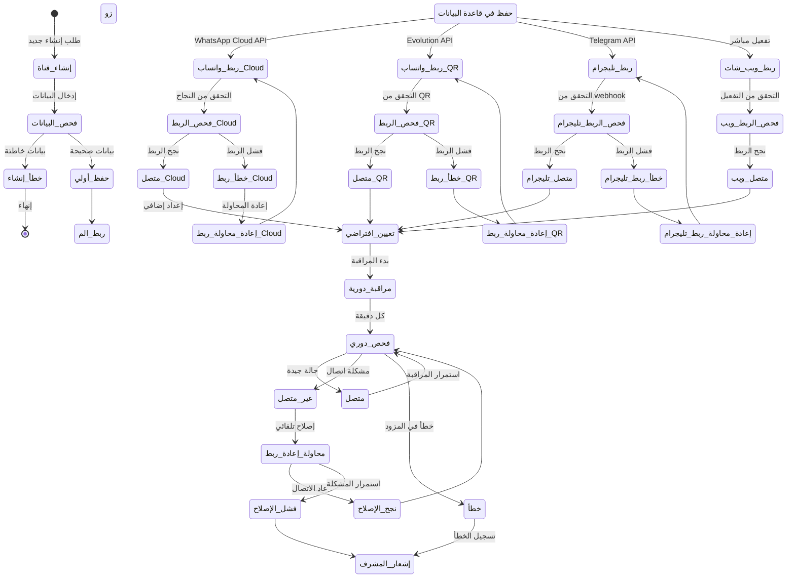
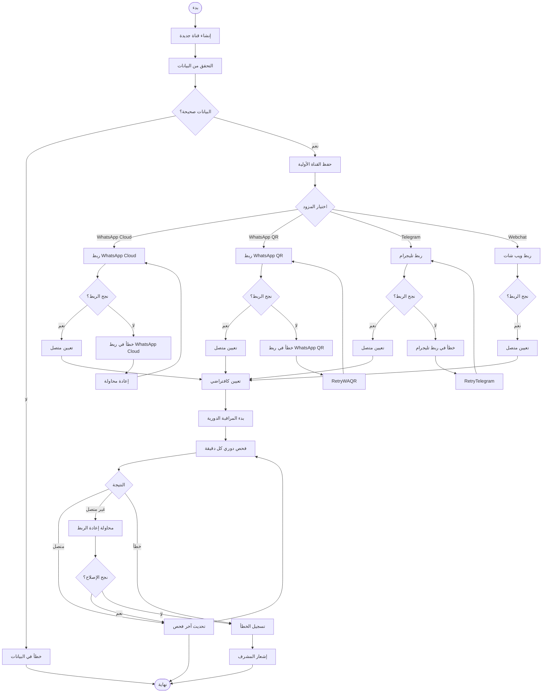

# ورك فلو إدارة القنوات - نظام كليم الشامل

## نظرة عامة على النظام

نظام كليم يدعم إدارة شاملة للقنوات متعددة المنصات مع تكامل متقدم:

- **قنوات مدعومة**: واتساب (Cloud API + QR)، تليجرام، ويب شات، إنستاجرام، ماسنجر
- **إدارة الاتصال**: ربط وفصل القنوات بأمان
- **حالة القنوات**: مراقبة الاتصال والأداء
- **إعدادات مخصصة**: تخصيص كل قناة حسب الاحتياجات
- **أمان متقدم**: تشفير الأسرار وإدارة الأذونات

## 1. مخطط التدفق العام (Flowchart)



## 2. مخطط التسلسل (Sequence Diagram)



## 3. آلة الحالات (State Machine)



### تعريف الحالات

| الحالة             | الوصف                          | الإجراءات المسموحة           |
| ------------------ | ------------------------------ | ---------------------------- |
| `إنشاء_قناة`       | بدء عملية إنشاء قناة جديدة     | جمع البيانات المطلوبة        |
| `فحص_البيانات`     | التحقق من صحة البيانات المدخلة | التحقق من التوكن والمعرفات   |
| `حفظ_أولي`         | حفظ القناة في قاعدة البيانات   | إدراج السجل الأولي           |
| `ربط_الم زو د`     | بدء عملية الربط مع المزود      | استدعاء API المزود           |
| `ربط_واتساب_Cloud` | ربط مع WhatsApp Cloud API      | طلب الصلاحيات وإعداد webhook |
| `ربط_واتساب_QR`    | إنشاء جلسة Evolution API       | توليد QR code وinstance      |
| `ربط_تليجرام`      | ربط مع Telegram Bot API        | إعداد webhook للبوت          |
| `ربط_ويب_شات`      | تفعيل قناة الويب شات           | تفعيل مباشر بدون إعداد       |
| `فحص_الربط_*`      | التحقق من نجاح عملية الربط     | اختبار الاتصال               |
| `متصل_*`           | القناة متصلة وتعمل بنجاح       | بدء المراقبة الدورية         |
| `مراقبة_دورية`     | مراقبة حالة القناة دورياً      | فحص كل دقيقة                 |
| `فحص_دوري`         | فحص حالة الاتصال               | التحقق من المزود             |
| `غير_متصل`         | القناة غير متصلة               | محاولة إعادة الربط           |
| `خطأ`              | خطأ في القناة أو المزود        | إشعار المشرف                 |
| `محاولة_إعادة_ربط` | محاولة إصلاح المشكلة تلقائياً  | إعادة الربط مع المزود        |
| `تعيين_افتراضي`    | تعيين القناة كافتراضية         | تحديث قاعدة البيانات         |

## 4. مخطط سير العمل التجاري (BPMN)



## 5. تفاصيل تقنية لكل مرحلة

### 5.1 مرحلة الإنشاء والإعداد

#### 5.1.1 إنشاء القناة

**Endpoint**: `POST /merchants/{merchantId}/channels`

**البيانات المطلوبة**:

```typescript
interface CreateChannelDto {
  provider: 'whatsapp_cloud' | 'whatsapp_qr' | 'telegram' | 'webchat';
  accountLabel?: string; // اسم القناة
  isDefault?: boolean; // تعيين كافتراضي
  // بيانات إضافية حسب المزود
  accessToken?: string; // لواتساب Cloud
  phoneNumberId?: string; // لواتساب Cloud
  botToken?: string; // تليجرام
  widgetSettings?: object; // ويب شات
}
```

#### 5.1.2 حفظ القناة الأولية

```typescript
const channel = await channelsRepo.create({
  merchantId: new Types.ObjectId(merchantId),
  provider: dto.provider,
  accountLabel: dto.accountLabel,
  isDefault: dto.isDefault,
  enabled: false,
  status: 'disconnected',
});
```

### 5.2 مرحلة ربط القنوات

#### 5.2.1 ربط واتساب Cloud API

```typescript
// ربط مع Meta Graph API
await axios.post(
  `https://graph.facebook.com/v19.0/${phoneNumberId}/subscribed_apps`,
  {},
  { headers: { Authorization: `Bearer ${accessToken}` } },
);

// إعداد webhook
const webhookUrl = `${baseUrl}/webhooks/whatsapp_cloud/${channelId}`;
await axios.post(
  `https://graph.facebook.com/v19.0/${appId}/subscriptions`,
  {
    object: 'whatsapp_business_account',
    callback_url: webhookUrl,
    verify_token: verifyToken,
    fields: ['messages', 'message_deliveries', 'message_echoes'],
  },
  { headers: { Authorization: `Bearer ${accessToken}` } },
);
```

#### 5.2.2 ربط واتساب QR (Evolution API)

```typescript
// إنشاء instance جديد
const { qr, instanceId } = await evolutionService.startSession(
  instanceName,
  token,
);

// ضبط webhook
await evolutionService.setWebhook(instanceName, webhookUrl, [
  'MESSAGES_UPSERT',
]);

// حفظ البيانات
channel.sessionId = instanceName;
channel.instanceId = instanceId;
channel.qr = qr;
channel.accessTokenEnc = encryptSecret(token);
```

#### 5.2.3 ربط تليجرام

```typescript
// التحقق من صحة البوت
const botInfo = await axios.get(
  `https://api.telegram.org/bot${botToken}/getMe`,
);

// إعداد webhook
await axios.get(`https://api.telegram.org/bot${botToken}/setWebhook`, {
  params: {
    url: webhookUrl,
    secret_token: process.env.TELEGRAM_WEBHOOK_SECRET,
    drop_pending_updates: true,
    allowed_updates: ['message', 'edited_message'],
  },
});

// حفظ البيانات
channel.botTokenEnc = encryptSecret(botToken);
channel.webhookUrl = webhookUrl;
```

#### 5.2.4 ربط ويب شات

```typescript
// تفعيل مباشر بدون إعداد إضافي
channel.widgetSettings = dto.widgetSettings || {};
channel.enabled = true;
channel.status = 'connected';
```

### 5.3 مرحلة المراقبة والصيانة

#### 5.3.1 مراقبة الحالة الدورية

```typescript
// فحص كل دقيقة
async function checkChannelStatus(channel: ChannelDocument) {
  try {
    switch (channel.provider) {
      case 'whatsapp_cloud':
        return await checkWhatsAppCloudStatus(channel);
      case 'whatsapp_qr':
        return await checkWhatsAppQRStatus(channel);
      case 'telegram':
        return await checkTelegramStatus(channel);
      case 'webchat':
        return await checkWebchatStatus(channel);
    }
  } catch (error) {
    await logChannelError(channel, error);
    return 'error';
  }
}
```

#### 5.3.2 إعادة الربط التلقائي

```typescript
// محاولة إعادة الربط للقنوات غير المتصلة
async function attemptReconnection(channel: ChannelDocument) {
  const adapter = getAdapter(channel.provider);

  try {
    await adapter.connect(channel);
    await updateChannelStatus(channel, 'connected');
    await notifyAdmin('channel_reconnected', channel);
  } catch (error) {
    await updateChannelStatus(channel, 'error');
    await logReconnectionFailure(channel, error);
  }
}
```

### 5.4 مرحلة إدارة القنوات

#### 5.4.1 تعيين القناة كافتراضية

```typescript
// إلغاء الافتراضي للقنوات الأخرى
await channelsRepo.unsetDefaults(channel.merchantId, channel.provider);

// تعيين القناة الجديدة كافتراضية
channel.isDefault = true;
await channel.save();
```

#### 5.4.2 تعديل إعدادات القناة

```typescript
async function updateChannel(channelId: string, updates: UpdateChannelDto) {
  const channel = await channelsRepo.findById(channelId);

  if (updates.accountLabel) channel.accountLabel = updates.accountLabel;
  if (updates.enabled !== undefined) channel.enabled = updates.enabled;
  if (updates.widgetSettings) channel.widgetSettings = updates.widgetSettings;

  await channel.save();
  return channel;
}
```

#### 5.4.3 حذف/فصل القناة

```typescript
async function removeChannel(
  channelId: string,
  mode: 'disable' | 'disconnect' | 'wipe',
) {
  const channel = await channelsRepo.findById(channelId);
  const adapter = getAdapter(channel.provider);

  // فصل من المزود
  await adapter.disconnect(channel, mode);

  if (mode === 'wipe') {
    // حذف كامل من قاعدة البيانات
    await channelsRepo.deleteOneById(channel._id);
    return { deleted: true };
  }

  return { ok: true };
}
```

### 5.5 مرحلة إرسال الرسائل

#### 5.5.1 توجيه الرسائل للقنوات المناسبة

```typescript
async function dispatchMessage(
  merchantId: string,
  channel: string,
  sessionId: string,
  text: string,
) {
  const defaultChannel = await channelsRepo.findDefault(
    new Types.ObjectId(merchantId),
    channel as ChannelProvider,
  );

  if (!defaultChannel?.enabled) {
    throw new Error('No active channel found');
  }

  const adapter = getAdapter(defaultChannel.provider);
  await adapter.sendMessage(defaultChannel, sessionId, text);
}
```

#### 5.5.2 إرسال عبر واتساب Cloud API

```typescript
async function sendWhatsAppCloudMessage(
  channel: ChannelDocument,
  to: string,
  text: string,
) {
  const token = decryptSecret(channel.accessTokenEnc!);
  const phoneNumberId = channel.phoneNumberId!;

  await axios.post(
    `https://graph.facebook.com/v19.0/${phoneNumberId}/messages`,
    {
      messaging_product: 'whatsapp',
      to,
      type: 'text',
      text: { body: text },
    },
    { headers: { Authorization: `Bearer ${token}` } },
  );
}
```

#### 5.5.3 إرسال عبر تليجرام

```typescript
async function sendTelegramMessage(
  channel: ChannelDocument,
  to: string,
  text: string,
) {
  const token = decryptSecret(channel.botTokenEnc!);

  await axios.post(`https://api.telegram.org/bot${token}/sendMessage`, {
    chat_id: to,
    text,
    parse_mode: 'HTML',
  });
}
```

## 6. معايير الأمان والحماية

### 6.1 تشفير الأسرار

```typescript
// تشفير جميع الأسرار قبل الحفظ
const encryptedToken = encryptSecret(token);
const hashedSecret = hashSecret(secret);

// فك التشفير عند الحاجة فقط
const decryptedToken = decryptSecret(encryptedToken);
```

### 6.2 التحقق من الأذونات

```typescript
// التحقق من صلاحية المستخدم
const user = await getCurrentUser();
const merchant = await merchantsRepo.findById(merchantId);

if (!canAccessMerchant(user, merchant)) {
  throw new ForbiddenException('Access denied');
}
```

### 6.3 Rate Limiting

- **إنشاء القنوات**: 5 قنوات/ساعة لكل تاجر
- **تحديث القنوات**: 10 تحديثات/دقيقة
- **فحص الحالة**: 60 فحص/دقيقة

## 7. مسارات الخطأ والتعامل معها

### 7.1 أخطاء الإنشاء

```javascript
INVALID_PROVIDER; // مزود غير مدعوم
MISSING_CREDENTIALS; // بيانات الربط ناقصة
DUPLICATE_CHANNEL; // قناة موجودة مسبقاً
MERCHANT_NOT_FOUND; // التاجر غير موجود
```

### 7.2 أخطاء الربط

```javascript
CONNECTION_FAILED; // فشل الربط مع المزود
INVALID_TOKEN; // توكن غير صحيح
WEBHOOK_SETUP_FAILED; // فشل إعداد webhook
QR_GENERATION_FAILED; // فشل توليد QR code
```

### 7.3 أخطاء التشغيل

```javascript
CHANNEL_DISCONNECTED; // القناة غير متصلة
SEND_FAILED; // فشل إرسال الرسالة
RATE_LIMIT_EXCEEDED; // تجاوز حد الرسائل
INVALID_SESSION; // جلسة غير صحيحة
```

## 8. خطة الاختبار والتحقق

### 8.1 اختبارات الوحدة

- اختبار إنشاء القنوات لكل مزود
- اختبار ربط القنوات مع المزودين
- اختبار فك وتشفير الأسرار
- اختبار مراقبة الحالة

### 8.2 اختبارات التكامل

- اختبار التدفق الكامل للقنوات
- اختبار webhook endpoints
- اختبار إرسال الرسائل
- اختبار معالجة الأخطاء

### 8.3 اختبارات الأداء

- اختبار الحمل على إنشاء القنوات
- اختبار مراقبة الحالة الدورية
- اختبار استهلاك الذاكرة
- اختبار زمن الاستجابة

---

_تم إنشاء هذا التوثيق بواسطة نظام كليم لإدارة المتاجر الذكية_
