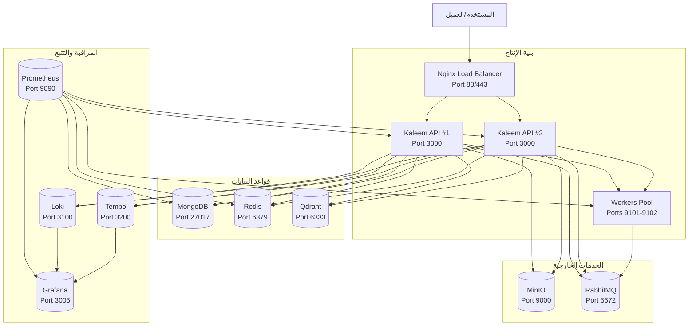
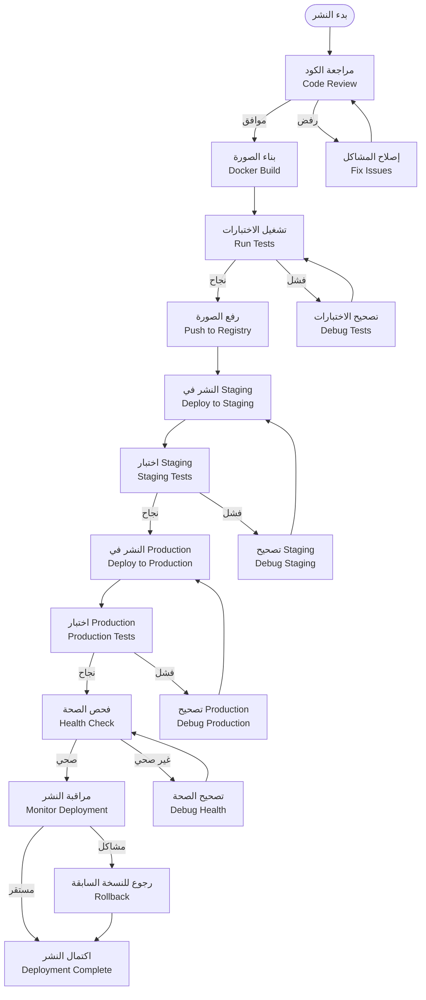
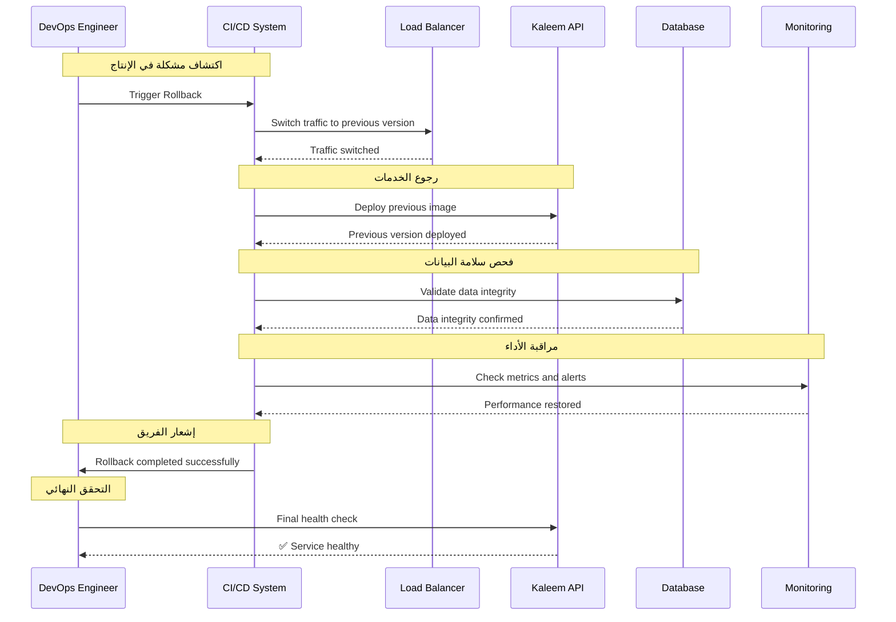
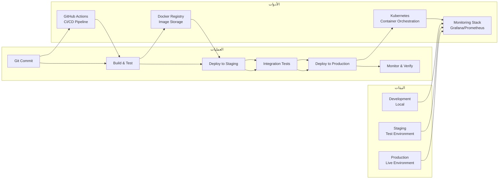

# نظام CI/CD والتشغيل (Docker Compose/Nginx/Secrets/Envs/Staging→Prod) - نظام كليم

## نظرة عامة على النظام

نظام كليم يدعم بنية تحتية متقدمة للنشر والتشغيل مع CI/CD آلي:

- **Docker Compose**: إدارة الحاويات المحلية والإنتاج
- **Nginx Load Balancer**: توزيع الطلبات وتوازن الحمل
- **Secrets Management**: إدارة آمنة للأسرار والتوكنات
- **Environment Variables**: تكوين البيئات المختلفة
- **Staging → Production**: مسار النشر من التطوير للإنتاج
- **Automated Deployment**: نشر آلي مع فحوصات الصحة

## 1. مخطط النشر (Deployment Diagram)



## 2. مخطط تدفق النشر (Release Flowchart)



## 3. مخطط رجوع النسخة (Rollback Sequence)



## 4. مخطط البيئات (Environment Diagram)



## 5. تفاصيل تقنية لكل مرحلة

### 5.1 مرحلة النشر المحلي (Development)

#### 5.1.1 Docker Compose للتطوير

```yaml
# docker-compose.dev.yml
version: '3.8'
services:
  api:
    build:
      context: .
      dockerfile: Dockerfile.dev
    ports:
      - '3000:3000'
    environment:
      - NODE_ENV=development
      - DATABASE_URL=mongodb://mongo:27017/kaleem_dev
    volumes:
      - .:/app
      - /app/node_modules
    depends_on:
      - mongo
      - redis

  mongo:
    image: mongo:5
    ports:
      - '27017:27017'
    volumes:
      - mongo_dev_data:/data/db

  redis:
    image: redis:6-alpine
    ports:
      - '6379:6379'
    volumes:
      - redis_dev_data:/data
```

#### 5.1.2 إعداد البيئة المحلية

```bash
# تشغيل البيئة المحلية
docker compose -f docker-compose.dev.yml up -d

# فحص السجلات
docker compose -f docker-compose.dev.yml logs -f api

# تشغيل الاختبارات
npm run test:watch
```

### 5.2 مرحلة النشر في Staging

#### 5.2.1 Pipeline CI/CD

```yaml
# .github/workflows/staging-deploy.yml
name: Deploy to Staging
on:
  push:
    branches: [develop]

jobs:
  test:
    runs-on: ubuntu-latest
    steps:
      - uses: actions/checkout@v3
      - uses: actions/setup-node@v3
        with:
          node-version: '18'
      - run: npm ci
      - run: npm run test
      - run: npm run build

  build:
    needs: test
    runs-on: ubuntu-latest
    steps:
      - uses: actions/checkout@v3
      - name: Build and push Docker image
        uses: docker/build-push-action@v4
        with:
          context: .
          push: true
          tags: kaleem-api:staging-${{ github.sha }}

  deploy:
    needs: build
    runs-on: ubuntu-latest
    environment: staging
    steps:
      - name: Deploy to staging
        run: |
          ssh user@staging-server << 'EOF'
            docker pull kaleem-api:staging-${{ github.sha }}
            docker compose -f docker-compose.staging.yml up -d api
            # Health check
            curl -f http://localhost:3000/api/health
          EOF
```

#### 5.2.2 تكوين Staging

```yaml
# docker-compose.staging.yml
version: '3.8'
services:
  api:
    image: kaleem-api:staging-${GITHUB_SHA}
    environment:
      - NODE_ENV=staging
      - DATABASE_URL=${DATABASE_URL_STAGING}
      - REDIS_URL=${REDIS_URL_STAGING}
    deploy:
      replicas: 2
    healthcheck:
      test: ['CMD', 'curl', '-f', 'http://localhost:3000/api/health']
      interval: 30s
      timeout: 10s
      retries: 3
```

### 5.3 مرحلة النشر في Production

#### 5.3.1 Pipeline Production

```yaml
# .github/workflows/production-deploy.yml
name: Deploy to Production
on:
  release:
    types: [published]

jobs:
  deploy:
    runs-on: ubuntu-latest
    environment: production
    steps:
      - name: Deploy to production
        run: |
          ssh user@prod-server << 'EOF'
            # Backup current deployment
            docker tag kaleem-api:current kaleem-api:backup-$(date +%s)

            # Deploy new version
            docker pull kaleem-api:${{ github.event.release.tag_name }}
            docker compose -f docker-compose.prod.yml up -d api

            # Health check with rollback on failure
            for i in {1..10}; do
              if curl -f http://localhost:3000/api/health; then
                echo "✅ Deployment successful"
                exit 0
              fi
              sleep 30
            done

            # Rollback on failure
            echo "❌ Deployment failed, rolling back..."
            docker compose -f docker-compose.prod.yml up -d api --image kaleem-api:backup
          EOF
```

#### 5.3.2 تكوين Production

```yaml
# docker-compose.prod.yml
version: '3.8'
services:
  nginx:
    image: nginx:alpine
    ports:
      - '80:80'
      - '443:443'
    volumes:
      - ./nginx.conf:/etc/nginx/nginx.conf:ro
      - ./ssl:/etc/nginx/ssl:ro
    depends_on:
      - api

  api:
    image: kaleem-api:${IMAGE_TAG:-latest}
    environment:
      - NODE_ENV=production
      - DATABASE_URL=${DATABASE_URL_PROD}
      - REDIS_URL=${REDIS_URL_PROD}
    deploy:
      replicas: 3
    healthcheck:
      test: ['CMD', 'curl', '-f', 'http://localhost:3000/api/health']
      interval: 30s
      timeout: 10s
      retries: 3
      start_period: 40s
```

### 5.4 مرحلة إدارة الأسرار والمتغيرات

#### 5.4.1 نظام الأسرار

```bash
# إنشاء أسرار آمنة
echo "JWT_SECRET=$(openssl rand -hex 32)" > .env
echo "DATABASE_PASSWORD=$(openssl rand -hex 16)" >> .env
echo "REDIS_PASSWORD=$(openssl rand -hex 16)" >> .env

# تشفير الملف
gpg --symmetric --cipher-algo AES256 .env

# في CI/CD
gpg --decrypt --passphrase="$GPG_PASSPHRASE" --output .env .env.gpg
```

#### 5.4.2 متغيرات البيئة حسب البيئة

```bash
# .env.example
NODE_ENV=development
DATABASE_URL=mongodb://localhost:27017/kaleem_dev
REDIS_URL=redis://localhost:6379
JWT_SECRET=your-secret-key
JWT_ACCESS_TTL=15m
JWT_REFRESH_TTL=7d

# .env.staging
NODE_ENV=staging
DATABASE_URL=mongodb://mongo-staging:27017/kaleem_staging
REDIS_URL=redis://redis-staging:6379
API_URL=https://api-staging.kaleem-ai.com

# .env.production
NODE_ENV=production
DATABASE_URL=mongodb://mongo-prod:27017/kaleem_prod
REDIS_URL=redis://redis-prod:6379
API_URL=https://api.kaleem-ai.com
```

### 5.5 مرحلة Nginx Load Balancer

#### 5.5.1 تكوين Nginx

```nginx
# nginx.conf
upstream api_backend {
    least_conn;
    server api-1:3000;
    server api-2:3000;
    server api-3:3000;
    keepalive 64;
}

server {
    listen 80;
    server_name api.kaleem-ai.com;

    # Health check endpoint
    location /api/health {
        proxy_pass http://api_backend/api/health;
        proxy_connect_timeout 5s;
        proxy_read_timeout 10s;
    }

    # Main API
    location / {
        proxy_pass http://api_backend;
        proxy_http_version 1.1;
        proxy_set_header Connection "";
        proxy_set_header Host $host;
        proxy_set_header X-Real-IP $remote_addr;
        proxy_set_header X-Forwarded-For $proxy_add_x_forwarded_for;
        proxy_set_header X-Forwarded-Proto $scheme;

        # Timeouts
        proxy_connect_timeout 30s;
        proxy_read_timeout 30s;
        proxy_send_timeout 30s;
    }
}

# SSL configuration for production
server {
    listen 443 ssl http2;
    server_name api.kaleem-ai.com;

    ssl_certificate /etc/nginx/ssl/cert.pem;
    ssl_certificate_key /etc/nginx/ssl/key.pem;
    ssl_protocols TLSv1.2 TLSv1.3;

    # Security headers
    add_header Strict-Transport-Security "max-age=31536000; includeSubDomains" always;
    add_header X-Content-Type-Options nosniff;
    add_header X-Frame-Options DENY;
    add_header X-XSS-Protection "1; mode=block";

    location / {
        proxy_pass http://api_backend;
        # ... same proxy settings
    }
}
```

#### 5.5.2 فحص صحة Nginx

```bash
# فحص التكوين
nginx -t

# إعادة تحميل التكوين
nginx -s reload

# فحص الإحصائيات
curl http://localhost/nginx_status
```

## 6. مرحلة النسخ الاحتياطي والاستعادة

### 6.1 استراتيجية النسخ الاحتياطي

```bash
# نسخ احتياطي يومي
# MongoDB
mongodump --uri="$DATABASE_URL" --out="/backup/mongodb-$(date +%Y%m%d)"

# Redis
redis-cli SAVE
cp /data/dump.rdb "/backup/redis-$(date +%Y%m%d).rdb"

# MinIO
mc mirror --overwrite local/minio /backup/minio-bucket

# تدوير النسخ (احتفظ بآخر 7 أيام)
find /backup -type f -name "mongodb-*" -mtime +7 -delete
```

### 6.2 إجراءات الاستعادة

```bash
# استعادة MongoDB
mongorestore --uri="$DATABASE_URL" /backup/mongodb-20240101

# استعادة Redis
redis-cli FLUSHALL
redis-cli --pipe < /backup/redis-20240101.rdb

# استعادة MinIO
mc mirror /backup/minio-bucket local/minio --overwrite
```

## 7. مرحلة المراقبة والتنبيهات

### 7.1 مقاييس النشر

```yaml
# prometheus.yml - deployment metrics
- name: deployment_duration_seconds
  type: histogram
  help: 'مدة عمليات النشر'
  labelnames: [environment, service, status]

- name: deployment_success_total
  type: counter
  help: 'إجمالي عمليات النشر الناجحة'
  labelnames: [environment, service]

- name: rollback_total
  type: counter
  help: 'إجمالي عمليات الرجوع'
  labelnames: [environment, service, reason]
```

### 7.2 تنبيهات النشر

```yaml
# alerts/deployment.yml
groups:
  - name: deployment
    rules:
      - alert: DeploymentFailed
        expr: |
          increase(deployment_duration_seconds_count{status="failed"}[10m]) > 0
        for: 0m
        labels:
          severity: critical
        annotations:
          summary: 'فشل في النشر'
          runbook_url: 'https://kb.kaleem-ai.com/runbooks/deployment-failure'

      - alert: LongDeploymentTime
        expr: |
          deployment_duration_seconds{quantile="0.95"} > 300
        for: 5m
        labels:
          severity: warning
        annotations:
          summary: 'زمن النشر طويل'
```

## 8. خطة الاختبار والتحقق

### 8.1 اختبارات النشر

- اختبار Pipeline CI/CD
- اختبار النشر في Staging
- اختبار النشر في Production
- اختبار الرجوع للنسخة السابقة

### 8.2 اختبارات الأداء

- اختبار Load Balancer تحت الحمل
- اختبار أداء قواعد البيانات
- اختبار استهلاك الموارد
- اختبار زمن الاستجابة

### 8.3 اختبارات الأمان

- اختبار إدارة الأسرار
- اختبار تشفير البيانات
- اختبار الوصول المصرح
- اختبار منع الهجمات

### 8.4 اختبارات الاستعادة

- اختبار استعادة قاعدة البيانات
- اختبار استعادة الملفات
- اختبار استعادة التكوين
- اختبار الرجوع الكامل للنظام

---

_تم إنشاء هذا التوثيق بواسطة فريق العمليات في كليم لضمان النشر الآمن والموثوق_
