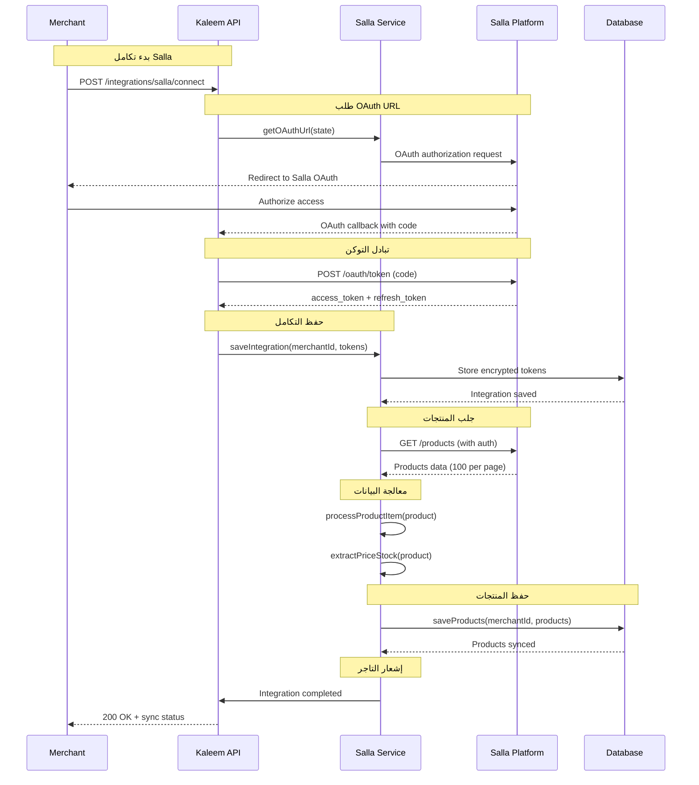
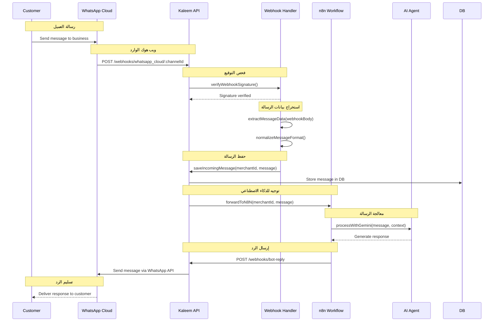
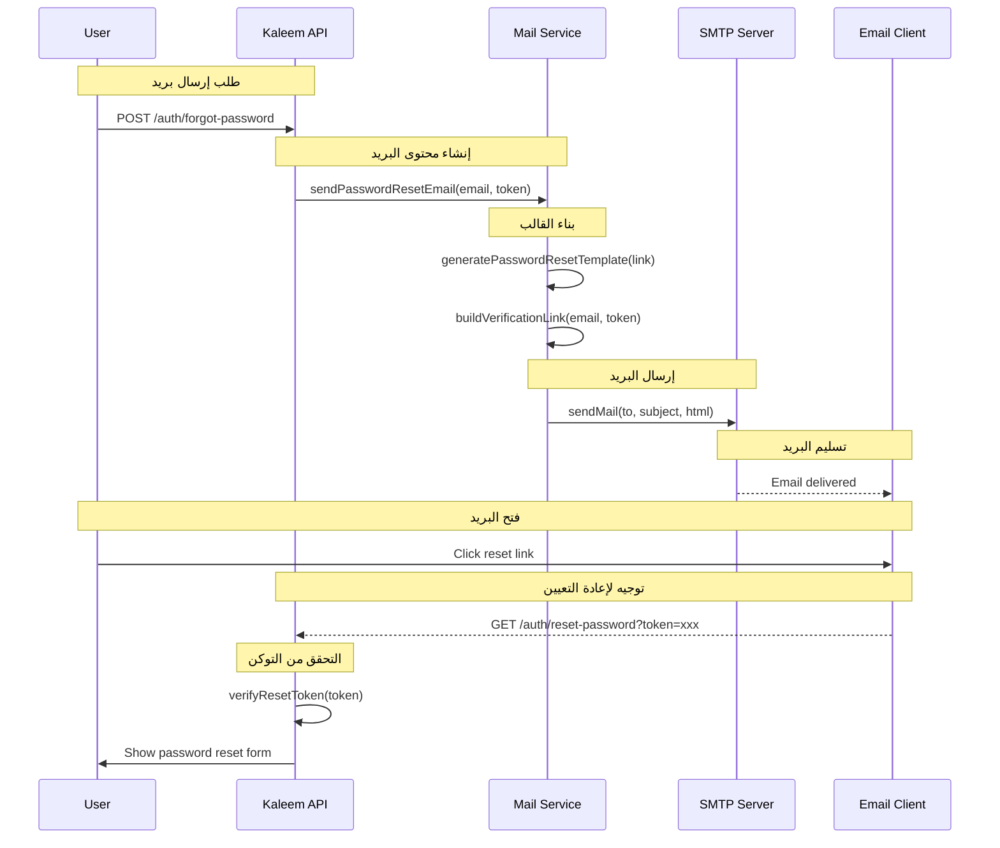
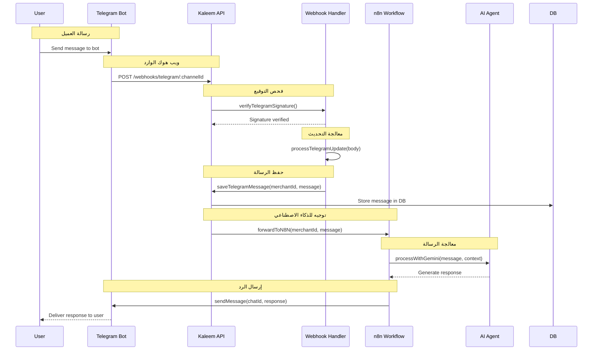
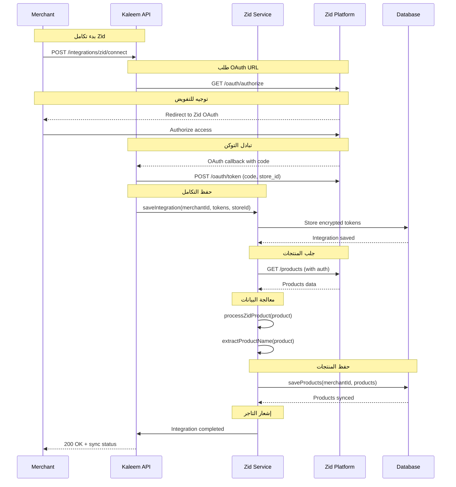
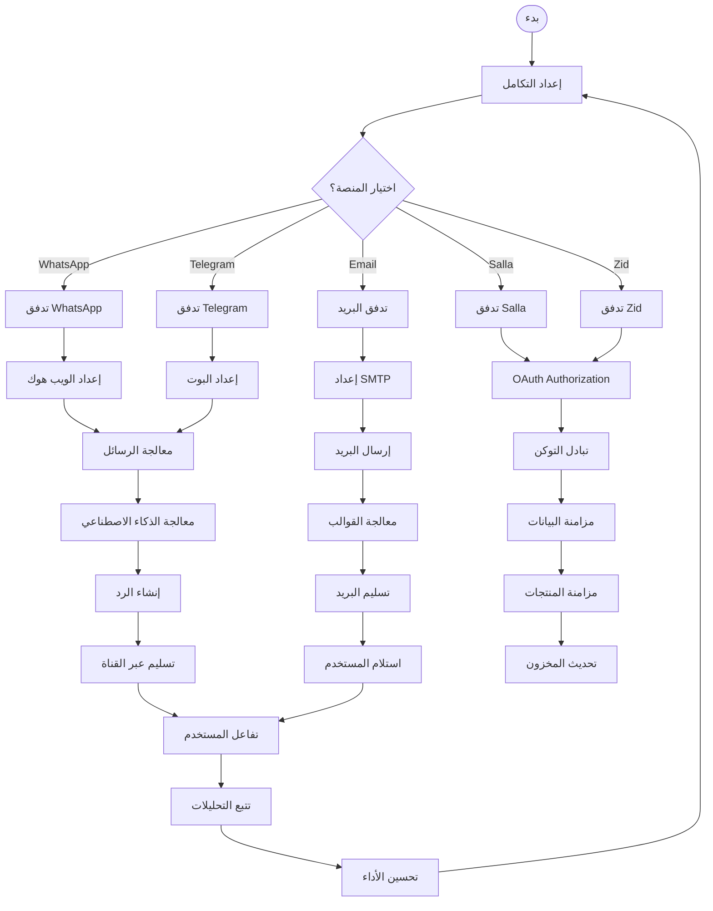

# التكاملات الخارجية - نظام كليم الشامل

## نظرة عامة على النظام

نظام كليم يدعم تكاملات متقدمة مع منصات التجارة الإلكترونية والمراسلة:

- **Salla Integration**: تكامل مع منصة سلا السعودية
- **Zid Integration**: تكامل مع منصة زد السعودية
- **WhatsApp Integration**: تكامل مع واتساب كلاود وويب هوك
- **Telegram Integration**: تكامل مع تيليجرام بوت وويب هوك
- **Email Integration**: نظام إرسال البريد الإلكتروني
- **Webhook Security**: تواقيع آمنة ومنع التكرار

## 1. مخطط التسلسل - Salla Integration (Sequence Diagram)



## 2. مخطط التسلسل - WhatsApp Cloud Integration (Sequence Diagram)



## 3. مخطط التسلسل - Email Integration (Sequence Diagram)



## 4. مخطط التسلسل - Telegram Integration (Sequence Diagram)



## 5. مخطط التسلسل - Zid Integration (Sequence Diagram)



## 6. مخطط سير العمل التجاري (BPMN) - مسارات الأعمال الحرجة



## 7. تفاصيل تقنية لكل تكامل

### 7.1 تكامل Salla

#### 7.1.1 OAuth Flow

```typescript
// src/modules/integrations/salla/salla.service.ts
getOAuthUrl(state: string): string {
  const clientId = this.config.get<string>('SALLA_CLIENT_ID')!;
  const redirectUri = this.config.get<string>('SALLA_REDIRECT_URI')!;
  const scope = this.config.get<string>('SALLA_SCOPE') || 'offline_access';

  const params = new URLSearchParams({
    client_id: clientId,
    redirect_uri: redirectUri,
    response_type: 'code',
    scope,
    state,
  });

  return `https://accounts.salla.sa/oauth/authorize?${params.toString()}`;
}

async exchangeCodeForTokens(code: string, state: string): Promise<SallaTokenResponse> {
  const response = await firstValueFrom(
    this.http.post<SallaTokenResponse>(
      'https://accounts.salla.sa/oauth/token',
      {
        grant_type: 'authorization_code',
        client_id: this.config.get<string>('SALLA_CLIENT_ID'),
        client_secret: this.config.get<string>('SALLA_CLIENT_SECRET'),
        redirect_uri: this.config.get<string>('SALLA_REDIRECT_URI'),
        code,
      },
      {
        headers: {
          'Content-Type': 'application/x-www-form-urlencoded',
          Accept: 'application/json',
        },
      }
    )
  );

  return response;
}
```

#### 7.1.2 مزامنة المنتجات

```typescript
async syncProducts(merchantId: string): Promise<void> {
  const integration = await this.integrations.findSallaByMerchant(merchantId);
  if (!integration) throw new Error('Salla integration not found');

  const accessToken = await this.ensureValidToken(integration);
  const authorizationHeader = `Bearer ${accessToken}`;

  let page = 1;
  let hasMore = true;

  while (hasMore) {
    const response = await firstValueFrom(
      this.http.get<SallaProductsResponse>(
        `https://api.salla.sa/v1/products?page=${page}`,
        {
          headers: { Authorization: authorizationHeader },
        }
      )
    );

    const products = response.data?.data?.products || [];
    if (products.length > 0) {
      const processedProducts = products.map(item => this.processProductItem(item));
      await this.saveProductsToDB(merchantId, processedProducts);
    }

    hasMore = !!response.data?.links?.next;
    page++;
  }
}
```

### 7.2 تكامل WhatsApp Cloud

#### 7.2.1 معالجة الويب هوك

```typescript
// src/modules/webhooks/whatsapp-cloud.webhook.controller.ts
async incoming(
  @Param('channelId') channelId: string,
  @Req() req: RequestWithWebhookData,
  @Body() body: WhatsAppCloudDto,
): Promise<void> {
  const merchantId = String(req.merchantId);

  // استخراج بيانات الرسالة
  const messageData = this.extractMessageData(body);
  if (!messageData) return;

  // منع التكرار
  const messageId = this.extractMessageId(body);
  const isDuplicate = await this.checkIdempotency(channelId, merchantId, messageId);

  if (isDuplicate) {
    this.logger.log(`Duplicate message ignored: ${messageId}`);
    return;
  }

  // حفظ الرسالة
  await this.webhooksController.handleIncomingMessage(
    merchantId,
    channelId,
    messageData,
    'whatsapp_cloud'
  );
}
```

#### 7.2.2 إرسال الردود

```typescript
// src/modules/channels/whatsapp-cloud.service.ts
async sendMessage(
  channelId: string,
  to: string,
  message: string,
  messageType: 'text' | 'template' = 'text'
): Promise<void> {
  const channel = await this.getChannelById(channelId);
  const accessToken = await this.getValidAccessToken(channel);

  const payload = {
    messaging_product: 'whatsapp',
    recipient_type: 'individual',
    to,
    type: 'text',
    text: { body: message },
  };

  await firstValueFrom(
    this.http.post(
      `https://graph.facebook.com/v18.0/${channel.externalId}/messages`,
      payload,
      {
        headers: {
          Authorization: `Bearer ${accessToken}`,
          'Content-Type': 'application/json',
        },
      }
    )
  );
}
```

### 7.3 تكامل Telegram

#### 7.3.1 معالجة التحديثات

```typescript
// src/modules/webhooks/telegram.webhook.controller.ts
async incoming(
  @Param('channelId') channelId: string,
  @Req() req: RequestWithWebhookData,
  @Body() body: TelegramUpdateDto,
): Promise<void> {
  const merchantId = String(req.merchantId);

  // استخراج التحديث
  const update = this.extractUpdateData(body);
  if (!update) return;

  // منع التكرار
  const isDuplicate = await this.checkIdempotency(channelId, merchantId, update.updateId);

  if (isDuplicate) {
    this.logger.log(`Duplicate update ignored: ${update.updateId}`);
    return;
  }

  // معالجة الرسالة
  await this.webhooksController.handleIncomingMessage(
    merchantId,
    channelId,
    update.message,
    'telegram'
  );
}
```

#### 7.3.2 إرسال الردود

```typescript
// src/modules/channels/telegram.service.ts
async sendMessage(
  botToken: string,
  chatId: string | number,
  message: string,
  replyToMessageId?: number
): Promise<void> {
  const payload: any = {
    chat_id: chatId,
    text: message,
    parse_mode: 'HTML',
  };

  if (replyToMessageId) {
    payload.reply_to_message_id = replyToMessageId;
  }

  await firstValueFrom(
    this.http.post(
      `https://api.telegram.org/bot${botToken}/sendMessage`,
      payload
    )
  );
}
```

### 7.4 تكامل البريد الإلكتروني

#### 7.4.1 إرسال البريد

```typescript
// src/modules/mail/mail.service.ts
async sendVerificationEmail(email: string, code: string): Promise<void> {
  const link = this.buildVerificationLink(email, code);
  const html = this.generateVerificationTemplate(code, link);

  await this.transporter.sendMail({
    from: this.mailFrom,
    to: email,
    subject: 'تفعيل حسابك على منصة كليم',
    html,
  });

  this.logger.log(`Verification email sent to ${email}`);
}
```

#### 7.4.2 قوالب البريد

```typescript
private generateVerificationTemplate(code: string, link: string): string {
  return `
    <!DOCTYPE html>
    <html dir="rtl" lang="ar">
    <head>
      <meta charset="UTF-8">
      <meta name="viewport" content="width=device-width, initial-scale=1.0">
      <title>تفعيل الحساب</title>
    </head>
    <body style="font-family: Arial, sans-serif; direction: rtl;">
      <div style="max-width: 600px; margin: 0 auto; padding: 20px;">
        <h1 style="color: #333;">مرحباً بك في كليم</h1>
        <p>شكراً لتسجيلك معنا. لتفعيل حسابك، يرجى استخدام الرمز التالي:</p>
        <div style="background: #f5f5f5; padding: 20px; text-align: center; margin: 20px 0;">
          <h2 style="margin: 0; color: #333;">${code}</h2>
        </div>
        <p>أو يمكنك النقر على الرابط التالي:</p>
        <a href="${link}" style="background: #007bff; color: white; padding: 10px 20px; text-decoration: none; border-radius: 5px;">تفعيل الحساب</a>
      </div>
    </body>
    </html>
  `;
}
```

## 8. معايير الأمان والحماية

### 8.1 تواقيع الويب هوك

```typescript
// src/common/guards/webhook-signature.guard.ts
export class WebhookSignatureGuard implements CanActivate {
  async canActivate(context: ExecutionContext): Promise<boolean> {
    const request = context.switchToHttp().getRequest();
    const signature = request.headers['x-hub-signature-256'];
    const body = JSON.stringify(request.body);

    if (!signature) {
      throw new ForbiddenException('Missing signature');
    }

    const expectedSignature = this.generateSignature(body, secret);
    return signature === expectedSignature;
  }

  private generateSignature(payload: string, secret: string): string {
    return `sha256=${crypto.createHmac('sha256', secret).update(payload).digest('hex')}`;
  }
}
```

### 8.2 منع التكرار

```typescript
// src/common/utils/idempotency.util.ts
export async function preventDuplicates(
  cache: Cache,
  key: string,
  ttlSeconds: number = 3600,
): Promise<boolean> {
  const exists = await cache.get(key);
  if (exists) {
    return true; // Duplicate detected
  }

  await cache.set(key, true, ttlSeconds);
  return false; // Not a duplicate
}
```

### 8.3 تشفير التوكنات

```typescript
// src/modules/integrations/utils/encryption.util.ts
export class TokenEncryptionService {
  async encryptToken(token: string): Promise<string> {
    const algorithm = 'aes-256-gcm';
    const key = crypto.randomBytes(32);
    const iv = crypto.randomBytes(16);

    const cipher = crypto.createCipher(algorithm, key);
    cipher.setAAD(Buffer.from('token-metadata'));

    let encrypted = Buffer.concat([
      cipher.update(token, 'utf8'),
      cipher.final(),
    ]);

    const authTag = cipher.getAuthTag();
    const encryptedToken = Buffer.concat([key, iv, authTag, encrypted]);

    return encryptedToken.toString('base64');
  }

  async decryptToken(encryptedToken: string): Promise<string> {
    const buffer = Buffer.from(encryptedToken, 'base64');
    const key = buffer.subarray(0, 32);
    const iv = buffer.subarray(32, 48);
    const authTag = buffer.subarray(48, 64);
    const encrypted = buffer.subarray(64);

    const decipher = crypto.createDecipher('aes-256-gcm', key);
    decipher.setAuthTag(authTag);
    decipher.setAAD(Buffer.from('token-metadata'));

    return Buffer.concat([
      decipher.update(encrypted),
      decipher.final(),
    ]).toString('utf8');
  }
}
```

## 9. مراقبة الأداء والأمان

### 9.1 مقاييس التكاملات

```yaml
# prometheus.yml - مقاييس التكاملات
- name: integration_sync_total
  type: counter
  help: 'إجمالي عمليات المزامنة'
  labelnames: [platform, sync_type, status]

- name: webhook_processing_duration_seconds
  type: histogram
  help: 'زمن معالجة الويب هوك'
  labelnames: [platform, channel_id]

- name: email_delivery_total
  type: counter
  help: 'إجمالي عمليات إرسال البريد'
  labelnames: [template_type, status]

- name: oauth_token_refresh_total
  type: counter
  help: 'إجمالي عمليات تجديد التوكن'
  labelnames: [platform, status]
```

### 9.2 تنبيهات التكاملات

```yaml
# alerts/integrations.yml
groups:
  - name: integrations
    rules:
      - alert: SallaSyncFailure
        expr: |
          increase(integration_sync_total{platform="salla",status="failed"}[5m]) > 3
        for: 5m
        labels:
          severity: warning
        annotations:
          summary: 'فشل مزامنة Salla'
          runbook_url: 'https://kb.kaleem-ai.com/runbooks/salla-sync-failure'

      - alert: WebhookSignatureFailures
        expr: |
          increase(webhook_processing_duration_seconds_count{channel_id=~".*"}[5m]) > 10
        for: 5m
        labels:
          severity: critical
        annotations:
          summary: 'فشل تواقيع الويب هوك'
          runbook_url: 'https://kb.kaleem-ai.com/runbooks/webhook-signature-failures'
```

## 10. خطة الاختبار والتحقق

### 10.1 اختبارات التكاملات

- اختبار OAuth flow لكل منصة
- اختبار مزامنة البيانات
- اختبار معالجة الويب هوك
- اختبار إرسال الرسائل والبريد

### 10.2 اختبارات الأمان

- اختبار فحص تواقيع الويب هوك
- اختبار منع التكرار
- اختبار تشفير التوكنات
- اختبار معالجة الأخطاء

### 10.3 اختبارات الأداء

- اختبار أداء مزامنة المنتجات
- اختبار أداء معالجة الرسائل
- اختبار أداء إرسال البريد
- اختبار استهلاك الموارد

### 10.4 اختبارات التكامل

- اختبار تكامل مع Salla API
- اختبار تكامل مع Zid API
- اختبار تكامل مع WhatsApp Cloud API
- اختبار تكامل مع Telegram Bot API
- اختبار تكامل مع SMTP servers

---

_تم إنشاء هذا التوثيق بواسطة نظام كليم لإدارة المتاجر الذكية_
