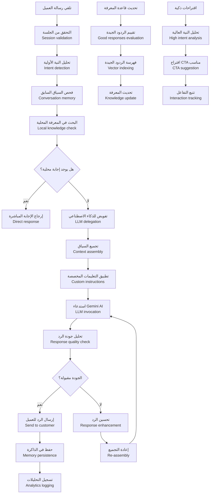
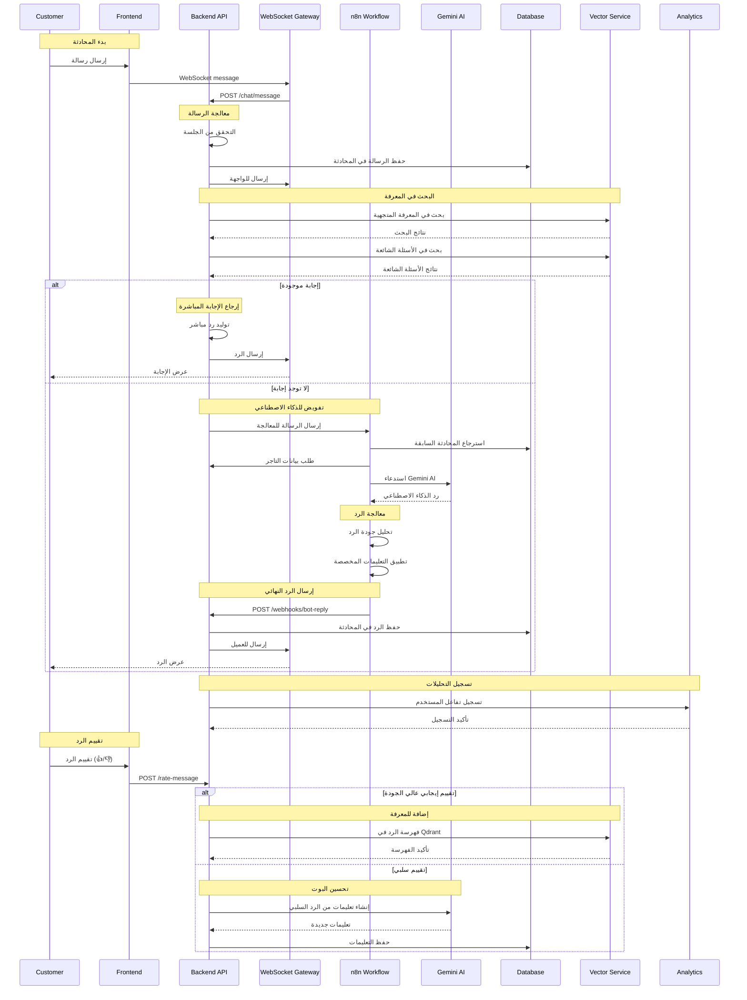

# ورك فلو بوابة الدردشة والردود الذكية - نظام كليم الشامل

## نظرة عامة على النظام

نظام كليم يدعم بوابة دردشة ذكية متكاملة مع إمكانيات متقدمة للردود الذكية:

- **LLM Router**: توجيه الرسائل للذكاء الاصطناعي المناسب
- **Tools Integration**: أدوات بحث متقدمة (منتجات، معرفة، سياق المتجر)
- **Memory Management**: حفظ وتتبع سياق المحادثة
- **Unified Search**: بحث موحد عبر جميع مصادر البيانات
- **Template System**: قوالب مخصصة لكل تاجر قابلة للاستنساخ
- **Quality Assurance**: تقييم وتحسين جودة الردود

## 1. مخطط التدفق العام (Flowchart)



## 2. مخطط التسلسل (Sequence Diagram)



## 3. آلة الحالات (State Machine)

```mermaid
stateDiagram-v2
    [*] --> تلقي_الرسالة: استلام رسالة جديدة

    تلقي_الرسالة --> فحص_الجلسة: التحقق من الجلسة
    فحص_الجلسة --> جلسة_صالحة: جلسة نشطة
    فحص_الجلسة --> جلسة_منتهية: جلسة منتهية الصلاحية

    جلسة_منتهية --> إنهاء_المحادثة: لا يمكن المتابعة
    جلسة_صالحة --> تحليل_النية: كشف نية الرسالة

    تحليل_النية --> فحص_السياق: استرجاع المحادثة السابقة
    فحص_السياق --> البحث_في_المعرفة: البحث في Qdrant

    البحث_في_المعرفة --> إجابة_موجودة: تم العثور على إجابة
    البحث_في_المعرفة --> لا_إجابة: لا توجد إجابة مطابقة

    إجابة_موجودة --> إرسال_الإجابة_المباشرة: رد فوري
    لا_إجابة --> تفويض_للذكاء: إرسال للمعالجة

    تفويض_للذكاء --> معالجة_n8n: استدعاء workflow
    معالجة_n8n --> استدعاء_Gemini: طلب من AI
    استدعاء_Gemini --> تطبيق_التعليمات: تخصيص الرد
    تطبيق_التعليمات --> توليد_الرد_الأولي: الرد الأساسي

    توليد_الرد_الأولي --> فحص_الجودة: تقييم الرد
    فحص_الجودة --> جودة_عالية: رد ممتاز
    فحص_الجودة --> جودة_عادية: رد مقبول
    فحص_الجودة --> جودة_منخفضة: رد ضعيف

    جودة_عالية --> إرسال_الرد: للعميل
    جودة_عادية --> إرسال_الرد: للعميل
    جودة_منخفضة --> تحسين_الرد: إعادة الصياغة

    تحسين_الرد --> إعادة_التجميع: تحسين المحتوى
    إعادة_التجميع --> توليد_الرد_الأولي: محاولة أخرى

    إرسال_الرد --> عرض_التقييم: خيارات 👍/👎
    عرض_التقييم --> تلقي_التقييم: من المستخدم

    تلقي_التقييم --> تقييم_إيجابي: 👍
    تلقي_التقييم --> تقييم_سلبي: 👎

    تقييم_إيجابي --> فحص_الفهرسة: جودة عالية؟
    تقييم_سلبي --> تحليل_المشكلة: استخراج السبب

    فحص_الفهرسة --> فهرسة_مطلوبة: إضافة للمعرفة
    فهرسة_مطلوبة --> إضافة_للمتجهات: فهرسة في Qdrant

    تحليل_المشكلة --> إنشاء_تعليمات: من الرد السلبي
    إنشاء_تعليمات --> حفظ_التعليمات: في قاعدة البيانات
    حفظ_التعليمات --> تحديث_البرومبت: إعادة البناء

    إضافة_للمتجهات --> تحديث_المعرفة: متاح للبحث
    تحديث_البرومبت --> تحسين_البوت: محدث

    تحديث_المعرفة --> اقتراح_CTA: فحص النية
    تحسين_البوت --> اقتراح_CTA

    اقتراح_CTA --> فحص_النية_العالية: high intent check
    فحص_النية_العالية --> نية_عالية: عرض CTA
    فحص_النية_العالية --> نية_عادية: متابعة المحادثة

    نية_عالية --> عرض_CTA: اقتراح العمل
    نية_عادية --> استمرار_المحادثة: متابعة طبيعية

    عرض_CTA --> تتبع_التفاعل: مراقبة الاستجابة
    تتبع_التفاعل --> تحسين_CTA: ضبط الاقتراحات

    تحسين_CTA --> استمرار_المحادثة
    استمرار_المحادثة --> تلقي_رسالة_جديدة: دورة جديدة

    تلقي_رسالة_جديدة --> تحليل_النية: بداية الدورة

    إنهاء_المحادثة --> [*]: انتهاء
```



### تعريف الحالات

| الحالة              | الوصف                        | الإجراءات المسموحة        |
| ------------------- | ---------------------------- | ------------------------- |
| `تلقي_الرسالة`      | استلام رسالة جديدة من العميل | التحقق من الجلسة          |
| `فحص_الجلسة`        | التحقق من صحة الجلسة         | إنشاء أو استرجاع الجلسة   |
| `تحليل_النية`       | تحليل نية الرسالة            | كشف النوايا والغرض        |
| `فحص_السياق`        | فحص سياق المحادثة السابقة    | استرجاع المحادثات السابقة |
| `البحث_في_المعرفة`  | البحث في قاعدة المعرفة       | استعلام Qdrant            |
| `إجابة_موجودة`      | تم العثور على إجابة مطابقة   | إرجاع النتيجة المباشرة    |
| `لا_إجابة`          | لا توجد إجابة مطابقة         | تفويض للذكاء الاصطناعي    |
| `تفويض_للذكاء`      | إرسال للمعالجة الذكية        | استدعاء n8n workflow      |
| `معالجة_n8n`        | معالجة في n8n                | استدعاء Gemini AI         |
| `استدعاء_Gemini`    | طلب من Gemini AI             | توليد الرد                |
| `تطبيق_التعليمات`   | تطبيق التخصيصات المخصصة      | تخصيص الرد حسب التاجر     |
| `توليد_الرد_الأولي` | الرد الأساسي من AI           | الإجابة المكتملة          |
| `فحص_الجودة`        | تقييم جودة الرد              | تصنيف الجودة              |
| `جودة_عالية`        | رد ممتاز الجودة              | إضافة للمعرفة             |
| `جودة_عادية`        | رد مقبول                     | عرض للمستخدم              |
| `جودة_منخفضة`       | رد ضعيف الجودة               | تحسين الرد                |
| `إرسال_الرد`        | عرض الرد للمستخدم            | إرسال الإجابة             |
| `عرض_التقييم`       | عرض خيارات التقييم           | 👍/👎 options             |
| `تلقي_التقييم`      | تلقي تقييم المستخدم          | حفظ التقييم               |
| `تقييم_إيجابي`      | تقييم إيجابي من المستخدم     | فحص الفهرسة               |
| `تقييم_سلبي`        | تقييم سلبي من المستخدم       | تحليل المشكلة             |
| `فحص_الفهرسة`       | فحص إمكانية الفهرسة          | تقييم الجودة              |
| `فهرسة_مطلوبة`      | يتطلب الفهرسة                | إضافة للمعرفة             |
| `إضافة_للمتجهات`    | إضافة للمعرفة المتجهية       | فهرسة في Qdrant           |
| `تحليل_المشكلة`     | تحليل سبب المشكلة            | استخراج الأخطاء           |
| `إنشاء_تعليمات`     | إنشاء تعليمات جديدة          | من التقييمات السلبية      |
| `حفظ_التعليمات`     | حفظ التعليمات                | في قاعدة البيانات         |
| `تحديث_البرومبت`    | تحديث prompt البوت           | إعادة البناء              |
| `تحديث_المعرفة`     | تحديث قاعدة المعرفة          | إضافة الردود              |
| `اقتراح_CTA`        | اقتراح Call-to-Action        | فحص النية                 |
| `فحص_النية_العالية` | فحص النية العالية            | تحليل الاستعداد           |
| `نية_عالية`         | نية عالية للعمل              | عرض CTA                   |
| `نية_عادية`         | نية عادية                    | متابعة المحادثة           |
| `عرض_CTA`           | عرض CTA للمستخدم             | اقتراح العمل              |
| `تتبع_التفاعل`      | تتبع تفاعل المستخدم          | مراقبة الاستجابة          |
| `تحسين_CTA`         | تحسين اقتراحات CTA           | ضبط الخوارزمية            |
| `استمرار_المحادثة`  | متابعة المحادثة              | الدورة التالية            |
| `تلقي_رسالة_جديدة`  | تلقي رسالة جديدة             | بدء دورة جديدة            |

## 4. مخطط سير العمل التجاري (BPMN)

```mermaid
graph TB
    Start([بدء]) --> MessageReceived[تلقي الرسالة]
    MessageReceived --> SessionCheck[فحص الجلسة]

    SessionCheck --> SessionValid{جلسة صالحة؟}
    SessionValid -->|نعم| IntentAnalysis[تحليل النية]
    SessionValid -->|لا| SessionError[خطأ في الجلسة]

    IntentAnalysis --> ContextCheck[فحص السياق]
    ContextCheck --> KnowledgeSearch[البحث في المعرفة]

    KnowledgeSearch --> AnswerFound{إجابة موجودة؟}
    AnswerFound -->|نعم| DirectResponse[إرجاع الإجابة المباشرة]
    AnswerFound -->|لا| LLMDelegation[تفويض للذكاء]

    LLMDelegation --> N8NProcessing[معالجة n8n]
    N8NProcessing --> GeminiInvocation[استدعاء Gemini]
    GeminiInvocation --> InstructionsApplication[تطبيق التعليمات]
    InstructionsApplication --> ResponseGeneration[توليد الرد]

    ResponseGeneration --> QualityCheck[فحص الجودة]
    QualityCheck --> QualityResult{الجودة؟}

    QualityResult -->|عالية| HighQuality[جودة عالية]
    QualityResult -->|عادية| NormalQuality[جودة عادية]
    QualityResult -->|منخفضة| LowQuality[جودة منخفضة]

    HighQuality --> SendResponse[إرسال الرد]
    NormalQuality --> SendResponse
    LowQuality --> ResponseEnhancement[تحسين الرد]

    ResponseEnhancement --> SendResponse
    SendResponse --> ShowRating[عرض التقييم]

    ShowRating --> ReceiveRating[تلقي التقييم]
    ReceiveRating --> RatingType{نوع التقييم}

    RatingType -->|إيجابي| PositiveFeedback[تقييم إيجابي]
    RatingType -->|سلبي| NegativeFeedback[تقييم سلبي]

    PositiveFeedback --> IndexingCheck[فحص الفهرسة]
    IndexingCheck --> HighQualityCheck{جودة عالية؟}
    HighQualityCheck -->|نعم| AddToKnowledge[إضافة للمعرفة]
    HighQualityCheck -->|لا| SkipIndexing[تجاهل الفهرسة]

    NegativeFeedback --> ProblemAnalysis[تحليل المشكلة]
    ProblemAnalysis --> InstructionGeneration[إنشاء تعليمات]
    InstructionGeneration --> SaveInstructions[حفظ التعليمات]
    SaveInstructions --> UpdatePrompt[تحديث البرومبت]

    AddToKnowledge --> KnowledgeUpdated[معرفة محدثة]
    SkipIndexing --> BotImproved[البوت محدث]
    UpdatePrompt --> BotImproved

    KnowledgeUpdated --> CTASuggestion[اقتراح CTA]
    BotImproved --> CTASuggestion

    CTASuggestion --> IntentCheck[فحص النية العالية]
    IntentCheck --> HighIntent{نية عالية؟}
    HighIntent -->|نعم| ShowCTA[عرض CTA]
    HighIntent -->|لا| ContinueConversation[متابعة المحادثة]

    ShowCTA --> TrackInteraction[تتبع التفاعل]
    TrackInteraction --> OptimizeCTA[تحسين CTA]

    ContinueConversation --> NewMessage[رسالة جديدة]
    OptimizeCTA --> ContinueConversation
    NewMessage --> IntentAnalysis

    SessionError --> End([نهاية])
    ContinueConversation --> End
```



## 5. تفاصيل تقنية لكل مرحلة

### 5.1 مرحلة معالجة الرسائل

#### 5.1.1 تلقي وتخزين الرسائل

```typescript
async function handleMessage(
  sessionId: string,
  message: string,
  metadata?: Record<string, unknown>,
) {
  // 1. التحقق من الجلسة
  const session = await validateSession(sessionId);

  // 2. حفظ الرسالة في المحادثة
  await conversationService.createOrAppend(sessionId, [
    {
      role: 'user',
      text: message,
      metadata,
      timestamp: new Date(),
    },
  ]);

  // 3. تحليل النية الأولية
  const intent = await analyzeIntent(message);

  return { session, intent };
}
```

#### 5.1.2 تحليل النية الأولية

```typescript
async function analyzeIntent(text: string): Promise<IntentResult> {
  // تحليل نصي بسيط
  const simpleIntent = detectSimpleIntent(text);

  // تحليل متقدم باستخدام كلمات مفتاحية
  const advancedIntent = detectAdvancedIntent(text);

  // تحليل السياق من المحادثة السابقة
  const contextIntent = await detectContextIntent(text, sessionId);

  return {
    primary: advancedIntent || simpleIntent,
    confidence: calculateConfidence(text, contextIntent),
    context: contextIntent,
  };
}
```

### 5.2 مرحلة البحث في المعرفة

#### 5.2.1 البحث المتوحد (Unified Search)

```typescript
async function unifiedSearch(
  query: string,
  merchantId: string,
  sessionId: string,
): Promise<SearchResult[]> {
  const results = [];

  // 1. البحث في المنتجات
  const productResults = await vectorService.searchProducts({
    query,
    merchantId,
    topK: 3,
  });

  // 2. البحث في المعرفة العامة
  const knowledgeResults = await vectorService.searchKnowledge({
    query,
    merchantId,
    topK: 3,
  });

  // 3. البحث في الأسئلة الشائعة
  const faqResults = await botFaqService.search(query, 3);

  // 4. البحث في الوثائق
  const documentResults = await vectorService.searchDocuments({
    query,
    merchantId,
    topK: 2,
  });

  // دمج وترتيب النتائج
  results.push(
    ...productResults.map((r) => ({ ...r, source: 'products' })),
    ...knowledgeResults.map((r) => ({ ...r, source: 'knowledge' })),
    ...faqResults.map((r) => ({ ...r, source: 'faq' })),
    ...documentResults.map((r) => ({ ...r, source: 'documents' })),
  );

  return results.sort((a, b) => b.score - a.score).slice(0, 5);
}
```

#### 5.2.2 استرجاع سياق المحادثة

```typescript
async function getConversationContext(
  sessionId: string,
): Promise<ConversationContext> {
  const messages = await conversationService.getRecentMessages(sessionId, 10);

  return {
    messages: messages.map((m) => ({
      role: m.role,
      content: m.text,
      timestamp: m.timestamp,
    })),
    topics: extractTopics(messages),
    intent: detectConversationIntent(messages),
    entities: extractEntities(messages),
  };
}
```

### 5.3 مرحلة معالجة الذكاء الاصطناعي

#### 5.3.1 بناء البرومبت المتكامل

```typescript
async function buildSystemPrompt(
  userMessage: string,
  conversationContext: ConversationContext,
  merchantSettings: MerchantSettings,
  searchResults: SearchResult[],
) {
  // 1. جلب التعليمات النشطة
  const instructions =
    await instructionsService.getActiveInstructions(merchantId);

  // 2. بناء السياق من المحادثة
  const contextText = conversationContext.messages
    .slice(-5) // آخر 5 رسائل
    .map((m) => `${m.role}: ${m.content}`)
    .join('\n');

  // 3. إضافة نتائج البحث
  const knowledgeText = searchResults
    .map((r) => `من ${r.source}: ${r.content}`)
    .join('\n');

  // 4. تجميع البرومبت النهائي
  const systemPrompt = `
    أنت مساعد ذكي لمتجر ${merchantSettings.name}.

    ${instructions.map((i) => i.instruction).join('\n')}

    السياق الحالي:
    ${contextText}

    المعرفة المتاحة:
    ${knowledgeText}

    قواعد الرد:
    - كن مهذباً ومساعداً
    - استخدم نفس لغة العميل
    - لا تفترض معلومات غير مؤكدة
    - ركز على حل مشكلة العميل

    الرسالة الحالية: ${userMessage}
  `;

  return systemPrompt;
}
```

#### 5.3.2 استدعاء n8n workflow

```typescript
async function forwardToN8N(
  sessionId: string,
  message: string,
  context: ConversationContext,
  searchResults: SearchResult[],
) {
  const payload = {
    sessionId,
    message,
    context,
    searchResults,
    metadata: {
      timestamp: Date.now(),
      source: 'intelligent_chat',
    },
  };

  const response = await axios.post(
    `${N8N_BASE_URL}/webhook/ai-agent-${merchantId}`,
    payload,
    {
      headers: {
        'X-Kaleem-Timestamp': Date.now(),
        'X-Kaleem-Signature': generateSignature(payload),
      },
    },
  );

  return response.data;
}
```

### 5.4 مرحلة تقييم الردود وتحسين البوت

#### 5.4.1 نظام التقييم المتقدم

```typescript
async function evaluateResponse(
  response: string,
  originalMessage: string,
  context: ConversationContext,
): Promise<ResponseEvaluation> {
  const criteria = [
    checkRelevance(response, originalMessage),
    checkCompleteness(response, context),
    checkAccuracy(response, searchResults),
    checkTone(response, merchantSettings),
    checkLength(response, context),
  ];

  const score =
    criteria.reduce((sum, criterion) => sum + criterion.score, 0) /
    criteria.length;

  return {
    score,
    criteria,
    recommendations: generateRecommendations(criteria),
    quality: score >= 0.8 ? 'high' : score >= 0.6 ? 'medium' : 'low',
  };
}
```

#### 5.4.2 إنشاء تعليمات من التقييمات السلبية

```typescript
async function createInstructionFromNegativeFeedback(
  badResponse: string,
  feedback: string,
  merchantId: string,
) {
  const prompt = `
    الرد التالي تم تقييمه سلبيًا: "${badResponse}"
    التعليق: "${feedback}"

    صِغ تعليمة مختصرة (سطر واحد، 15 كلمة أو أقل) لتجنب هذا الخطأ.
    ركز على السبب المحدد في التعليق.
  `;

  const instruction = await geminiService.generateContent(prompt);

  await instructionsService.create({
    merchantId,
    instruction: instruction.trim(),
    relatedResponses: [badResponse],
    source: 'user_feedback',
    type: 'auto',
  });
}
```

### 5.5 مرحلة اقتراح Call-to-Action

#### 5.5.1 فحص النية العالية

```typescript
function detectHighIntent(
  message: string,
  conversationHistory: Message[],
  context: ConversationContext,
): boolean {
  // فحص الكلمات المفتاحية
  const highIntentKeywords = [
    'أريد شراء',
    'كم السعر',
    'متوفر',
    'طلب',
    'شراء',
    'أحتاج',
    'أبحث عن',
    'أرغب في',
  ];

  const keywordMatch = highIntentKeywords.some((keyword) =>
    message.toLowerCase().includes(keyword),
  );

  // فحص سياق المحادثة
  const contextIntent = analyzeConversationIntent(conversationHistory);

  // فحص النوايا المحددة
  const specificIntent = detectSpecificIntent(message);

  return keywordMatch || contextIntent || specificIntent;
}
```

#### 5.5.2 توليد اقتراحات CTA ذكية

```typescript
async function generateSmartCTA(
  sessionId: string,
  highIntent: boolean,
  context: ConversationContext,
) {
  if (!highIntent) return null;

  const suggestions = [];

  // اقتراحات بناء على السياق
  if (context.topics.includes('product_inquiry')) {
    suggestions.push({
      type: 'product_suggestion',
      action: 'show_products',
      text: 'عرض المنتجات المشابهة',
    });
  }

  if (context.topics.includes('order_intent')) {
    suggestions.push({
      type: 'order_cta',
      action: 'start_order',
      text: 'بدء عملية الطلب',
    });
  }

  return {
    type: 'high_intent',
    suggestions,
    metadata: {
      sessionId,
      intentLevel: 'high',
      contextTopics: context.topics,
    },
  };
}
```

## 6. معايير الأمان والحماية

### 6.1 التحقق من الجلسات

```typescript
// التحقق من صحة الجلسة
const session = await sessionStore.get(sessionId);
if (!session || !session.isActive) {
  throw new UnauthorizedException('Invalid session');
}
```

### 6.2 Rate Limiting

- **رسائل المستخدم**: 30 رسالة/دقيقة
- **طلبات البحث**: 100 طلب/دقيقة
- **تقييم الردود**: 10 تقييمات/دقيقة

### 6.3 منع الإساءة

```typescript
// فحص الرسائل المسيئة
function isAbusiveMessage(text: string): boolean {
  const abusivePatterns = ['سب', 'شتم', 'كلمات مسيئة'];
  return abusivePatterns.some((pattern) =>
    text.toLowerCase().includes(pattern),
  );
}
```

## 7. مسارات الخطأ والتعامل معها

### 7.1 أخطاء المعالجة

```javascript
AI_SERVICE_UNAVAILABLE; // خدمة الذكاء الاصطناعي غير متاحة
VECTOR_SEARCH_FAILED; // فشل في البحث المتجهي
KNOWLEDGE_NOT_FOUND; // لا توجد معرفة مطابقة
PROMPT_BUILDING_FAILED; // فشل في بناء البرومبت
```

### 7.2 أخطاء التقييم

```javascript
INVALID_RATING_VALUE; // قيمة تقييم غير صحيحة
RESPONSE_NOT_FOUND; // الرد غير موجود للتقييم
SESSION_NOT_AUTHORIZED; // غير مخول للتقييم
```

### 7.3 أخطاء CTA

```javascript
CTA_GENERATION_FAILED; // فشل في توليد CTA
INTENT_DETECTION_FAILED; // فشل في كشف النية
INTERACTION_TRACKING_FAILED; // فشل في تتبع التفاعل
```

## 8. خطة الاختبار والتحقق

### 8.1 اختبارات الوحدة

- اختبار تحليل النية للرسائل المختلفة
- اختبار البحث في المعرفة المتوحد
- اختبار تقييم الردود وإنشاء التعليمات
- اختبار اقتراح CTA للنوايا المختلفة

### 8.2 اختبارات التكامل

- اختبار التكامل مع n8n workflow
- اختبار التكامل مع Gemini AI
- اختبار التكامل مع Qdrant
- اختبار معالجة الأخطاء

### 8.3 اختبارات الأداء

- اختبار زمن الاستجابة للرسائل
- اختبار البحث في قواعد بيانات كبيرة
- اختبار توليد التضمينات بالجملة
- اختبار استهلاك الذاكرة والمعالج

---

_تم إنشاء هذا التوثيق بواسطة نظام كليم لإدارة المتاجر الذكية_
