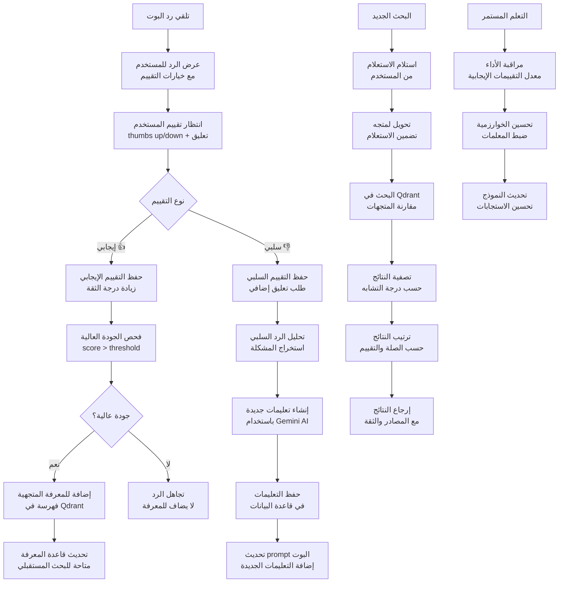
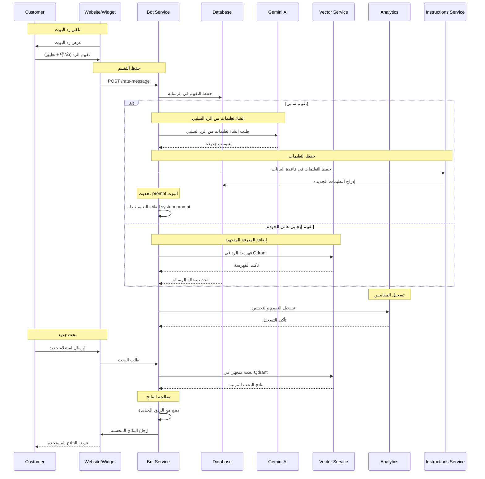
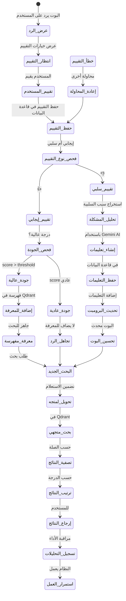
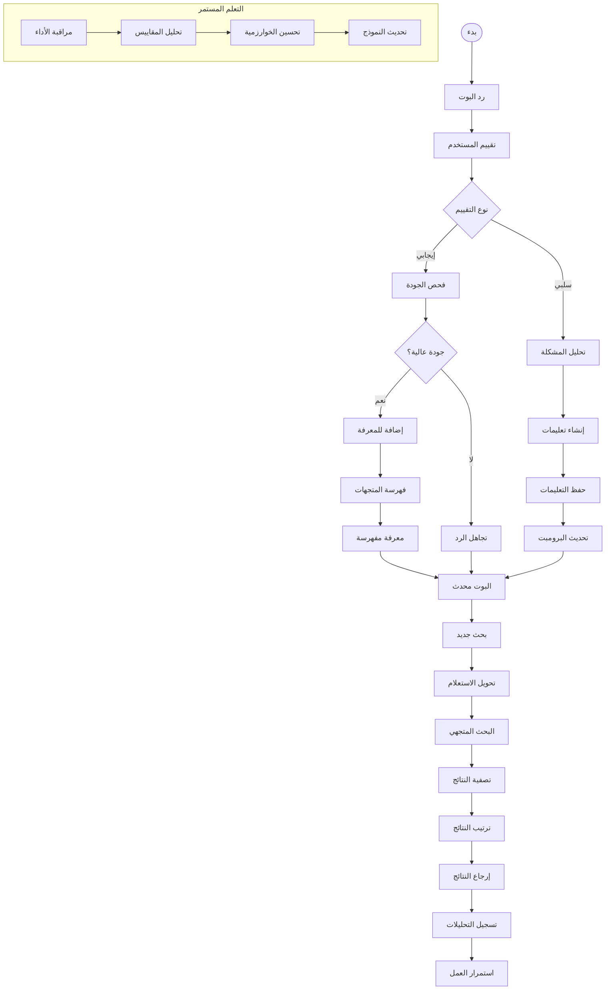

# ورك فلو تقييم الرسائل والانتقال إلى المتجهات - نظام كليم الشامل

## نظرة عامة على النظام

نظام كليم يدعم تقييماً شاملاً لرسائل البوت مع انتقال ذكي للمتجهات لتحسين الاستجابات:

- **تقييم الرسائل**: نظام تصنيف الردود (جيد/سيء) مع تعليقات
- **تحسين الذكاء الاصطناعي**: إنشاء تعليمات من الردود السيئة
- **الانتقال للمتجهات**: فهرسة الردود الجيدة في Qdrant
- **التعلم المستمر**: تحسين البوت بناءً على التغذية الراجعة
- **البحث المتجهي**: استرجاع الردود المشابهة من المعرفة

## 1. مخطط التدفق العام (Flowchart)



## 2. مخطط التسلسل (Sequence Diagram)



## 3. آلة الحالات (State Machine)



### تعريف الحالات

| الحالة            | الوصف                           | الإجراءات المسموحة |
| ----------------- | ------------------------------- | ------------------ |
| `عرض_الرد`        | عرض رد البوت للمستخدم           | عرض خيارات التقييم |
| `انتظار_التقييم`  | انتظار تقييم المستخدم           | عرض خيارات 👍/👎   |
| `تقييم_المستخدم`  | المستخدم يقيم الرد              | حفظ التقييم        |
| `حفظ_التقييم`     | حفظ التقييم في قاعدة البيانات   | تحديث سجل الرسالة  |
| `فحص_نوع_التقييم` | تحديد نوع التقييم               | تصنيف التقييم      |
| `تقييم_إيجابي`    | تقييم إيجابي من المستخدم        | فحص الجودة         |
| `تقييم_سلبي`      | تقييم سلبي من المستخدم          | تحليل المشكلة      |
| `فحص_الجودة`      | فحص درجة جودة الرد              | تقييم الصلة        |
| `جودة_عالية`      | الرد عالي الجودة                | إضافة للمعرفة      |
| `جودة_عادية`      | الرد عادي الجودة                | تجاهل الرد         |
| `تحليل_المشكلة`   | تحليل سبب التقييم السلبي        | استخراج المشكلة    |
| `إنشاء_تعليمات`   | إنشاء تعليمات جديدة             | استدعاء Gemini AI  |
| `حفظ_التعليمات`   | حفظ التعليمات في قاعدة البيانات | إدراج التعليمات    |
| `تحديث_البرومبت`  | تحديث prompt البوت              | إضافة التعليمات    |
| `إضافة_للمعرفة`   | إضافة الرد للمعرفة المتجهية     | فهرسة في Qdrant    |
| `معرفة_مفهرسة`    | المعرفة جاهزة للبحث             | جميع عمليات البحث  |
| `تحسين_البوت`     | البوت محدث بالتعليمات الجديدة   | تحسين الاستجابات   |
| `البحث_الجديد`    | طلب بحث جديد                    | تنفيذ الاستعلام    |
| `تحويل_لمتجه`     | تحويل الاستعلام لمتجه           | تضمين النص         |
| `بحث_متجهي`       | البحث في Qdrant                 | استرجاع النتائج    |
| `تصفية_النتائج`   | ترتيب وتصفية النتائج            | تحسين العرض        |
| `ترتيب_النتائج`   | ترتيب حسب الصلة والتقييم        | إعداد النتائج      |
| `إرجاع_النتائج`   | إرجاع النتائج للمستخدم          | عرض المحتوى        |
| `تسجيل_التحليلات` | تسجيل المقاييس والإحصائيات      | مراقبة الأداء      |

## 4. مخطط سير العمل التجاري (BPMN)



## 5. تفاصيل تقنية لكل مرحلة

### 5.1 مرحلة تقييم الرسائل

#### 5.1.1 نظام التقييم

**Endpoint**: `POST /rate-message/{sessionId}/{msgIdx}`

**البيانات المطلوبة**:

```typescript
interface RateMessageDto {
  rating: 0 | 1; // 0 = سلبي، 1 = إيجابي
  feedback?: string; // تعليق إضافي (اختياري)
}
```

**عملية المعالجة**:

```typescript
async function rateMessage(
  sessionId: string,
  msgIdx: number,
  rating: 0 | 1,
  feedback?: string,
) {
  // 1. العثور على الرسالة
  const message = await messagesRepo.findBySessionAndIndex(sessionId, msgIdx);

  // 2. حفظ التقييم
  message.rating = rating;
  message.feedback = feedback;
  await message.save();

  // 3. إذا كان التقييم سلبياً
  if (rating === 0) {
    // إنشاء تعليمات من الرد السلبي
    const instruction = await geminiService.generateInstructionFromBadReply(
      message.text,
    );

    // حفظ التعليمات
    await instructionsService.create({
      merchantId: message.merchantId,
      instruction,
      relatedReplies: [message.text],
      type: 'auto',
    });
  }

  // 4. إذا كان التقييم إيجابياً وعالي الجودة
  if (rating === 1 && isHighQuality(message)) {
    // إضافة للمعرفة المتجهية
    await vectorService.upsertKnowledge([
      {
        id: generateId(),
        vector: await embedText(message.text),
        payload: {
          text: message.text,
          type: 'bot_response',
          rating: 1,
          merchantId: message.merchantId,
        },
      },
    ]);
  }

  return { status: 'ok' };
}
```

#### 5.1.2 تحليل جودة الرد

```typescript
function isHighQuality(message: Message): boolean {
  // معايير الجودة العالية
  const criteria = [
    message.text.length > 50, // طول مناسب
    !message.text.includes('لا أفهم'), // عدم الالتباس
    !message.text.includes('عذراً'), // عدم الاعتذار
    message.text.includes('يمكنني') || // تقديم المساعدة
      message.text.includes('سأساعدك') ||
      message.text.includes('الإجابة'),
  ];

  return criteria.filter(Boolean).length >= 2; // معيارين على الأقل
}
```

### 5.2 مرحلة إنشاء التعليمات

#### 5.2.1 إنشاء تعليمات من الردود السلبية

**استدعاء Gemini AI**:

```typescript
async function generateInstructionFromBadReply(
  badReply: string,
): Promise<string> {
  const prompt = `
    الرد التالي تم تقييمه سلبيًا من قبل التاجر: "${badReply}".
    صِغ توجيهًا مختصرًا جدًا (سطر واحد فقط، 15 كلمة أو أقل، لا تشرح السبب)
    لمنع مساعد الذكاء الاصطناعي من تكرار هذا الخطأ.
  `;

  const result = await model.generateContent(prompt);
  return result.response.text().trim();
}
```

**أمثلة للتعليمات المُنشأة**:

- "لا تقدم معلومات خاطئة عن الأسعار"
- "تأكد من فهم السؤال قبل الإجابة"
- "لا تفترض المعلومات، اطلب التوضيح"
- "ركز على حل مشكلة العميل"

#### 5.2.2 حفظ التعليمات في قاعدة البيانات

```typescript
const instruction = await instructionsService.create({
  merchantId,
  instruction: generatedInstruction,
  relatedReplies: [badReply],
  type: 'auto',
  active: true,
});
```

### 5.3 مرحلة فهرسة المتجهات

#### 5.3.1 إضافة الردود الجيدة للمعرفة

```typescript
async function addHighQualityResponseToKnowledge(message: Message) {
  const embedding = await embeddingService.embedText(message.text);

  await vectorService.upsertKnowledge([
    {
      id: generateId(),
      vector: embedding,
      payload: {
        text: message.text,
        type: 'bot_response',
        rating: 1,
        merchantId: message.merchantId,
        sessionId: message.sessionId,
        timestamp: message.timestamp,
      },
    },
  ]);
}
```

#### 5.3.2 تحديث prompt البوت

```typescript
async function updateBotPrompt(merchantId: string) {
  const instructions =
    await instructionsService.getActiveInstructions(merchantId);

  const systemPrompt = `
    أنت مساعد ذكي لمتجر إلكتروني.
    ${instructions.map((i) => i.instruction).join('\n')}

    قواعد عامة:
    - كن مهذباً ومساعداً
    - قدم معلومات دقيقة
    - لا تفترض معلومات غير مؤكدة
  `;

  // تحديث prompt في n8n workflow
  await updateN8nPrompt(merchantId, systemPrompt);
}
```

### 5.4 مرحلة البحث المتجهي

#### 5.4.1 تحويل الاستعلام لمتجه

```typescript
async function searchSimilarResponses(query: string, merchantId: string) {
  // 1. تحويل الاستعلام لمتجه
  const queryEmbedding = await embeddingService.embedText(query);

  // 2. البحث في Qdrant
  const results = await vectorService.search({
    collection: 'knowledge',
    vector: queryEmbedding,
    filter: { merchantId },
    limit: 5,
    score_threshold: 0.7,
  });

  // 3. تصفية وترتيب النتائج
  return results
    .filter((result) => result.score > 0.8)
    .sort((a, b) => b.score - a.score)
    .map((result) => ({
      text: result.payload.text,
      similarity: result.score,
      source: 'vector_knowledge',
    }));
}
```

#### 5.4.2 دمج مع البحث النصي

```typescript
async function hybridSearch(query: string, merchantId: string) {
  // 1. البحث النصي في MongoDB
  const textResults = await searchTextInDatabase(query, merchantId);

  // 2. البحث المتجهي في Qdrant
  const vectorResults = await searchSimilarResponses(query, merchantId);

  // 3. دمج النتائج
  const combinedResults = [
    ...textResults.map((r) => ({ ...r, source: 'text_search' })),
    ...vectorResults.map((r) => ({ ...r, source: 'vector_search' })),
  ];

  // 4. ترتيب حسب الصلة
  return combinedResults
    .sort((a, b) => b.similarity - a.similarity)
    .slice(0, 5);
}
```

## 6. معايير الأمان والحماية

### 6.1 التحقق من الصلاحية

```typescript
// التحقق من صلاحية المستخدم للتقييم
const message = await messagesRepo.findBySessionAndIndex(sessionId, msgIdx);
const user = await getCurrentUser();

if (message.sessionId !== user.sessionId) {
  throw new ForbiddenException('Cannot rate this message');
}
```

### 6.2 Rate Limiting

- **تقييم الرسائل**: 10 تقييمات/دقيقة لكل مستخدم
- **إنشاء التعليمات**: 5 تعليمات/دقيقة لكل تاجر
- **البحث المتجهي**: 100 طلب/دقيقة لكل تاجر

### 6.3 منع الإساءة

```typescript
// فحص التعليقات المسيئة
function isAbusiveFeedback(feedback: string): boolean {
  const abusivePatterns = ['كلمة مسيئة', 'سب', 'شتم'];
  return abusivePatterns.some((pattern) =>
    feedback.toLowerCase().includes(pattern),
  );
}
```

## 7. مسارات الخطأ والتعامل معها

### 7.1 أخطاء التقييم

```javascript
INVALID_RATING; // قيمة تقييم غير صحيحة
MESSAGE_NOT_FOUND; // الرسالة غير موجودة
UNAUTHORIZED_ACCESS; // غير مخول للتقييم
SESSION_EXPIRED; // انتهت صلاحية الجلسة
```

### 7.2 أخطاء إنشاء التعليمات

```javascript
AI_GENERATION_FAILED; // فشل في إنشاء التعليمات
INSTRUCTION_TOO_LONG; // التعليمات طويلة جداً
INVALID_INSTRUCTION; // التعليمات غير صحيحة
```

### 7.3 أخطاء الفهرسة

```javascript
VECTOR_INDEX_FAILED; // فشل في فهرسة Qdrant
EMBEDDING_FAILED; // فشل في توليد التضمينات
DUPLICATE_CONTENT; // محتوى مكرر موجود مسبقاً
```

## 8. خطة الاختبار والتحقق

### 8.1 اختبارات الوحدة

- اختبار نظام التقييم (إيجابي/سلبي)
- اختبار إنشاء التعليمات من الردود السلبية
- اختبار فهرسة الردود الجيدة
- اختبار البحث المتجهي

### 8.2 اختبارات التكامل

- اختبار التكامل مع Gemini AI
- اختبار التكامل مع Qdrant
- اختبار تحديث prompt البوت
- اختبار معالجة الأخطاء

### 8.3 اختبارات الأداء

- اختبار البحث في قواعد بيانات كبيرة
- اختبار توليد التضمينات بالجملة
- اختبار فهرسة كميات كبيرة من المحتوى
- اختبار استهلاك الذاكرة والمعالج

---

_تم إنشاء هذا التوثيق بواسطة نظام كليم لإدارة المتاجر الذكية_
