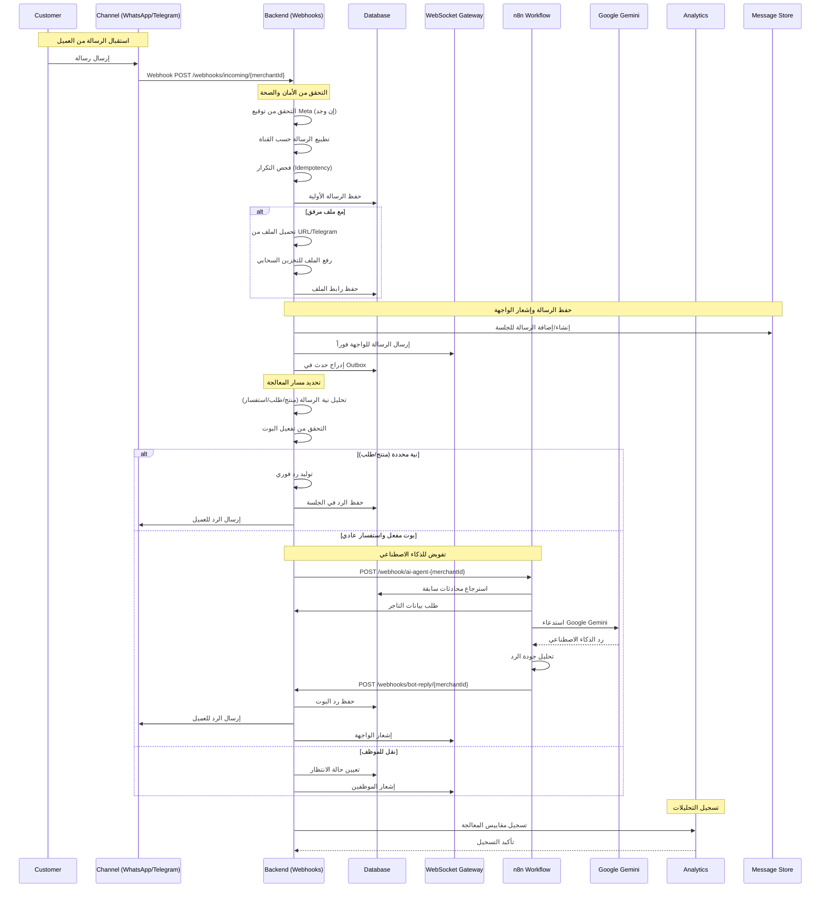
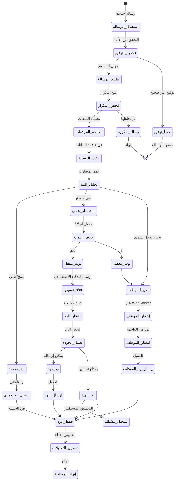
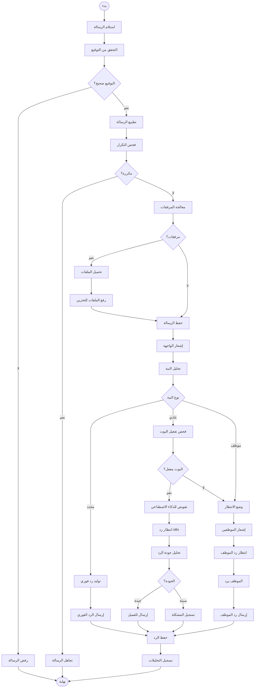

# ورك فلو معالجة الرسائل - نظام كليم الشامل

## نظرة عامة على النظام

نظام كليم يدعم استقبال وإرسال الرسائل عبر قنوات متعددة مع تكامل ذكي مع الذكاء الاصطناعي:

- **قنوات الاستقبال**: واتساب (Cloud API + QR)، تليجرام، ويب شات، داشبورد
- **قنوات الإرسال**: نفس القنوات مع إشعارات فورية
- **معالجة ذكية**: تكامل مع n8n و Google Gemini
- **تخزين الرسائل**: MongoDB مع إدارة الجلسات
- **إشعارات فورية**: WebSocket للوحة التحكم

## 1. مخطط التدفق العام (Flowchart)

```mermaid
graph TD
    A[استلام الرسالة] --> B[تحديد القناة<br/>واتساب/تليجرام/ويب شات]
    B --> C[التحقق من التوقيع<br/>Meta/Facebook API]
    C --> D[تطبيع الرسالة<br/>توحيد التنسيق]
    D --> E[فحص التكرار<br/>Idempotency check]
    E --> F[معالجة المرفقات<br/>تحميل ورفع الملفات]
    F --> G[حفظ الرسالة<br/>في قاعدة البيانات]

    G --> H[تحديد النية<br/>طلب منتج/طلب/استفسار عادي]
    H --> I{نية محددة؟}
    I -->|نعم| J[إرسال رد فوري<br/>تفاصيل المنتج/الطلب]
    I -->|لا| K[التحقق من البوت<br/>مفعل أم لا؟}
    K -->|مفعل| L[تفويض للذكاء الاصطناعي<br/>عبر n8n workflow]
    K -->|معطل| M[نقل للموظف<br/>وضع الانتظار]

    J --> N[حفظ الرد<br/>في قاعدة البيانات]
    L --> O[انتظار رد n8n<br/>معالجة الذكاء الاصطناعي]
    O --> P[تحليل جودة الرد<br/>فحص الذكاء الاصطناعي]
    P --> Q[إرسال الرد للعميل<br/>عبر القناة المناسبة]
    Q --> N

    M --> R[إشعار الموظف<br/>عبر WebSocket]
    R --> S[انتظار رد الموظف<br/>من لوحة التحكم]
    S --> T[إرسال رد الموظف<br/>للعميل]
    T --> N

    N --> U[تسجيل التحليلات<br/>مقاييس الأداء]
    U --> V[إنهاء العملية<br/>نجاح]
```

## 2. مخطط التسلسل (Sequence Diagram)



## 3. آلة الحالات (State Machine)



### تعريف الحالات

| الحالة            | الوصف                   | الإجراءات المسموحة     |
| ----------------- | ----------------------- | ---------------------- |
| `استقبال_الرسالة` | رسالة جديدة من عميل     | بدء المعالجة           |
| `فحص_التوقيع`     | التحقق من توقيع Meta    | قبول أو رفض الرسالة    |
| `تطبيع_الرسالة`   | تحويل تنسيق الرسالة     | توحيد البيانات         |
| `فحص_التكرار`     | منع الرسائل المكررة     | فحص المعرف الفريد      |
| `معالجة_المرفقات` | تحميل ورفع الملفات      | معالجة الصور/الملفات   |
| `حفظ_الرسالة`     | حفظ في قاعدة البيانات   | إدراج الرسالة          |
| `تحليل_النية`     | فهم نوع الاستفسار       | تصنيف الرسالة          |
| `نية_محددة`       | طلب منتج أو طلب         | رد فوري                |
| `استفسار_عادي`    | سؤال عام                | معالجة ذكية            |
| `نقل_للموظف`      | يحتاج تدخل بشري         | إشعار الموظفين         |
| `فحص_البوت`       | التحقق من تفعيل البوت   | قرار التوجيه           |
| `بوت_مفعل`        | البوت يمكنه الرد        | تفويض للذكاء الاصطناعي |
| `بوت_معطل`        | البوت غير مفعل          | نقل للموظف             |
| `تفويض_n8n`       | إرسال للمعالجة          | استدعاء n8n            |
| `انتظار_الرد`     | معالجة الذكاء الاصطناعي | انتظار النتيجة         |
| `تحليل_الجودة`    | فحص جودة الرد           | تقييم النتيجة          |
| `إرسال_الرد`      | إرسال الرد للعميل       | عبر القناة المناسبة    |
| `إشعار_الموظف`    | إخطار الموظفين          | عبر WebSocket          |
| `انتظار_الموظف`   | انتظار رد الموظف        | من الواجهة             |
| `إرسال_رد_الموظف` | إرسال رد الموظف         | للعميل                 |
| `حفظ_الرد`        | حفظ الرد في الجلسة      | تحديث قاعدة البيانات   |
| `تسجيل_التحليلات` | تسجيل المقاييس          | مراقبة الأداء          |
| `إنهاء_المعالجة`  | انتهاء العملية          | نجاح                   |

## 4. مخطط سير العمل التجاري (BPMN)



## 5. تفاصيل تقنية لكل مرحلة

### 5.1 مرحلة الاستقبال (Incoming Webhooks)

#### 5.1.1 استقبال رسائل واتساب (Cloud API)

**Endpoint**: `POST /webhooks/incoming/{merchantId}`

**التحقق من التوقيع**:

```typescript
// التحقق من X-Hub-Signature-256
const signature = req.headers['x-hub-signature-256'];
const expectedSignature = generateSignature(rawBody, appSecret);
if (signature !== expectedSignature) {
  throw new ForbiddenException('Invalid signature');
}
```

**تطبيع الرسالة**:

```typescript
interface NormalizedMessage {
  merchantId: string;
  sessionId: string; // رقم الهاتف أو معرف المستخدم
  channel: 'whatsapp_cloud' | 'whatsapp_qr' | 'telegram' | 'webchat';
  text: string;
  role: 'customer';
  timestamp: Date;
  metadata: {
    sourceMessageId: string;
    channel: string;
    // ... بيانات إضافية حسب القناة
  };
}
```

#### 5.1.2 استقبال رسائل تليجرام

**Endpoint**: `POST /webhooks/telegram/{channelId}`

**التحقق من صحة البوت**:

```typescript
const token = req.body.message?.from?.id || req.body.callback_query?.from?.id;
const botToken = await getBotToken(merchantId);
if (!verifyTelegramAuth(token, botToken)) {
  throw new ForbiddenException('Invalid Telegram token');
}
```

#### 5.1.3 استقبال رسائل ويب شات

**Endpoint**: `POST /api/chat` (WebSocket)

**التحقق من التوكن**:

```typescript
const token = extractTokenFromHandshake(socket);
const decoded = jwtService.verify(token);
if (!isValidUser(decoded)) {
  socket.disconnect();
}
```

### 5.2 مرحلة المعالجة والحفظ

#### 5.2.1 حفظ الرسالة في قاعدة البيانات

```typescript
// إنشاء أو إضافة رسالة للجلسة
await messageService.createOrAppend({
  merchantId,
  sessionId,
  channel,
  messages: [
    {
      role: 'customer',
      text: normalizedMessage.text,
      timestamp: new Date(),
      metadata: normalizedMessage.metadata,
    },
  ],
});
```

#### 5.2.2 إدارة المرفقات

```typescript
// تحميل الملف من تليجرام
const file = await downloadTelegramFile(fileId, botToken);
const uploadResult = await chatMediaService.uploadChatMedia(
  merchantId,
  file.tmpPath,
  file.originalName,
  mimeType,
);

// حفظ رابط الملف في الرسالة
metadata.mediaUrl = uploadResult.url;
```

### 5.3 مرحلة تحديد النية وتوجيه الرسالة

#### 5.3.1 تحليل النية

```typescript
const intent = detectOrderIntent(text);
// يرجع: { step: 'orderDetails' | 'orders' | 'askPhone' | 'normal' }
```

**أنواع النية**:

- `orderDetails`: طلب تفاصيل طلب محدد
- `orders`: طلب قائمة الطلبات
- `askPhone`: طلب رقم الهاتف للبحث
- `normal`: استفسار عام

#### 5.3.2 توجيه الرسائل المحددة

```typescript
if (intent.step === 'orderDetails' && intent.orderId) {
  const order = await ordersService.findOne(intent.orderId);
  const reply = buildOrderDetailsMessage(order);
  await replyAndEmit(normalizedMessage, reply.text);
}
```

#### 5.3.3 توجيه للذكاء الاصطناعي

```typescript
const botEnabled = await isBotEnabled(merchantId, channel);
if (botEnabled && intent.step === 'normal') {
  await n8nForwarderService.forward(merchantId, {
    merchantId,
    sessionId,
    channel,
    text,
    metadata,
    timestamp: Date.now(),
  });
}
```

### 5.4 مرحلة معالجة n8n والذكاء الاصطناعي

#### 5.4.1 استدعاء n8n

```typescript
const ts = Math.floor(Date.now() / MS_PER_SECOND);
const nonce = crypto.randomUUID();
const signature = createHmac('sha256', secret)
  .update(`${ts}.${JSON.stringify(payload)}`)
  .digest('hex');

await axios.post(`${N8N_BASE_URL}/ai-agent-${merchantId}`, payload, {
  headers: {
    'X-Kaleem-Timestamp': ts,
    'X-Kaleem-Nonce': nonce,
    'X-Kaleem-Signature': signature,
  },
});
```

#### 5.4.2 معالجة n8n workflow

```javascript
// nodes في n8n workflow:
1. Webhook (استقبال الرسالة)
2. Get Merchant (بيانات التاجر)
3. AI Agent (Google Gemini)
4. MongoDB Chat Memory (سياق المحادثة)
5. searchProducts (البحث في المنتجات)
6. search knowledge (البحث في المعرفة)
7. AI Agent1 (تحليل جودة الرد)
8. Send To Backend (إرسال الرد)
```

#### 5.4.3 تحليل جودة الرد

```javascript
// في n8n: فحص ما إذا كان الرد فارغ أو غير مفهوم
if (response.output === '' || containsConfusionWords(response.output)) {
  // تسجيل للتحسين المستقبلي
  await analytics.trackMissingResponse({
    question: originalMessage,
    botReply: response.output,
    merchantId,
    channel,
    sessionId,
  });
}
```

### 5.5 مرحلة إرسال الردود

#### 5.5.1 إرسال الردود للقنوات المختلفة

```typescript
async function sendReplyToChannel(deps, channelsRepo, chatGateway, evoService) {
  const { merchantId, channel, sessionId, text } = deps;

  switch (channel) {
    case 'webchat':
    case 'dashboard-test':
      return sendToWebchat(sessionId, text, chatGateway);

    case 'telegram':
      return sendToTelegram(merchantId, sessionId, text, channelsRepo);

    case 'whatsapp_cloud':
      return sendToWhatsAppCloud(merchantId, sessionId, text, channelsRepo);

    case 'whatsapp_qr':
      return sendToWhatsAppQR(
        merchantId,
        sessionId,
        text,
        channelsRepo,
        evoService,
      );
  }
}
```

#### 5.5.2 إرسال عبر واتساب Cloud API

```typescript
await axios.post(
  `https://graph.facebook.com/v19.0/${phoneNumberId}/messages`,
  {
    messaging_product: 'whatsapp',
    to: sessionId,
    type: 'text',
    text: { body: text },
  },
  { headers: { Authorization: `Bearer ${accessToken}` } },
);
```

#### 5.5.3 إرسال عبر تليجرام

```typescript
await axios.post(`https://api.telegram.org/bot${botToken}/sendMessage`, {
  chat_id: sessionId,
  text,
});
```

#### 5.5.4 إرسال عبر Evolution API (واتساب QR)

```typescript
await evoService.sendMessage(instanceName, sessionId, text);
```

### 5.6 مرحلة الإشعارات والمراقبة

#### 5.6.1 إشعارات WebSocket

```typescript
// للعملاء في نفس الجلسة
chatGateway.server.to(sessionId).emit('message', {
  id: messageId,
  role: 'bot',
  text: reply,
  timestamp: new Date(),
});

// للمشرفين والموظفين
chatGateway.server.to('admin').emit('admin_new_message', {
  sessionId,
  message: replyMessage,
});
```

#### 5.6.2 تسجيل التحليلات

```typescript
await analytics.trackMessage({
  merchantId,
  sessionId,
  channel,
  messageType: 'incoming' | 'bot_reply' | 'agent_reply',
  processingTime: Date.now() - startTime,
  success: true,
});
```

## 6. معايير الأمان والحماية

### 6.1 حماية من الهجمات

- **Rate Limiting**: 1 طلب/10ث للـ webhooks، 10 رسائل/10د للـ WebSocket
- **Signature Verification**: التحقق من تواقيع Meta و Telegram
- **Idempotency**: منع معالجة الرسائل المكررة
- **Token Validation**: التحقق من JWT tokens للـ WebSocket
- **Input Sanitization**: تنظيف البيانات المدخلة

### 6.2 مراقبة الأداء

- **Response Time Tracking**: قياس زمن المعالجة
- **Error Rate Monitoring**: مراقبة معدلات الأخطاء
- **Memory Usage**: مراقبة استهلاك الذاكرة
- **Database Performance**: مراقبة أداء قاعدة البيانات

## 7. مسارات الخطأ والتعامل معها

### 7.1 أخطاء الاستقبال

```javascript
INVALID_SIGNATURE; // توقيع غير صحيح
DUPLICATE_MESSAGE; // رسالة مكررة
INVALID_FORMAT; // تنسيق خاطئ
CHANNEL_NOT_FOUND; // القناة غير موجودة
```

### 7.2 أخطاء المعالجة

```javascript
AI_PROCESSING_FAILED; // فشل معالجة n8n
FILE_UPLOAD_FAILED; // فشل رفع الملف
MERCHANT_NOT_FOUND; // التاجر غير موجود
BOT_NOT_ENABLED; // البوت غير مفعل
```

### 7.3 أخطاء الإرسال

```javascript
SEND_FAILED; // فشل الإرسال للقناة
WEBHOOK_TIMEOUT; // انتهت مهلة n8n
INVALID_SESSION; // جلسة غير صحيحة
```

## 8. خطة الاختبار والتحقق

### 8.1 اختبارات الوحدة

- اختبار تطبيع الرسائل لكل قناة
- اختبار فحص التوقيعات
- اختبار تحليل النية
- اختبار إرسال الردود

### 8.2 اختبارات التكامل

- اختبار التدفق الكامل للرسائل
- اختبار تكامل n8n
- اختبار تكامل القنوات المختلفة
- اختبار معالجة الأخطاء

### 8.3 اختبارات الأداء

- اختبار الحمل على الـ webhooks
- اختبار زمن المعالجة
- اختبار استهلاك الذاكرة
- اختبار WebSocket connections

---

_تم إنشاء هذا التوثيق بواسطة نظام كليم لإدارة المتاجر الذكية_
