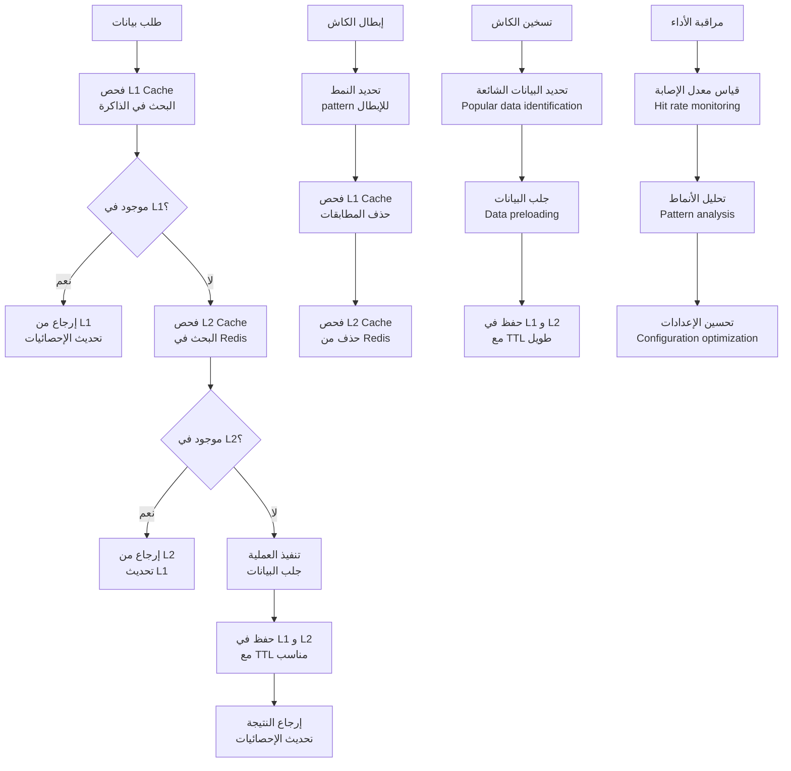
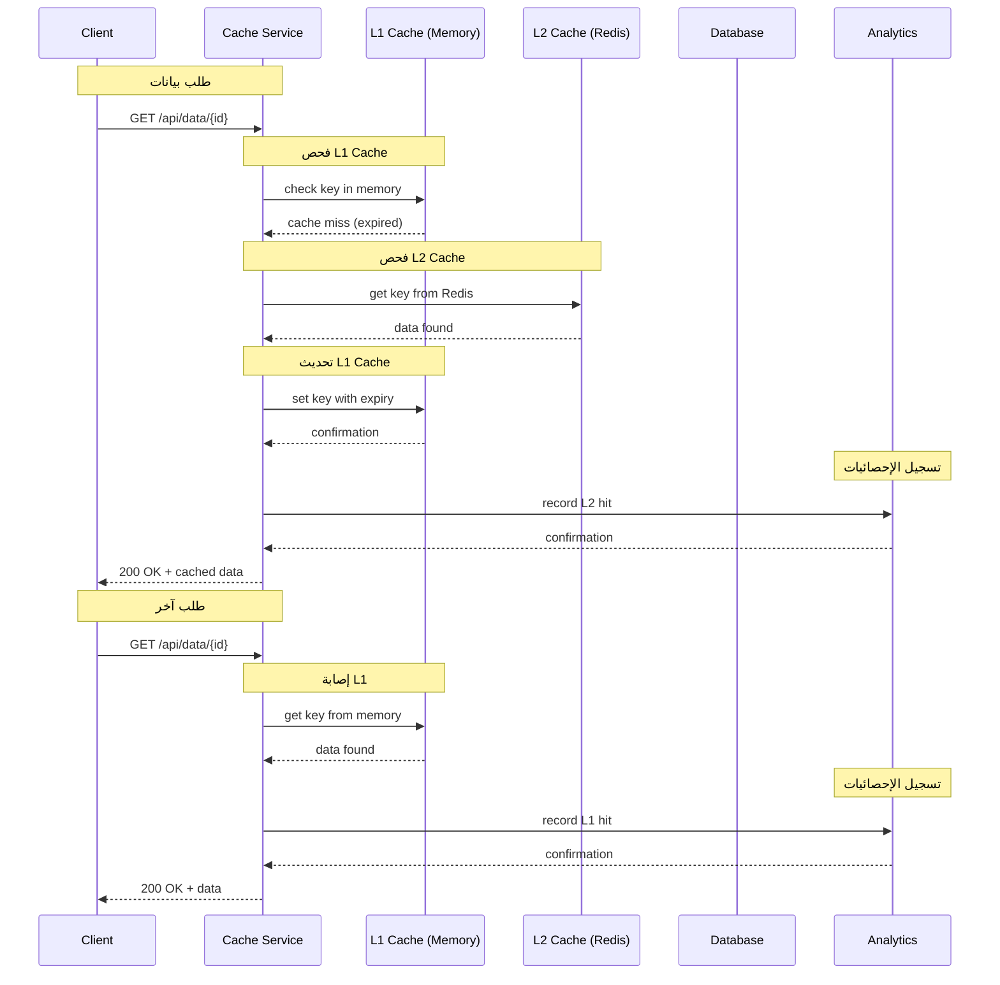
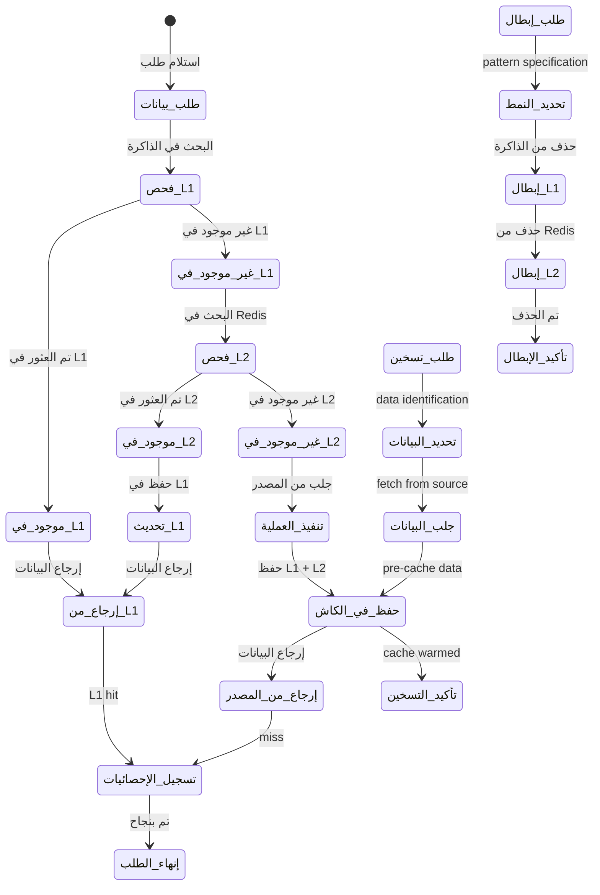
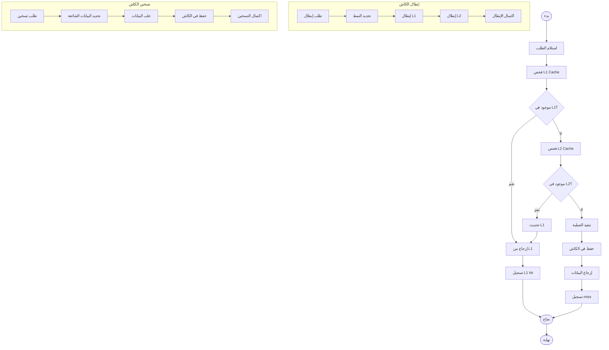

# ورك فلو الكاش متعدد الطبقات (L1/L2) - نظام كليم الشامل

## نظرة عامة على النظام

نظام كليم يدعم كاش متعدد الطبقات متقدم لتحسين الأداء والموثوقية:

- **L1 Cache**: ذاكرة داخلية سريعة (in-memory Map)
- **L2 Cache**: Redis للتخزين الموزع والمستمر
- **Cache Invalidation**: إبطال ذكي بناءً على الأنماط
- **Cache Warmer**: تسخين الكاش للبيانات الشائعة
- **Metrics & Monitoring**: تتبع الأداء والإحصائيات
- **Locking Mechanism**: منع السباق في الكاش المشترك

## 1. مخطط التدفق العام (Flowchart)



## 2. مخطط التسلسل (Sequence Diagram)



## 3. آلة الحالات (State Machine)



### تعريف الحالات

| الحالة             | الوصف                     | الإجراءات المسموحة    |
| ------------------ | ------------------------- | --------------------- |
| `طلب_بيانات`       | استلام طلب لجلب بيانات    | فحص الكاش             |
| `فحص_L1`           | البحث في L1 Cache         | التحقق من الصلاحية    |
| `موجود_في_L1`      | البيانات موجودة في L1     | إرجاع مباشرة          |
| `غير_موجود_في_L1`  | البيانات غير موجودة في L1 | فحص L2                |
| `فحص_L2`           | البحث في L2 Cache         | التحقق من Redis       |
| `موجود_في_L2`      | البيانات موجودة في L2     | تحديث L1              |
| `غير_موجود_في_L2`  | البيانات غير موجودة في L2 | تنفيذ العملية         |
| `تنفيذ_العملية`    | جلب البيانات من المصدر    | قاعدة البيانات أو API |
| `حفظ_في_الكاش`     | حفظ في L1 و L2            | تحديث كلا المستويين   |
| `إرجاع_من_L1`      | إرجاع البيانات من L1      | تحديث الإحصائيات      |
| `إرجاع_من_المصدر`  | إرجاع البيانات الجديدة    | تحديث الإحصائيات      |
| `تسجيل_الإحصائيات` | تسجيل مقاييس الأداء       | hit/miss tracking     |
| `طلب_إبطال`        | طلب إبطال الكاش           | تحديد النمط           |
| `طلب_تسخين`        | طلب تسخين الكاش           | تحديد البيانات        |

## 4. مخطط سير العمل التجاري (BPMN)



## 5. تفاصيل تقنية لكل مرحلة

### 5.1 مرحلة الكاش متعدد الطبقات

#### 5.1.1 هيكل الكاش

```typescript
// L1: ذاكرة داخلية سريعة
private readonly l1 = new Map<string, Entry<unknown>>();

// L2: Redis للتخزين المستمر
private redis: RedisLike | null = null;

// إحصائيات الأداء
private stats = {
  l1Hits: 0,
  l2Hits: 0,
  misses: 0,
  sets: 0,
  invalidations: 0,
};
```

#### 5.1.2 هيكل البيانات المخزنة

```typescript
interface Entry<T> {
  v: T; // القيمة المخزنة
  e: number; // تاريخ الانتهاء (timestamp)
}
```

#### 5.1.3 عملية البحث

```typescript
async function get<T>(key: string): Promise<T | undefined> {
  // 1. فحص L1 أولاً (سريع جداً)
  const l1Result = this.checkL1Cache<T>(key);
  if (l1Result) return l1Result;

  // 2. فحص L2 إذا لم يكن موجود في L1
  const l2Result = await this.checkL2Cache<T>(key);
  return l2Result;
}

private checkL1Cache<T>(key: string): T | undefined {
  const now = Date.now();
  const l1Entry = this.l1.get(key);

  if (l1Entry && l1Entry.e > now) {
    this.recordHit('l1', key);
    return l1Entry.v as T;
  }

  return undefined;
}

private async checkL2Cache<T>(key: string): Promise<T | undefined> {
  if (!this.redis) return undefined;

  try {
    const raw = await this.redis.get(key);
    if (!raw) return undefined;

    const parsed = this.parseRedisValue<T>(raw);
    if (!parsed || parsed.e <= Date.now()) {
      await this.deleteExpiredEntry(key);
      return undefined;
    }

    // تحديث L1 من L2
    this.l1.set(key, parsed);
    this.recordHit('l2', key);
    return parsed.v;
  } catch (error) {
    return undefined;
  }
}
```

### 5.2 مرحلة إبطال الكاش

#### 5.2.1 إبطال بناءً على الأنماط

```typescript
async function invalidate(pattern: string): Promise<void> {
  // 1. إبطال L1
  const l1Keys = Array.from(this.l1.keys());
  const matchingL1Keys = l1Keys.filter((key) =>
    this.matchPattern(key, pattern),
  );
  matchingL1Keys.forEach((key) => this.l1.delete(key));

  // 2. إبطال L2 (Redis)
  if (this.redis) {
    const stream = this.redis.scanStream({
      match: pattern,
      count: SCAN_COUNT,
    });

    let pipeline = this.redis.pipeline();
    let batch = 0;

    stream.on('data', (keys: string[]) => {
      keys.forEach((key) => {
        pipeline.del(key);
        batch++;
        if (batch >= PIPELINE_BATCH) {
          pipeline.exec();
          pipeline = this.redis!.pipeline();
          batch = 0;
        }
      });
    });
  }
}
```

#### 5.2.2 مطابقة الأنماط

```typescript
private matchPattern(key: string, pattern: string): boolean {
  const escaped = pattern.replace(/[.*+?^${}()|[\]\\]/g, '\\$&');
  const regexPattern = escaped.replace(/\\\*/g, '.*').replace(/\\\?/g, '.');
  const regex = new RegExp(`^${regexPattern}$`);
  return regex.test(key);
}
```

### 5.3 مرحلة تسخين الكاش

#### 5.3.1 تحديد البيانات الشائعة

```typescript
async function identifyPopularData(): Promise<string[]> {
  const popularKeys = [];

  // تحليل الاستعلامات الشائعة
  const queryStats = await analytics.getPopularQueries();
  popularKeys.push(...queryStats.map((q) => `query:${q.id}`));

  // تحليل المنتجات الشائعة
  const productStats = await analytics.getPopularProducts();
  popularKeys.push(...productStats.map((p) => `product:${p.id}`));

  // تحليل الفئات الشائعة
  const categoryStats = await analytics.getPopularCategories();
  popularKeys.push(...categoryStats.map((c) => `category:${c.id}`));

  return popularKeys;
}
```

#### 5.3.2 تسخين الكاش

```typescript
async function warmupCache(popularKeys: string[]): Promise<void> {
  const warmupPromises = popularKeys.map(async (key) => {
    try {
      const data = await fetchDataForKey(key);
      await this.set(key, data, LONG_TTL);
    } catch (error) {
      logger.warn(`Failed to warmup cache for key: ${key}`, error);
    }
  });

  await Promise.allSettled(warmupPromises);
}
```

### 5.4 مرحلة إدارة الجلسات والقفل

#### 5.4.1 قفل الكاش المشترك

```typescript
async function getOrSet<T>(
  key: string,
  ttlSeconds: number,
  fn: () => Promise<T>,
): Promise<T> {
  // فحص الكاش أولاً
  const cached = await this.get<T>(key);
  if (cached !== undefined) return cached;

  // إنشاء قفل لمنع السباق
  const lockKey = `lock:fill:${key}`;
  const gotLock = await this.redis?.set(lockKey, '1', 'EX', LOCK_TTL_SEC, 'NX');

  if (gotLock !== 'OK') {
    // في انتظار الآخرين
    await new Promise((resolve) => setTimeout(resolve, LOCK_BACKOFF_MS));
    const again = await this.get<T>(key);
    if (again !== undefined) return again;
  }

  try {
    // تنفيذ العملية
    const value = await fn();
    await this.set(key, value, ttlSeconds);
    return value;
  } finally {
    // إزالة القفل
    await this.redis?.del(lockKey);
  }
}
```

#### 5.4.2 تنظيف الجلسات المنتهية

```typescript
@Interval(CLEANUP_INTERVAL_MS)
private cleanupL1Tick(): void {
  const now = Date.now();
  let cleaned = 0;

  for (const [key, entry] of this.l1.entries()) {
    if (entry.e <= now) {
      this.l1.delete(key);
      cleaned++;
    }
  }

  if (cleaned > 0) {
    logger.debug(`Cleaned ${cleaned} expired entries from L1 cache`);
  }
}
```

## 6. معايير الأداء والمراقبة

### 6.1 إحصائيات الأداء

```typescript
getStats(): {
  l1Hits: number;
  l2Hits: number;
  misses: number;
  sets: number;
  invalidations: number;
  l1Size: number;
  hitRate: string;
  totalRequests: number;
} {
  const total = this.stats.l1Hits + this.stats.l2Hits + this.stats.misses;
  const hitRate = total > 0
    ? (((this.stats.l1Hits + this.stats.l2Hits) / total) * 100).toFixed(2)
    : '0.00';

  return {
    ...this.stats,
    l1Size: this.l1.size,
    hitRate: `${hitRate}%`,
    totalRequests: total,
  };
}
```

### 6.2 مراقبة معدل الإصابة

```typescript
@Interval(HITRATE_INTERVAL_MS)
updateHitRate(): void {
  const total = this.hits + this.misses || 1;
  this.cacheHitRateGauge.set(
    { cache_type: 'redis' },
    (this.hits / total) * 100
  );
  this.hits = 0;
  this.misses = 0;
}
```

## 7. مسارات الخطأ والتعامل معها

### 7.1 أخطاء L1 Cache

```javascript
L1_CACHE_OVERFLOW; // تجاوز حجم L1
L1_MEMORY_ERROR; // خطأ في الذاكرة
L1_SERIALIZATION_ERROR; // خطأ في التسلسل
```

### 7.2 أخطاء L2 Cache (Redis)

```javascript
REDIS_CONNECTION_ERROR; // خطأ في الاتصال
REDIS_TIMEOUT_ERROR; // انتهاء المهلة
REDIS_MEMORY_ERROR; // نفدت الذاكرة
REDIS_SERIALIZATION_ERROR; // خطأ في التسلسل
```

### 7.3 أخطاء الإبطال

```javascript
INVALIDATION_PATTERN_ERROR; // نمط إبطال خاطئ
INVALIDATION_TIMEOUT; // انتهاء مهلة الإبطال
PARTIAL_INVALIDATION; // إبطال جزئي فقط
```

## 8. خطة الاختبار والتحقق

### 8.1 اختبارات الوحدة

- اختبار فحص L1 Cache
- اختبار فحص L2 Cache
- اختبار إبطال الكاش
- اختبار نظام القفل

### 8.2 اختبارات التكامل

- اختبار التكامل مع Redis
- اختبار التكامل مع NestJS Cache Manager
- اختبار التكامل مع Prometheus
- اختبار معالجة الأخطاء

### 8.3 اختبارات الأداء

- اختبار أداء L1 vs L2
- اختبار أداء الإبطال
- اختبار أداء تسخين الكاش
- اختبار استهلاك الذاكرة

### 8.4 اختبارات التحميل

- اختبار الكاش تحت الحمل العالي
- اختبار معدل الإصابة تحت الضغط
- اختبار زمن الاستجابة
- اختبار استهلاك الشبكة

---

_تم إنشاء هذا التوثيق بواسطة نظام كليم لإدارة المتاجر الذكية_
