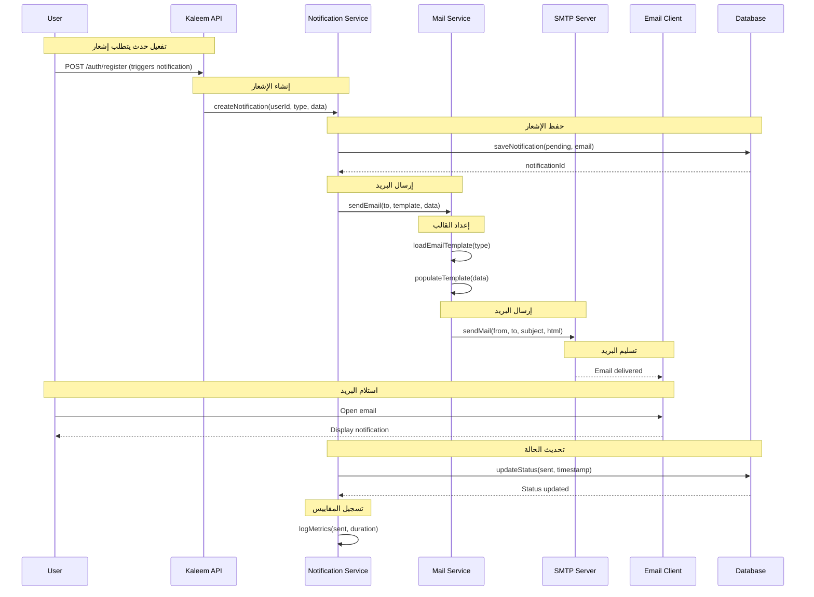
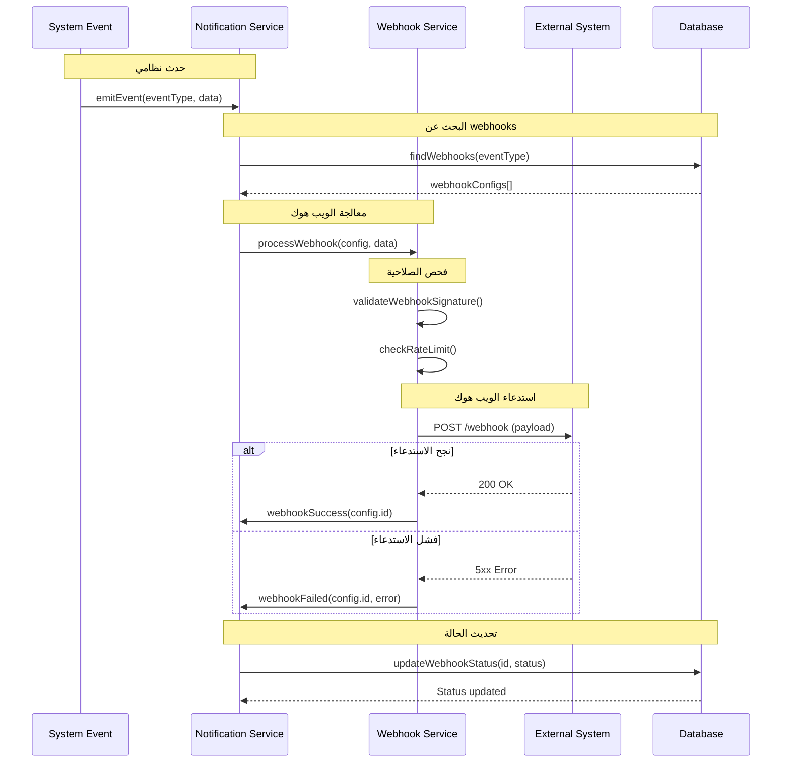
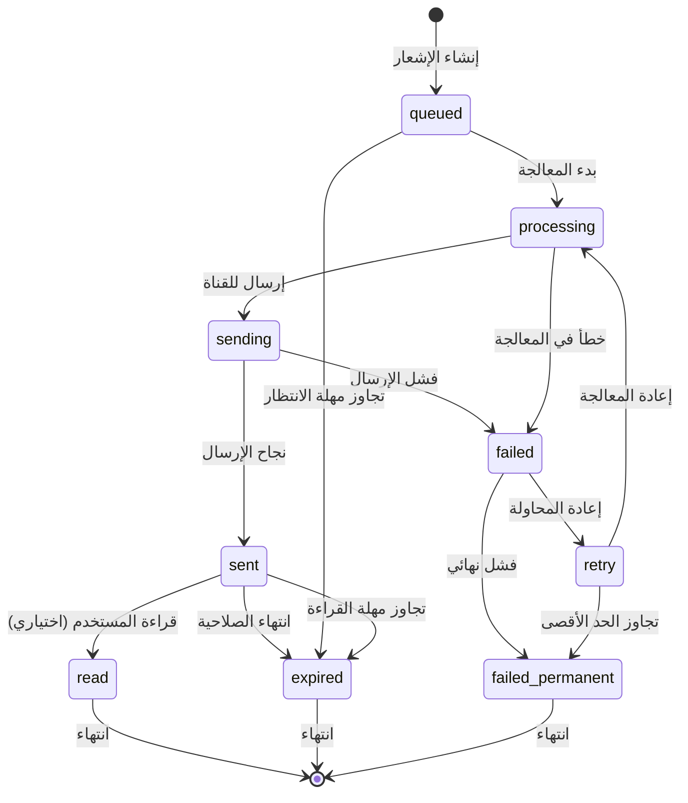
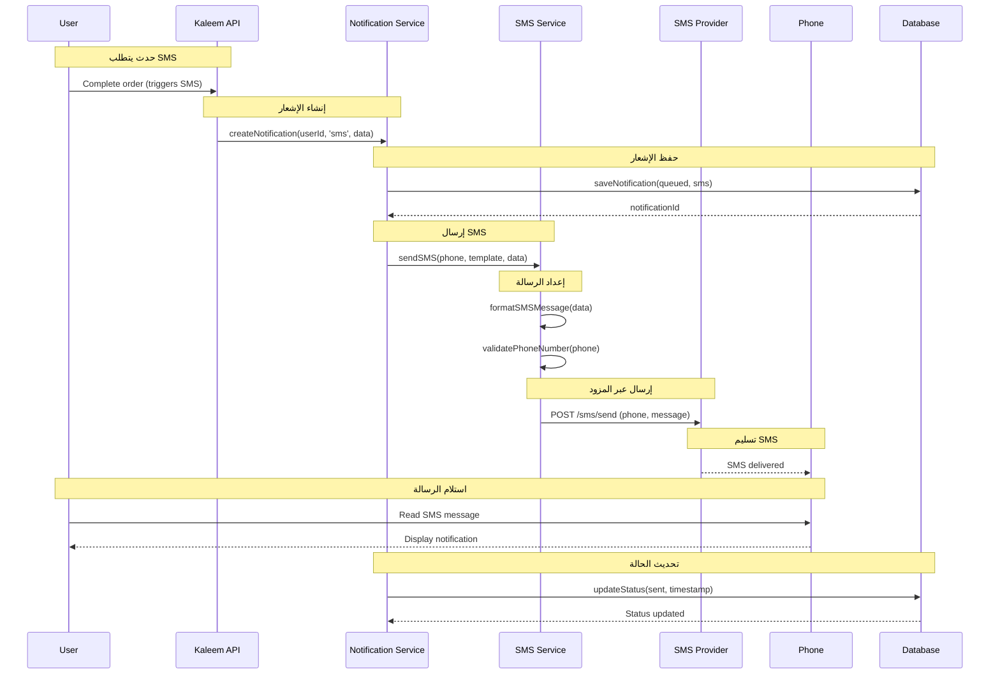
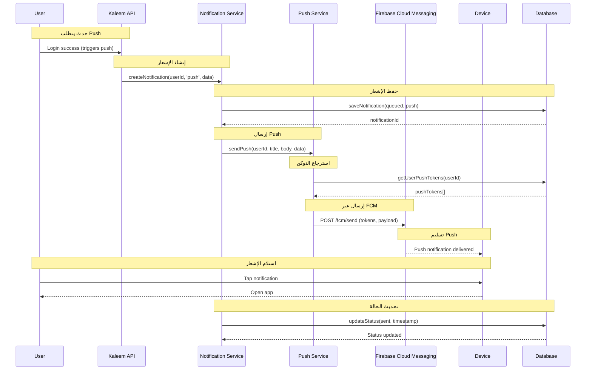

# نظام الإشعارات (Email/SMS/Push/Webhooks) - نظام كليم

## نظرة عامة على النظام

نظام كليم يدعم نظام إشعارات متعدد القنوات مع حالات تتبع متقدمة:

- **Email Notifications**: إرسال البريد الإلكتروني مع قوالب HTML
- **SMS Notifications**: إرسال الرسائل النصية (مخطط للمستقبل)
- **Push Notifications**: إشعارات الدفع (مخطط للمستقبل)
- **Webhook Notifications**: استدعاءات HTTP للنظم الخارجية
- **Notification States**: تتبع حالات الإشعارات (queued/sent/failed)
- **Event-Driven Architecture**: نظام أحداث للتفعيل

## 1. مخطط التسلسل - Email Notification (Sequence Diagram)



## 2. مخطط التسلسل - Webhook Notification (Sequence Diagram)



## 3. آلة الحالات - Notification States (State Machine)



### تعريف الحالات

| الحالة             | الوصف                     | الإجراءات المسموحة      |
| ------------------ | ------------------------- | ----------------------- |
| `queued`           | الإشعار في قائمة الانتظار | إضافة للمعالجة          |
| `processing`       | جاري معالجة الإشعار       | تحضير المحتوى وإرسال    |
| `sending`          | جاري إرسال الإشعار        | استدعاء قناة الإرسال    |
| `sent`             | تم إرسال الإشعار بنجاح    | انتظار تفاعل المستخدم   |
| `failed`           | فشل في إرسال الإشعار      | إعادة المحاولة أو إلغاء |
| `read`             | تم قراءة الإشعار          | انتهاء دورة الحياة      |
| `expired`          | انتهت صلاحية الإشعار      | تنظيف تلقائي            |
| `failed_permanent` | فشل نهائي في الإرسال      | تسجيل وتنظيف            |
| `retry`            | في قائمة إعادة المحاولة   | إعادة المعالجة          |

## 4. مخطط التسلسل - SMS Notification (Sequence Diagram)



## 5. مخطط التسلسل - Push Notification (Sequence Diagram)



## 6. تفاصيل تقنية لكل مرحلة

### 6.1 مرحلة إنشاء الإشعار

#### 6.1.1 إنشاء الإشعار من حدث

```typescript
// src/modules/notifications/notifications.service.ts
async createNotification(input: NotifyInput): Promise<NotificationPayload> {
  const doc = await this.repo.create({
    userId: toObjectId(input.userId),
    merchantId: input.merchantId ? toObjectId(input.merchantId) : undefined,
    type: input.type,
    title: input.title,
    body: input.body,
    data: input.data,
    severity: input.severity || DEFAULT_SEVERITY,
    read: false,
  });

  // إشعار الأحداث
  this.eventEmitter.emit(EVENT_NOTIFY_USER, {
    userId: input.userId,
    notification: buildPayload(doc, toObjectId(input.userId), input),
  });

  return buildPayload(doc, toObjectId(input.userId), input);
}
```

#### 6.1.2 معالجة الأحداث

```typescript
// src/modules/notifications/notifications.module.ts
@Module({
  providers: [
    {
      provide: 'NOTIFICATION_EVENT_HANDLER',
      useFactory: (
        eventEmitter: EventEmitter2,
        notificationsService: NotificationsService,
      ) => {
        eventEmitter.on('notify.user', async (payload) => {
          await notificationsService.processNotificationEvent(payload);
        });
      },
      inject: [EventEmitter2, NotificationsService],
    },
  ],
})
export class NotificationsModule {}
```

### 6.2 مرحلة معالجة الإشعار

#### 6.2.1 معالجة البريد الإلكتروني

```typescript
// src/modules/mail/mail.service.ts
async sendVerificationEmail(email: string, code: string): Promise<void> {
  const link = this.buildVerificationLink(email, code);
  const html = this.generateVerificationTemplate(code, link);

  try {
    await this.transporter.sendMail({
      from: this.mailFrom,
      to: email,
      subject: 'تفعيل حسابك على منصة كليم',
      html,
    });

    this.logger.log(`Verification email sent to ${email}`);
  } catch (error) {
    this.logger.error(`Failed to send email to ${email}`, error);
    throw new InternalServerErrorException('فشل في إرسال بريد التفعيل');
  }
}
```

#### 6.2.2 معالجة الويب هوك

```typescript
// src/modules/webhooks/webhooks.service.ts
async processWebhookNotification(
  webhookConfig: WebhookConfig,
  eventType: string,
  data: unknown
): Promise<void> {
  const payload = {
    event: eventType,
    timestamp: new Date().toISOString(),
    data,
    webhookId: webhookConfig.id,
  };

  try {
    await this.httpService.post(webhookConfig.url, payload, {
      headers: {
        'Content-Type': 'application/json',
        'X-Webhook-Signature': this.generateSignature(payload, webhookConfig.secret),
      },
      timeout: 10000,
    });

    await this.updateWebhookStatus(webhookConfig.id, 'sent');
  } catch (error) {
    await this.updateWebhookStatus(webhookConfig.id, 'failed', error.message);
    throw error;
  }
}
```

### 6.3 مرحلة تتبع الحالات

#### 6.3.1 تحديث حالة الإشعار

```typescript
// src/modules/notifications/notifications.service.ts
async updateNotificationStatus(
  notificationId: string,
  status: NotificationStatus,
  metadata?: Record<string, unknown>
): Promise<void> {
  const update: UpdateQuery<NotificationDocument> = {
    status,
    ...(status === 'sent' && { sentAt: new Date() }),
    ...(status === 'failed' && { failedAt: new Date(), errorDetails: metadata }),
    ...(status === 'read' && { readAt: new Date() }),
  };

  await this.repo.update(notificationId, update);

  // تسجيل المقاييس
  this.metrics.recordNotificationStatus(notificationId, status);
}
```

#### 6.3.2 جدولة إعادة المحاولة

```typescript
// src/modules/notifications/notifications.service.ts
async scheduleRetry(notificationId: string, delayMs: number = 60000): Promise<void> {
  await this.queue.add('retry-notification', { notificationId }, {
    delay: delayMs,
    attempts: 3,
    backoff: {
      type: 'exponential',
      delay: 60000,
    },
  });
}
```

### 6.4 مرحلة إدارة القوالب

#### 6.4.1 قوالب البريد الإلكتروني

```typescript
// src/modules/mail/mail.service.ts
private generateVerificationTemplate(code: string, link: string): string {
  return `
    <!DOCTYPE html>
    <html dir="rtl" lang="ar">
    <head>
      <meta charset="UTF-8">
      <meta name="viewport" content="width=device-width, initial-scale=1.0">
      <title>تفعيل الحساب</title>
    </head>
    <body style="font-family: Arial, sans-serif; direction: rtl;">
      <div style="max-width: 600px; margin: 0 auto; padding: 20px;">
        <h1 style="color: #333;">مرحباً بك في كليم</h1>
        <p>شكراً لتسجيلك معنا. لتفعيل حسابك، يرجى استخدام الرمز التالي:</p>
        <div style="background: #f5f5f5; padding: 20px; text-align: center; margin: 20px 0;">
          <h2 style="margin: 0; color: #333;">${code}</h2>
        </div>
        <p>أو يمكنك النقر على الرابط التالي:</p>
        <a href="${link}" style="background: #007bff; color: white; padding: 10px 20px; text-decoration: none; border-radius: 5px;">تفعيل الحساب</a>
      </div>
    </body>
    </html>
  `;
}
```

#### 6.4.2 قوالب الرسائل النصية

```typescript
// src/modules/sms/sms.service.ts
private formatSMSMessage(type: string, data: Record<string, unknown>): string {
  switch (type) {
    case 'order_confirmation':
      return `تم تأكيد طلبك رقم ${data.orderId}. المبلغ: ${data.amount} ${data.currency}`;

    case 'password_reset':
      return `رمز إعادة تعيين كلمة المرور: ${data.code}. صالح لمدة 10 دقائق`;

    case 'account_verification':
      return `رمز تفعيل الحساب: ${data.code}. مرحباً بك في كليم!`;

    default:
      return `إشعار من كليم: ${data.message || 'تم إرسال إشعار جديد'}`;
  }
}
```

## 7. سياسات الأمان والحماية

### 7.1 تشفير البيانات الحساسة

```typescript
// src/modules/notifications/notifications.service.ts
async createSecureNotification(input: SecureNotifyInput): Promise<NotificationPayload> {
  const encryptedData = await this.encryptionService.encrypt(input.sensitiveData);

  const doc = await this.repo.create({
    userId: toObjectId(input.userId),
    type: input.type,
    title: input.title,
    data: { encrypted: encryptedData },
    severity: input.severity,
  });

  return buildPayload(doc, toObjectId(input.userId), {
    ...input,
    data: { encrypted: true }, // لا نرسل البيانات الحساسة
  });
}
```

### 7.2 Rate Limiting للإشعارات

```typescript
// src/modules/notifications/notifications.service.ts
async checkRateLimit(userId: string, type: string): Promise<boolean> {
  const key = `notification:${type}:${userId}`;
  const limit = this.getRateLimitForType(type);
  const window = this.getRateLimitWindow(type);

  const current = await this.cache.get<number>(key) || 0;

  if (current >= limit) {
    return false; // تجاوز الحد
  }

  await this.cache.set(key, current + 1, window);
  return true;
}
```

### 7.3 فحص محتوى الإشعارات

```typescript
// src/modules/notifications/notifications.service.ts
async validateNotificationContent(input: NotifyInput): Promise<boolean> {
  // فحص طول العنوان والمحتوى
  if (input.title.length > 200 || (input.body && input.body.length > 1000)) {
    return false;
  }

  // فحص المحتوى المشبوه
  const suspiciousPatterns = [
    /<script/i,
    /javascript:/i,
    /on\w+\s*=/i,
  ];

  const content = `${input.title} ${input.body || ''}`;
  for (const pattern of suspiciousPatterns) {
    if (pattern.test(content)) {
      return false;
    }
  }

  return true;
}
```

## 8. مراقبة الأداء والأمان

### 8.1 مقاييس الإشعارات

```yaml
# prometheus.yml - مقاييس الإشعارات
- name: notifications_created_total
  type: counter
  help: 'إجمالي الإشعارات المُنشأة'
  labelnames: [type, channel, severity]

- name: notifications_sent_total
  type: counter
  help: 'إجمالي الإشعارات المُرسلة'
  labelnames: [type, channel, status]

- name: notifications_failed_total
  type: counter
  help: 'إجمالي الإشعارات الفاشلة'
  labelnames: [type, channel, error_type]

- name: notification_processing_duration_seconds
  type: histogram
  help: 'زمن معالجة الإشعارات'
  labelnames: [type, channel]
  buckets: [0.01, 0.05, 0.1, 0.5, 1, 2, 5]
```

### 8.2 تنبيهات الإشعارات

```yaml
# alerts/notifications.yml
groups:
  - name: notifications
    rules:
      - alert: HighNotificationFailureRate
        expr: |
          rate(notifications_failed_total[5m]) / rate(notifications_sent_total[5m]) > 0.1
        for: 5m
        labels:
          severity: warning
        annotations:
          summary: 'معدل فشل الإشعارات مرتفع'
          runbook_url: 'https://kb.kaleem-ai.com/runbooks/notification-failures'

      - alert: NotificationQueueBacklog
        expr: |
          notifications_created_total - notifications_sent_total > 1000
        for: 10m
        labels:
          severity: critical
        annotations:
          summary: 'تراكم في قائمة الإشعارات'
```

## 9. خطة الاختبار والتحقق

### 9.1 اختبارات الوحدة

- اختبار إنشاء الإشعارات
- اختبار معالجة القوالب
- اختبار تحديث الحالات
- اختبار Rate Limiting

### 9.2 اختبارات التكامل

- اختبار إرسال البريد الإلكتروني
- اختبار إرسال SMS
- اختبار إرسال Push
- اختبار استدعاء الويب هوك

### 9.3 اختبارات الأداء

- اختبار معالجة كميات كبيرة من الإشعارات
- اختبار زمن الاستجابة للإشعارات
- اختبار استهلاك الموارد
- اختبار معدل الفشل تحت الحمل

### 9.4 اختبارات الأمان

- اختبار فحص محتوى الإشعارات
- اختبار Rate Limiting
- اختبار تشفير البيانات الحساسة
- اختبار منع الهجمات

---

_تم إنشاء هذا التوثيق بواسطة نظام كليم لإدارة المتاجر الذكية_
