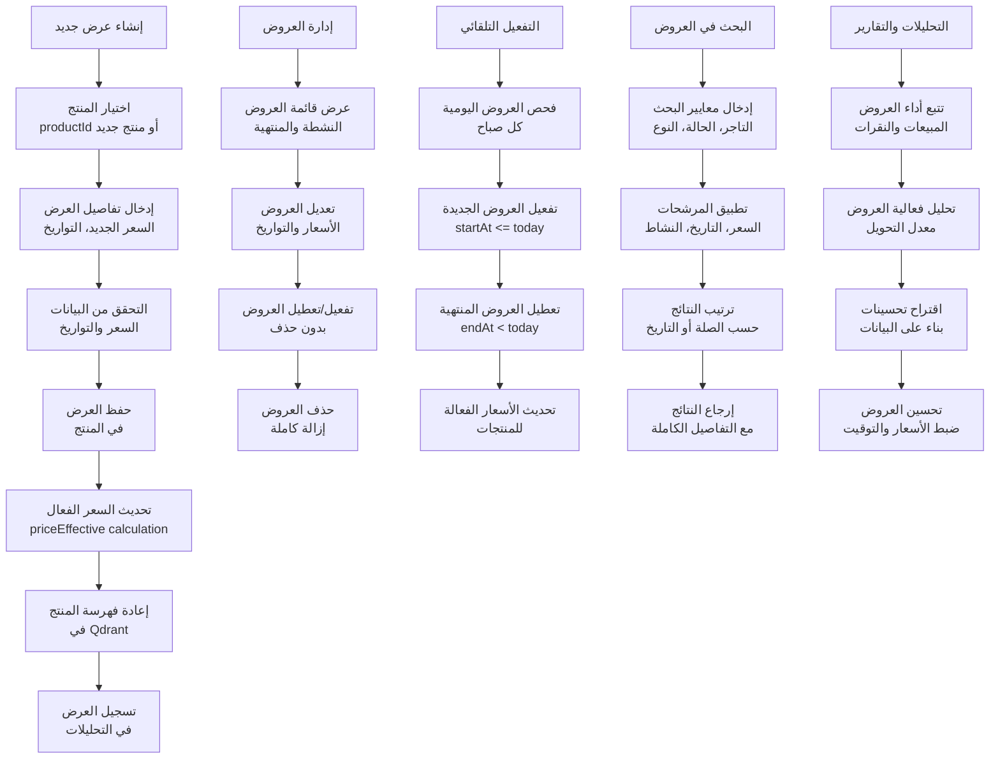
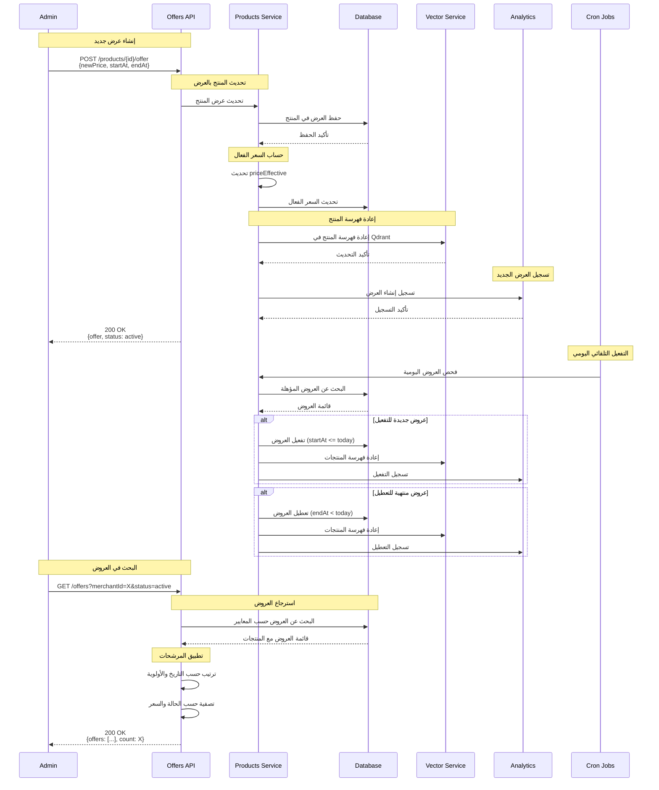
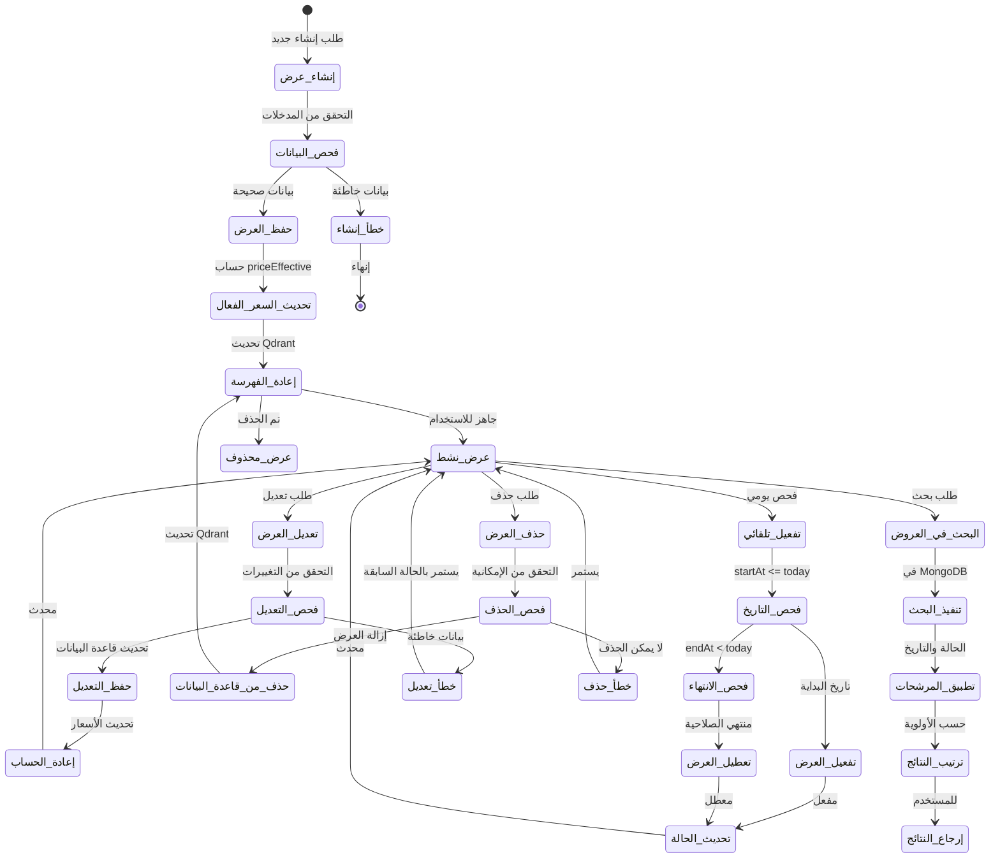
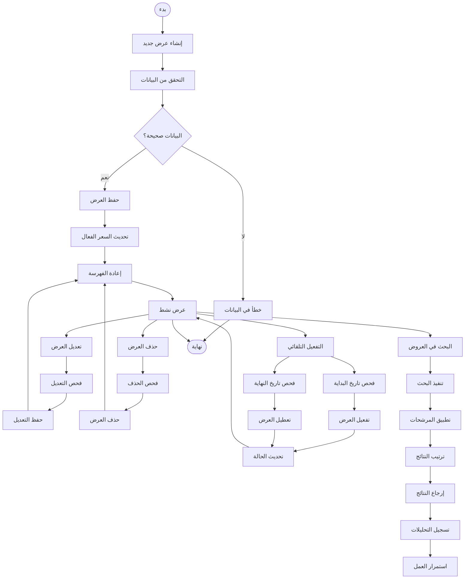

# ورك فلو إدارة العروض - نظام كليم الشامل

## نظرة عامة على النظام

نظام كليم يدعم إدارة شاملة للعروض والتخفيضات مع إمكانيات متقدمة:

- **العروض في المنتجات**: كل منتج يمكن أن يحتوي على عرض واحد
- **إدارة الحملات**: عروض موسمية ومؤقتة
- **حساب الأسعار**: السعر الأصلي والمخفض والفعال
- **التفعيل التلقائي**: بدء وانتهاء العروض حسب التواريخ
- **البحث والتصفية**: حسب التاجر والحالة والنوع
- **التحليلات**: تتبع أداء العروض والمبيعات

## 1. مخطط التدفق العام (Flowchart)



## 2. مخطط التسلسل (Sequence Diagram)



## 3. آلة الحالات (State Machine)



### تعريف الحالات

| الحالة               | الوصف                          | الإجراءات المسموحة          |
| -------------------- | ------------------------------ | --------------------------- |
| `إنشاء_عرض`          | بدء عملية إنشاء عرض جديد       | جمع البيانات والتحقق        |
| `فحص_البيانات`       | التحقق من صحة البيانات المدخلة | التحقق من الأسعار والتواريخ |
| `حفظ_العرض`          | حفظ العرض في المنتج            | إدراج في قاعدة البيانات     |
| `تحديث_السعر_الفعال` | حساب السعر الفعال              | priceEffective calculation  |
| `إعادة_الفهرسة`      | تحديث فهرسة المنتج             | إعادة الفهرسة في Qdrant     |
| `عرض_نشط`            | العرض جاهز ومتاح               | جميع العمليات               |
| `تعديل_العرض`        | طلب تعديل العرض                | تعديل البيانات              |
| `حذف_العرض`          | طلب حذف العرض                  | إزالة العرض                 |
| `البحث_في_العروض`    | طلب بحث في العروض              | تنفيذ الاستعلام             |

## 4. مخطط سير العمل التجاري (BPMN)



## 5. تفاصيل تقنية لكل مرحلة

### 5.1 مرحلة الإنشاء والإعداد

#### 5.1.1 إنشاء عرض جديد

**Endpoint**: `POST /products/{productId}/offer`

**البيانات المطلوبة**:

```typescript
interface CreateOfferDto {
  enabled: boolean; // تفعيل العرض
  oldPrice?: number; // السعر الأصلي (اختياري)
  newPrice: number; // السعر الجديد (مطلوب)
  startAt?: string; // تاريخ البداية (ISO string)
  endAt?: string; // تاريخ النهاية (ISO string)
}
```

**عملية الإنشاء**:

```typescript
async function createOffer(productId: string, offerData: CreateOfferDto) {
  // 1. العثور على المنتج
  const product = await productsRepo.findById(productId);
  if (!product) {
    throw new NotFoundException('Product not found');
  }

  // 2. إنشاء العرض
  const offer = {
    enabled: offerData.enabled,
    oldPrice: offerData.oldPrice || product.price,
    newPrice: offerData.newPrice,
    startAt: offerData.startAt ? new Date(offerData.startAt) : new Date(),
    endAt: offerData.endAt ? new Date(offerData.endAt) : null,
  };

  // 3. تحديث المنتج
  product.offer = offer;
  product.hasActiveOffer = offerData.enabled;
  product.priceEffective = offerData.enabled
    ? offerData.newPrice
    : product.price;

  await product.save();

  // 4. إعادة فهرسة المنتج
  await vectorService.upsertProducts([
    {
      ...product,
      price: product.priceEffective,
    },
  ]);

  return product;
}
```

#### 5.1.2 حساب السعر الفعال

```typescript
function calculateEffectivePrice(product: ProductDocument): number {
  const offer = product.offer;

  if (offer?.enabled && offer.newPrice != null) {
    const now = new Date();
    const startValid = !offer.startAt || now >= new Date(offer.startAt);
    const endValid = !offer.endAt || now <= new Date(offer.endAt);

    if (startValid && endValid) {
      return Number(offer.newPrice);
    }
  }

  return Number(product.price);
}
```

### 5.2 مرحلة التفعيل التلقائي

#### 5.2.1 فحص العروض اليومي

```typescript
async function processDailyOffers() {
  const now = new Date();

  // 1. تفعيل العروض الجديدة
  const offersToActivate = await productsRepo.find({
    'offer.enabled': true,
    'offer.startAt': { $lte: now },
    'offer.endAt': { $gte: now },
  });

  for (const product of offersToActivate) {
    product.hasActiveOffer = true;
    product.priceEffective = product.offer!.newPrice!;
    await product.save();
  }

  // 2. تعطيل العروض المنتهية
  const offersToDeactivate = await productsRepo.find({
    'offer.enabled': true,
    'offer.endAt': { $lt: now },
  });

  for (const product of offersToDeactivate) {
    product.offer!.enabled = false;
    product.hasActiveOffer = false;
    product.priceEffective = product.price;
    await product.save();
  }

  // 3. إعادة فهرسة المنتجات المحدثة
  const updatedProducts = [...offersToActivate, ...offersToDeactivate];
  if (updatedProducts.length > 0) {
    await vectorService.upsertProducts(updatedProducts);
  }
}
```

#### 5.2.2 جدولة المهمة اليومية

```typescript
// في cron jobs
@Cron('0 0 * * *') // كل يوم في منتصف الليل
async function dailyOffersProcessing() {
  await offersService.processDailyOffers();
}
```

### 5.3 مرحلة البحث والعرض

#### 5.3.1 عرض قائمة العروض

**Endpoint**: `GET /offers?merchantId=X`

```typescript
async function listAllOffers(
  merchantId: string,
  pagination: PaginationOptions,
) {
  const products = await productsRepo.findOffersByMerchant(
    merchantId,
    pagination,
  );

  return products.map((product) => ({
    id: product._id,
    name: product.name,
    slug: product.slug,
    originalPrice: product.price,
    offerPrice: product.offer?.newPrice,
    discountPercentage: calculateDiscount(
      product.price,
      product.offer?.newPrice,
    ),
    isActive: isOfferActive(product.offer),
    startDate: product.offer?.startAt,
    endDate: product.offer?.endAt,
    image: product.images?.[0],
    url: generateProductUrl(product),
  }));
}
```

#### 5.3.2 حساب نسبة التخفيض

```typescript
function calculateDiscount(originalPrice: number, offerPrice: number): number {
  if (!offerPrice || !originalPrice || offerPrice >= originalPrice) {
    return 0;
  }

  return Math.round(((originalPrice - offerPrice) / originalPrice) * 100);
}
```

### 5.4 مرحلة إدارة العروض

#### 5.4.1 تعديل العرض

**Endpoint**: `PATCH /products/{productId}/offer`

```typescript
async function updateOffer(productId: string, offerData: UpdateOfferDto) {
  const product = await productsRepo.findById(productId);

  // تحديث العرض
  if (offerData.enabled !== undefined) {
    product.offer!.enabled = offerData.enabled;
  }
  if (offerData.newPrice !== undefined) {
    product.offer!.newPrice = offerData.newPrice;
  }
  if (offerData.startAt !== undefined) {
    product.offer!.startAt = new Date(offerData.startAt);
  }
  if (offerData.endAt !== undefined) {
    product.offer!.endAt = new Date(offerData.endAt);
  }

  // إعادة حساب السعر الفعال
  product.hasActiveOffer = isOfferActive(product.offer!);
  product.priceEffective = calculateEffectivePrice(product);

  await product.save();
  await vectorService.upsertProducts([product]);

  return product;
}
```

#### 5.4.2 حذف العرض

**Endpoint**: `DELETE /products/{productId}/offer`

```typescript
async function removeOffer(productId: string) {
  const product = await productsRepo.findById(productId);

  // إزالة العرض
  product.offer = undefined;
  product.hasActiveOffer = false;
  product.priceEffective = product.price;

  await product.save();
  await vectorService.upsertProducts([product]);

  return { message: 'Offer removed successfully' };
}
```

### 5.5 مرحلة التحليلات والتقارير

#### 5.5.1 تتبع أداء العروض

```typescript
async function trackOfferPerformance(offerId: string) {
  const offer = await offersRepo.findById(offerId);

  // تتبع المبيعات أثناء فترة العرض
  const salesDuringOffer = await ordersRepo.countSalesDuringPeriod(
    offer.productId,
    offer.startAt,
    offer.endAt || new Date(),
  );

  // تتبع النقرات والمشاهدات
  const views = await analytics.getOfferViews(offerId);
  const clicks = await analytics.getOfferClicks(offerId);

  const conversionRate = views > 0 ? (clicks / views) * 100 : 0;

  return {
    offerId,
    sales: salesDuringOffer,
    views,
    clicks,
    conversionRate,
    revenue: salesDuringOffer * offer.newPrice,
  };
}
```

#### 5.5.2 تحليل فعالية العروض

```typescript
async function analyzeOffersEffectiveness(merchantId: string) {
  const offers = await offersRepo.findByMerchant(merchantId);

  const analysis = {
    totalOffers: offers.length,
    activeOffers: offers.filter((o) => o.enabled).length,
    expiredOffers: offers.filter((o) => o.endAt && o.endAt < new Date()).length,
    averageDiscount: calculateAverageDiscount(offers),
    topPerformingOffers: await getTopPerformingOffers(offers),
    recommendations: await generateOfferRecommendations(offers),
  };

  return analysis;
}
```

## 6. معايير الأمان والحماية

### 6.1 التحقق من الملكية

```typescript
// التحقق من صلاحية التاجر للتعديل
const product = await productsRepo.findById(productId);
const user = await getCurrentUser();

if (product.merchantId.toString() !== merchantId && user.role !== 'ADMIN') {
  throw new ForbiddenException('Access denied');
}
```

### 6.2 Rate Limiting

- **إنشاء العروض**: 20 عرض/ساعة لكل تاجر
- **تعديل العروض**: 50 تعديل/ساعة لكل تاجر
- **البحث في العروض**: 100 طلب/ساعة لكل تاجر

### 6.3 منع العمليات الخطرة

```typescript
// منع إنشاء عرض بسعر أعلى من الأصلي
if (offerData.newPrice >= product.price) {
  throw new BadRequestException(
    'Offer price must be lower than original price',
  );
}

// منع تاريخ البداية بعد تاريخ النهاية
if (
  offerData.startAt &&
  offerData.endAt &&
  new Date(offerData.startAt) >= new Date(offerData.endAt)
) {
  throw new BadRequestException('Start date must be before end date');
}
```

## 7. مسارات الخطأ والتعامل معها

### 7.1 أخطاء الإنشاء

```javascript
INVALID_OFFER_DATA; // بيانات العرض غير صحيحة
PRODUCT_NOT_FOUND; // المنتج غير موجود
OFFER_PRICE_INVALID; // السعر غير صحيح
DATE_RANGE_INVALID; // نطاق التاريخ غير صحيح
```

### 7.2 أخطاء التعديل

```javascript
OFFER_NOT_FOUND; // العرض غير موجود
INVALID_STATUS_TRANSITION; // انتقال حالة غير صحيح
MERCHANT_NOT_AUTHORIZED; // التاجر غير مخول
```

### 7.3 أخطاء التفعيل التلقائي

```javascript
AUTO_ACTIVATION_FAILED; // فشل في التفعيل التلقائي
BULK_UPDATE_FAILED; // فشل في تحديث مجموعة العروض
INDEXING_FAILED; // فشل في إعادة الفهرسة
```

## 8. خطة الاختبار والتحقق

### 8.1 اختبارات الوحدة

- اختبار إنشاء العروض بمختلف الأنواع
- اختبار حساب السعر الفعال
- اختبار التفعيل التلقائي
- اختبار البحث في العروض

### 8.2 اختبارات التكامل

- اختبار التكامل مع المنتجات
- اختبار التكامل مع Qdrant
- اختبار التكامل مع التحليلات
- اختبار معالجة الأخطاء

### 8.3 اختبارات الأداء

- اختبار التفعيل التلقائي للعروض الكثيرة
- اختبار البحث في العروض الكبيرة
- اختبار إعادة الفهرسة الجماعية
- اختبار استهلاك الذاكرة

---

_تم إنشاء هذا التوثيق بواسطة نظام كليم لإدارة المتاجر الذكية_
