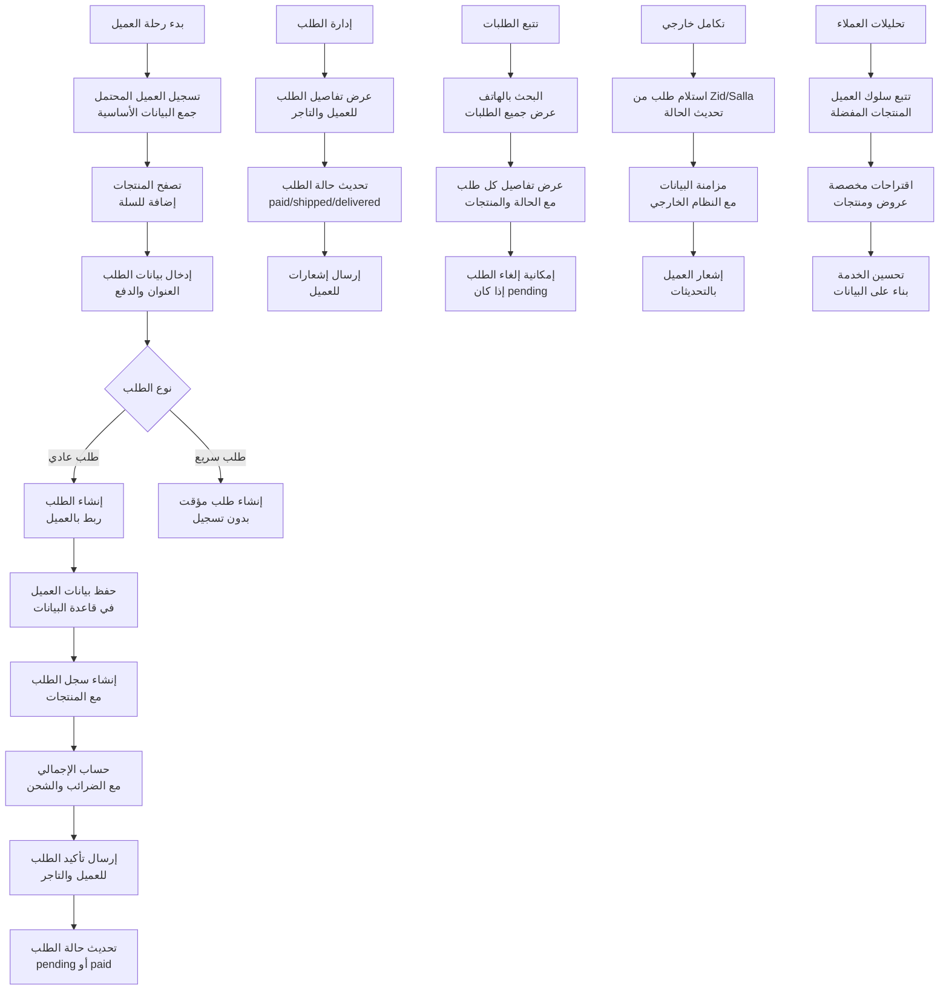
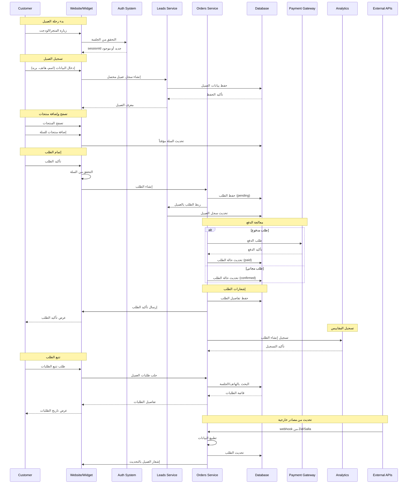
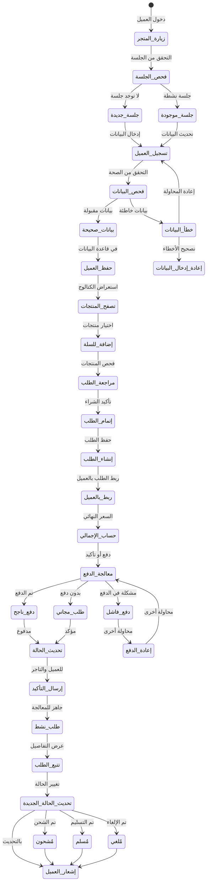
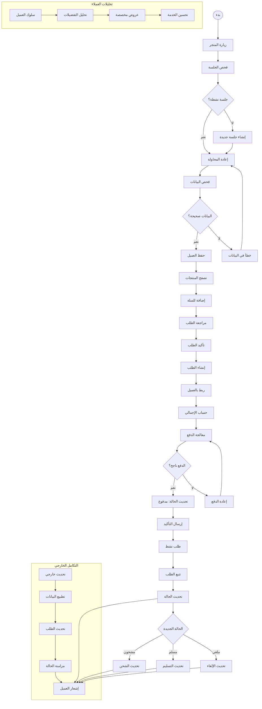

# ورك فلو رحلة الطلب مع تسجيل العميل - نظام كليم الشامل

## نظرة عامة على النظام

نظام كليم يدعم رحلة طلب متكاملة مع تسجيل العملاء وتتبع شامل:

- **تسجيل العميل**: إنشاء سجل عميل محتمل مع بياناته
- **إنشاء الطلب**: ربط العميل بالطلب من خلال sessionId
- **تتبع الطلبات**: للعميل من خلال رقم الهاتف
- **إدارة الحالات**: تحديث حالة الطلب (pending/paid/shipped)
- **التكامل الخارجي**: مع منصات التجارة الإلكترونية
- **الإشعارات**: للعميل والتاجر حول الطلب

## 1. مخطط التدفق العام (Flowchart)



## 2. مخطط التسلسل (Sequence Diagram)



## 3. آلة الحالات (State Machine)



### تعريف الحالات

| الحالة                 | الوصف                    | الإجراءات المسموحة        |
| ---------------------- | ------------------------ | ------------------------- |
| `زيارة_المتجر`         | دخول العميل للمتجر       | بدء الجلسة                |
| `فحص_الجلسة`           | التحقق من وجود جلسة نشطة | إنشاء أو استرجاع الجلسة   |
| `تسجيل_العميل`         | إدخال بيانات العميل      | جمع الاسم، الهاتف، البريد |
| `فحص_البيانات`         | التحقق من صحة البيانات   | التحقق من التنسيق والقيم  |
| `حفظ_العميل`           | حفظ بيانات العميل        | إدراج في قاعدة البيانات   |
| `تصفح_المنتجات`        | استعراض الكتالوج         | البحث والتصفية            |
| `إضافة_للسلة`          | إضافة منتجات للسلة       | تحديث السلة               |
| `مراجعة_الطلب`         | فحص المنتجات والأسعار    | التأكد من الطلب           |
| `إتمام_الطلب`          | تأكيد الشراء             | إنشاء الطلب               |
| `إنشاء_الطلب`          | حفظ الطلب في النظام      | إدراج الطلب               |
| `ربط_بالعميل`          | ربط الطلب بالعميل        | تحديث سجل العميل          |
| `حساب_الإجمالي`        | حساب السعر النهائي       | الضرائب والشحن            |
| `معالجة_الدفع`         | معالجة عملية الدفع       | دفع أو تأكيد              |
| `إرسال_التأكيد`        | إرسال تأكيد الطلب        | للعميل والتاجر            |
| `طلب_نشط`              | الطلب جاهز للمعالجة      | تتبع وتحديث               |
| `تتبع_الطلب`           | عرض تفاصيل الطلب         | للعميل والتاجر            |
| `تحديث_الحالة_الجديدة` | تغيير حالة الطلب         | من قبل التاجر             |

## 4. مخطط سير العمل التجاري (BPMN)



## 5. تفاصيل تقنية لكل مرحلة

### 5.1 مرحلة تسجيل العميل

#### 5.1.1 تسجيل العميل المحتمل

**Endpoint**: `POST /merchants/{merchantId}/leads`

**البيانات المطلوبة**:

```typescript
interface CreateLeadDto {
  sessionId: string; // معرف الجلسة
  data: {
    // بيانات العميل
    name: string; // الاسم
    phone: string; // رقم الهاتف
    email?: string; // البريد الإلكتروني (اختياري)
    address?: object; // العنوان (اختياري)
  };
  source?: string; // مصدر التسجيل
}
```

**عملية المعالجة**:

```typescript
async function createLead(merchantId: string, leadData: CreateLeadDto) {
  // 1. تطبيع رقم الهاتف
  const phoneNormalized = normalizePhone(leadData.data.phone);

  // 2. إنشاء سجل العميل
  const lead = await leadsRepo.create({
    merchantId,
    sessionId: leadData.sessionId,
    data: leadData.data,
    phoneNormalized,
    source: leadData.source || 'manual',
  });

  // 3. إشعار النظام
  await notifications.notifyAdmin({
    type: 'new_lead',
    leadId: lead._id,
    merchantId,
    customerName: leadData.data.name,
    customerPhone: leadData.data.phone,
  });

  return lead;
}
```

#### 5.1.2 تطبيع رقم الهاتف

```typescript
function normalizePhone(phone: string): string {
  // إزالة جميع الرموز غير الرقمية
  let normalized = phone.replace(/[^\d]/g, '');

  // إضافة رمز الدولة إذا كان مفقوداً
  if (normalized.length === 9) {
    normalized = '966' + normalized; // السعودية
  } else if (normalized.length === 10 && normalized.startsWith('0')) {
    normalized = '966' + normalized.slice(1);
  }

  return normalized;
}
```

### 5.2 مرحلة إنشاء الطلب

#### 5.2.1 إنشاء الطلب

**Endpoint**: `POST /orders`

**البيانات المطلوبة**:

```typescript
interface CreateOrderDto {
  merchantId: string; // معرف التاجر
  sessionId: string; // معرف الجلسة
  customer: {
    // بيانات العميل
    name: string; // الاسم
    phone: string; // رقم الهاتف
    email?: string; // البريد (اختياري)
    address?: object; // العنوان (اختياري)
  };
  products: [
    {
      // منتجات الطلب
      product?: string; // معرف المنتج (اختياري)
      name: string; // اسم المنتج
      price: number; // السعر
      quantity: number; // الكمية
    },
  ];
  source?: string; // مصدر الطلب
  metadata?: object; // بيانات إضافية
}
```

**عملية المعالجة**:

```typescript
async function createOrder(orderData: CreateOrderDto) {
  // 1. تطبيع رقم الهاتف
  const phoneNormalized = normalizePhone(orderData.customer.phone);

  // 2. إنشاء الطلب
  const order = await ordersRepo.create({
    merchantId: orderData.merchantId,
    sessionId: orderData.sessionId,
    customer: {
      ...orderData.customer,
      phoneNormalized,
    },
    products: orderData.products,
    source: orderData.source || 'manual',
    status: 'pending',
  });

  // 3. ربط العميل بالطلب
  try {
    await leadsService.create(orderData.merchantId, {
      sessionId: orderData.sessionId,
      data: orderData.customer,
      source: 'order',
    });
  } catch (error) {
    // لا نفشل إنشاء الطلب إذا فشل تسجيل العميل
    logger.warn('Failed to create lead for order', error);
  }

  // 4. إشعار التاجر
  await notifications.notifyMerchant(orderData.merchantId, {
    type: 'new_order',
    orderId: order._id,
    customerName: orderData.customer.name,
    totalAmount: calculateTotal(orderData.products),
  });

  return order;
}
```

#### 5.2.2 حساب الإجمالي

```typescript
function calculateTotal(products: OrderProduct[]): number {
  return products.reduce((total, product) => {
    return total + product.price * product.quantity;
  }, 0);
}
```

### 5.3 مرحلة تتبع الطلبات

#### 5.3.1 البحث عن طلبات العميل

**Endpoint**: `GET /orders/by-customer/{merchantId}/{phone}`

```typescript
async function findByCustomer(merchantId: string, phone: string) {
  // تطبيع رقم الهاتف
  const phoneNormalized = normalizePhone(phone);

  // البحث في الطلبات
  const orders = await ordersRepo
    .find({
      merchantId,
      'customer.phoneNormalized': phoneNormalized,
    })
    .sort({ createdAt: -1 });

  return orders;
}
```

#### 5.3.2 عرض تفاصيل الطلب

**Endpoint**: `GET /orders/{orderId}`

```typescript
async function getOrderDetails(orderId: string) {
  const order = await ordersRepo.findById(orderId);

  if (!order) {
    throw new NotFoundException('Order not found');
  }

  // إضافة معلومات إضافية
  const orderWithDetails = {
    ...order.toObject(),
    customerInfo: await getCustomerInfo(order.customer.phoneNormalized),
    totalAmount: calculateTotal(order.products),
    estimatedDelivery: calculateEstimatedDelivery(
      order.createdAt,
      order.merchantId,
    ),
  };

  return orderWithDetails;
}
```

### 5.4 مرحلة إدارة حالة الطلب

#### 5.4.1 تحديث حالة الطلب

**Endpoint**: `PATCH /orders/{orderId}/status`

```typescript
async function updateOrderStatus(orderId: string, newStatus: OrderStatus) {
  const order = await ordersRepo.findById(orderId);

  if (!order) {
    throw new NotFoundException('Order not found');
  }

  // التحقق من الانتقال الصحيح للحالة
  const validTransitions = getValidStatusTransitions(order.status);
  if (!validTransitions.includes(newStatus)) {
    throw new BadRequestException('Invalid status transition');
  }

  // تحديث الحالة
  order.status = newStatus;
  if (newStatus === 'paid') order.paidAt = new Date();
  if (newStatus === 'shipped') order.shippedAt = new Date();
  if (newStatus === 'delivered') order.deliveredAt = new Date();

  await order.save();

  // إشعار العميل
  await notifications.notifyCustomer(order.customer.phoneNormalized, {
    type: 'order_status_updated',
    orderId: order._id,
    newStatus,
    merchantId: order.merchantId,
  });

  return order;
}
```

#### 5.4.2 الانتقالات الصحيحة للحالات

```typescript
function getValidStatusTransitions(currentStatus: OrderStatus): OrderStatus[] {
  const transitions: Record<OrderStatus, OrderStatus[]> = {
    pending: ['paid', 'canceled'],
    paid: ['shipped', 'canceled', 'refunded'],
    shipped: ['delivered', 'canceled'],
    delivered: ['refunded'],
    canceled: [], // لا يمكن تغيير حالة الطلب الملغي
    refunded: [], // لا يمكن تغيير حالة الطلب المسترد
  };

  return transitions[currentStatus] || [];
}
```

### 5.5 مرحلة التكامل الخارجي

#### 5.5.1 استلام طلب من Zid

```typescript
async function handleZidOrder(zidOrder: ZidOrderWebhook) {
  const orderData = {
    merchantId: zidOrder.merchantId,
    sessionId: generateSessionId(),
    customer: {
      name: zidOrder.customer.name,
      phone: zidOrder.customer.phone,
      email: zidOrder.customer.email,
    },
    products: zidOrder.items.map((item) => ({
      name: item.name,
      price: item.price,
      quantity: item.quantity,
    })),
    externalId: zidOrder.id,
    source: 'zid',
  };

  const order = await ordersService.create(orderData);

  // تحديث حالة الطلب حسب حالة Zid
  if (zidOrder.status === 'paid') {
    await ordersService.updateStatus(order._id, 'paid');
  }

  return order;
}
```

#### 5.5.2 مزامنة مع Salla

```typescript
async function handleSallaOrder(sallaOrder: SallaOrderWebhook) {
  const orderData = {
    merchantId: sallaOrder.merchant_id,
    sessionId: generateSessionId(),
    customer: {
      name: sallaOrder.customer.name,
      phone: sallaOrder.customer.mobile,
      email: sallaOrder.customer.email,
    },
    products: sallaOrder.items.map((item) => ({
      name: item.name,
      price: item.price,
      quantity: item.quantity,
    })),
    externalId: sallaOrder.id,
    source: 'salla',
  };

  return await ordersService.create(orderData);
}
```

## 6. معايير الأمان والحماية

### 6.1 التحقق من الملكية

```typescript
// التحقق من صلاحية التاجر للوصول للطلب
const order = await ordersService.findOne(orderId);
const user = await getCurrentUser();

if (order.merchantId !== user.merchantId && user.role !== 'ADMIN') {
  throw new ForbiddenException('Access denied');
}
```

### 6.2 Rate Limiting

- **إنشاء الطلبات**: 10 طلبات/دقيقة لكل عميل
- **عرض الطلبات**: 50 طلب/دقيقة لكل عميل
- **تحديث الحالة**: 20 تحديث/دقيقة لكل تاجر

### 6.3 منع الاحتيال

```typescript
// فحص الطلبات المشبوهة
async function detectSuspiciousOrder(order: Order) {
  const recentOrders = await ordersRepo.findRecentByPhone(
    order.customer.phoneNormalized,
    24 * 60 * 60 * 1000, // آخر 24 ساعة
  );

  if (recentOrders.length > 10) {
    // طلب مراجعة يدوية
    order.status = 'under_review';
    await notifications.alertAdmin('suspicious_activity', {
      customerPhone: order.customer.phoneNormalized,
      orderCount: recentOrders.length,
    });
  }
}
```

## 7. مسارات الخطأ والتعامل معها

### 7.1 أخطاء التسجيل

```javascript
INVALID_CUSTOMER_DATA; // بيانات العميل غير صحيحة
DUPLICATE_PHONE; // رقم هاتف موجود مسبقاً
SESSION_EXPIRED; // انتهت صلاحية الجلسة
MERCHANT_NOT_FOUND; // التاجر غير موجود
```

### 7.2 أخطاء الطلب

```javascript
INVALID_ORDER_DATA; // بيانات الطلب غير صحيحة
PRODUCT_NOT_FOUND; // منتج غير موجود
INSUFFICIENT_STOCK; // كمية غير كافية
PAYMENT_FAILED; // فشل في الدفع
```

### 7.3 أخطاء التتبع

```javascript
ORDER_NOT_FOUND; // الطلب غير موجود
CUSTOMER_NOT_AUTHORIZED; // العميل غير مخول
INVALID_STATUS_TRANSITION; // انتقال حالة غير صحيح
```

## 8. خطة الاختبار والتحقق

### 8.1 اختبارات الوحدة

- اختبار إنشاء العملاء والطلبات
- اختبار تطبيع أرقام الهواتف
- اختبار حساب الإجمالي
- اختبار تحديث حالة الطلب

### 8.2 اختبارات التكامل

- اختبار التكامل مع منصات التجارة
- اختبار webhook endpoints
- اختبار إشعارات العملاء
- اختبار معالجة الأخطاء

### 8.3 اختبارات الأداء

- اختبار الحمل على إنشاء الطلبات
- اختبار البحث في الطلبات
- اختبار إشعارات التحديثات
- اختبار استهلاك الذاكرة

---

_تم إنشاء هذا التوثيق بواسطة نظام كليم لإدارة المتاجر الذكية_
