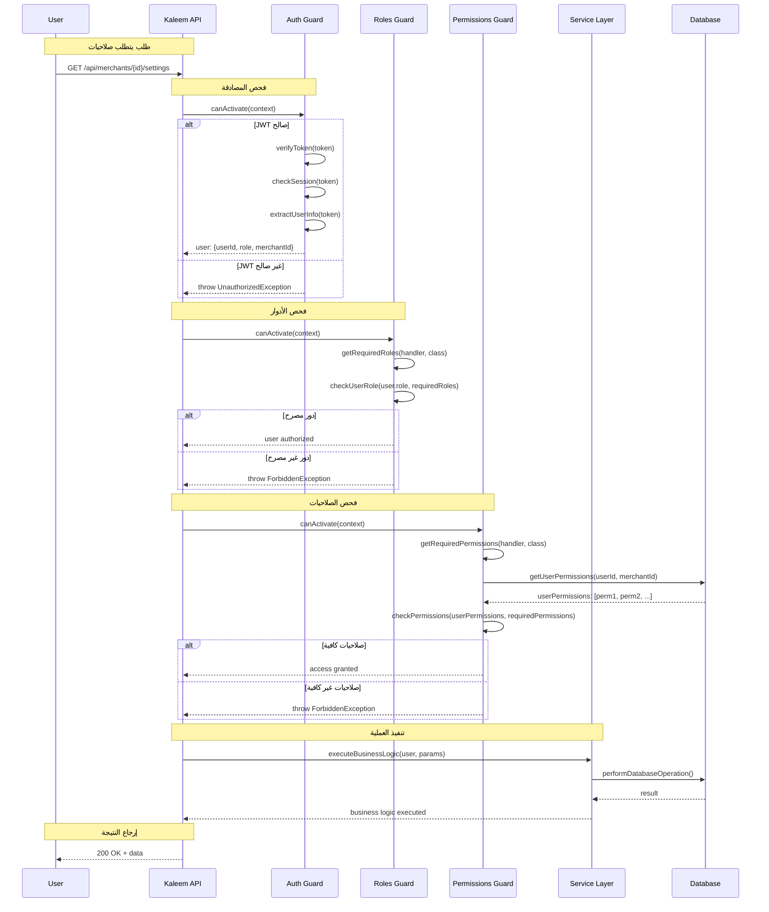
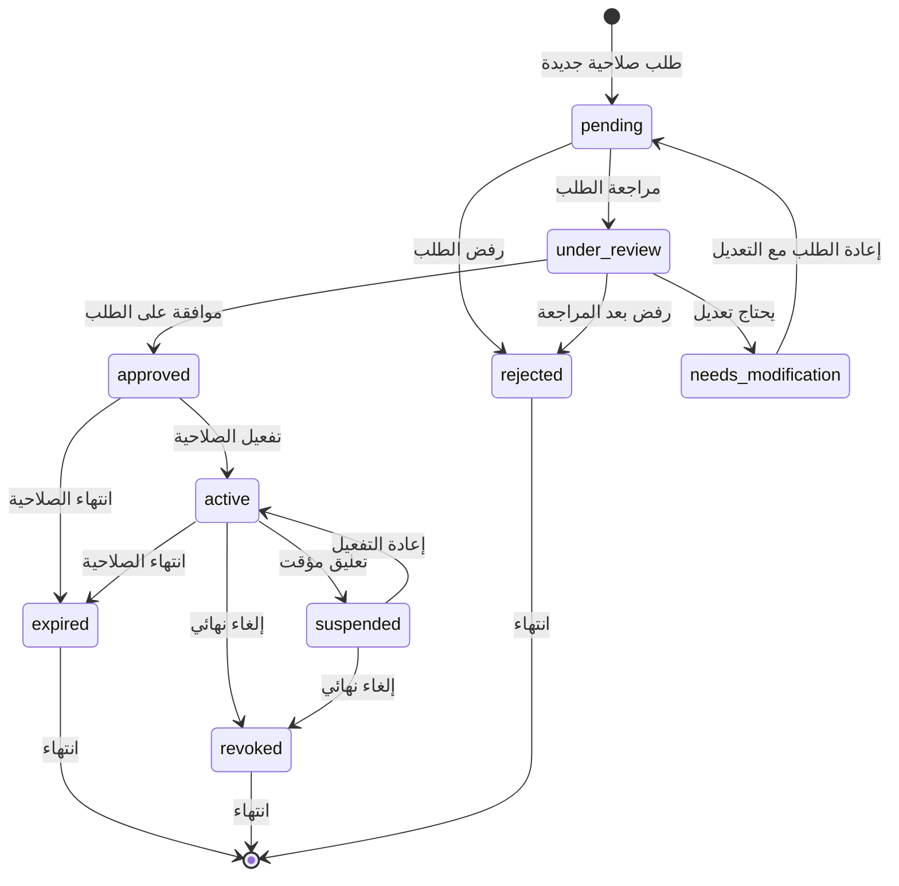
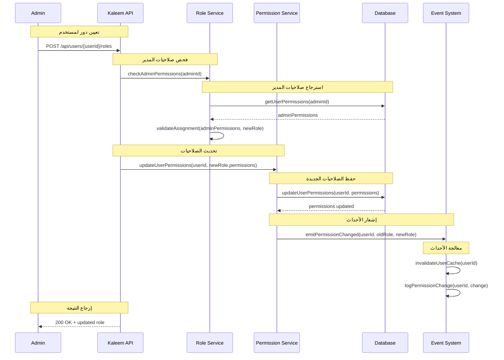

# إدارة الصلاحيات الدقيقة داخل الفريق (Org Roles/Permissions) - نظام كليم

## نظرة عامة على النظام

نظام كليم يدعم نظام إدارة صلاحيات متقدم (RBAC) مع أدوار وصلاحيات دقيقة:

- **Role-Based Access Control (RBAC)**: نظام صلاحيات مبني على الأدوار
- **Granular Permissions**: صلاحيات دقيقة للعمليات المحددة
- **Organization Hierarchy**: هيكل تنظيمي للفريق
- **Dynamic Role Assignment**: تعيين الأدوار ديناميكياً
- **Permission Inheritance**: وراثة الصلاحيات من الأدوار الأبوية
- **Audit Trail**: تتبع التغييرات في الصلاحيات

## 1. مخطط التسلسل - Guard Validation (Sequence Diagram)



## 2. مصفوفة RBAC (RBAC Matrix)

| **الدور**           | **إدارة المستخدمين**    | **إدارة المنتجات** | **إدارة الطلبات** | **إدارة الإعدادات** | **التقارير**   | **الدعم الفني**  |
| ------------------- | ----------------------- | ------------------ | ----------------- | ------------------- | -------------- | ---------------- |
| **Super Admin**     | ✅ Create/Update/Delete | ✅ Full Access     | ✅ Full Access    | ✅ Full Access      | ✅ Full Access | ✅ Full Access   |
| **Org Admin**       | ✅ Create/Update        | ✅ Full Access     | ✅ Full Access    | ✅ Full Access      | ✅ Read/Export | ✅ Full Access   |
| **Merchant Admin**  | ✅ Read                 | ✅ Full Access     | ✅ Read/Export    | ✅ Read/Update      | ✅ Read        | ✅ Create/Update |
| **Sales Manager**   | ❌                      | ✅ Read/Update     | ✅ Full Access    | ✅ Read             | ✅ Read/Export | ❌               |
| **Support Agent**   | ❌                      | ✅ Read            | ✅ Read           | ❌                  | ❌             | ✅ Full Access   |
| **Content Creator** | ❌                      | ✅ Create/Update   | ❌                | ❌                  | ❌             | ❌               |
| **Viewer**          | ✅ Read                 | ✅ Read            | ✅ Read           | ✅ Read             | ✅ Read        | ❌               |

### تفسير المصفوفة:

- **✅ Full Access**: جميع العمليات (Create/Read/Update/Delete)
- **✅ Create/Update**: عمليات الكتابة فقط
- **✅ Read/Export**: عمليات القراءة والتصدير
- **✅ Read**: قراءة فقط
- **❌**: لا يوجد صلاحية

## 3. آلة الحالات - Permission States (State Machine)



### تعريف الحالات

| الحالة               | الوصف           | الإجراءات المسموحة       |
| -------------------- | --------------- | ------------------------ |
| `pending`            | طلب صلاحية جديد | مراجعة وموافقة أو رفض    |
| `under_review`       | قيد المراجعة    | فحص الطلب والصلاحيات     |
| `approved`           | تمت الموافقة    | تفعيل الصلاحية           |
| `active`             | صلاحية نشطة     | استخدام الصلاحية         |
| `suspended`          | معلقة مؤقتاً    | إعادة تفعيل أو إلغاء     |
| `revoked`            | ملغية نهائياً   | لا يمكن إعادة التفعيل    |
| `expired`            | منتهية الصلاحية | تجديد أو إنشاء جديدة     |
| `rejected`           | مرفوضة          | إعادة الطلب مع التعديل   |
| `needs_modification` | تحتاج تعديل     | إعادة الطلب مع التغييرات |

## 4. مخطط التسلسل - Role Assignment (Sequence Diagram)



## 5. تفاصيل تقنية لكل مرحلة

### 5.1 مرحلة المصادقة والتفويض

#### 5.1.1 JWT Strategy

```typescript
// src/modules/auth/strategies/jwt.strategy.ts
validate(payload: JwtPayload): {
  userId: string;
  role: string;
  merchantId: string | null;
  iat?: number;
} {
  const userId = payload.userId ?? payload.sub;
  return {
    userId,
    role: payload.role, // 'ADMIN' | 'MERCHANT' | 'MEMBER'
    merchantId: payload.merchantId ?? null,
    iat: payload.iat,
  };
}
```

#### 5.1.2 Roles Guard

```typescript
// src/common/guards/roles.guard.ts
canActivate(context: ExecutionContext): boolean {
  const requiredRoles = this.reflector.getAllAndOverride<string[]>(
    ROLES_KEY,
    [context.getHandler(), context.getClass()],
  );

  if (!requiredRoles || requiredRoles.length === 0) return true;

  const request = context.switchToHttp().getRequest<RequestWithUser>();
  const user = request.user;

  if (!requiredRoles.includes(user.role)) {
    throw new ForbiddenException('Insufficient role');
  }

  return true;
}
```

### 5.2 مرحلة إدارة الأدوار

#### 5.2.1 تعريف الأدوار والصلاحيات

```typescript
// src/common/constants/roles.ts
export const ROLE_DEFINITIONS = {
  SUPER_ADMIN: {
    name: 'Super Admin',
    description: 'Full system access',
    permissions: [
      'users.create',
      'users.read',
      'users.update',
      'users.delete',
      'merchants.create',
      'merchants.read',
      'merchants.update',
      'merchants.delete',
      'products.create',
      'products.read',
      'products.update',
      'products.delete',
      'orders.create',
      'orders.read',
      'orders.update',
      'orders.delete',
      'settings.create',
      'settings.read',
      'settings.update',
      'settings.delete',
      'reports.read',
      'reports.export',
      'support.create',
      'support.read',
      'support.update',
      'support.delete',
    ],
  },

  ORG_ADMIN: {
    name: 'Organization Admin',
    description: 'Organization-wide management',
    permissions: [
      'users.create',
      'users.read',
      'users.update',
      'merchants.create',
      'merchants.read',
      'merchants.update',
      'merchants.delete',
      'products.create',
      'products.read',
      'products.update',
      'products.delete',
      'orders.create',
      'orders.read',
      'orders.update',
      'orders.delete',
      'settings.create',
      'settings.read',
      'settings.update',
      'settings.delete',
      'reports.read',
      'reports.export',
      'support.create',
      'support.read',
      'support.update',
      'support.delete',
    ],
  },

  MERCHANT_ADMIN: {
    name: 'Merchant Admin',
    description: 'Merchant-specific management',
    permissions: [
      'users.read',
      'merchants.read',
      'products.create',
      'products.read',
      'products.update',
      'products.delete',
      'orders.create',
      'orders.read',
      'orders.update',
      'orders.delete',
      'settings.read',
      'settings.update',
      'reports.read',
      'support.create',
      'support.read',
      'support.update',
    ],
  },
} as const;
```

#### 5.2.2 تعيين الأدوار

```typescript
// src/modules/auth/services/role.service.ts
async assignRole(
  adminId: string,
  userId: string,
  roleId: string,
  merchantId?: string
): Promise<void> {
  // 1. فحص صلاحيات المدير
  const adminPermissions = await this.getUserPermissions(adminId);
  if (!adminPermissions.includes('users.update')) {
    throw new ForbiddenException('Insufficient permissions to assign roles');
  }

  // 2. فحص صحة الدور المطلوب
  const role = await this.getRoleById(roleId);
  if (!role) {
    throw new NotFoundException('Role not found');
  }

  // 3. تحديث صلاحيات المستخدم
  await this.updateUserPermissions(userId, role.permissions, merchantId);

  // 4. تسجيل التغيير
  await this.logRoleAssignment(adminId, userId, roleId, merchantId);

  // 5. إشعار الأحداث
  this.eventEmitter.emit('role.assigned', {
    userId,
    roleId,
    assignedBy: adminId,
    merchantId,
  });
}
```

### 5.3 مرحلة إدارة الصلاحيات

#### 5.3.1 نظام الصلاحيات الدقيق

```typescript
// src/common/constants/permissions.ts
export const PERMISSIONS = {
  // إدارة المستخدمين
  'users.create': 'Create new users',
  'users.read': 'View user information',
  'users.update': 'Update user details',
  'users.delete': 'Delete users',

  // إدارة التجار
  'merchants.create': 'Create new merchants',
  'merchants.read': 'View merchant information',
  'merchants.update': 'Update merchant settings',
  'merchants.delete': 'Delete merchants',

  // إدارة المنتجات
  'products.create': 'Add new products',
  'products.read': 'View product catalog',
  'products.update': 'Edit product information',
  'products.delete': 'Remove products',

  // إدارة الطلبات
  'orders.create': 'Create new orders',
  'orders.read': 'View order details',
  'orders.update': 'Update order status',
  'orders.delete': 'Cancel orders',

  // إدارة الإعدادات
  'settings.create': 'Create system settings',
  'settings.read': 'View system settings',
  'settings.update': 'Modify system settings',
  'settings.delete': 'Delete system settings',

  // التقارير
  'reports.read': 'Access reports',
  'reports.export': 'Export report data',

  // الدعم الفني
  'support.create': 'Create support tickets',
  'support.read': 'View support tickets',
  'support.update': 'Update ticket status',
  'support.delete': 'Close support tickets',
} as const;
```

#### 5.3.2 فحص الصلاحيات

```typescript
// src/common/guards/permissions.guard.ts
export class PermissionsGuard implements CanActivate {
  constructor(private reflector: Reflector) {}

  async canActivate(context: ExecutionContext): Promise<boolean> {
    const requiredPermissions = this.reflector.getAllAndOverride<string[]>(
      PERMISSIONS_KEY,
      [context.getHandler(), context.getClass()],
    );

    if (!requiredPermissions || requiredPermissions.length === 0) {
      return true;
    }

    const request = context.switchToHttp().getRequest<RequestWithUser>();
    const user = request.user;

    if (!user) {
      throw new UnauthorizedException('User not authenticated');
    }

    // الحصول على صلاحيات المستخدم
    const userPermissions = await this.getUserPermissions(
      user.userId,
      user.merchantId,
    );

    // فحص الصلاحيات المطلوبة
    const hasPermissions = requiredPermissions.every((permission) =>
      userPermissions.includes(permission),
    );

    if (!hasPermissions) {
      throw new ForbiddenException('Insufficient permissions');
    }

    return true;
  }

  private async getUserPermissions(
    userId: string,
    merchantId?: string,
  ): Promise<string[]> {
    // استرجاع الصلاحيات من قاعدة البيانات
    return await this.permissionsService.getUserPermissions(userId, merchantId);
  }
}
```

### 5.4 مرحلة التتبع والمراقبة

#### 5.4.1 تسجيل التغييرات

```typescript
// src/modules/auth/services/audit.service.ts
async logPermissionChange(
  userId: string,
  action: 'grant' | 'revoke' | 'modify',
  permissions: string[],
  performedBy: string,
  metadata?: Record<string, unknown>
): Promise<void> {
  const auditLog = {
    userId,
    action,
    permissions,
    performedBy,
    timestamp: new Date(),
    metadata,
    ip: this.getClientIP(),
    userAgent: this.getUserAgent(),
  };

  await this.auditRepository.create(auditLog);

  // إشعار نظام المراقبة
  this.metrics.recordPermissionChange(action, permissions.length);
}
```

#### 5.4.2 مراقبة الصلاحيات

```yaml
# prometheus.yml - مقاييس الصلاحيات
- name: role_assignments_total
  type: counter
  help: 'إجمالي تعيينات الأدوار'
  labelnames: [role, merchant_id, performed_by]

- name: permission_checks_total
  type: counter
  help: 'إجمالي فحوصات الصلاحيات'
  labelnames: [resource, action, result]

- name: permission_violations_total
  type: counter
  help: 'إجمالي انتهاكات الصلاحيات'
  labelnames: [user_id, resource, action]

- name: role_changes_total
  type: counter
  help: 'إجمالي تغييرات الأدوار'
  labelnames: [old_role, new_role, merchant_id]
```

## 6. سياسات الأمان والحماية

### 6.1 مبدأ أقل الصلاحيات

```typescript
// src/common/decorators/permissions.decorator.ts
export const PERMISSIONS_KEY = 'permissions';
export const Permissions = (...permissions: string[]) =>
  SetMetadata(PERMISSIONS_KEY, permissions);
```

### 6.2 حماية من التصعيد

```typescript
// src/common/guards/privilege-escalation.guard.ts
export class PrivilegeEscalationGuard implements CanActivate {
  async canActivate(context: ExecutionContext): Promise<boolean> {
    const request = context.switchToHttp().getRequest<RequestWithUser>();
    const user = request.user;

    // منع تعيين أدوار أعلى من دور المستخدم الحالي
    const targetRole = this.getTargetRole(context);
    const userRole = user.role;

    if (this.isRoleEscalation(userRole, targetRole)) {
      throw new ForbiddenException('Cannot assign higher privilege role');
    }

    return true;
  }
}
```

### 6.3 فحص الصلاحيات في الوقت الفعلي

```typescript
// src/common/middleware/permission-cache.middleware.ts
export class PermissionCacheMiddleware implements NestMiddleware {
  async use(req: RequestWithUser, res: Response, next: NextFunction) {
    if (req.user) {
      // تحديث cache الصلاحيات كل 5 دقائق
      const cacheKey = `permissions:${req.user.userId}:${req.user.merchantId}`;
      const cached = await this.cache.get(cacheKey);

      if (!cached || this.isCacheExpired(cached.timestamp)) {
        const freshPermissions =
          await this.permissionsService.getUserPermissions(
            req.user.userId,
            req.user.merchantId,
          );

        await this.cache.set(cacheKey, {
          permissions: freshPermissions,
          timestamp: Date.now(),
        });
      }
    }

    next();
  }
}
```

## 7. خطة الاختبار والتحقق

### 7.1 اختبارات الأدوار

- اختبار تعيين الأدوار المختلفة
- اختبار وراثة الصلاحيات
- اختبار قيود التصعيد
- اختبار إدارة الأدوار الديناميكية

### 7.2 اختبارات الصلاحيات

- اختبار فحص الصلاحيات للعمليات المختلفة
- اختبار الصلاحيات المركبة
- اختبار تحديث الصلاحيات في الوقت الفعلي
- اختبار منع الوصول غير المصرح

### 7.3 اختبارات التكامل

- اختبار تكامل مع نظام المصادقة
- اختبار تكامل مع قاعدة البيانات
- اختبار تكامل مع نظام التسجيل
- اختبار تكامل مع نظام المراقبة

### 7.4 اختبارات الأداء

- اختبار أداء فحص الصلاحيات
- اختبار استهلاك الذاكرة للـ cache
- اختبار زمن الاستجابة للطلبات المصرحة
- اختبار تحت الحمل العالي

---

_تم إنشاء هذا التوثيق بواسطة نظام كليم لإدارة المتاجر الذكية_
