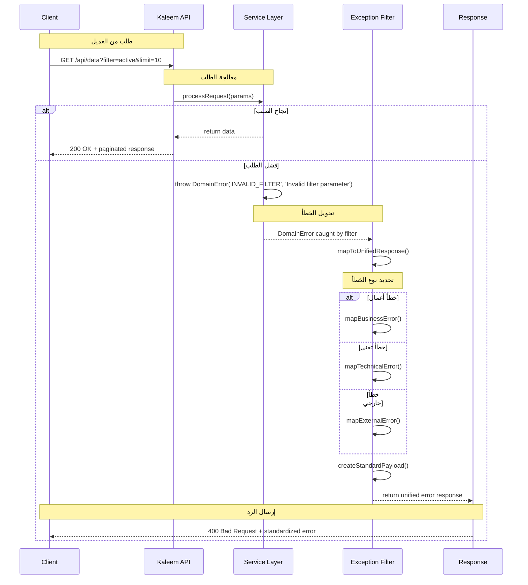
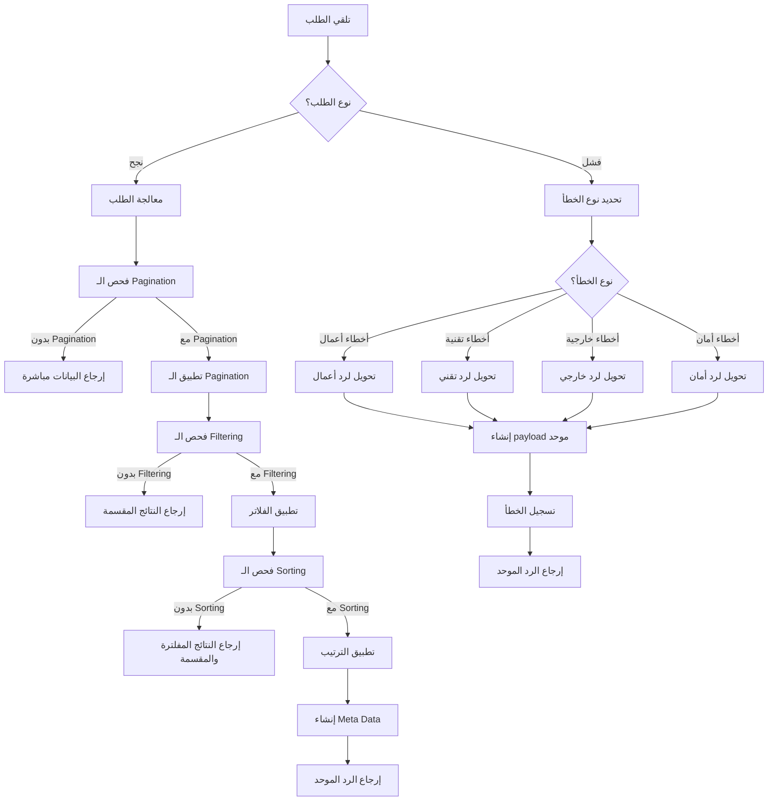

# سياسة الأخطاء والردود الموحدة + Pagination/Filtering - نظام كليم

## نظرة عامة على النظام

نظام كليم يدعم سياسة موحدة للأخطاء والردود مع نظام pagination وfiltering متقدم:

- **Unified Error Policy**: نظام أخطاء موحد ومنظم
- **Error Mapping**: تحويل الأخطاء لردود متسقة
- **Pagination System**: نظام تقسيم النتائج متقدم
- **Filtering**: فلترة ذكية للبيانات
- **Response Standardization**: توحيد شكل الردود

## 1. مخطط التسلسل - Error Mapping (Sequence Diagram)



## 2. مخطط التدفق - Decision Flow (Flowchart)



## 3. مصفوفة الأمثلة (Examples Matrix)

| **السيناريو**          | **نوع الطلب**                                     | **الرد المتوقع**                                                                                                                                                                                        | **رمز الحالة**         | **الأخطاء المحتملة**     |
| ---------------------- | ------------------------------------------------- | ------------------------------------------------------------------------------------------------------------------------------------------------------------------------------------------------------- | ---------------------- | ------------------------ | ---------------- |
| **نجاح كامل**          | `GET /api/products?limit=10&category=electronics` | `json<br>{<br>  "items": [...],<br>  "meta": {<br>    "nextCursor": "eyJ0IjoxNjk5ODg4ODAwMDAwLCJpZCI6IjY1NGY5YzAwMTIzNDU2Nzg5YWJjZGVmMCJ9",<br>    "hasMore": true,<br>    "count": 10<br>  }<br>}<br>` | 200                    | -                        |
| **صفحة غير موجودة**    | `GET /api/products?cursor=invalid&limit=10`       | `json<br>{<br>  "code": "INVALID_CURSOR",<br>  "message": "Cursor غير صحيح",<br>  "requestId": "req-123",<br>  "timestamp": "2024-01-01T00:00:00Z"<br>}<br>`                                            | 400                    | `INVALID_CURSOR`         |
| **فلتر غير صحيح**      | `GET /api/products?filter=invalid`                | ```json<br>{<br> "code": "INVALID_FILTER",<br> "message": "معامل الفلتر غير صحيح",<br> "details": {"field": "filter", "expected": "active                                                               | inactive"}<br>}<br>``` | 400                      | `INVALID_FILTER` |
| **حدود غير صحيحة**     | `GET /api/products?limit=1000`                    | `json<br>{<br>  "code": "INVALID_LIMIT",<br>  "message": "الحد يجب أن يكون بين 1 و 100",<br>  "details": {"provided": 1000, "min": 1, "max": 100}<br>}<br>`                                             | 400                    | `INVALID_LIMIT`          |
| **خطأ قاعدة البيانات** | `GET /api/products`                               | `json<br>{<br>  "code": "DATABASE_ERROR",<br>  "message": "خطأ في قاعدة البيانات",<br>  "requestId": "req-123",<br>  "timestamp": "2024-01-01T00:00:00Z"<br>}<br>`                                      | 500                    | `DATABASE_ERROR`         |
| **خدمة خارجية معطلة**  | `GET /api/external`                               | `json<br>{<br>  "code": "EXTERNAL_SERVICE_ERROR",<br>  "message": "خطأ في الخدمة الخارجية",<br>  "details": {"url": "https://external.com", "status": 503}<br>}<br>`                                    | 502                    | `EXTERNAL_SERVICE_ERROR` |

## 4. تفاصيل تقنية لكل مرحلة

### 4.1 مرحلة معالجة الأخطاء

#### 4.1.1 نظام الأخطاء الموحد

```typescript
// src/common/errors/domain-error.ts
export class DomainError extends HttpException {
  constructor(
    code: string,
    message: string,
    status: number = HttpStatus.BAD_REQUEST,
    details?: Record<string, unknown>,
  ) {
    super({ code, message, details }, status);
  }
}

// أمثلة للأخطاء المخصصة
export class OutOfStockError extends DomainError {
  constructor(productId: string) {
    super('OUT_OF_STOCK', 'المنتج غير متوفر حاليًا', HttpStatus.CONFLICT, {
      productId,
    });
  }
}
```

#### 4.1.2 معالجة الأخطاء المركزية

```typescript
// src/common/filters/all-exceptions.filter.ts
@Catch()
export class AllExceptionsFilter implements ExceptionFilter {
  catch(exception: unknown, host: ArgumentsHost): void {
    const response = host.switchToHttp().getResponse();
    const request = host.switchToHttp().getRequest();

    // تحويل جميع الأخطاء لرد موحد
    const payload = this.mapErrorToUnifiedResponse(exception, request);
    response.status(payload.status).json(payload);
  }

  private mapErrorToUnifiedResponse(exception: unknown, request: Request) {
    // منطق تحويل الأخطاء للشكل الموحد
    return {
      code: 'ERROR_CODE',
      message: 'رسالة خطأ واضحة',
      requestId: request.requestId,
      timestamp: new Date().toISOString(),
      details: {}, // تفاصيل إضافية
    };
  }
}
```

### 4.2 مرحلة نظام الـ Pagination

#### 4.2.1 DTO للـ Pagination

```typescript
// src/common/dto/pagination.dto.ts
export class CursorDto {
  @IsOptional()
  @Transform(({ value }) => parseInt(value as string))
  @IsInt()
  @Min(MIN_LIMIT)
  @Max(MAX_LIMIT)
  limit?: number = DEFAULT_LIMIT;

  @IsOptional()
  cursor?: string;
}
```

#### 4.2.2 إنشاء النتائج المقسمة

```typescript
export interface PaginationResult<T> {
  items: T[];
  meta: {
    nextCursor?: string;
    hasMore: boolean;
    count: number;
  };
}

export function createPaginationResult<T>(
  items: T[],
  cursor?: string,
  sortField: string = 'createdAt',
): PaginationResult<T> {
  const hasMore = items.length === limit;
  const nextCursor = hasMore
    ? encodeCursor(
        items[items.length - 1][sortField],
        items[items.length - 1]._id,
      )
    : undefined;

  return {
    items,
    meta: {
      nextCursor,
      hasMore,
      count: items.length,
    },
  };
}
```

### 4.3 مرحلة نظام الـ Filtering

#### 4.3.1 أنواع الفلاتر المدعومة

```typescript
// src/common/dto/filtering.dto.ts
export class BaseFilteringDto {
  @IsOptional()
  @IsString()
  search?: string;

  @IsOptional()
  @IsArray()
  @IsString({ each: true })
  fields?: string[];

  @IsOptional()
  @IsObject()
  filters?: Record<string, unknown>;
}

export class ProductFilteringDto extends BaseFilteringDto {
  @IsOptional()
  @IsString()
  category?: string;

  @IsOptional()
  @IsNumberString()
  minPrice?: string;

  @IsOptional()
  @IsNumberString()
  maxPrice?: string;

  @IsOptional()
  @IsBooleanString()
  inStock?: string;
}
```

#### 4.3.2 تطبيق الفلاتر

```typescript
export function applyFilters<T>(
  query: Query<T[]>,
  filters: Record<string, unknown>,
): Query<T[]> {
  let filteredQuery = query;

  // فلترة النص
  if (filters.search) {
    filteredQuery = filteredQuery.where({
      $text: { $search: filters.search as string },
    });
  }

  // فلترة الحقول المحددة
  if (filters.fields && filters.fields.length > 0) {
    const projection = filters.fields.reduce(
      (acc, field) => {
        acc[field] = 1;
        return acc;
      },
      {} as Record<string, 1>,
    );
    filteredQuery = filteredQuery.select(projection);
  }

  // فلاتر محددة للمنتجات
  if (filters.category) {
    filteredQuery = filteredQuery.where({ category: filters.category });
  }

  if (filters.minPrice || filters.maxPrice) {
    const priceFilter: Record<string, unknown> = {};
    if (filters.minPrice)
      priceFilter.$gte = parseFloat(filters.minPrice as string);
    if (filters.maxPrice)
      priceFilter.$lte = parseFloat(filters.maxPrice as string);
    filteredQuery = filteredQuery.where({ price: priceFilter });
  }

  return filteredQuery;
}
```

### 4.4 مرحلة الردود الموحدة

#### 4.4.1 هيكل الرد الموحد

```typescript
interface UnifiedResponse<T = unknown> {
  // للنجاح
  data?: T;
  meta?: {
    pagination?: PaginationMeta;
    filters?: AppliedFilters;
    sorting?: SortingInfo;
  };

  // للأخطاء
  code?: string;
  message: string;
  details?: Record<string, unknown>;
  requestId: string;
  timestamp: string;
}

interface PaginationMeta {
  nextCursor?: string;
  hasMore: boolean;
  count: number;
  total?: number;
}

interface AppliedFilters {
  search?: string;
  category?: string;
  priceRange?: { min: number; max: number };
  inStock?: boolean;
}
```

#### 4.4.2 إنشاء الردود

```typescript
export class ResponseService {
  static success<T>(
    data: T,
    meta?: UnifiedResponse['meta'],
    requestId?: string,
  ): UnifiedResponse<T> {
    return {
      data,
      meta,
      requestId: requestId || generateRequestId(),
      timestamp: new Date().toISOString(),
    };
  }

  static error(
    code: string,
    message: string,
    details?: Record<string, unknown>,
    requestId?: string,
  ): UnifiedResponse {
    return {
      code,
      message,
      details,
      requestId: requestId || generateRequestId(),
      timestamp: new Date().toISOString(),
    };
  }
}
```

## 5. رموز الأخطاء الموحدة

### 5.1 رموز أخطاء الأعمال

```javascript
VALIDATION_ERROR; // بيانات غير صحيحة
INVALID_ID; // معرف غير صحيح
DUPLICATE_ENTRY; // البيانات موجودة مسبقاً
NOT_FOUND; // المورد غير موجود
OUT_OF_STOCK; // المنتج غير متوفر
INSUFFICIENT_BALANCE; // رصيد غير كافي
PAYMENT_REQUIRED; // مطلوب دفع
```

### 5.2 رموز أخطاء التقنية

```javascript
DATABASE_ERROR; // خطأ في قاعدة البيانات
CACHE_ERROR; // خطأ في الكاش
EXTERNAL_SERVICE_ERROR; // خطأ في الخدمة الخارجية
NETWORK_ERROR; // خطأ في الشبكة
TIMEOUT_ERROR; // انتهاء المهلة
RATE_LIMIT_EXCEEDED; // تجاوز حد الطلبات
```

### 5.3 رموز أخطاء الأمان

```javascript
UNAUTHORIZED; // غير مخول
FORBIDDEN; // ممنوع
INVALID_TOKEN; // توكن غير صحيح
TOKEN_EXPIRED; // التوكن منتهي الصلاحية
INVALID_CREDENTIALS; // بيانات اعتماد خاطئة
ACCOUNT_LOCKED; // الحساب مقفل
```

## 6. معايير الأداء والمراقبة

### 6.1 مراقبة الأخطاء

```yaml
# prometheus.yml - قواعد مراقبة الأخطاء
groups:
  - name: error_monitoring
    rules:
      - alert: HighErrorRate
        expr: |
          sum(rate(http_requests_total{status_code=~"5.."}[5m]))
          / sum(rate(http_requests_total[5m])) > 0.01
        for: 5m
        labels:
          severity: warning
        annotations:
          summary: 'معدل الأخطاء مرتفع'
          runbook_url: 'https://kb.kaleem-ai.com/runbooks/high-error-rate'
```

### 6.2 مراقبة الـ Pagination

```yaml
# مقاييس الـ Pagination
- name: pagination_requests_total
  type: counter
  help: 'إجمالي طلبات الـ pagination'
  labelnames: [endpoint, limit, has_cursor]

- name: pagination_response_time_seconds
  type: histogram
  help: 'زمن استجابة الـ pagination'
  buckets: [0.1, 0.5, 1, 2, 5]
```

## 7. خطة الاختبار والتحقق

### 7.1 اختبارات الأخطاء

- اختبار تحويل جميع أنواع الأخطاء
- اختبار تسجيل الأخطاء بشكل صحيح
- اختبار هيكل الرد الموحد
- اختبار معالجة الأخطاء المتداخلة

### 7.2 اختبارات الـ Pagination

- اختبار تقسيم النتائج بشكل صحيح
- اختبار تشفير/فك تشفير الـ cursor
- اختبار الحدود والقيم المتطرفة
- اختبار الأداء مع كميات كبيرة من البيانات

### 7.3 اختبارات الـ Filtering

- اختبار جميع أنواع الفلاتر
- اختبار الفلاتر المركبة
- اختبار أداء الفلترة
- اختبار معالجة الفلاتر الخاطئة

### 7.4 اختبارات التكامل

- اختبار تكامل الأخطاء مع الـ pagination
- اختبار تكامل الفلترة مع الـ pagination
- اختبار تكامل مع نظام المراقبة
- اختبار تكامل مع نظام التسجيل

---

_تم إنشاء هذا التوثيق بواسطة نظام كليم لإدارة المتاجر الذكية_
