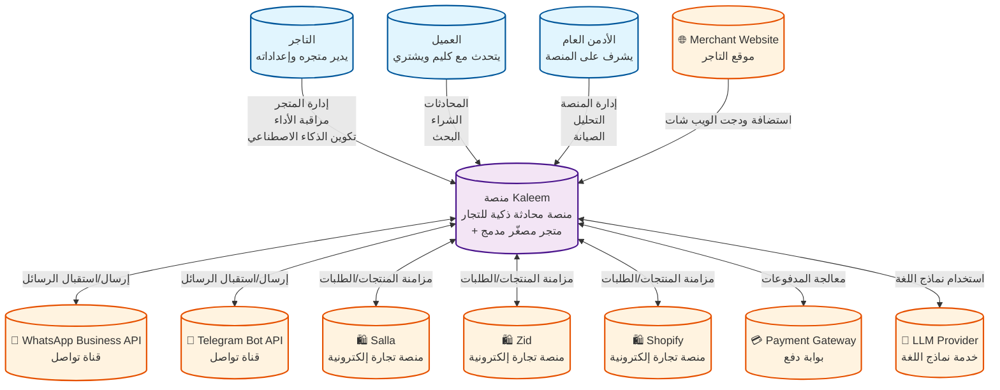

# مخطط C4 - السياق العام (Context Diagram) - منصة Kaleem

## 📋 نظرة عامة

هذا المخطط يوضح السياق العام لمنصة Kaleem والتفاعل مع المستخدمين والأنظمة الخارجية.

---

## 🎯 المستخدمون (People)

### 1. التاجر (Merchant)

- **الوصف**: يدير متجره وإعداداته وصندوق وارد متجره
- **الاحتياجات**:
  - إدارة المنتجات والطلبات
  - مراقبة الأداء والمبيعات
  - تكوين الذكاء الاصطناعي
  - إدارة القنوات المختلفة

### 2. العميل (Shopper)

- **الوصف**: يتحدث مع كليم ويشتري عبر القنوات المختلفة
- **الاحتياجات**:
  - الحصول على مساعدة فورية
  - البحث عن المنتجات
  - إتمام عملية الشراء
  - التواصل عبر القنوات المفضلة

### 3. الأدمن العام (Platform Admin)

- **الوصف**: يشرف على المنصة ويُدرّب كليم عالميًا
- **الاحتياجات**:
  - مراقبة أداء المنصة
  - إدارة المستخدمين
  - تحليل البيانات
  - صيانة النظام

---

## 🌐 الأنظمة الخارجية (External Systems)

### 1. قنوات التواصل

- **WhatsApp Business API**: قناة تواصل رئيسية
- **Telegram Bot API**: قناة تواصل إضافية

### 2. منصات التجارة الإلكترونية

- **Salla**: منصة تجارة إلكترونية سعودية
- **Zid**: منصة تجارة إلكترونية سعودية
- **Shopify**: منصة تجارة إلكترونية عالمية

### 3. خدمات الدفع

- **Payment Gateway**: بوابة دفع متعددة

### 4. خدمات الذكاء الاصطناعي

- **LLM Provider**: مزود نماذج اللغة الكبيرة

### 5. مواقع التاجر

- **Merchant Website**: موقع التاجر الذي يستضيف ودجت الويب شات

---

## 🏗️ منصة Kaleem (Kaleem Platform)

### الوصف

منصة محادثة ذكية للتجار مع متجر مصغّر مدمج، توفر:

- ذكاء اصطناعي متقدم للمحادثات
- تكامل مع منصات التجارة الإلكترونية
- إدارة شاملة للمنتجات والطلبات
- تحليلات مفصلة للأداء

### الميزات الرئيسية

- **المحادثات الذكية**: ذكاء اصطناعي متقدم لفهم طلبات العملاء
- **إدارة المنتجات**: فهرسة وبحث متقدم للمنتجات
- **التكاملات**: ربط مع منصات التجارة الإلكترونية
- **التحليلات**: تقارير مفصلة عن الأداء والمبيعات
- **المتجر المصغّر**: متجر مدمج للعملاء

---

## 🔗 التفاعلات الرئيسية

### 1. التاجر ↔ منصة Kaleem

- **إدارة المتجر**: إعداد المنتجات، الطلبات، والإعدادات
- **مراقبة الأداء**: عرض التقارير والإحصائيات
- **تكوين الذكاء الاصطناعي**: تدريب النماذج وإدارة المعرفة

### 2. العميل ↔ منصة Kaleem

- **المحادثات**: تفاعل مع الذكاء الاصطناعي
- **الشراء**: إتمام عمليات الشراء
- **البحث**: البحث عن المنتجات والخدمات

### 3. الأدمن العام ↔ منصة Kaleem

- **إدارة المنصة**: مراقبة وإدارة النظام
- **التحليل**: تحليل البيانات والأداء
- **الصيانة**: صيانة وتطوير النظام

### 4. منصة Kaleem ↔ الأنظمة الخارجية

- **قنوات التواصل**: إرسال واستقبال الرسائل
- **منصات التجارة**: مزامنة المنتجات والطلبات
- **خدمات الدفع**: معالجة المدفوعات
- **خدمات الذكاء الاصطناعي**: استخدام نماذج اللغة

---

## 📊 مخطط السياق (Context Diagram)

---

## 🎯 الأهداف الاستراتيجية

### 1. أهداف المستخدمين

- **التاجر**: زيادة المبيعات وتحسين تجربة العملاء
- **العميل**: الحصول على مساعدة فورية وشراء سهل
- **الأدمن العام**: ضمان استقرار وأداء المنصة

### 2. أهداف المنصة

- **الذكاء الاصطناعي**: توفير محادثات ذكية ومفيدة
- **التكامل**: ربط سلس مع منصات التجارة الإلكترونية
- **الأداء**: ضمان سرعة وموثوقية عالية
- **القابلية للتوسع**: دعم نمو المستخدمين والبيانات

---

## 📈 مؤشرات الأداء الرئيسية (KPIs)

### 1. مؤشرات المستخدمين

- **عدد التجار النشطين**: عدد التجار الذين يستخدمون المنصة
- **عدد العملاء النشطين**: عدد العملاء الذين يتفاعلون مع المنصة
- **معدل التفاعل**: متوسط عدد المحادثات لكل عميل

### 2. مؤشرات المنصة

- **معدل الاستجابة**: سرعة استجابة الذكاء الاصطناعي
- **دقة الإجابات**: نسبة الإجابات الصحيحة والمفيدة
- **معدل التحويل**: نسبة العملاء الذين يكملون الشراء
- **وقت التشغيل**: نسبة الوقت الذي تعمل فيه المنصة

---

## 🔒 الأمان والخصوصية

### 1. حماية البيانات

- **تشفير البيانات**: تشفير جميع البيانات الحساسة
- **الوصول الآمن**: مصادقة قوية للمستخدمين
- **النسخ الاحتياطية**: نسخ احتياطية منتظمة للبيانات

### 2. الامتثال

- **GDPR**: الامتثال للوائح حماية البيانات الأوروبية
- **PCI DSS**: الامتثال لمعايير أمان بطاقات الائتمان
- **الخصوصية**: حماية خصوصية المستخدمين

---

## 🚀 التطوير المستقبلي

### 1. ميزات جديدة

- **قنوات إضافية**: دعم المزيد من قنوات التواصل
- **ذكاء اصطناعي متقدم**: نماذج أكثر تطوراً
- **تحليلات متقدمة**: رؤى أعمق حول العملاء والمبيعات

### 2. تحسينات تقنية

- **الأداء**: تحسين سرعة الاستجابة
- **القابلية للتوسع**: دعم المزيد من المستخدمين
- **الموثوقية**: تحسين استقرار النظام

---

_آخر تحديث: ديسمبر 2024_  
_الإصدار: 1.0.0_
