# مخطط C4 - الحاويات والخدمات (Container Diagram) - منصة Kaleem

## 📋 نظرة عامة

هذا المخطط يوضح الحاويات والخدمات الرئيسية في منصة Kaleem والتفاعل بينها.

---

## 🎯 المستخدمون والأنظمة الخارجية

### المستخدمون

- **التاجر**: يدير متجره وإعداداته
- **العميل**: يتحدث مع كليم ويشتري
- **الأدمن العام**: يشرف على المنصة

### الأنظمة الخارجية

- **WhatsApp/Telegram**: قنوات التواصل
- **Salla/Zid/Shopify**: منصات التجارة الإلكترونية
- **Payment Gateway**: بوابة الدفع
- **LLM Provider**: خدمة نماذج اللغة
- **Merchant Website**: موقع التاجر

---

## 🏗️ حاويات منصة Kaleem

### 1. واجهات المستخدم (Frontend Containers)

#### أ) لوحة الأدمن العام (Platform Admin Portal)

- **التقنية**: React + Material-UI
- **الوظيفة**: إدارة المنصة العامة
- **الميزات**:
  - مراقبة أداء المنصة
  - إدارة المستخدمين
  - تحليل البيانات
  - إعدادات النظام

#### ب) لوحة التاجر (Merchant Portal)

- **التقنية**: React + Material-UI
- **الوظيفة**: إدارة متجر التاجر
- **الميزات**:
  - إدارة المنتجات
  - مراقبة الطلبات
  - تكوين الذكاء الاصطناعي
  - التقارير والإحصائيات

#### ج) ودجت الويب شات (Web Chat Widget)

- **التقنية**: JavaScript Widget
- **الوظيفة**: محادثة مباشرة مع العملاء
- **الميزات**:
  - واجهة محادثة تفاعلية
  - دعم الملفات والصور
  - تكامل مع الذكاء الاصطناعي
  - تخصيص المظهر

#### د) المتجر المصغّر (Micro Storefront)

- **التقنية**: React + Next.js
- **الوظيفة**: متجر مدمج للعملاء
- **الميزات**:
  - عرض المنتجات
  - سلة التسوق
  - عملية الدفع
  - إدارة الطلبات

### 2. الخدمات الخلفية (Backend Services)

#### أ) API الرئيسي (Backend API)

- **التقنية**: NestJS
- **الوظيفة**: إدارة المصادقة، المحادثات، التدريب، المعرفة، التكاملات
- **الميزات**:
  - RESTful API
  - WebSocket للاتصال المباشر
  - مصادقة JWT
  - معالجة الطلبات
  - تكامل مع الخدمات الخارجية

#### ب) عمال الخلفية (Background Workers)

- **التقنية**: NestJS
- **الوظيفة**: معالجة المهام غير المتزامنة
- **الميزات**:
  - معالجة رسائل الذكاء الاصطناعي
  - إرسال Webhooks
  - فهرسة المحتوى
  - مزامنة البيانات

#### ج) منسق الذكاء الاصطناعي (AI Orchestrator)

- **التقنية**: n8n
- **الوظيفة**: تنظيم سير عمل الذكاء الاصطناعي
- **الميزات**:
  - تنسيق العمليات
  - إدارة الأدوات
  - معالجة الطلبات
  - تحليل الجودة

#### د) خدمة التضمين (Embedding Service)

- **التقنية**: FastAPI
- **الوظيفة**: توليد Embeddings للنصوص
- **الميزات**:
  - تحويل النصوص إلى متجهات
  - دعم نماذج متعددة
  - معالجة سريعة
  - تخزين مؤقت

#### هـ) خدمة الاستخراج (Extractor Service)

- **التقنية**: FastAPI + Playwright
- **الوظيفة**: استخلاص وفهرسة المحتوى
- **الميزات**:
  - استخراج النصوص من الويب
  - معالجة الملفات
  - فهرسة المحتوى
  - تحليل الصور

### 3. قواعد البيانات والتخزين (Data Storage)

#### أ) قاعدة البيانات الرئيسية (MongoDB)

- **التقنية**: MongoDB
- **الوظيفة**: تخزين البيانات الرئيسية
- **المحتوى**:
  - بيانات المستخدمين
  - المحادثات والرسائل
  - المنتجات والطلبات
  - الإعدادات والتكوينات

#### ب) قاعدة البيانات المتجهة (Qdrant)

- **التقنية**: Qdrant
- **الوظيفة**: تخزين والبحث في المتجهات
- **المحتوى**:
  - Embeddings المنتجات
  - Embeddings المعرفة
  - Embeddings المحادثات
  - فهارس البحث

#### ج) التخزين المؤقت (Redis)

- **التقنية**: Redis
- **الوظيفة**: تخزين مؤقت وإدارة الجلسات
- **المحتوى**:
  - جلسات المستخدمين
  - بيانات مؤقتة
  - طوابير المهام
  - إحصائيات سريعة

#### د) تخزين الملفات (MinIO)

- **التقنية**: MinIO (S3-compatible)
- **الوظيفة**: تخزين الملفات والوثائق
- **المحتوى**:
  - صور المنتجات
  - وثائق المعرفة
  - ملفات المستخدمين
  - النسخ الاحتياطية

#### هـ) طابور الرسائل (RabbitMQ)

- **التقنية**: RabbitMQ
- **الوظيفة**: إدارة الرسائل والمهام
- **المحتوى**:
  - طوابير المعالجة
  - رسائل الأحداث
  - مهام الخلفية
  - إشعارات النظام

---

## 🔗 التفاعلات بين الحاويات

### 1. تفاعلات الواجهات الأمامية

- **لوحة الأدمن** → **API الرئيسي**: إدارة المنصة
- **لوحة التاجر** → **API الرئيسي**: إدارة المتجر
- **ودجت الويب شات** → **API الرئيسي**: المحادثات المباشرة
- **المتجر المصغّر** → **API الرئيسي**: عمليات الشراء

### 2. تفاعلات الخدمات الخلفية

- **API الرئيسي** → **منسق الذكاء الاصطناعي**: معالجة الطلبات
- **API الرئيسي** → **خدمة التضمين**: توليد Embeddings
- **API الرئيسي** → **خدمة الاستخراج**: فهرسة المحتوى
- **عمال الخلفية** → **منسق الذكاء الاصطناعي**: معالجة المهام

### 3. تفاعلات قواعد البيانات

- **API الرئيسي** → **MongoDB**: تخزين البيانات
- **API الرئيسي** → **Redis**: التخزين المؤقت
- **API الرئيسي** → **Qdrant**: البحث في المتجهات
- **API الرئيسي** → **MinIO**: تخزين الملفات
- **API الرئيسي** → **RabbitMQ**: إرسال الرسائل

### 4. تفاعلات العمال

- **عمال الخلفية** → **RabbitMQ**: استهلاك المهام
- **عمال الخلفية** → **Qdrant**: تحديث المتجهات
- **عمال الخلفية** → **MongoDB**: تحديث البيانات

---

## 📊 مخطط الحاويات (Container Diagram)

```mermaid
graph TB
    %% المستخدمون
    Merchant[("👨‍💼 التاجر")]
    Shopper[("🛒 العميل")]
    PlatformAdmin[("👨‍💻 الأدمن العام")]

    %% الأنظمة الخارجية
    WhatsApp[("📱 WhatsApp")]
    Telegram[("📱 Telegram")]
    Salla[("🛍️ Salla")]
    Zid[("🛍️ Zid")]
    Shopify[("🛍️ Shopify")]
    Payment[("💳 Payment Gateway")]
    LLM[("🤖 LLM Provider")]
    MerchantSite[("🌐 Merchant Website")]

    %% منصة Kaleem
    subgraph Kaleem["🏢 منصة Kaleem"]
        %% الواجهات الأمامية
        subgraph Frontend["🖥️ الواجهات الأمامية"]
            AdminPortal["📊 لوحة الأدمن العام<br/>React + Material-UI"]
            MerchantPortal["🏪 لوحة التاجر<br/>React + Material-UI"]
            WebChat["💬 ودجت الويب شات<br/>JavaScript Widget"]
            Storefront["🛒 المتجر المصغّر<br/>React + Next.js"]
        end

        %% الخدمات الخلفية
        subgraph Backend["⚙️ الخدمات الخلفية"]
            API["🔧 API الرئيسي<br/>NestJS"]
            Workers["👷 عمال الخلفية<br/>NestJS"]
            N8N["🤖 منسق الذكاء الاصطناعي<br/>n8n"]
            Embedding["🧠 خدمة التضمين<br/>FastAPI"]
            Extractor["📄 خدمة الاستخراج<br/>FastAPI + Playwright"]
        end

        %% قواعد البيانات والتخزين
        subgraph DataStorage["💾 قواعد البيانات والتخزين"]
            MongoDB["🗄️ MongoDB<br/>قاعدة البيانات الرئيسية"]
            Qdrant["🔍 Qdrant<br/>قاعدة البيانات المتجهة"]
            Redis["⚡ Redis<br/>التخزين المؤقت"]
            MinIO["📁 MinIO<br/>تخزين الملفات"]
            RabbitMQ["📨 RabbitMQ<br/>طابور الرسائل"]
        end
    end

    %% التفاعلات الرئيسية
    PlatformAdmin --> AdminPortal
    Merchant --> MerchantPortal
    Shopper --> WebChat
    Shopper --> Storefront

    %% تفاعلات الواجهات مع API
    AdminPortal --> API
    MerchantPortal --> API
    WebChat --> API
    Storefront --> API

    %% تفاعلات API مع الخدمات
    API --> N8N
    API --> Embedding
    API --> Extractor
    Workers --> N8N

    %% تفاعلات قواعد البيانات
    API --> MongoDB
    API --> Redis
    API --> Qdrant
    API --> MinIO
    API --> RabbitMQ
    Workers --> RabbitMQ
    Workers --> Qdrant
    Workers --> MongoDB

    %% تفاعلات خارجية
    WhatsApp <--> API
    Telegram <--> API
    Salla <--> API
    Zid <--> API
    Shopify <--> API
    Payment <--> API
    N8N <--> LLM
    MerchantSite --> WebChat

    %% التنسيق
    classDef userClass fill:#e1f5fe,stroke:#01579b,stroke-width:2px
    classDef externalClass fill:#fff3e0,stroke:#e65100,stroke-width:2px
    classDef frontendClass fill:#e8f5e8,stroke:#2e7d32,stroke-width:2px
    classDef backendClass fill:#f3e5f5,stroke:#7b1fa2,stroke-width:2px
    classDef dataClass fill:#fff8e1,stroke:#f57c00,stroke-width:2px

    class Merchant,Shopper,PlatformAdmin userClass
    class WhatsApp,Telegram,Salla,Zid,Shopify,Payment,LLM,MerchantSite externalClass
    class AdminPortal,MerchantPortal,WebChat,Storefront frontendClass
    class API,Workers,N8N,Embedding,Extractor backendClass
    class MongoDB,Qdrant,Redis,MinIO,RabbitMQ dataClass
```

---

## 🔧 التفاصيل التقنية

### 1. تقنيات الواجهات الأمامية

- **React**: مكتبة واجهة المستخدم
- **Material-UI**: مكونات واجهة المستخدم
- **Next.js**: إطار عمل React للخادم
- **JavaScript**: لغة البرمجة الأساسية

### 2. تقنيات الخدمات الخلفية

- **NestJS**: إطار عمل Node.js
- **FastAPI**: إطار عمل Python
- **n8n**: منصة أتمتة سير العمل
- **TypeScript**: لغة البرمجة المطورة

### 3. تقنيات قواعد البيانات

- **MongoDB**: قاعدة بيانات NoSQL
- **Qdrant**: قاعدة بيانات المتجهات
- **Redis**: قاعدة بيانات التخزين المؤقت
- **MinIO**: تخزين الملفات
- **RabbitMQ**: نظام الرسائل

---

## 📈 مؤشرات الأداء

### 1. مؤشرات الواجهات الأمامية

- **وقت التحميل**: < 2 ثانية
- **معدل الاستجابة**: > 99%
- **تجربة المستخدم**: تقييم عالي

### 2. مؤشرات الخدمات الخلفية

- **وقت الاستجابة**: < 500ms
- **معدل الخطأ**: < 0.1%
- **الإنتاجية**: > 1000 طلب/دقيقة

### 3. مؤشرات قواعد البيانات

- **وقت الاستعلام**: < 100ms
- **معدل التوفر**: > 99.9%
- **سعة التخزين**: قابلة للتوسع

---

## 🔒 الأمان

### 1. أمان الواجهات الأمامية

- **HTTPS**: تشفير جميع الاتصالات
- **CORS**: حماية من الطلبات المباشرة
- **مصادقة**: نظام مصادقة قوي

### 2. أمان الخدمات الخلفية

- **JWT**: رموز المصادقة
- **Rate Limiting**: حماية من الهجمات
- **Validation**: التحقق من البيانات

### 3. أمان قواعد البيانات

- **تشفير**: تشفير البيانات الحساسة
- **النسخ الاحتياطية**: نسخ احتياطية منتظمة
- **الوصول**: تحكم في الوصول

---

## 🚀 التطوير المستقبلي

### 1. تحسينات قصيرة المدى

- تحسين أداء الواجهات
- إضافة ميزات جديدة
- تحسين الأمان

### 2. تحسينات متوسطة المدى

- دعم المزيد من القنوات
- تحسين الذكاء الاصطناعي
- إضافة تحليلات متقدمة

### 3. تحسينات طويلة المدى

- دعم متعدد المناطق
- ذكاء اصطناعي متقدم
- منصة قابلة للتوسع

---

_آخر تحديث: ديسمبر 2024_  
_الإصدار: 1.0.0_
