# مخطط C4 - المكونات الداخلية (Component Diagram) - API الرئيسي

## 📋 نظرة عامة

هذا المخطط يوضح المكونات الداخلية لـ API الرئيسي في منصة Kaleem والتفاعل بينها.

---

## 🎯 المستخدمون والأنظمة الخارجية

### المستخدمون

- **التاجر**: يدير متجره وإعداداته
- **العميل**: يتحدث مع كليم ويشتري
- **الأدمن العام**: يشرف على المنصة

### الأنظمة الخارجية

- **WhatsApp/Telegram**: قنوات التواصل
- **Salla/Zid/Shopify**: منصات التجارة الإلكترونية
- **Payment Gateway**: بوابة الدفع
- **LLM Provider**: خدمة نماذج اللغة
- **Merchant Website**: موقع التاجر

---

## 🏗️ مكونات API الرئيسي

### 1. طبقة التحكم (Controllers)

#### أ) متحكم Webhook القنوات (ChannelWebhookController)

- **الوظيفة**: معالجة Webhooks من القنوات المختلفة
- **المسؤوليات**:
  - استقبال الرسائل من WhatsApp/Telegram
  - التحقق من صحة التوقيعات
  - توجيه الرسائل للمعالجة
  - إرسال ردود التلقائية

#### ب) متحكم الويب شات (WebChatController)

- **الوظيفة**: إدارة جلسات الويب شات والاتصال المباشر
- **المسؤوليات**:
  - إنشاء وإدارة الجلسات
  - معالجة الرسائل المباشرة
  - إدارة الاتصال WebSocket
  - تنسيق الردود

#### ج) متحكم المحادثات (ConversationsController)

- **الوظيفة**: إدارة المحادثات والرسائل
- **المسؤوليات**:
  - إنشاء المحادثات الجديدة
  - حفظ واسترجاع الرسائل
  - إدارة حالة المحادثات
  - تتبع تقدم المحادثات

#### د) متحكم التدريب (TrainingController)

- **الوظيفة**: إدارة تقييم وتدريب النماذج
- **المسؤوليات**:
  - جمع بيانات التدريب
  - تقييم أداء النماذج
  - إدارة دورة التدريب
  - تحليل النتائج

#### هـ) متحكم المعرفة (KnowledgeController)

- **الوظيفة**: إدارة الوثائق والFAQ والفهرسة
- **المسؤوليات**:
  - إدارة قاعدة المعرفة
  - فهرسة المحتوى
  - البحث في المعرفة
  - تحديث المعلومات

#### و) متحكم المنتجات (ProductsController)

- **الوظيفة**: إدارة بحث وتفاصيل وفهرسة المنتجات
- **المسؤوليات**:
  - إدارة كتالوج المنتجات
  - البحث في المنتجات
  - تحديث معلومات المنتجات
  - مزامنة مع المنصات الخارجية

#### ز) متحكم المتجر المصغّر (StorefrontController)

- **الوظيفة**: إدارة سلة التسوق والطلبات والمدفوعات
- **المسؤوليات**:
  - إدارة سلة التسوق
  - معالجة الطلبات
  - تنسيق المدفوعات
  - إدارة المخزون

#### ح) متحكم المدفوعات (PaymentsController)

- **الوظيفة**: إدارة بوابة الدفع
- **المسؤوليات**:
  - معالجة المدفوعات
  - التحقق من المعاملات
  - إدارة الاستردادات
  - تتبع المدفوعات

#### ط) متحكم التكاملات (IntegrationsController)

- **الوظيفة**: إدارة تكامل Salla/Zid/Shopify والمصادقة والمزامنة
- **المسؤوليات**:
  - إدارة التكاملات الخارجية
  - مزامنة البيانات
  - إدارة المصادقة
  - تنسيق العمليات

#### ي) متحكم الأدمن (AdminController)

- **الوظيفة**: إدارة الإعدادات العامة والتقارير
- **المسؤوليات**:
  - إدارة إعدادات النظام
  - توليد التقارير
  - مراقبة الأداء
  - إدارة المستخدمين

### 2. طبقة الخدمات (Services)

#### أ) خدمة المحادثات (ConversationService)

- **الوظيفة**: إدارة منطق المحادثات
- **المسؤوليات**:
  - تنسيق تدفق المحادثات
  - إدارة حالة المحادثات
  - معالجة الرسائل
  - تنسيق الردود

#### ب) حارس سياسة المحادثات (ConversationPolicyGuard)

- **الوظيفة**: تطبيق سياسات المحادثات
- **المسؤوليات**:
  - التحقق من الصلاحيات
  - تطبيق القواعد
  - مراقبة السلوك
  - منع الانتهاكات

#### ج) خدمة التسليم (HandoffService)

- **الوظيفة**: إدارة تسليم المحادثات للبشر
- **المسؤوليات**:
  - تحديد الحاجة للتسليم
  - تنسيق التسليم
  - إدارة الانتظار
  - تتبع الحالة

#### د) عميل منسق الذكاء الاصطناعي (AIOrchestratorClient)

- **الوظيفة**: التواصل مع منسق الذكاء الاصطناعي
- **المسؤوليات**:
  - إرسال الطلبات
  - استقبال الردود
  - إدارة الاتصال
  - معالجة الأخطاء

#### هـ) خدمة سجل الأدوات (ToolRegistryService)

- **الوظيفة**: إدارة سجل الأدوات المتاحة
- **المسؤوليات**:
  - تسجيل الأدوات
  - إدارة التوفر
  - تنسيق الاستخدام
  - مراقبة الأداء

#### و) خدمة المعرفة (KnowledgeService)

- **الوظيفة**: إدارة المعرفة والبحث
- **المسؤوليات**:
  - البحث في المعرفة
  - إدارة المحتوى
  - تحديث المعلومات
  - تحسين النتائج

#### ز) خدمة بحث المنتجات (ProductSearchService)

- **الوظيفة**: إدارة البحث في المنتجات
- **المسؤوليات**:
  - البحث في المنتجات
  - تصفية النتائج
  - ترتيب النتائج
  - تحسين البحث

#### ح) خدمة المتجهات (VectorService)

- **الوظيفة**: إدارة العمليات المتجهة
- **المسؤوليات**:
  - البحث في المتجهات
  - إدارة الفهارس
  - تحسين الأداء
  - تنسيق العمليات

#### ط) عميل التضمين (EmbeddingClient)

- **الوظيفة**: التواصل مع خدمة التضمين
- **المسؤوليات**:
  - إرسال النصوص
  - استقبال المتجهات
  - إدارة الاتصال
  - معالجة الأخطاء

#### ي) عميل الاستخراج (ExtractorClient)

- **الوظيفة**: التواصل مع خدمة الاستخراج
- **المسؤوليات**:
  - إرسال الطلبات
  - استقبال النتائج
  - إدارة الاتصال
  - معالجة الأخطاء

#### ك) خدمة التقييم (FeedbackService)

- **الوظيفة**: إدارة التقييمات والملاحظات
- **المسؤوليات**:
  - جمع التقييمات
  - تحليل النتائج
  - إدارة التحسينات
  - تتبع التقدم

#### ل) خدمة التعليمات (InstructionService)

- **الوظيفة**: إدارة التعليمات والتوجيهات
- **المسؤوليات**:
  - إدارة التعليمات
  - تطبيق التوجيهات
  - تحديث القواعد
  - مراقبة الامتثال

#### م) خدمة إعادة الترتيب (RerankerService)

- **الوظيفة**: إعادة ترتيب النتائج
- **المسؤوليات**:
  - تحسين الترتيب
  - تطبيق الخوارزميات
  - تحسين الدقة
  - مراقبة الأداء

#### ن) خدمة المدفوعات (PaymentsService)

- **الوظيفة**: إدارة عمليات الدفع
- **المسؤوليات**:
  - معالجة المدفوعات
  - إدارة المعاملات
  - تنسيق العمليات
  - مراقبة الأمان

#### س) خدمة التكاملات (IntegrationsService)

- **الوظيفة**: إدارة التكاملات الخارجية
- **المسؤوليات**:
  - تنسيق التكاملات
  - مزامنة البيانات
  - إدارة الاتصالات
  - معالجة الأخطاء

#### ع) خدمة التخزين المؤقت (CacheService)

- **الوظيفة**: إدارة التخزين المؤقت
- **المسؤوليات**:
  - تخزين البيانات المؤقتة
  - إدارة انتهاء الصلاحية
  - تحسين الأداء
  - تنسيق العمليات

#### غ) حافلة الأحداث (EventBus)

- **الوظيفة**: إدارة الأحداث والرسائل
- **المسؤوليات**:
  - نشر الأحداث
  - استهلاك الرسائل
  - تنسيق العمليات
  - إدارة التدفق

#### ف) مسجل التدقيق (AuditLogger)

- **الوظيفة**: تسجيل عمليات التدقيق
- **المسؤوليات**:
  - تسجيل العمليات
  - تتبع التغييرات
  - إدارة السجلات
  - مراقبة الأمان

#### ص) محقق توقيع Webhook (WebhookSignatureVerifier)

- **الوظيفة**: التحقق من توقيعات Webhook
- **المسؤوليات**:
  - التحقق من التوقيعات
  - ضمان الأمان
  - منع التزوير
  - تنسيق العمليات

#### ق) متجر عدم التكرار (IdempotencyStore)

- **الوظيفة**: إدارة عدم التكرار
- **المسؤوليات**:
  - منع التكرار
  - إدارة المفاتيح
  - تحسين الأداء
  - ضمان الاتساق

### 3. طبقة المستودعات (Repositories)

#### أ) مستودع المحادثات (ConversationRepo)

- **الوظيفة**: إدارة بيانات المحادثات
- **المسؤوليات**:
  - حفظ المحادثات
  - استرجاع البيانات
  - تحديث المعلومات
  - حذف السجلات

#### ب) مستودع الرسائل (MessageRepo)

- **الوظيفة**: إدارة بيانات الرسائل
- **المسؤوليات**:
  - حفظ الرسائل
  - استرجاع الرسائل
  - تحديث الحالة
  - إدارة الفهرسة

#### ج) مستودع غير المجاب (UnansweredRepo)

- **الوظيفة**: إدارة الأسئلة غير المجابة
- **المسؤوليات**:
  - تسجيل الأسئلة
  - تتبع الحالة
  - إدارة التحليل
  - تنسيق التحسين

#### د) مستودع التعليمات (InstructionRepo)

- **الوظيفة**: إدارة بيانات التعليمات
- **المسؤوليات**:
  - حفظ التعليمات
  - استرجاع القواعد
  - تحديث التوجيهات
  - إدارة الإصدارات

#### هـ) مستودع التاجر (MerchantRepo)

- **الوظيفة**: إدارة بيانات التجار
- **المسؤوليات**:
  - حفظ بيانات التجار
  - استرجاع المعلومات
  - تحديث الإعدادات
  - إدارة الصلاحيات

#### و) مستودع السياسات (PolicyRepo)

- **الوظيفة**: إدارة سياسات النظام
- **المسؤوليات**:
  - حفظ السياسات
  - استرجاع القواعد
  - تحديث الإعدادات
  - إدارة الامتثال

#### ز) مستودع المنتجات (ProductRepo)

- **الوظيفة**: إدارة بيانات المنتجات
- **المسؤوليات**:
  - حفظ المنتجات
  - استرجاع البيانات
  - تحديث المعلومات
  - إدارة الفهرسة

#### ح) مستودع المعرفة (KnowledgeRepo)

- **الوظيفة**: إدارة بيانات المعرفة
- **المسؤوليات**:
  - حفظ المعرفة
  - استرجاع المعلومات
  - تحديث المحتوى
  - إدارة الفهرسة

#### ط) مستودع المهام (JobRepo)

- **الوظيفة**: إدارة المهام والوظائف
- **المسؤوليات**:
  - حفظ المهام
  - تتبع الحالة
  - إدارة التنفيذ
  - تنسيق العمليات

---

## 🔗 التفاعلات بين المكونات

### 1. تفاعلات المتحكمات مع الخدمات

- **ChannelWebhookController** → **WebhookSignatureVerifier**: التحقق من التوقيع
- **ChannelWebhookController** → **ConversationService**: معالجة الرسائل
- **ConversationsController** → **ConversationService**: إدارة المحادثات
- **ConversationsController** → **ConversationPolicyGuard**: تطبيق السياسات
- **ConversationPolicyGuard** → **AIOrchestratorClient**: تنسيق الذكاء الاصطناعي

### 2. تفاعلات الخدمات مع بعضها البعض

- **ProductSearchService** → **VectorService**: البحث في المتجهات
- **KnowledgeService** → **VectorService**: البحث في المعرفة
- **VectorService** → **EmbeddingClient**: توليد المتجهات
- **KnowledgeService** → **ExtractorClient**: استخراج المحتوى

### 3. تفاعلات الخدمات مع المستودعات

- **ConversationService** → **ConversationRepo**: إدارة المحادثات
- **ProductSearchService** → **ProductRepo**: البحث في المنتجات
- **KnowledgeService** → **KnowledgeRepo**: إدارة المعرفة
- **PaymentsService** → **MerchantRepo**: إدارة بيانات التاجر

### 4. تفاعلات الخدمات مع الأنظمة الخارجية

- **AIOrchestratorClient** → **LLM Provider**: استخدام نماذج اللغة
- **EmbeddingClient** → **Embedding Service**: توليد المتجهات
- **ExtractorClient** → **Extractor Service**: استخراج المحتوى
- **IntegrationsService** → **Salla/Zid/Shopify**: مزامنة البيانات

---

## 📊 مخطط المكونات (Component Diagram)

```mermaid
graph TB
    %% المستخدمون والأنظمة الخارجية
    Merchant[("👨‍💼 التاجر")]
    Shopper[("🛒 العميل")]
    PlatformAdmin[("👨‍💻 الأدمن العام")]
    WhatsApp[("📱 WhatsApp")]
    Telegram[("📱 Telegram")]
    Salla[("🛍️ Salla")]
    Zid[("🛍️ Zid")]
    Shopify[("🛍️ Shopify")]
    Payment[("💳 Payment Gateway")]
    LLM[("🤖 LLM Provider")]
    MerchantSite[("🌐 Merchant Website")]

    %% API الرئيسي
    subgraph API["🔧 API الرئيسي (NestJS)"]
        %% طبقة التحكم
        subgraph Controllers["🎮 طبقة التحكم (Controllers)"]
            ChannelWebhook["📨 ChannelWebhookController<br/>Webhook للقنوات"]
            WebChat["💬 WebChatController<br/>جلسات الويب شات"]
            Conversations["🗣️ ConversationsController<br/>إدارة المحادثات"]
            Training["🎓 TrainingController<br/>تقييم/تدريب"]
            Knowledge["📚 KnowledgeController<br/>وثائق/FAQ/فهرسة"]
            Products["🛍️ ProductsController<br/>بحث/تفاصيل/فهرسة منتجات"]
            Storefront["🛒 StorefrontController<br/>سلة/طلبات/مدفوعات"]
            Payments["💳 PaymentsController<br/>بوابة الدفع"]
            Integrations["🔗 IntegrationsController<br/>Salla/Zid/Shopify Auth/Sync"]
            Admin["👨‍💻 AdminController<br/>إعدادات عامة/تقارير"]
        end

        %% طبقة الخدمات
        subgraph Services["⚙️ طبقة الخدمات (Services)"]
            ConversationService["🗣️ ConversationService<br/>إدارة المحادثات"]
            ConversationPolicyGuard["🛡️ ConversationPolicyGuard<br/>حارس السياسات"]
            HandoffService["🤝 HandoffService<br/>تسليم المحادثات"]
            AIOrchestratorClient["🤖 AIOrchestratorClient<br/>عميل منسق الذكاء الاصطناعي"]
            ToolRegistryService["🔧 ToolRegistryService<br/>سجل الأدوات"]
            KnowledgeService["📚 KnowledgeService<br/>خدمة المعرفة"]
            ProductSearchService["🔍 ProductSearchService<br/>بحث المنتجات"]
            VectorService["🧮 VectorService<br/>خدمة المتجهات"]
            EmbeddingClient["🧠 EmbeddingClient<br/>عميل التضمين"]
            ExtractorClient["📄 ExtractorClient<br/>عميل الاستخراج"]
            FeedbackService["⭐ FeedbackService<br/>خدمة التقييم"]
            InstructionService["📋 InstructionService<br/>خدمة التعليمات"]
            RerankerService["🔄 RerankerService<br/>خدمة إعادة الترتيب"]
            PaymentsService["💳 PaymentsService<br/>خدمة المدفوعات"]
            IntegrationsService["🔗 IntegrationsService<br/>خدمة التكاملات"]
            CacheService["⚡ CacheService<br/>خدمة التخزين المؤقت"]
            EventBus["📡 EventBus<br/>حافلة الأحداث"]
            AuditLogger["📝 AuditLogger<br/>مسجل التدقيق"]
            WebhookSignatureVerifier["🔐 WebhookSignatureVerifier<br/>محقق توقيع Webhook"]
            IdempotencyStore["🔄 IdempotencyStore<br/>متجر عدم التكرار"]
        end

        %% طبقة المستودعات
        subgraph Repositories["🗄️ طبقة المستودعات (Repositories)"]
            ConversationRepo["🗣️ ConversationRepo<br/>مستودع المحادثات"]
            MessageRepo["💬 MessageRepo<br/>مستودع الرسائل"]
            UnansweredRepo["❓ UnansweredRepo<br/>مستودع غير المجاب"]
            InstructionRepo["📋 InstructionRepo<br/>مستودع التعليمات"]
            MerchantRepo["👨‍💼 MerchantRepo<br/>مستودع التاجر"]
            PolicyRepo["📜 PolicyRepo<br/>مستودع السياسات"]
            ProductRepo["🛍️ ProductRepo<br/>مستودع المنتجات"]
            KnowledgeRepo["📚 KnowledgeRepo<br/>مستودع المعرفة"]
            JobRepo["⚙️ JobRepo<br/>مستودع المهام"]
        end
    end

    %% التفاعلات الرئيسية
    PlatformAdmin --> Admin
    Merchant --> Products
    Merchant --> Storefront
    Shopper --> WebChat
    Shopper --> Storefront

    %% تفاعلات المتحكمات مع الخدمات
    ChannelWebhook --> WebhookSignatureVerifier
    ChannelWebhook --> ConversationService
    WebChat --> ConversationService
    Conversations --> ConversationService
    Conversations --> ConversationPolicyGuard
    ConversationPolicyGuard --> AIOrchestratorClient
    Training --> FeedbackService
    Knowledge --> KnowledgeService
    Products --> ProductSearchService
    Storefront --> PaymentsService
    Payments --> PaymentsService
    Integrations --> IntegrationsService
    Admin --> AuditLogger

    %% تفاعلات الخدمات مع بعضها البعض
    ProductSearchService --> VectorService
    KnowledgeService --> VectorService
    VectorService --> EmbeddingClient
    KnowledgeService --> ExtractorClient
    ConversationService --> HandoffService
    AIOrchestratorClient --> ToolRegistryService
    ProductSearchService --> RerankerService
    KnowledgeService --> RerankerService

    %% تفاعلات الخدمات مع المستودعات
    ConversationService --> ConversationRepo
    ConversationService --> MessageRepo
    ProductSearchService --> ProductRepo
    KnowledgeService --> KnowledgeRepo
    PaymentsService --> MerchantRepo
    ConversationPolicyGuard --> PolicyRepo
    Training --> UnansweredRepo
    InstructionService --> InstructionRepo
    EventBus --> JobRepo

    %% تفاعلات خارجية
    WhatsApp --> ChannelWebhook
    Telegram --> ChannelWebhook
    Salla <--> IntegrationsService
    Zid <--> IntegrationsService
    Shopify <--> IntegrationsService
    Payment <--> PaymentsService
    AIOrchestratorClient <--> LLM
    EmbeddingClient <--> EmbeddingService
    ExtractorClient <--> ExtractorService
    MerchantSite --> WebChat

    %% التنسيق
    classDef userClass fill:#e1f5fe,stroke:#01579b,stroke-width:2px
    classDef externalClass fill:#fff3e0,stroke:#e65100,stroke-width:2px
    classDef controllerClass fill:#e8f5e8,stroke:#2e7d32,stroke-width:2px
    classDef serviceClass fill:#f3e5f5,stroke:#7b1fa2,stroke-width:2px
    classDef repoClass fill:#fff8e1,stroke:#f57c00,stroke-width:2px

    class Merchant,Shopper,PlatformAdmin userClass
    class WhatsApp,Telegram,Salla,Zid,Shopify,Payment,LLM,MerchantSite externalClass
    class ChannelWebhook,WebChat,Conversations,Training,Knowledge,Products,Storefront,Payments,Integrations,Admin controllerClass
    class ConversationService,ConversationPolicyGuard,HandoffService,AIOrchestratorClient,ToolRegistryService,KnowledgeService,ProductSearchService,VectorService,EmbeddingClient,ExtractorClient,FeedbackService,InstructionService,RerankerService,PaymentsService,IntegrationsService,CacheService,EventBus,AuditLogger,WebhookSignatureVerifier,IdempotencyStore serviceClass
    class ConversationRepo,MessageRepo,UnansweredRepo,InstructionRepo,MerchantRepo,PolicyRepo,ProductRepo,KnowledgeRepo,JobRepo repoClass
```

---

## 🔧 التفاصيل التقنية

### 1. تقنيات طبقة التحكم

- **NestJS Controllers**: إدارة الطلبات والاستجابات
- **Decorators**: تنسيق العمليات
- **Validation**: التحقق من البيانات
- **Exception Handling**: معالجة الأخطاء

### 2. تقنيات طبقة الخدمات

- **Dependency Injection**: إدارة التبعيات
- **Business Logic**: منطق الأعمال
- **Error Handling**: معالجة الأخطاء
- **Logging**: تسجيل العمليات

### 3. تقنيات طبقة المستودعات

- **Repository Pattern**: نمط المستودع
- **Data Access**: الوصول للبيانات
- **Query Optimization**: تحسين الاستعلامات
- **Caching**: التخزين المؤقت

---

## 📈 مؤشرات الأداء

### 1. مؤشرات طبقة التحكم

- **وقت الاستجابة**: < 100ms
- **معدل الخطأ**: < 0.1%
- **الإنتاجية**: > 1000 طلب/دقيقة

### 2. مؤشرات طبقة الخدمات

- **وقت المعالجة**: < 500ms
- **معدل النجاح**: > 99%
- **الذاكرة**: < 512MB

### 3. مؤشرات طبقة المستودعات

- **وقت الاستعلام**: < 50ms
- **معدل التوفر**: > 99.9%
- **سعة التخزين**: قابلة للتوسع

---

## 🔒 الأمان

### 1. أمان طبقة التحكم

- **Input Validation**: التحقق من المدخلات
- **Rate Limiting**: تحديد معدل الطلبات
- **Authentication**: المصادقة
- **Authorization**: التفويض

### 2. أمان طبقة الخدمات

- **Data Encryption**: تشفير البيانات
- **Access Control**: تحكم في الوصول
- **Audit Logging**: تسجيل التدقيق
- **Error Handling**: معالجة آمنة للأخطاء

### 3. أمان طبقة المستودعات

- **SQL Injection Prevention**: منع حقن SQL
- **Data Validation**: التحقق من البيانات
- **Access Logging**: تسجيل الوصول
- **Backup Security**: أمان النسخ الاحتياطية

---

## 🚀 التطوير المستقبلي

### 1. تحسينات قصيرة المدى

- تحسين أداء الخدمات
- إضافة ميزات جديدة
- تحسين الأمان

### 2. تحسينات متوسطة المدى

- دعم المزيد من التكاملات
- تحسين الذكاء الاصطناعي
- إضافة تحليلات متقدمة

### 3. تحسينات طويلة المدى

- دعم متعدد المناطق
- ذكاء اصطناعي متقدم
- منصة قابلة للتوسع

---

_آخر تحديث: ديسمبر 2024_  
_الإصدار: 1.0.0_
