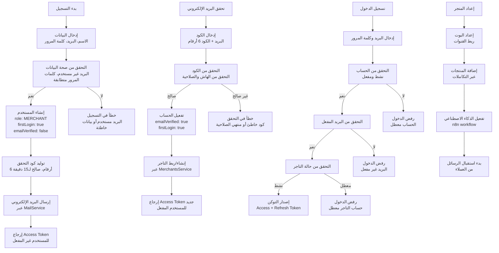
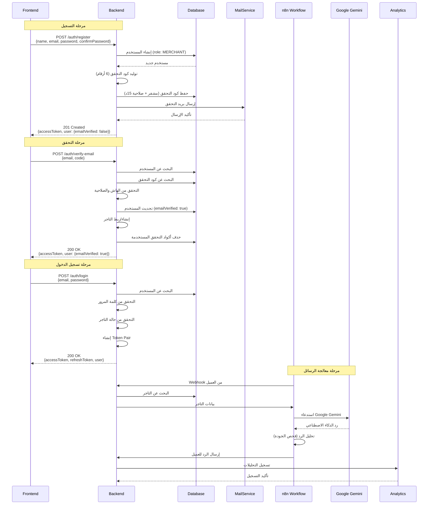
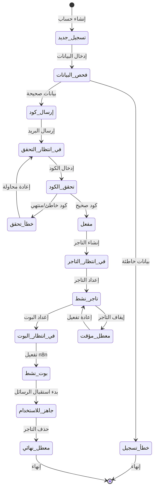
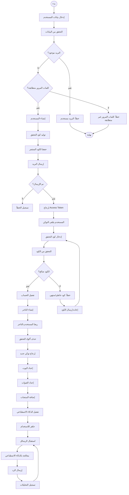

# ورك فلو إنشاء الحساب - نظام كليم الشامل

## نظرة عامة على النظام

نظام كليم هو منصة ذكاء اصطناعي متكاملة للتجار تتضمن:

- إدارة التجار والمستخدمين
- نظام الذكاء الاصطناعي المعتمد على n8n و Google Gemini
- نظام المراسلة متعدد القنوات (واتساب، تليجرام، ويب شات)
- إدارة المنتجات والطلبات
- نظام التحليلات والمراقبة

## 1. مخطط التدفق العام (Flowchart)



## 2. مخطط التسلسل (Sequence Diagram)



## 3. آلة الحالات (State Machine)



### تعريف الحالات

| الحالة             | الوصف                        | الإجراءات المسموحة        |
| ------------------ | ---------------------------- | ------------------------- |
| `تسجيل_جديد`       | مستخدم جديد في مرحلة التسجيل | إدخال البيانات الأساسية   |
| `فحص_البيانات`     | التحقق من صحة البيانات       | التحقق من البريد والكلمات |
| `إرسال_كود`        | إرسال كود التحقق عبر البريد  | إنشاء وإرسال الكود        |
| `في_انتظار_التحقق` | انتظار إدخال كود التحقق      | إعادة إرسال الكود         |
| `تحقق_الكود`       | فحص صحة الكود المدخل         | التحقق من الهاش والصلاحية |
| `مفعل`             | الحساب مفعل والبريد موثق     | إنشاء التاجر              |
| `في_انتظار_التاجر` | في مرحلة إنشاء/ربط التاجر    | إعداد معلومات التاجر      |
| `تاجر_نشط`         | التاجر جاهز للاستخدام        | إعداد البوت والقنوات      |
| `في_انتظار_البوت`  | في مرحلة إعداد البوت         | ربط n8n workflow          |
| `بوت_نشط`          | البوت جاهز للعمل             | تفعيل الذكاء الاصطناعي    |
| `جاهز_للاستخدام`   | النظام جاهز بالكامل          | استقبال ومعالجة الرسائل   |
| `معطل_مؤقت`        | التاجر معطل مؤقتاً           | عرض رسالة تعليق           |
| `معطل_نهائي`       | التاجر محذوف نهائياً         | منع الوصول                |

## 4. مخطط سير العمل التجاري (BPMN)



## 5. تفاصيل تقنية لكل مرحلة

### 5.1 مرحلة التسجيل

**Endpoint**: `POST /auth/register`

**البيانات المطلوبة**:

```typescript
interface RegisterDto {
  email: string; // بريد إلكتروني صحيح
  password: string; // 6 أحرف على الأقل
  confirmPassword: string; // يجب أن يطابق password
  name: string; // 3 أحرف على الأقل
}
```

**الإجراءات الداخلية**:

1. التحقق من تطابق كلمات المرور
2. إنشاء المستخدم في قاعدة البيانات:
   ```javascript
   {
     name,
     email,
     password, // يتم هاشها تلقائياً
     role: 'MERCHANT',
     active: true,
     firstLogin: true,
     emailVerified: false
   }
   ```
3. توليد كود تحقق 6 أرقام عشوائي
4. حفظ الكود المشفر بصلاحية 15 دقيقة
5. إرسال البريد الإلكتروني
6. إرجاع Access Token للمستخدم غير المفعل

### 5.2 مرحلة التحقق من البريد

**Endpoint**: `POST /auth/verify-email`

**البيانات المطلوبة**:

```typescript
interface VerifyEmailDto {
  email: string;
  code: string; // 6 أرقام
}
```

**الإجراءات الداخلية**:

1. البحث عن المستخدم
2. البحث عن آخر كود تحقق للمستخدم
3. التحقق من:
   - تطابق الهاش مع الكود المدخل
   - عدم انتهاء صلاحية الكود
4. تحديث حالة المستخدم:
   ```javascript
   user.emailVerified = true;
   user.firstLogin = true;
   ```
5. إنشاء أو ربط حساب التاجر
6. حذف أكواد التحقق المستخدمة
7. إرجاع Access Token جديد

### 5.3 مرحلة تسجيل الدخول

**Endpoint**: `POST /auth/login`

**البيانات المطلوبة**:

```typescript
interface LoginDto {
  email: string;
  password: string;
}
```

**الإجراءات الداخلية**:

1. البحث عن المستخدم
2. التحقق من كلمة المرور بـ bcrypt
3. التحقق من:
   - حالة الحساب (نشط)
   - تفعيل البريد الإلكتروني
   - حالة التاجر (نشط)
4. إنشاء Token Pair:
   - Access Token: صالح لـ15 دقيقة
   - Refresh Token: صالح لـ7 أيام
5. إعداد Cookies آمنة

### 5.4 تكامل مع n8n والذكاء الاصطناعي

**مسار الرسائل**:

1. **Webhook Reception**: الرسائل تصل عبر webhooks
2. **Merchant Lookup**: البحث عن بيانات التاجر
3. **AI Processing**: إرسال الرسالة لـ Google Gemini
4. **Response Analysis**: تحليل جودة الرد
5. **Backend Integration**: إرسال الرد للعميل
6. **Analytics Logging**: تسجيل التحليلات

**الأدوات المتاحة للذكاء الاصطناعي**:

- **البحث عن المنتجات**: `POST /api/vector/products`
- **البحث في المعرفة**: `POST /api/vector/unified-search`
- **معلومات المتجر**: `GET /api/merchants/{id}/ai/store-context`

## 6. معايير الأمان والحماية

### 6.1 حماية من الهجمات

- **Rate Limiting**: 5 محاولات للتسجيل/60ث، 5 محاولات للدخول/60ث
- **CSRF Protection**: حماية من هجمات CSRF
- **Password Hashing**: تشفير كلمات المرور بـ bcrypt
- **Token Security**: JWT tokens مع انتهاء صلاحية
- **Code Hashing**: تشفير أكواد التحقق بـ SHA256

### 6.2 مراقبة الأداء

- **Metrics Tracking**: تتبع المقاييس التجارية
- **Error Monitoring**: مراقبة الأخطاء والاستثناءات
- **Cache Management**: إدارة الكاش للبحث السريع
- **Database Optimization**: فهرسة قواعد البيانات

## 7. مسارات الخطأ والتعامل معها

### 7.1 أخطاء التسجيل

```javascript
DUPLICATE_KEY_CODE; // البريد مستخدم مسبقاً
VALIDATION_ERROR; // بيانات غير صحيحة
THROTTLE_ERROR; // تجاوز عدد المحاولات
```

### 7.2 أخطاء التحقق

```javascript
INVALID_VERIFICATION_CODE; // كود خاطئ
VERIFICATION_CODE_EXPIRED; // انتهت صلاحية الكود
EMAIL_NOT_REGISTERED; // البريد غير مسجل
```

### 7.3 أخطاء تسجيل الدخول

```javascript
INVALID_CREDENTIALS; // بيانات دخول خاطئة
ACCOUNT_DISABLED; // الحساب معطل
EMAIL_NOT_VERIFIED; // البريد غير مفعل
MERCHANT_ACCOUNT_SUSPENDED; // حساب التاجر معلق
```

## 8. خطة الاختبار والتحقق

### 8.1 اختبارات الوحدة

- اختبار إنشاء المستخدم
- اختبار توليد أكواد التحقق
- اختبار إرسال البريد الإلكتروني
- اختبار تفعيل الحساب

### 8.2 اختبارات التكامل

- اختبار التدفق الكامل للتسجيل
- اختبار التكامل مع n8n
- اختبار تكامل الذكاء الاصطناعي
- اختبار معالجة الأخطاء

### 8.3 اختبارات الأداء

- اختبار الحمل على عمليات التسجيل
- اختبار زمن الاستجابة
- اختبار استهلاك الذاكرة
- اختبار قاعدة البيانات

---

_تم إنشاء هذا التوثيق بواسطة نظام كليم لإدارة المتاجر الذكية_
