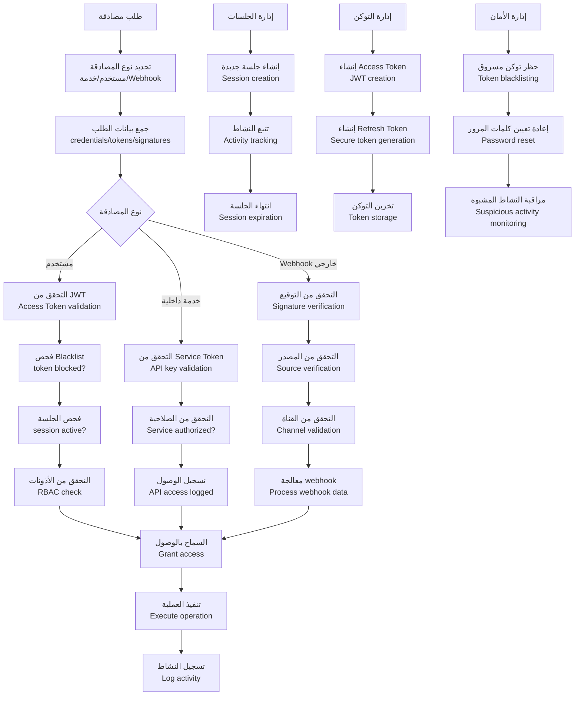
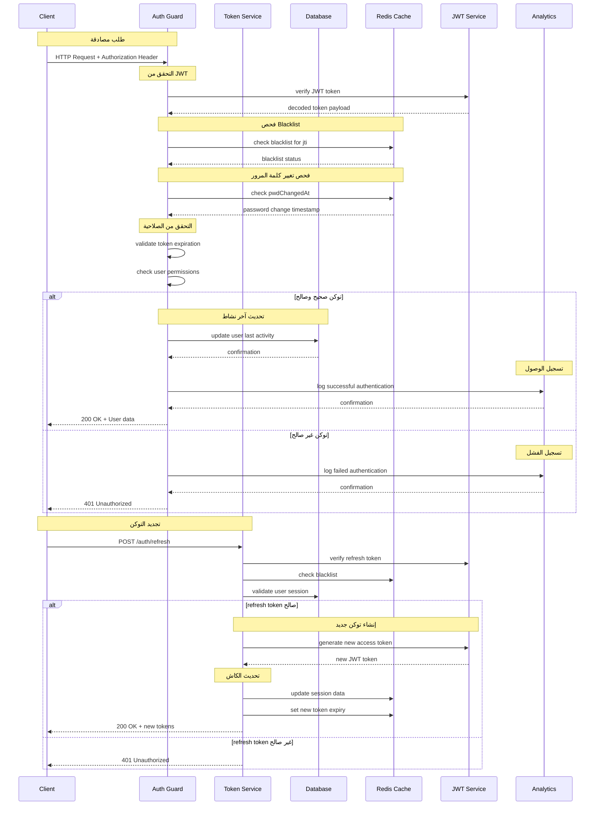
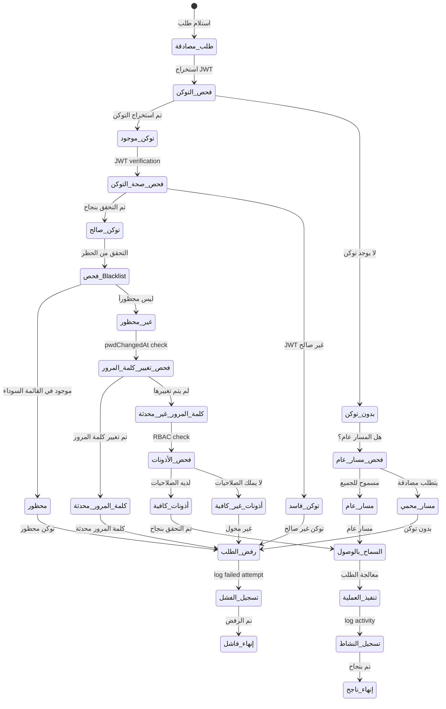
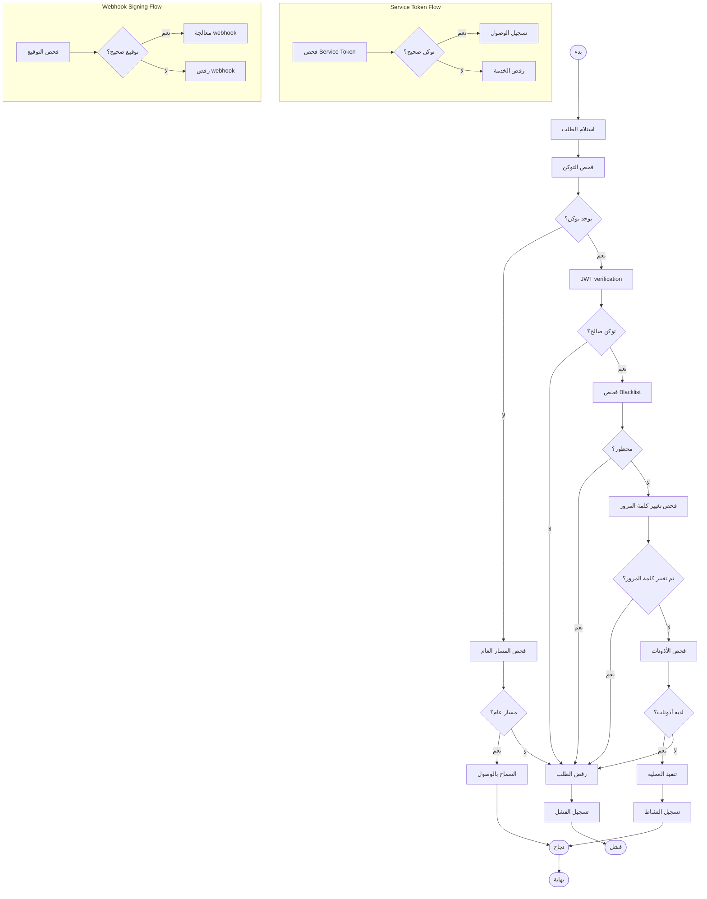

# ورك فلو المصادقة والتفويض - نظام كليم الشامل

## نظرة عامة على النظام

نظام كليم يدعم نظام مصادقة وتفويض متقدم وآمن:

- **JWT Authentication**: مصادقة المستخدمين مع Access و Refresh tokens
- **RBAC**: Role-Based Access Control للأذونات
- **Service Tokens**: مصادقة الخدمات الداخلية
- **Webhook Signing**: التحقق من صحة webhooks من المصادر الخارجية
- **Session Management**: إدارة الجلسات وانتهاء صلاحيتها
- **Blacklist Management**: حظر التوكن المسروقة
- **Password Security**: تشفير كلمات المرور وإعادة تعيينها

## 1. مخطط التدفق العام (Flowchart)



## 2. مخطط التسلسل (Sequence Diagram)



## 3. آلة الحالات (State Machine)



### تعريف الحالات

| الحالة                  | الوصف                       | الإجراءات المسموحة     |
| ----------------------- | --------------------------- | ---------------------- |
| `طلب_مصادقة`            | استلام طلب يتطلب مصادقة     | فحص التوكن والأذونات   |
| `فحص_التوكن`            | استخراج وفحص JWT token      | التحقق من وجود التوكن  |
| `بدون_توكن`             | لا يوجد توكن في الطلب       | فحص إذا كان المسار عام |
| `فحص_مسار_عام`          | التحقق من المسارات العامة   | السماح أو الرفض        |
| `مسار_عام`              | المسار مسموح للجميع         | السماح بالوصول         |
| `مسار_محمي`             | المسار يتطلب مصادقة         | رفض الطلب              |
| `فحص_صحة_التوكن`        | التحقق من صحة JWT           | verification           |
| `توكن_فاسد`             | JWT token غير صالح          | رفض الطلب              |
| `فحص_Blacklist`         | التحقق من القائمة السوداء   | blacklist check        |
| `محظور`                 | التوكن محظور                | رفض الطلب              |
| `غير_محظور`             | التوكن غير محظور            | فحص كلمة المرور        |
| `فحص_تغيير_كلمة_المرور` | فحص تاريخ تغيير كلمة المرور | pwdChangedAt check     |
| `كلمة_المرور_محدثة`     | تم تغيير كلمة المرور        | رفض الطلب              |
| `كلمة_المرور_غير_محدثة` | لم يتم تغيير كلمة المرور    | فحص الأذونات           |
| `فحص_الأذونات`          | التحقق من الأذونات          | RBAC check             |
| `أذونات_كافية`          | المستخدم مخول               | السماح بالوصول         |
| `أذونات_غير_كافية`      | المستخدم غير مخول           | رفض الطلب              |
| `السماح_بالوصول`        | تم التحقق بنجاح             | تنفيذ العملية          |
| `تنفيذ_العملية`         | معالجة الطلب                | execute operation      |
| `تسجيل_النشاط`          | تسجيل النشاط                | log activity           |

## 4. مخطط سير العمل التجاري (BPMN)



## 5. تفاصيل تقنية لكل مرحلة

### 5.1 مرحلة JWT Authentication

#### 5.1.1 إنشاء وإدارة التوكن

```typescript
// إنشاء Access Token فقط
function createAccessOnly(payload: {
  userId: string;
  role: JwtPayload['role'];
  merchantId?: string | null;
}): { accessToken: string; jti: string } {
  const jti = randomUUID();

  const claims: Pick<JwtPayload, 'sub' | 'role' | 'merchantId' | 'jti'> & {
    typ: 'access';
  } = {
    sub: payload.userId,
    role: payload.role,
    merchantId: payload.merchantId ?? null,
    jti,
    typ: 'access',
  };

  const signOptions: JwtSignOptions = {
    issuer: this.config.get<string>('JWT_ISSUER'),
    audience: this.config.get<string>('JWT_AUDIENCE'),
    algorithm: 'HS256',
    expiresIn: '15m', // 15 دقيقة
  };

  const accessToken = this.jwtService.sign(claims, signOptions);
  return { accessToken, jti };
}

// إنشاء زوج توكنات (Access/Refresh) وتخزين الجلسة
async function createTokenPair(
  payload: Omit<JwtPayload, 'iat' | 'exp' | 'jti' | 'iss' | 'aud'>,
  sessionInfo?: { userAgent?: string; ip?: string; csrfToken?: string },
): Promise<TokenPair> {
  const refreshJti = randomUUID();
  const accessJti = randomUUID();
  const now = Math.floor(Date.now() / MS_PER_SECOND);

  const accessPayload: JwtPayload = {
    ...payload,
    userId: payload.userId as string,
    role: payload.role as JwtPayload['role'],
    sub: payload.userId as string,
    jti: accessJti,
    iat: now,
    exp: now + this.ACCESS_TOKEN_TTL, // 15 دقيقة
  };
  const refreshPayload: JwtPayload = {
    ...payload,
    userId: payload.userId as string,
    role: payload.role as JwtPayload['role'],
    sub: payload.userId as string,
    jti: refreshJti,
    iat: now,
    exp: now + this.REFRESH_TOKEN_TTL, // 7 أيام
  };

  const commonSign: JwtSignOptions = {
    issuer: this.config.get<string>('JWT_ISSUER'),
    audience: this.config.get<string>('JWT_AUDIENCE'),
    algorithm: 'HS256',
  };

  const accessToken = this.jwtService.sign(accessPayload, {
    ...commonSign,
    expiresIn: this.ACCESS_TOKEN_TTL,
  });
  const refreshToken = this.jwtService.sign(refreshPayload, {
    ...commonSign,
    expiresIn: this.REFRESH_TOKEN_TTL,
  });

  const sessionData: SessionData = {
    userId: payload.userId as string,
    role: payload.role as string,
    merchantId: payload.merchantId as string | null,
    createdAt: now,
    lastUsed: now,
    userAgent: sessionInfo?.userAgent,
    ip: sessionInfo?.ip,
    csrfToken: sessionInfo?.csrfToken ?? this.generateCsrfToken(),
    refreshTokenHash: this.hashRefreshToken(refreshToken),
  };

  await this.store.setSession(refreshJti, sessionData, this.REFRESH_TOKEN_TTL);

  return { accessToken, refreshToken };
}
```

#### 5.1.2 فحص صحة التوكن

```typescript
// فحص Access Token مع التحقق من القائمة السوداء
async function validateAccessToken(token: string): Promise<JwtPayload | null> {
  try {
    const decoded = this.jwtService.verify<JwtPayload>(token, {
      secret: this.config.get<string>('JWT_SECRET'),
      issuer: this.config.get<string>('JWT_ISSUER'),
      audience: this.config.get<string>('JWT_AUDIENCE'),
    });

    if (typeof decoded?.jti !== 'string') return null;

    const blacklisted = await this.store.isBlacklisted(decoded.jti);
    if (blacklisted) return null;

    return decoded;
  } catch {
    return null;
  }
}

// فحص الجلسة وتحديث آخر استخدام
async function validateSession(jti: string): Promise<SessionData | null> {
  const sess = await this.store.getSession(jti);
  if (!sess) return null;

  sess.lastUsed = Math.floor(Date.now() / MS_PER_SECOND);
  await this.store.setSession(jti, sess, this.REFRESH_TOKEN_TTL);
  return sess;
}
```

### 5.2 مرحلة RBAC (Role-Based Access Control)

#### 5.2.1 تعريف الأدوار

```typescript
export enum UserRole {
  MERCHANT = 'MERCHANT',  // تاجر (له صلاحيات كاملة على متجره)
  ADMIN = 'ADMIN',        // مدير نظام (له صلاحيات كاملة على النظام)
  MEMBER = 'MEMBER',      // عضو عادي (له صلاحيات محدودة)
}
```

#### 5.2.2 فحص الأذونات

```typescript
// فحص بسيط للدور المطلوب
function checkRole(userRole: UserRole, requiredRoles: string[]): boolean {
  return requiredRoles.includes(userRole);
}

// مثال على استخدام الديكوراتور
@Injectable()
export class RolesGuard implements CanActivate {
  constructor(private reflector: Reflector) {}

  canActivate(context: ExecutionContext): boolean {
    const requiredRoles = this.reflector.getAllAndOverride<string[]>(
      ROLES_KEY,
      [context.getHandler(), context.getClass()],
    );

    if (!requiredRoles || requiredRoles.length === 0) return true;

    const request = context.switchToHttp().getRequest<RequestWithUser>();
    const user = request.user;

    if (!user) {
      throw new UnauthorizedException('Unauthorized');
    }

    if (!requiredRoles.includes(user.role)) {
      throw new ForbiddenException('Insufficient role');
    }

    return true;
  }
}
```

### 5.3 مرحلة Service Tokens

#### 5.3.1 إنشاء وإدارة Service Tokens

```typescript
// فحص Service Token بسيط (يستخدم متغير البيئة مباشرة)
@Injectable()
export class ServiceTokenGuard implements CanActivate {
  private readonly token: string;

  constructor() {
    const t = process.env.N8N_SERVICE_TOKEN;
    this.token = t || 'REPLACE_WITH_TOKEN';
  }

  canActivate(context: ExecutionContext): boolean {
    const req = context.switchToHttp().getRequest();
    const header = String(req.headers?.authorization || '');
    const provided = header.startsWith('Bearer ') ? header.slice(7) : '';

    if (!provided || !this.timingSafeEqual(provided, this.token)) {
      throw new UnauthorizedException('invalid service token');
    }
    return true;
  }

  private timingSafeEqual(a: string, b: string): boolean {
    const A = Buffer.from(a);
    const B = Buffer.from(b);
    return A.length === B.length && crypto.timingSafeEqual(A, B);
  }
}
```

### 5.4 مرحلة Webhook Signing

#### 5.4.1 WhatsApp Cloud Webhook Verification

```typescript
private verifyWhatsAppCloud(
  req: RequestWithWebhook,
  ch: ChannelSecretsLean,
): boolean {
  const sig = req.headers['x-hub-signature-256'] as string;
  if (!sig || !sig.startsWith('sha256=')) return false;
  if (!ch.appSecretEnc) return false;

  const raw = req.rawBody;
  if (!raw || raw.length === 0) return false;

  const appSecret = decryptSecret(ch.appSecretEnc);
  const theirs = Buffer.from(sig.split('=')[1], 'hex');
  const ours = crypto.createHmac('sha256', appSecret).update(raw).digest();

  return (
    theirs.length === ours.length && crypto.timingSafeEqual(theirs, ours)
  );
}
```

#### 5.4.2 Telegram Webhook Verification

```typescript
private verifyTelegram(req: RequestWithWebhook): boolean {
  const got = req.headers['x-telegram-bot-api-secret-token'] as string | undefined;
  const expected = process.env.TELEGRAM_WEBHOOK_SECRET || '';
  return timingSafeEqStr(got, expected);
}
```

#### 5.4.3 Evolution API Webhook Verification

```typescript
private verifyEvolution(req: RequestWithWebhook): boolean {
  const got = (req.headers['x-evolution-apikey'] || req.headers['apikey']) as string | undefined;
  const expected = process.env.EVOLUTION_APIKEY || process.env.EVOLUTION_API_KEY || '';
  return timingSafeEqStr(got, expected);
}
```

#### 5.4.4 كشف مزود القناة من المسار

```typescript
private detect(req: RequestWithWebhook): Detected {
  const full = (req.baseUrl || '') + (req.path || '');
  const params = req.params || {};

  if (/\/webhooks\/whatsapp_cloud\//.test(full)) {
    return {
      provider: ChannelProvider.WHATSAPP_CLOUD,
      channelId: params.channelId,
    };
  }
  if (/\/webhooks\/telegram\//.test(full)) {
    return {
      provider: ChannelProvider.TELEGRAM,
      channelId: params.channelId,
    };
  }
  if (/\/webhooks\/whatsapp_qr\//.test(full)) {
    return {
      provider: ChannelProvider.WHATSAPP_QR,
      channelId: params.channelId,
    };
  }
  return { provider: 'unknown' };
}
```

### 5.5 مرحلة Session Management

#### 5.5.1 تعريف بيانات الجلسة

```typescript
export interface SessionData {
  userId: string;
  role: string;
  merchantId?: string | null;
  createdAt: number;           // timestamp بالثواني
  lastUsed: number;           // timestamp بالثواني
  userAgent?: string;
  ip?: string;
  csrfToken?: string;         // CSRF token للحماية
  refreshTokenHash?: string;  // Hash للـ refresh token
}
```

#### 5.5.2 إدارة الجلسات عبر Redis

```typescript
export interface SessionStore {
  // جلسات Refresh
  setSession(jti: string, data: SessionData, ttlSeconds: number): Promise<void>;
  getSession(jti: string): Promise<SessionData | null>;
  deleteSession(jti: string): Promise<void>;

  // قائمة جلسات المستخدم
  addUserSession(userId: string, jti: string, ttlSeconds: number): Promise<void>;
  getUserSessions(userId: string): Promise<string[]>;
  clearUserSessions(userId: string): Promise<void>;

  // القائمة السوداء
  addToBlacklist(jti: string, ttlSeconds: number): Promise<void>;
  isBlacklisted(jti: string): Promise<boolean>;
}
```

#### 5.5.3 إنشاء وإدارة الجلسات

```typescript
// في TokenService
async createTokenPair(
  payload: Omit<JwtPayload, 'iat' | 'exp' | 'jti' | 'iss' | 'aud'>,
  sessionInfo?: { userAgent?: string; ip?: string; csrfToken?: string },
): Promise<TokenPair> {
  // ... إنشاء التوكنات

  const sessionData: SessionData = {
    userId: payload.userId as string,
    role: payload.role as string,
    merchantId: payload.merchantId as string | null,
    createdAt: now,
    lastUsed: now,
    userAgent: sessionInfo?.userAgent,
    ip: sessionInfo?.ip,
    csrfToken: sessionInfo?.csrfToken ?? this.generateCsrfToken(),
    refreshTokenHash: this.hashRefreshToken(refreshToken),
  };

  await this.store.setSession(refreshJti, sessionData, this.REFRESH_TOKEN_TTL);
  await this.store.addUserSession(payload.userId as string, refreshJti, this.REFRESH_TOKEN_TTL);

  return { accessToken, refreshToken };
}

// تسجيل الخروج من جميع الجلسات
async revokeAllUserSessions(userId: string): Promise<void> {
  const all = await this.store.getUserSessions(userId);
  for (const jti of all) {
    await this.revokeRefreshToken(jti);
  }
  await this.store.clearUserSessions(userId);
}
```

### 5.6 مرحلة إدارة الأمان

#### 5.6.1 حظر التوكن

```typescript
// حظر access jti (للتسجيل خروج فوري)
async blacklistAccessJti(jti: string, ttlSeconds: number): Promise<void> {
  await this.store.addToBlacklist(jti, ttlSeconds);
}

// إلغاء جلسة Refresh محددة وإضافتها للقائمة السوداء
async revokeRefreshToken(jti: string): Promise<void> {
  await this.store.deleteSession(jti);
  await this.store.addToBlacklist(jti, this.REFRESH_TOKEN_TTL);
}
```

#### 5.6.2 إدارة تغيير كلمات المرور

```typescript
async changePassword(userId: string, dto: ChangePasswordDto): Promise<void> {
  // ... التحقق من كلمة المرور الحالية

  user.password = newPassword;
  user.passwordChangedAt = new Date();
  await this.repo.saveUser(user);

  // تحديث كاش تاريخ تغيير كلمة المرور
  await this.cacheManager.set(
    `pwdChangedAt:${user._id.toString()}`,
    user.passwordChangedAt.getTime(),
    30 * 24 * SECONDS_PER_HOUR, // 30 يوم
  );

  // حذف رموز إعادة تعيين كلمة المرور المعلقة
  await this.repo.deletePasswordResetTokensByUser(user._id);

  // تسجيل خروج من جميع الجلسات للأمان
  await this.tokenService.revokeAllUserSessions(userId);
}
```

#### 5.6.3 تشفير كلمات المرور

```typescript
// في User Schema - هاش تلقائي قبل الحفظ
UserSchema.pre('save', async function (next) {
  if (!this.isModified('password')) return next();
  const salt = await bcrypt.genSalt(10); // استخدام salt بـ 10 rounds
  this.password = await bcrypt.hash(this.password, salt);
  next();
});

// مقارنة كلمة المرور
UserSchema.methods.comparePassword = function(candidate: string) {
  return bcrypt.compare(candidate, this.password);
};
```

## 6. معايير الأمان والحماية

### 6.1 تشفير كلمات المرور

```typescript
// في User Schema - هاش تلقائي قبل الحفظ
UserSchema.pre('save', async function (next) {
  if (!this.isModified('password')) return next();
  const salt = await bcrypt.genSalt(10); // استخدام salt بـ 10 rounds
  this.password = await bcrypt.hash(this.password, salt);
  next();
});

// مقارنة كلمة المرور في الخدمة
const isMatch = await bcrypt.compare(password, userDoc.password);
if (!isMatch) {
  throw new BadRequestException(
    this.translationService.translate('auth.errors.invalidCredentials'),
  );
}
```

### 6.2 فحص الحسابات الموقوفة

```typescript
// فحص حالة الحساب
if (userDoc.active === false) {
  throw new BadRequestException(
    this.translationService.translate('auth.errors.accountDisabled'),
  );
}

// فحص حالة التاجر (إن وجد)
if (userDoc.merchantId && String(userDoc.role) !== 'ADMIN') {
  const merchant = await this.repo.findMerchantBasicById(
    userDoc.merchantId as unknown as string,
  );
  if (merchant && (merchant.active === false || merchant.deletedAt)) {
    throw new BadRequestException(
      this.translationService.translate('auth.errors.merchantAccountSuspended'),
    );
  }
}
```

### 6.3 التحقق من البريد الإلكتروني

```typescript
// فحص تفعيل البريد الإلكتروني
if (!userDoc.emailVerified) {
  throw new BadRequestException(
    this.translationService.translate('auth.errors.emailNotVerified'),
  );
}

// إرسال رمز التحقق عبر البريد الإلكتروني
const code = generateNumericCode(VERIFICATION_CODE_LENGTH);
await this.repo.createEmailVerificationToken({
  userId: userDoc._id,
  codeHash: sha256(code),
  expiresAt: minutesFromNow(15),
});

try {
  await this.mailService.sendVerificationEmail(email, code);
} catch {
  // log error but don't fail registration
}
```

### 6.4 إعادة تعيين كلمة المرور

```typescript
// إنشاء رمز إعادة تعيين آمن
const token = generateSecureToken(PASSWORD_RESET_TOKEN_LENGTH);
const tokenHash = sha256(token);

// حفظ رمز الإعادة تعيين مع تاريخ انتهاء الصلاحية
await this.repo.createPasswordResetToken({
  userId: user._id,
  tokenHash,
  expiresAt: minutesFromNow(30),
});

// إرسال رابط إعادة التعيين عبر البريد الإلكتروني
const link = `${baseUrl}/reset-password?token=${encodeURIComponent(token)}&email=${encodeURIComponent(email)}`;
await this.mailService.sendPasswordResetEmail(email, link);
```

## 7. مسارات الخطأ والتعامل معها

### 7.1 أخطاء المصادقة الشائعة

```typescript
// في AuthService
throw new BadRequestException(
  this.translationService.translate('auth.errors.invalidCredentials'),
);

// في JwtAuthGuard
throw new UnauthorizedException('Session expired or revoked');

// في RolesGuard
throw new ForbiddenException('Insufficient role');
```

### 7.2 أخطاء الحساب والحالة

```typescript
// حساب معطل
throw new BadRequestException(
  this.translationService.translate('auth.errors.accountDisabled'),
);

// بريد إلكتروني غير مُفعّل
throw new BadRequestException(
  this.translationService.translate('auth.errors.emailNotVerified'),
);

// حساب التاجر موقوف
throw new BadRequestException(
  this.translationService.translate('auth.errors.merchantAccountSuspended'),
);
```

### 7.3 أخطاء كلمات المرور

```typescript
// كلمات مرور غير متطابقة
throw new BadRequestException(
  this.translationService.translate('auth.errors.passwordMismatch'),
);

// كلمة مرور حالية خاطئة
throw new BadRequestException(
  this.translationService.translate('auth.errors.currentPasswordIncorrect'),
);

// رمز إعادة التعيين غير صحيح أو منتهي الصلاحية
throw new BadRequestException(
  this.translationService.translate('auth.errors.invalidVerificationCode'),
);
```

### 7.4 أخطاء Webhook

```typescript
// توقيع غير صحيح
throw new ForbiddenException('Signature verification failed');

// قناة غير متاحة
throw new ForbiddenException('Channel not available');

// مزود القناة لا يطابق المسار
throw new ForbiddenException('Channel/provider mismatch');
```

### 7.5 أخطاء Service Token

```typescript
// توكن خدمة غير صحيح
throw new UnauthorizedException('invalid service token');
```

## 8. ميزات إضافية مهمة

### 8.1 التحقق من البريد الإلكتروني

نظام كليم يتطلب تفعيل البريد الإلكتروني للأمان:

```typescript
// إرسال رمز التحقق أثناء التسجيل
const code = generateNumericCode(VERIFICATION_CODE_LENGTH); // 6 أرقام
await this.repo.createEmailVerificationToken({
  userId: userDoc._id,
  codeHash: sha256(code),
  expiresAt: minutesFromNow(15), // صالح لمدة 15 دقيقة
});

await this.mailService.sendVerificationEmail(email, code);

// التحقق من الرمز
const tokenDoc = await this.repo.latestEmailVerificationTokenByUser(user._id);
if (!tokenDoc || tokenDoc.codeHash !== sha256(code)) {
  throw new BadRequestException('رمز غير صحيح');
}
if (tokenDoc.expiresAt.getTime() < Date.now()) {
  throw new BadRequestException('انتهت صلاحية الرمز');
}

// تفعيل الحساب
user.emailVerified = true;
user.firstLogin = true;
await this.repo.saveUser(user);
```

### 8.2 إعادة تعيين كلمة المرور

نظام إعادة تعيين آمن باستخدام رموز مؤقتة:

```typescript
// طلب إعادة تعيين
const token = generateSecureToken(PASSWORD_RESET_TOKEN_LENGTH); // 32 حرف
const tokenHash = sha256(token);

await this.repo.createPasswordResetToken({
  userId: user._id,
  tokenHash,
  expiresAt: minutesFromNow(30), // صالح لمدة 30 دقيقة
});

const resetLink = `${baseUrl}/reset-password?token=${token}&email=${email}`;
await this.mailService.sendPasswordResetEmail(email, resetLink);

// التحقق من الرمز والحفظ
const resetDoc = await this.repo.findLatestPasswordResetForUser(user._id, true);
if (!resetDoc || resetDoc.tokenHash !== sha256(token)) {
  return; // فشل صامت للأمان
}

user.password = newPassword;
user.passwordChangedAt = new Date();
await this.repo.saveUser(user);

// تسجيل خروج من جميع الجلسات للأمان
await this.tokenService.revokeAllUserSessions(userId);
```

### 8.3 إدارة الحسابات الموقوفة

```typescript
// فحص حالة الحساب أثناء المصادقة
if (userDoc.active === false) {
  throw new BadRequestException('الحساب معطل');
}

// فحص حالة التاجر
if (userDoc.merchantId && userDoc.role !== 'ADMIN') {
  const merchant = await this.merchants.findById(userDoc.merchantId);
  if (merchant?.deletedAt || merchant?.active === false) {
    throw new BadRequestException('حساب التاجر موقوف');
  }
}
```

## 9. خطة الاختبار والتحقق

### 9.1 اختبارات الوحدة

- اختبار إنشاء وفحص JWT tokens (`auth.service.spec.ts`)
- اختبار نظام RBAC (`roles.guard.spec.ts`)
- اختبار Service token validation (`service-token.guard.spec.ts`)
- اختبار Webhook signature verification (`webhook-signature.guard.spec.ts`)
- اختبار تشفير كلمات المرور (`bcrypt` functionality)

### 9.2 اختبارات التكامل

- اختبار تدفق المصادقة الكامل (`auth.controller.spec.ts`)
- اختبار تجديد التوكن (`token.service.spec.ts`)
- اختبار حظر التوكن وإدارة الجلسات
- اختبار معالجة الأخطاء (`error-monitoring.controller.spec.ts`)
- اختبار التحقق من البريد الإلكتروني
- اختبار إعادة تعيين كلمة المرور

### 9.3 اختبارات E2E

- اختبار تسجيل الدخول والخروج
- اختبار تجديد التوكن
- اختبار حماية المسارات المحمية
- اختبار Webhook verification
- اختبار إدارة الحسابات الموقوفة

### 9.4 اختبارات الأداء

- اختبار أداء فحص التوكن مع Redis
- اختبار أداء البحث في Blacklist
- اختبار أداء فحص الأذونات
- اختبار استهلاك الذاكرة للجلسات
- اختبار تحمل النظام تحت ضغط عالي

### 9.5 اختبارات الأمان

- اختبار محاولات تسجيل الدخول المتكررة
- اختبار سرقة التوكن وحظرها
- اختبار تغيير كلمة المرور وحظر الجلسات القديمة
- اختبار CSRF protection
- اختبار توقيع Webhook من مصادر غير موثوقة

---

_تم إنشاء هذا التوثيق بواسطة نظام كليم لإدارة المتاجر الذكية_
