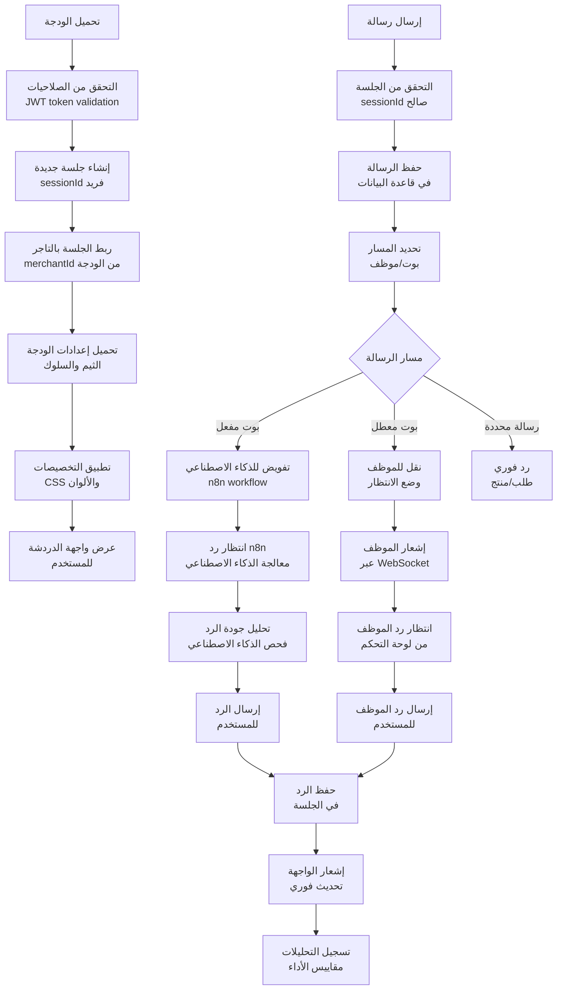
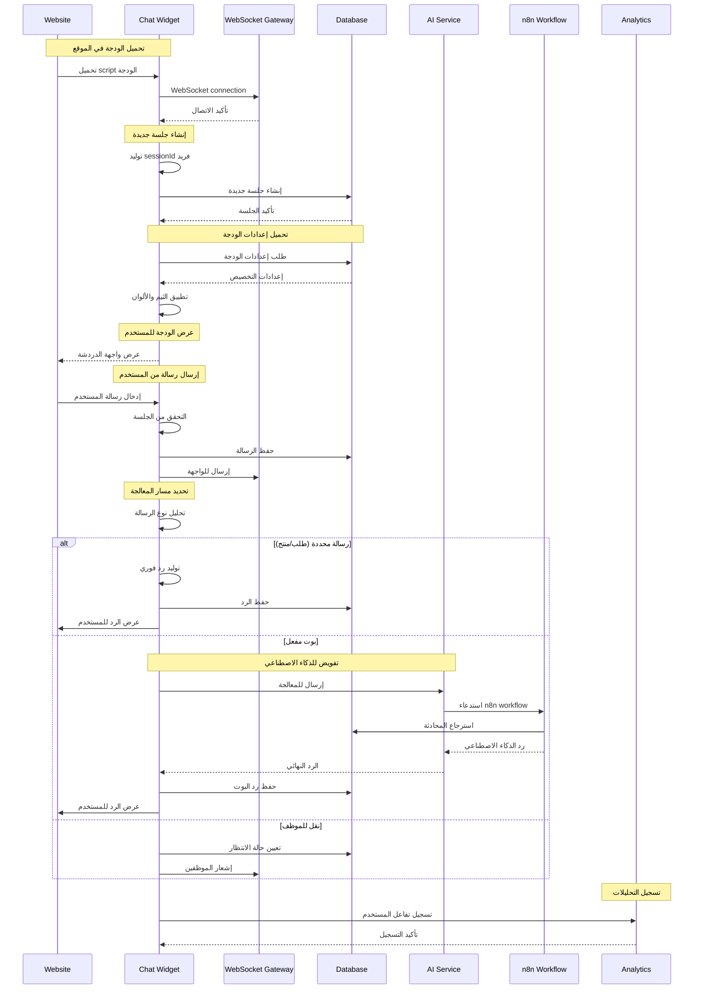
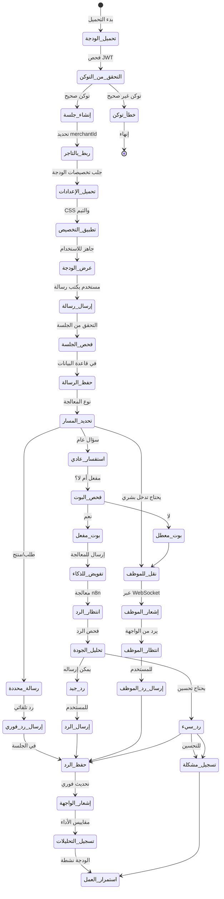
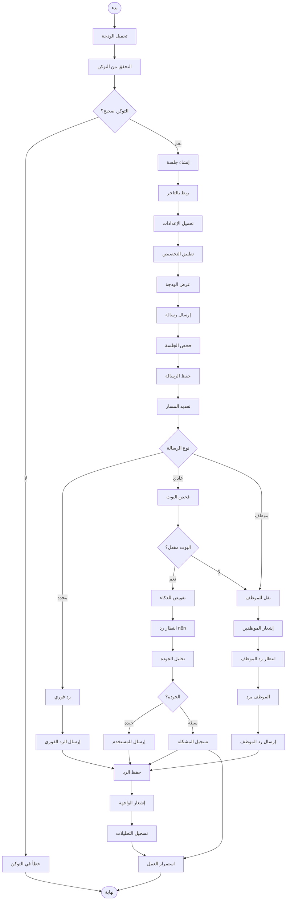

# ورك فلو ودجة الدردشة - نظام كليم الشامل

## نظرة عامة على النظام

نظام كليم يدعم ودجة دردشة متطورة قابلة للتخصيص الكامل مع إمكانيات متقدمة:

- **أوضاع التضمين**: فقاعة، iframe، شريط، محادثة كاملة
- **تخصيص مرئي**: ألوان، خطوط، ثيمات متعددة
- **إدارة الجلسات**: تتبع المحادثات والمستخدمين
- **نظام التحقق**: JWT tokens مع إدارة الجلسات
- **إشعارات فورية**: WebSocket للرسائل المباشرة
- **تحليلات متقدمة**: تتبع المستخدمين والمحادثات

## 1. مخطط التدفق العام (Flowchart)



## 2. مخطط التسلسل (Sequence Diagram)



## 3. آلة الحالات (State Machine)



### تعريف الحالات

| الحالة             | الوصف                         | الإجراءات المسموحة       |
| ------------------ | ----------------------------- | ------------------------ |
| `تحميل_الودجة`     | بدء تحميل الودجة في الموقع    | التحقق من التوكن         |
| `التحقق_من_التوكن` | فحص صحة JWT token             | قبول أو رفض الاتصال      |
| `إنشاء_جلسة`       | إنشاء جلسة جديدة للمستخدم     | توليد sessionId فريد     |
| `ربط_بالتاجر`      | ربط الجلسة بالتاجر المحدد     | تحديد merchantId         |
| `تحميل_الإعدادات`  | جلب تخصيصات الودجة            | استرجاع الثيم والإعدادات |
| `تطبيق_التخصيص`    | تطبيق CSS والألوان            | إعداد العرض المرئي       |
| `عرض_الودجة`       | عرض الودجة للمستخدم           | بدء التفاعل              |
| `إرسال_رسالة`      | إرسال رسالة من المستخدم       | معالجة المدخلات          |
| `فحص_الجلسة`       | التحقق من صحة الجلسة          | التأكد من الاتصال        |
| `حفظ_الرسالة`      | حفظ الرسالة في قاعدة البيانات | إدراج الرسالة            |
| `تحديد_المسار`     | تحديد كيفية معالجة الرسالة    | تصنيف الرسالة            |
| `رسالة_محددة`      | رسالة تحتوي على طلب محدد      | رد فوري                  |
| `استفسار_عادي`     | سؤال عام أو استفسار           | معالجة ذكية              |
| `نقل_للموظف`       | يحتاج تدخل موظف               | إشعار الموظفين           |
| `فحص_البوت`        | التحقق من تفعيل البوت         | قرار التوجيه             |
| `بوت_مفعل`         | البوت يمكنه الرد              | تفويض للذكاء الاصطناعي   |
| `بوت_معطل`         | البوت غير مفعل                | نقل للموظف               |
| `تفويض_للذكاء`     | إرسال للمعالجة الذكية         | استدعاء n8n              |
| `انتظار_الرد`      | معالجة الذكاء الاصطناعي       | انتظار النتيجة           |
| `تحليل_الجودة`     | فحص جودة الرد                 | تقييم النتيجة            |
| `إرسال_الرد`       | إرسال الرد للمستخدم           | عبر WebSocket            |
| `إشعار_الموظف`     | إخطار الموظفين                | عبر WebSocket            |
| `انتظار_الموظف`    | انتظار رد الموظف              | من الواجهة               |
| `إرسال_رد_الموظف`  | إرسال رد الموظف               | للمستخدم                 |
| `حفظ_الرد`         | حفظ الرد في الجلسة            | تحديث قاعدة البيانات     |
| `إشعار_الواجهة`    | إشعار الواجهة بالتحديث        | تحديث فوري               |
| `تسجيل_التحليلات`  | تسجيل المقاييس والإحصائيات    | مراقبة الأداء            |
| `استمرار_العمل`    | الودجة تعمل بشكل طبيعي        | جميع العمليات            |

## 4. مخطط سير العمل التجاري (BPMN)



## 5. تفاصيل تقنية لكل مرحلة

### 5.1 مرحلة التحميل والإعداد

#### 5.1.1 تحميل الودجة

```html
<!-- تضمين الودجة في الموقع -->
<script src="https://cdn.kaleem-ai.com/widget.js"></script>
<script>
  window.KaleemChatWidget.init({
    widgetSlug: 'chat_abc123',
    theme: 'default',
  });
</script>
```

#### 5.1.2 إنشاء الجلسة

```typescript
// إنشاء sessionId فريد
const sessionId = generateSessionId();
const session = await sessionsRepo.create({
  sessionId,
  merchantId,
  userAgent: req.headers['user-agent'],
  ip: req.ip,
  status: 'active',
});
```

#### 5.1.3 تحميل إعدادات الودجة

```typescript
// جلب إعدادات الودجة من قاعدة البيانات
const settings = await chatWidgetService.getSettings(merchantId);

// تطبيق التخصيصات
widget.applyTheme(settings.theme);
widget.setBotName(settings.botName);
widget.setWelcomeMessage(settings.welcomeMessage);
```

### 5.2 مرحلة معالجة الرسائل

#### 5.2.1 تحديد مسار الرسالة

```typescript
async function routeMessage(message: IncomingMessage) {
  // تحليل النية
  const intent = analyzeIntent(message.text);

  switch (intent.type) {
    case 'order_inquiry':
      return await handleOrderInquiry(message);
    case 'product_inquiry':
      return await handleProductInquiry(message);
    case 'general':
      return await handleGeneralInquiry(message);
    default:
      return await handleUnknownMessage(message);
  }
}
```

#### 5.2.2 تفويض للذكاء الاصطناعي

```typescript
async function forwardToAI(message: IncomingMessage) {
  // إرسال لـ n8n workflow
  await n8nService.forward({
    merchantId: message.merchantId,
    sessionId: message.sessionId,
    text: message.text,
    channel: 'webchat',
  });

  // انتظار الرد (timeout بعد 30 ثانية)
  const response = await waitForAIResponse(message.sessionId, 30000);

  return response;
}
```

#### 5.2.3 نقل للموظف

```typescript
async function transferToAgent(message: IncomingMessage) {
  // تحديث حالة الجلسة
  await sessionsRepo.update(message.sessionId, {
    status: 'waiting_for_agent',
    assignedAt: new Date(),
  });

  // إشعار الموظفين
  chatGateway.sendToAgents('new_customer_message', {
    sessionId: message.sessionId,
    message: message.text,
    customerInfo: message.metadata,
  });
}
```

### 5.3 مرحلة الإشعارات والمراقبة

#### 5.3.1 إشعارات WebSocket

```typescript
// إرسال رسالة للمستخدم
chatGateway.sendToSession(sessionId, {
  type: 'message',
  role: 'bot',
  text: response,
  timestamp: new Date(),
});

// إشعار المشرفين
chatGateway.sendToAdmins('new_session', {
  sessionId,
  merchantId,
  status: 'active',
});
```

#### 5.3.2 تتبع المقاييس

```typescript
// تسجيل تفاعل المستخدم
await analytics.track({
  event: 'widget_message_sent',
  sessionId,
  merchantId,
  messageType: 'user_input',
  timestamp: new Date(),
});

// تتبع الأداء
await metrics.record({
  metric: 'widget_response_time',
  value: Date.now() - startTime,
  tags: { merchantId, sessionId },
});
```

## 6. معايير الأمان والحماية

### 6.1 التحقق من الهوية

```typescript
// التحقق من JWT token
const decoded = jwtService.verify(token, {
  secret: process.env.JWT_SECRET,
  issuer: process.env.JWT_ISSUER,
  audience: process.env.JWT_AUDIENCE,
});

// فحص القائمة السوداء
const isBlacklisted = await cacheManager.get(`bl:${decoded.jti}`);
if (isBlacklisted) {
  throw new UnauthorizedException('Token blacklisted');
}
```

### 6.2 Rate Limiting

- **رسائل المستخدم**: 20 رسالة/دقيقة
- **اتصالات WebSocket**: 5 اتصالات/دقيقة لكل IP
- **طلبات الإعدادات**: 100 طلب/دقيقة

### 6.3 منع البريد المزعج

```typescript
// فحص الرسائل المكررة
const recentMessages = await messagesRepo.findRecent(sessionId, 60); // آخر دقيقة
if (recentMessages.length > 10) {
  // حظر مؤقت
  await sessionsRepo.update(sessionId, { status: 'blocked' });
}
```

## 7. مسارات الخطأ والتعامل معها

### 7.1 أخطاء التحميل

```javascript
WIDGET_LOAD_FAILED; // فشل في تحميل الودجة
INVALID_TOKEN; // توكن غير صحيح
MERCHANT_NOT_FOUND; // التاجر غير موجود
WIDGET_DISABLED; // الودجة معطلة
```

### 7.2 أخطاء المعالجة

```javascript
AI_PROCESSING_FAILED; // فشل في معالجة n8n
SESSION_EXPIRED; // انتهت صلاحية الجلسة
RATE_LIMIT_EXCEEDED; // تجاوز حد الرسائل
INVALID_MESSAGE_FORMAT; // تنسيق رسالة خاطئ
```

### 7.3 أخطاء الإرسال

```javascript
WEBSOCKET_DISCONNECTED; // انقطع اتصال WebSocket
MESSAGE_SEND_FAILED; // فشل في إرسال الرسالة
AGENT_UNAVAILABLE; // لا يوجد موظف متاح
```

## 8. خطة الاختبار والتحقق

### 8.1 اختبارات الوحدة

- اختبار تحميل الودجة بمختلف الإعدادات
- اختبار إنشاء الجلسات والتحقق من التوكن
- اختبار معالجة الرسائل المختلفة
- اختبار إشعارات WebSocket

### 8.2 اختبارات التكامل

- اختبار التكامل مع n8n workflow
- اختبار تكامل مع نظام الرسائل
- اختبار تكامل مع التحليلات
- اختبار معالجة الأخطاء

### 8.3 اختبارات الأداء

- اختبار الحمل على WebSocket connections
- اختبار زمن الاستجابة للرسائل
- اختبار استهلاك الذاكرة
- اختبار معدل الرسائل المعالجة

---

_تم إنشاء هذا التوثيق بواسطة نظام كليم لإدارة المتاجر الذكية_
