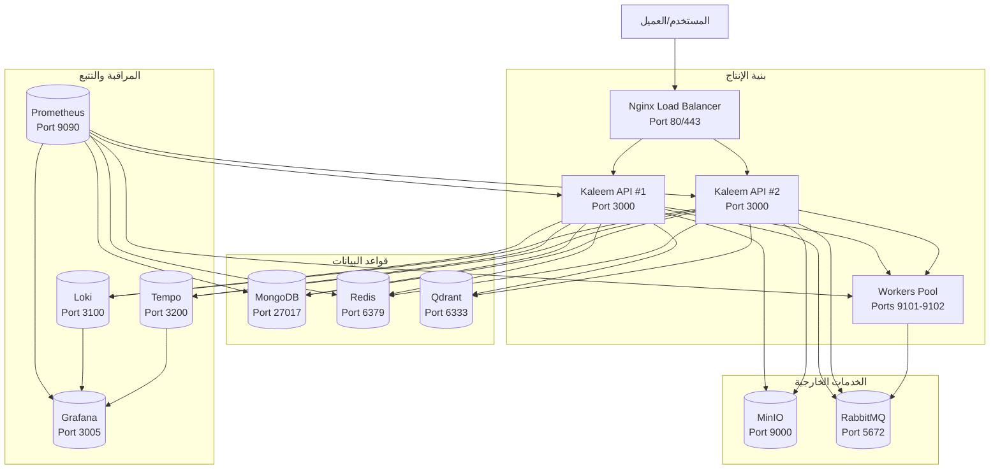
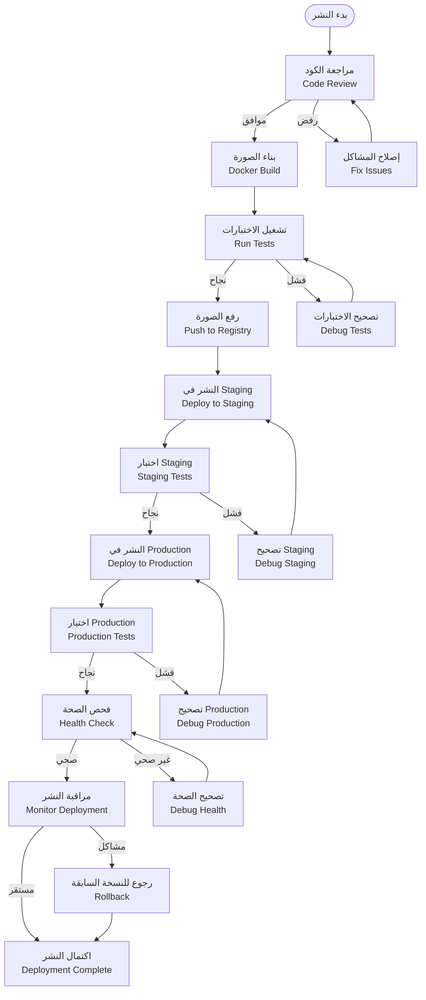
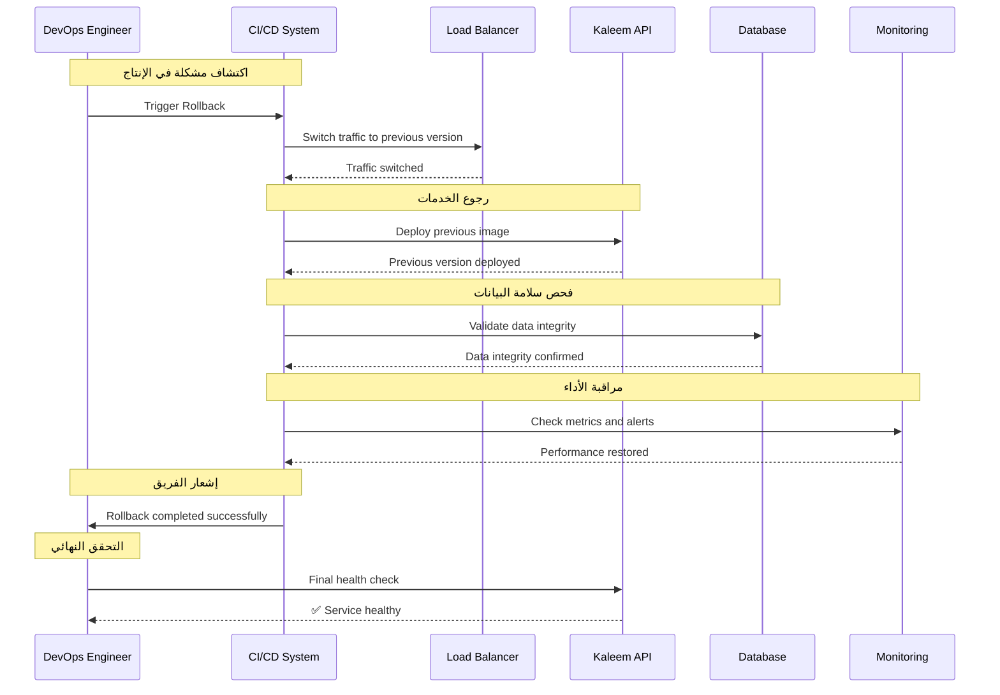
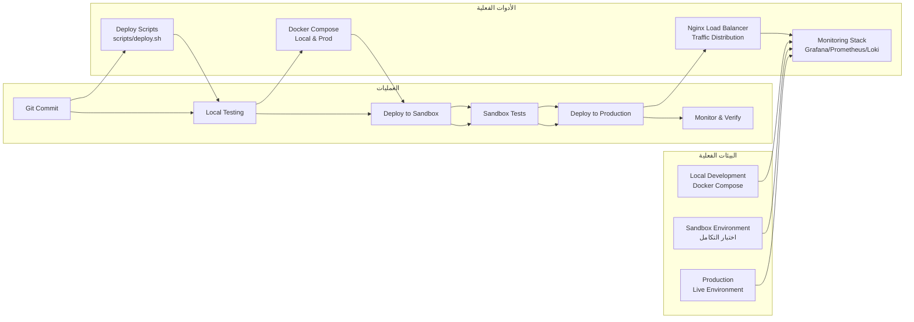

# نظام CI/CD والتشغيل (Docker Compose/Nginx/Secrets/Envs/Staging→Prod) - نظام كليم

## نظرة عامة على النظام

نظام كليم يدعم بنية تحتية متقدمة للنشر والتشغيل مع سكريبت نشر آلي:

- **Docker Compose**: إدارة الحاويات المحلية والإنتاج مع شبكات مخصصة
- **Nginx Load Balancer**: توزيع الطلبات مع DNS داخلي للحاويات الديناميكية
- **Deploy Script**: سكريبت نشر ذكي مع نسخ احتياطي ورجوع تلقائي
- **Environment Variables**: تكوين منظم عبر نظام التكوين في الكود
- **Sandbox Environment**: بيئة اختبار للتكامل والاختبار
- **Health Checks**: فحوصات صحة مع رجوع تلقائي عند الفشل

## 1. مخطط النشر (Deployment Diagram)



## 2. مخطط تدفق النشر (Release Flowchart)



## 3. مخطط رجوع النسخة (Rollback Sequence)



## 4. مخطط البيئات (Environment Diagram)



## 5. تفاصيل تقنية لكل مرحلة

### 5.1 مرحلة النشر المحلي (Development)

#### 5.1.1 Docker Compose للتطوير

```yaml
# docker-compose.yml (الرئيسي)
version: '3.8'
services:
  redis:
    image: redis:6-alpine
    container_name: kaleem-redis
    command: ['redis-server', '/usr/local/etc/redis/redis.conf']
    ports:
      - '6379:6379'
    volumes:
      - redis_data:/data
      - ./redis.conf:/usr/local/etc/redis/redis.conf:ro
    healthcheck:
      test: ['CMD', 'redis-cli', 'ping']
      interval: 10s
      timeout: 5s
      retries: 5
    networks:
      - backnet

  qdrant:
    image: qdrant/qdrant:latest
    container_name: kaleem-qdrant
    restart: always
    ports:
      - '6333:6333'
    volumes:
      - ./qdrant_data:/qdrant/storage
    healthcheck:
      test: ['CMD', 'curl', '-f', 'http://localhost:6333']
      interval: 30s
      timeout: 10s
      retries: 3
    networks:
      - backnet

  embedding:
    build:
      context: ./embedding-service
    container_name: kaleem-embedding
    ports:
      - '8000:8000'
    networks:
      - backnet
    restart: unless-stopped
```

#### 5.1.2 إعداد البيئة المحلية

```bash
# تشغيل البيئة المحلية
docker compose -f docker-compose.dev.yml up -d

# فحص السجلات
docker compose -f docker-compose.dev.yml logs -f api

# تشغيل الاختبارات
npm run test:watch
```

### 5.2 مرحلة النشر في Staging

#### 5.2.1 Pipeline CI/CD

```yaml
# .github/workflows/staging-deploy.yml
name: Deploy to Staging
on:
  push:
    branches: [develop]

jobs:
  test:
    runs-on: ubuntu-latest
    steps:
      - uses: actions/checkout@v3
      - uses: actions/setup-node@v3
        with:
          node-version: '18'
      - run: npm ci
      - run: npm run test
      - run: npm run build

  build:
    needs: test
    runs-on: ubuntu-latest
    steps:
      - uses: actions/checkout@v3
      - name: Build and push Docker image
        uses: docker/build-push-action@v4
        with:
          context: .
          push: true
          tags: kaleem-api:staging-${{ github.sha }}

  deploy:
    needs: build
    runs-on: ubuntu-latest
    environment: staging
    steps:
      - name: Deploy to staging
        run: |
          ssh user@staging-server << 'EOF'
            docker pull kaleem-api:staging-${{ github.sha }}
            docker compose -f docker-compose.staging.yml up -d api
            # Health check
            curl -f http://localhost:3000/api/health
          EOF
```

#### 5.2.2 تكوين Staging

```yaml
# docker-compose.staging.yml
version: '3.8'
services:
  api:
    image: kaleem-api:staging-${GITHUB_SHA}
    environment:
      - NODE_ENV=staging
      - DATABASE_URL=${DATABASE_URL_STAGING}
      - REDIS_URL=${REDIS_URL_STAGING}
    deploy:
      replicas: 2
    healthcheck:
      test: ['CMD', 'curl', '-f', 'http://localhost:3000/api/health']
      interval: 30s
      timeout: 10s
      retries: 3
```

### 5.3 مرحلة النشر في Production

#### 5.3.1 سكريبت النشر في Production

```bash
#!/usr/bin/env bash
# scripts/deploy.sh - سكريبت النشر الفعلي

# إعدادات عامة
COMPOSE_BASE="docker-compose.yml"
COMPOSE_OVERRIDE="docker-compose.image.override.yml"

# متغيّرات مطلوبة
KALEEM_API_IMAGE="${KALEEM_API_IMAGE:?KALEEM_API_IMAGE is required}"
HEALTH_URL="${HEALTH_URL:-http://localhost:8088/api/health}"
BACKUP_DIR="${BACKUP_DIR:-/opt/kaleem/backups}"
MAX_ATTEMPTS="${MAX_ATTEMPTS:-10}"
SLEEP_SECONDS="${SLEEP_SECONDS:-20}"

# دوال مساعدة
log() { printf "[%s] %s\n" "$(date '+%F %T')" "$*"; }
error_exit() { log "ERROR: $*"; exit 1; }

# سحب الصورة الجديدة
log "⬇️  Pulling image: $KALEEM_API_IMAGE"
docker pull "$KALEEM_API_IMAGE"

# التقاط صورة الخدمة الحالية للرجوع
PREV_IMAGE="$(docker compose -f "$COMPOSE_BASE" ps --format json 2>/dev/null \
  | jq -r '.[] | select(.Service=="api") | .Image' || true)"

# نسخ احتياطي لمونغو مع تدوير
BACKUP_NAME="mongo-$(date '+%Y%m%d-%H%M%S').archive.gz"
log "🧰 Mongo backup to: $BACKUP_DIR/$BACKUP_NAME"
docker run --rm --network host \
  -v "$BACKUP_DIR:/backup" \
  mongo:5 bash -lc "mongodump --uri='$MONGODB_URI' --archive=/backup/$BACKUP_NAME --gzip"

# تطبيق الترقية
log "🔄 Updating service: api"
export KALEEM_API_IMAGE
docker compose -f "$COMPOSE_BASE" -f "$COMPOSE_OVERRIDE" up -d --no-deps api

# فحص الصحة مع رجوع تلقائي
log "🩺 Health check: $HEALTH_URL"
ATTEMPT=1
until curl -fsS "$HEALTH_URL" >/dev/null; do
  if (( ATTEMPT >= MAX_ATTEMPTS )); then
    # رجوع للصورة السابقة إن وُجدت
    if [[ -n "$PREV_IMAGE" ]]; then
      log "🔙 Rolling back to previous image: $PREV_IMAGE"
      export KALEEM_API_IMAGE="$PREV_IMAGE"
      docker compose -f "$COMPOSE_BASE" -f "$COMPOSE_OVERRIDE" up -d --no-deps api || true
    fi
    error_exit "Deployment failed"
  fi
  ATTEMPT=$((ATTEMPT+1))
  sleep "$SLEEP_SECONDS"
done
log "✅ Deployment successful"
```

#### 5.3.2 تكوين Production

```yaml
# docker-compose.prod.yml
version: '3.8'
services:
  nginx:
    image: nginx:alpine
    ports:
      - '80:80'
      - '443:443'
    volumes:
      - ./nginx.conf:/etc/nginx/nginx.conf:ro
      - ./ssl:/etc/nginx/ssl:ro
    depends_on:
      - api

  api:
    image: kaleem-api:${IMAGE_TAG:-latest}
    environment:
      - NODE_ENV=production
      - DATABASE_URL=${DATABASE_URL_PROD}
      - REDIS_URL=${REDIS_URL_PROD}
    deploy:
      replicas: 3
    healthcheck:
      test: ['CMD', 'curl', '-f', 'http://localhost:3000/api/health']
      interval: 30s
      timeout: 10s
      retries: 3
      start_period: 40s
```

### 5.4 مرحلة إدارة الأسرار والمتغيرات

#### 5.4.1 نظام الأسرار

```bash
# إنشاء أسرار آمنة
echo "JWT_SECRET=$(openssl rand -hex 32)" > .env
echo "DATABASE_PASSWORD=$(openssl rand -hex 16)" >> .env
echo "REDIS_PASSWORD=$(openssl rand -hex 16)" >> .env

# تشفير الملف
gpg --symmetric --cipher-algo AES256 .env

# في CI/CD
gpg --decrypt --passphrase="$GPG_PASSPHRASE" --output .env .env.gpg
```

#### 5.4.2 متغيرات البيئة حسب البيئة

بناءً على نظام التكوين في الكود:

```typescript
// src/common/config/vars.config.ts
const getChatConfig = () => ({
  n8nEndpoint: process.env.CHAT_N8N_ENDPOINT ?? '/webhook/webhooks/kleem/incoming',
  botName: process.env.CHAT_BOT_NAME ?? 'kleem',
  defaultChannel: process.env.CHAT_DEFAULT_CHANNEL ?? 'webchat',
  typing: {
    stopDelayMs: parseIntWithDefault(
      process.env.CHAT_TYPING_STOP_DELAY_MS,
      CHAT_TYPING_STOP_DELAY_MS_DEFAULT,
    ),
  },
});

const getEmbeddingsConfig = () => ({
  expectedDim: parseIntWithDefault(
    process.env.EMBEDDINGS_EXPECTED_DIM,
    EMBEDDINGS_EXPECTED_DIM_DEFAULT,
  ),
  // ... المزيد من المتغيرات
});

// متغيرات البيئة الرئيسية
NODE_ENV=production
DATABASE_URL=mongodb://mongo:27017/kaleem_prod
REDIS_URL=redis://redis:6379
QDRANT_URL=http://qdrant:6333

// متغيرات الأمان
JWT_SECRET=your-jwt-secret
JWT_ACCESS_TTL=15m
JWT_REFRESH_TTL=7d

// متغيرات الخدمات الخارجية
N8N_BASE_URL=https://your-n8n-instance.com
N8N_WEBHOOK_TOKEN=your-webhook-token
```

### 5.5 مرحلة Nginx Load Balancer

#### 5.5.1 تكوين Nginx Load Balancer

```nginx
# nginx.lb.conf - تكوين Load Balancer الفعلي
worker_processes  auto;

events { worker_connections 1024; }

http {
  resolver 127.0.0.11 ipv6=off;  # DNS الداخلي لدوكر
  upstream api_upstream {
    least_conn;
    # (مهم) resolve عشان يعيد حلّ DNS لو زاد/نقص عدد الحاويات
    server api:3000 resolve;
    keepalive 64;
  }

  server {
    listen 80;

    # health للـ LB نفسه (اختياري)
    location = /lb-health {
      return 200 "ok\n";
      add_header Content-Type text/plain;
    }

    # health يمرر إلى API
    location = /api/health {
      proxy_pass http://api_upstream/api/health;
    }

    location / {
      proxy_http_version 1.1;
      proxy_set_header Connection "";
      proxy_set_header Host $host;
      proxy_set_header X-Forwarded-For $proxy_add_x_forwarded_for;
      proxy_set_header X-Forwarded-Proto $scheme;
      proxy_connect_timeout 5s;
      proxy_read_timeout 60s;
      proxy_pass http://api_upstream;
    }
  }
}
```

#### 5.5.2 فحص صحة Nginx

```bash
# فحص التكوين
nginx -t

# إعادة تحميل التكوين
nginx -s reload

# فحص الإحصائيات
curl http://localhost/nginx_status
```

## 6. مرحلة النسخ الاحتياطي والاستعادة

### 6.1 استراتيجية النسخ الاحتياطي

```bash
# نسخ احتياطي يومي
# MongoDB
mongodump --uri="$DATABASE_URL" --out="/backup/mongodb-$(date +%Y%m%d)"

# Redis
redis-cli SAVE
cp /data/dump.rdb "/backup/redis-$(date +%Y%m%d).rdb"

# MinIO
mc mirror --overwrite local/minio /backup/minio-bucket

# تدوير النسخ (احتفظ بآخر 7 أيام)
find /backup -type f -name "mongodb-*" -mtime +7 -delete
```

### 6.2 إجراءات الاستعادة

```bash
# استعادة MongoDB
mongorestore --uri="$DATABASE_URL" /backup/mongodb-20240101

# استعادة Redis
redis-cli FLUSHALL
redis-cli --pipe < /backup/redis-20240101.rdb

# استعادة MinIO
mc mirror /backup/minio-bucket local/minio --overwrite
```

## 7. مرحلة المراقبة والتنبيهات

### 7.1 مقاييس النشر

```yaml
# prometheus.yml - deployment metrics
- name: deployment_duration_seconds
  type: histogram
  help: 'مدة عمليات النشر'
  labelnames: [environment, service, status]

- name: deployment_success_total
  type: counter
  help: 'إجمالي عمليات النشر الناجحة'
  labelnames: [environment, service]

- name: rollback_total
  type: counter
  help: 'إجمالي عمليات الرجوع'
  labelnames: [environment, service, reason]
```

### 7.2 تنبيهات النشر

```yaml
# alerts/deployment.yml
groups:
  - name: deployment
    rules:
      - alert: DeploymentFailed
        expr: |
          increase(deployment_duration_seconds_count{status="failed"}[10m]) > 0
        for: 0m
        labels:
          severity: critical
        annotations:
          summary: 'فشل في النشر'
          runbook_url: 'https://kb.kaleem-ai.com/runbooks/deployment-failure'

      - alert: LongDeploymentTime
        expr: |
          deployment_duration_seconds{quantile="0.95"} > 300
        for: 5m
        labels:
          severity: warning
        annotations:
          summary: 'زمن النشر طويل'
```

## 8. خطة الاختبار والتحقق

### 8.1 اختبارات النشر

- اختبار Pipeline CI/CD
- اختبار النشر في Staging
- اختبار النشر في Production
- اختبار الرجوع للنسخة السابقة

### 8.2 اختبارات الأداء

- اختبار Load Balancer تحت الحمل
- اختبار أداء قواعد البيانات
- اختبار استهلاك الموارد
- اختبار زمن الاستجابة

### 8.3 اختبارات الأمان

- اختبار إدارة الأسرار
- اختبار تشفير البيانات
- اختبار الوصول المصرح
- اختبار منع الهجمات

### 8.4 اختبارات الاستعادة

- اختبار استعادة قاعدة البيانات
- اختبار استعادة الملفات
- اختبار استعادة التكوين
- اختبار الرجوع الكامل للنظام

---

_تم إنشاء هذا التوثيق بواسطة فريق العمليات في كليم لضمان النشر الآمن والموثوق_
