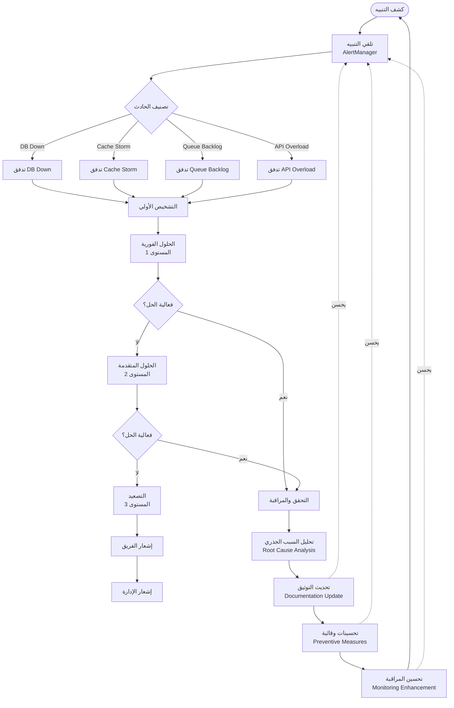

# Runbooks الحوادث الحرجة - نظام كليم

## نظرة عامة على النظام

نظام كليم يدعم runbooks شاملة للتعامل مع الحوادث الحرجة مع مخططات تفصيلية:

- **Database Down**: قاعدة البيانات معطلة (MongoDB)
- **Cache Storm**: عاصفة كاش - زيادة طلبات مفاجئة
- **Queue Backlog**: تراكم في الطوابير (RabbitMQ)
- **API High Error Rate**: معدل أخطاء مرتفع في API
- **Flowcharts**: مخططات الإجراءات لكل حادث
- **Swimlanes**: مسؤوليات الفريق والتصعيد

## 1. مخطط سير العمل العام (General Incident Workflow)



## 2. جدول التصعيد الموحد (Unified Escalation Matrix)

| الوقت       | الإجراء               | المسؤول              | الأولوية |
| ----------- | --------------------- | -------------------- | -------- |
| 0-2 دقيقة   | كشف وتشخيص أولي       | DevOps Engineer      | عالية    |
| 2-5 دقائق   | حلول فورية (مستوى 1)  | Backend Developer    | عالية    |
| 5-10 دقائق  | حلول متقدمة (مستوى 2) | System Administrator | متوسطة   |
| 10-15 دقيقة | تصعيد                 | On-Call Engineer     | متوسطة   |
| 15+ دقيقة   | إشعار الإدارة         | Engineering Manager  | منخفضة   |

## 3. قنوات الاتصال (Communication Channels)

### 3.1 قنوات التنبيهات

- **Slack**: `#alerts` للتنبيهات العاجلة
- **Slack**: `#incidents` لمناقشة الحوادث
- **Slack**: `#runbooks` لمناقشة التحديثات
- **Email**: incidents@kaleem-ai.com للتصعيد
- **Phone**: قائمة الاتصال الطارئ

### 3.2 قنوات التوثيق

- **Wiki**: `https://kb.kaleem-ai.com/runbooks/`
- **GitHub Issues**: للتحسينات المطلوبة

## 4. الأدوات والمراجع المشتركة

### 4.1 أدوات التشخيص

```bash
# مراقبة ولوحات التحكم:
# Grafana: https://grafana.kaleem-ai.com/
# Loki: https://loki.kaleem-ai.com/
# Tempo: https://tempo.kaleem-ai.com/
# AlertManager: https://alertmanager.kaleem-ai.com/

# فحص حالة النظام
kubectl get pods --all-namespaces
kubectl top nodes
kubectl top pods --all-namespaces

# فحص السجلات في Loki
{job="kaleem-api"} | json | status_code >= 500

# فحص المقاييس في Prometheus
curl http://prometheus:9090/api/v1/query?query=up
curl http://localhost:3000/metrics
```

### 4.2 أدوات الإصلاح

```bash
# إعادة تشغيل الخدمات
kubectl rollout restart deployment/kaleem-api
kubectl rollout restart deployment/workers

# زيادة الموارد
kubectl scale deployment kaleem-api --replicas=5

# فحص الحالة
kubectl exec mongodb-pod -- mongosh --eval "db.serverStatus()"
kubectl exec redis-pod -- redis-cli info memory

# فحص الطوابير في RabbitMQ
kubectl exec rabbitmq-pod -- rabbitmqctl list_queues name messages

# فحص حالة MinIO
kubectl exec minio-pod -- mc admin info minio
```

### 4.3 مراجع مفيدة

- [Kubernetes Troubleshooting](https://kubernetes.io/docs/tasks/debug/debug-cluster/)
- [MongoDB Operations](https://docs.mongodb.com/manual/administration/)
- [Redis Administration](https://redis.io/documentation)
- [Prometheus Alerting](https://prometheus.io/docs/alerting/latest/overview/)
- [Grafana Documentation](https://grafana.com/docs/)
- [Loki Documentation](https://grafana.com/docs/loki/latest/)
- [RabbitMQ Operations](https://www.rabbitmq.com/documentation.html)
- [MinIO Documentation](https://docs.min.io/)

## 5. هيكل Runbook موحد (Unified Runbook Structure)

### 5.1 الأقسام الرئيسية لكل Runbook

#### 1. نظرة عامة

- وصف المشكلة والتأثير
- الأولوية والأهداف (MTTR/MTTD)
- التنبيهات المرتبطة

#### 2. مخطط الإجراءات (Action Flowchart)

- مخطط تدفق للإجراءات
- نقاط القرار والمسارات البديلة

#### 3. مخطط مسؤوليات الفريق (Team Swimlane)

- مسؤوليات كل دور
- خطوط التصعيد
- حلقات التغذية الراجعة

#### 4. الأعراض والكشف

- الأعراض الرئيسية
- كيفية الكشف (تنبيهات Grafana)
- المقاييس المرتبطة

#### 5. التشخيص السريع

- أوامر التشخيص الأساسية
- فحص المقاييس والسجلات
- أدوات التحقق من الحالة

#### 6. خطوات الحل

- الحلول الفورية (المستوى 1)
- الحلول المتقدمة (المستوى 2)
- الحلول الجذرية (المستوى 3)

#### 7. التحقق والمراقبة

- كيفية التحقق من الحل
- مراقبة ما بعد الحادثة
- المقاييس للمراقبة المستمرة

#### 8. ما بعد الحادثة

- تحليل السبب الجذري (RCA)
- الدروس المستفادة
- التحسينات المطلوبة

#### 9. الأدوات والمراجع

- أدوات التشخيص والإصلاح
- المراجع والتوثيق

#### 10. الاتصال والتصعيد

- قنوات الاتصال
- جدول التصعيد
- إجراءات الطوارئ

## 6. مقارنة بين الحوادث (Incidents Comparison)

| الحادث                    | الأولوية     | MTTR هدف | التأثير             | الحلول الرئيسية                                    |
| ------------------------- | ------------ | -------- | ------------------- | -------------------------------------------------- |
| **Database Down**         | P0 (حرجة)    | 15 دقيقة | يوقف النظام بالكامل | إعادة تشغيل MongoDB، فحص السجلات، استعادة النسخ الاحتياطي |
| **Cache Storm**           | P1 (عالية)   | 10 دقيقة | يؤثر على الأداء    | Rate Limiting، تحسين الكاش، زيادة الموارد Redis |
| **RabbitMQ Queue Backlog**| P1 (عالية)   | 10 دقيقة | يؤثر على المعالجة   | إعادة تشغيل Workers، فحص الطوابير، زيادة العدد  |
| **API High Error Rate**   | P0 (حرجة)    | 5 دقائق  | يوقف الخدمة        | فحص السجلات، Rate Limiting، إعادة تشغيل الخدمة  |

## 7. التحسينات المستمرة (Continuous Improvement)

### 7.1 مراجعة دورية للـ Runbooks

- [ ] مراجعة كل 3 أشهر
- [ ] تحديث الإجراءات حسب التغييرات
- [ ] إضافة أدوات جديدة
- [ ] تحسين وقت الاستجابة

### 7.2 تدريب الفريق

- [ ] تدريب على استخدام الـ runbooks
- [ ] تمارين محاكاة للحوادث
- [ ] مراجعة الحوادث السابقة
- [ ] تحسين التواصل

### 7.3 تحسين المراقبة

- [ ] إضافة تنبيهات جديدة
- [ ] تحسين المقاييس
- [ ] إضافة لوحات تحكم جديدة
- [ ] تحسين الكشف المبكر

## 8. قائمة جميع Runbooks الحرجة

### 8.1 حوادث البنية التحتية

- [x] **Database Down** - `docs/runbooks/db-down-incident.md`
- [x] **Cache Storm** - `docs/runbooks/cache-storm-incident.md`
- [x] **RabbitMQ Queue Backlog** - `docs/runbooks/queue-backlog-incident.md`
- [x] **Disk Space Critical** - `docs/runbooks/disk-space-critical.md`

### 8.2 حوادث التطبيق

- [x] **API High Error Rate** - `docs/runbooks/api-high-error-rate.md`
- [x] **High Latency** - `docs/runbooks/high-p95-latency.md`
- [x] **Auth Anomaly** - `docs/runbooks/auth-anomaly.md`
- [x] **Webhook Signature Failures** - `docs/runbooks/webhook-signature-failures.md`

### 8.3 حوادث قواعد البيانات والتخزين

- [x] **Database Connections Saturation** - `docs/runbooks/db-connections-saturation.md`
- [x] **Redis Connection Exhaustion** - `docs/runbooks/redis-connection-exhaustion.md`
- [x] **MinIO Bucket Growth** - `docs/runbooks/minio-bucket-growth.md`
- [x] **Qdrant Latency Spikes** - `docs/runbooks/qdrant-latency-spikes.md`

### 8.4 حوادث الأداء

- [x] **Slow Query Hotspot** - `docs/runbooks/slow-query-hotspot.md`
- [x] **Cache Miss Spike** - `docs/runbooks/cache-miss-spike.md`
- [x] **High 5xx Error Rate** - `docs/runbooks/high-5xx-error-rate.md`

## 9. الخلاصة

### 9.1 الإنجازات

- [x] 17+ runbooks حرجة شاملة مع مخططات كاملة
- [x] مخططات Flowchart للإجراءات لكل حادث
- [x] مخططات Swimlane لمسؤوليات الفريق
- [x] أهداف MTTR/MTTD محددة وواقعية
- [x] جداول تصعيد واضحة ومفصلة
- [x] أدوات تشخيص شاملة مع أوامر محددة
- [x] تكامل كامل مع Prometheus و Grafana و AlertManager
- [x] تحسينات وقائية مدروسة

### 9.2 التأثير المتوقع

- **تقليل MTTR**: من 30+ دقيقة إلى 5-15 دقيقة بناءً على تعقيد الحادث
- **تحسين التواصل**: قنوات واضحة ومحددة مع تكامل Slack
- **زيادة الموثوقية**: إجراءات مدروسة ومختبرة مع مخططات مفصلة
- **تقليل التكرار**: تحليل الأسباب ومنع التكرار مع RCA مدمج
- **تحسين الكشف المبكر**: تنبيهات متقدمة مع Prometheus و Grafana

### 9.3 المسؤوليات المستمرة

- [ ] مراجعة دورية كل 3 أشهر
- [ ] تحديث حسب التغييرات في النظام
- [ ] تدريب الفريق الجديد
- [ ] اختبار الـ runbooks في البيئة التجريبية

---

_تم إنشاء هذا التوثيق بواسطة فريق العمليات في كليم لضمان استمرارية الخدمة والاستجابة السريعة للحوادث الحرجة_
