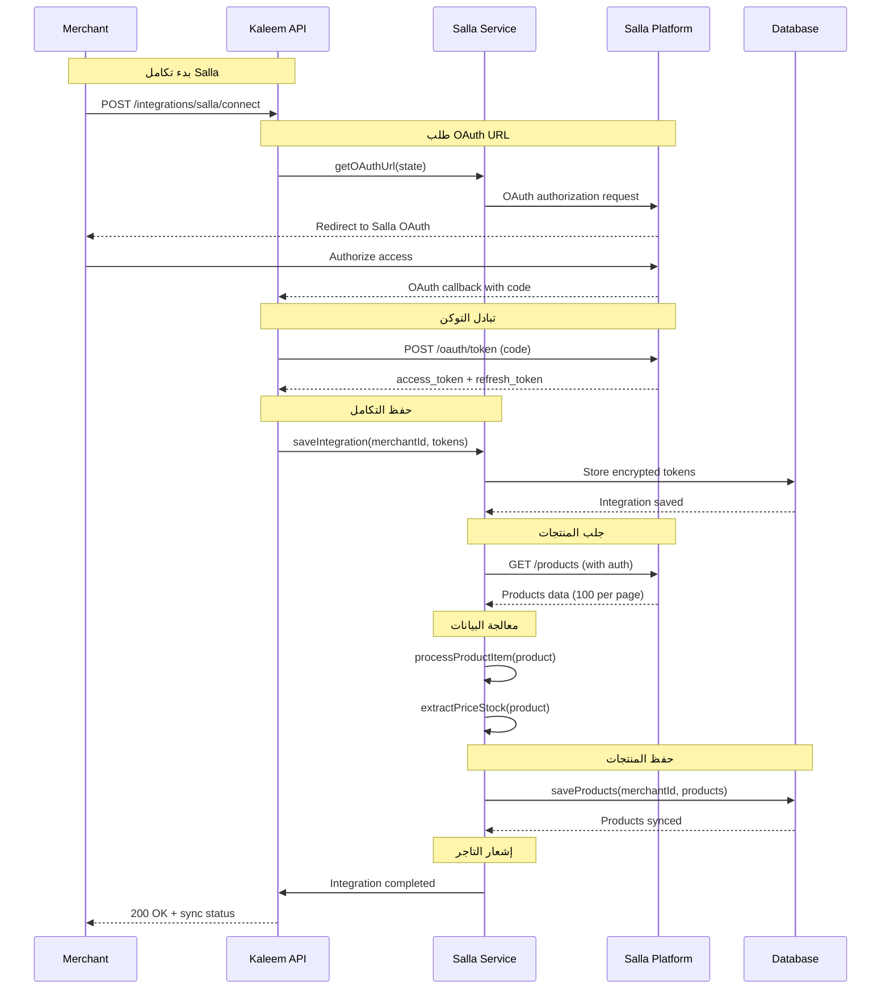
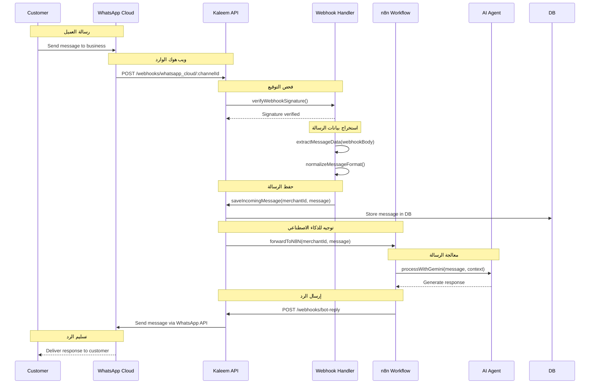
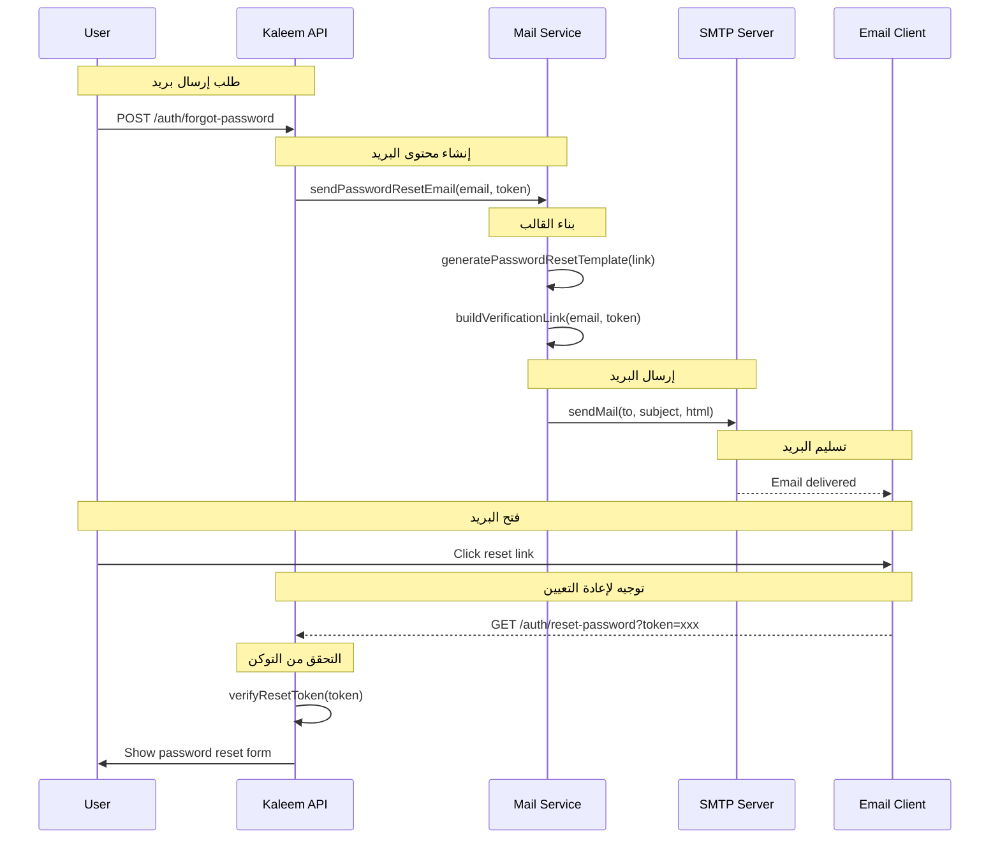
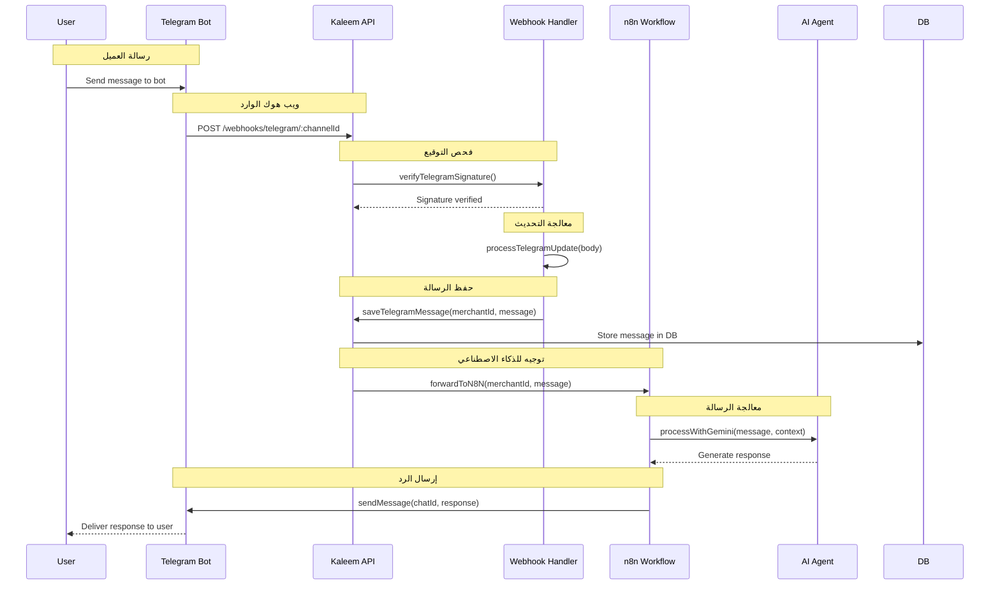
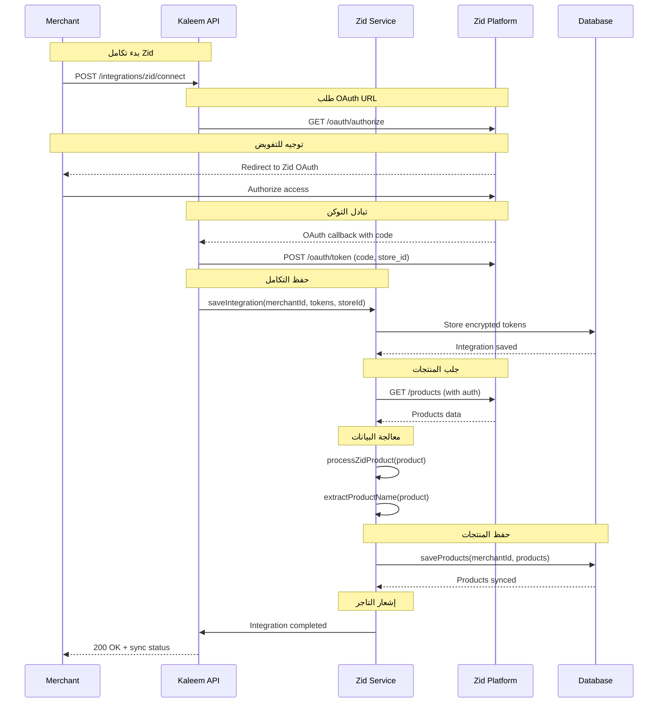
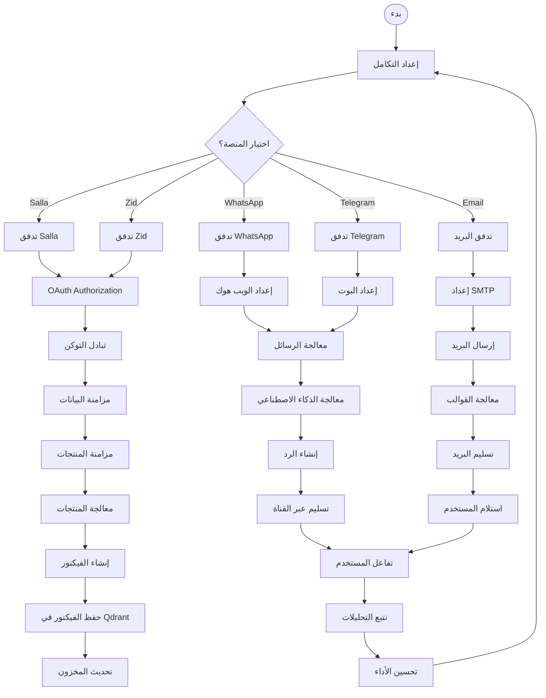

# التكاملات الخارجية - نظام كليم الشامل

## نظرة عامة على النظام

نظام كليم يدعم تكاملات متقدمة مع منصات التجارة الإلكترونية والمراسلة:

- **Salla Integration**: تكامل مع منصة سلا السعودية
- **Zid Integration**: تكامل مع منصة زد السعودية
- **WhatsApp Integration**: تكامل مع واتساب كلاود وويب هوك
- **Telegram Integration**: تكامل مع تيليجرام بوت وويب هوك
- **Email Integration**: نظام إرسال البريد الإلكتروني
- **Webhook Security**: تواقيع آمنة ومنع التكرار

## 1. مخطط التسلسل - Salla Integration (Sequence Diagram)



## 2. مخطط التسلسل - WhatsApp Cloud Integration (Sequence Diagram)



## 3. مخطط التسلسل - Email Integration (Sequence Diagram)



## 4. مخطط التسلسل - Telegram Integration (Sequence Diagram)



## 5. مخطط التسلسل - Zid Integration (Sequence Diagram)



## 6. مخطط سير عمل معالجة المنتجات والفيكتور (Process Flow)

```mermaid
flowchart TD
    A[بدء المزامنة<br/>Salla/Zid API] --> B[جلب المنتجات<br/>fetchProducts()]

    B --> C[حلقة على كل منتج<br/>for each product]

    C --> D[معالجة بيانات المنتج<br/>processProductItem()]

    D --> E[حفظ في قاعدة البيانات<br/>upsertExternal()]

    E --> F[تحويل لشكل Embeddable<br/>toEmbeddable()]

    F --> G[إنشاء الفيكتور<br/>embedText()]

    G --> H[حفظ الفيكتور في Qdrant<br/>upsertProducts()]

    H --> I[تسجيل نجاح المعالجة<br/>log success]

    I --> J{هل يوجد منتجات أخرى؟}

    J -->|نعم| C
    J -->|لا| K[انتهاء المزامنة<br/>sync complete]

    %% تفاصيل تقنية لكل مرحلة
    D -.->|استخراج| L[اسم المنتج<br/>السعر والعملة<br/>المخزون<br/>الصور<br/>الفئة<br/>الحالة]

    E -.->|حفظ| M[Products Collection<br/>MongoDB<br/>تجنب التكرار]

    F -.->|تحويل| N[الحقول الرئيسية:<br/>- mongoId<br/>- merchantId<br/>- name/description<br/>- category<br/>- pricing<br/>- images<br/>- availability]

    G -.->|تضمين| O[نموذج التضمين<br/>تحويل النص لفيكتور<br/>384 بُعد]

    H -.->|تخزين| P[Qdrant Collection<br/>بحث دلالي<br/>ربط بالمنتج الأصلي]
```

## 6. آلية إنشاء الفيكتور للمنتجات المزامنة

### 6.1 مرحلة استخراج البيانات

عند مزامنة المنتجات من Salla أو Zid، يتم استخراج البيانات التالية:

#### **البيانات الأساسية**:
- `externalId`: المعرف الخارجي من المنصة
- `title`: اسم المنتج
- `price`: السعر والعملة
- `stock`: المخزون المتوفر
- `updatedAt`: تاريخ آخر تحديث

#### **البيانات المحسنة**:
- `description`: وصف مفصل للمنتج
- `images`: قائمة الصور
- `category`: الفئة والفئة الفرعية
- `specifications`: المواصفات الفنية
- `keywords`: الكلمات المفتاحية للبحث

### 6.2 مرحلة الحفظ في قاعدة البيانات

```typescript
// في product-sync.service.ts
const docData: Partial<Product> & { externalId: string } = {
  merchantId: mId,
  source: 'api',
  externalId: p.externalId,
  platform: provider,

  name: p.title,
  description: extractDescription(p.raw),
  price: toNumber(p.price, 0),
  isAvailable: toBooleanFromStock(p.stock),
  images: extractImages(p.raw),

  status: STATUS_ACTIVE,
  syncStatus: SYNC_OK,
};
```

### 6.3 مرحلة إنشاء الفيكتور

#### **تحويل البيانات لشكل Embeddable**:
```typescript
// في product.utils.ts - دالة toEmbeddable
const basic = extractBasicFields(doc);
const urls = extractUrlFields(doc, sf);
const content = extractContentFields(doc);
const status = extractStatusFields(doc);
const offer = extractOfferFields(doc);

return {
  ...basic,
  categoryName: categoryName ?? undefined,
  ...urls,
  ...content,
  ...offer,
  ...status,
};
```

#### **الحقول المدرجة في الفيكتور**:

| الحقل | الوصف | المثال |
|--------|--------|--------|
| `mongoId` | معرف المنتج في قاعدة البيانات | `"507f1f77bcf86cd799439011"` |
| `merchantId` | معرف التاجر | `"507f1f77bcf86cd799439012"` |
| `name` | اسم المنتج | `"آيفون 15 برو ماكس"` |
| `description` | وصف مفصل | `"أحدث هواتف آبل مع معالج A17"` |
| `categoryId` | معرف الفئة | `"507f1f77bcf86cd799439013"` |
| `categoryName` | اسم الفئة | `"الهواتف الذكية"` |
| `slug` | الرابط المخصص | `"iphone-15-pro-max"` |
| `storefrontSlug` | رابط المتجر | `"my-store"` |
| `domain` | النطاق المخصص | `"mystore.com"` |
| `specsBlock` | المواصفات الفنية | `["شاشة 6.7 بوصة", "ذاكرة 256GB"]` |
| `keywords` | الكلمات المفتاحية | `["هاتف", "ذكي", "آبل"]` |
| `images` | قائمة الصور | `["https://cdn.com/image1.jpg"]` |
| `price` | السعر الأساسي | `4500.00` |
| `priceEffective` | السعر الفعال | `4200.00` |
| `currency` | العملة | `"SAR"` |
| `hasOffer` | هل يوجد عرض؟ | `true` |
| `priceOld` | السعر القديم | `4500.00` |
| `priceNew` | السعر الجديد | `4200.00` |
| `offerStart` | بداية العرض | `"2024-01-01"` |
| `offerEnd` | نهاية العرض | `"2024-01-31"` |
| `discountPct` | نسبة الخصم | `6.67` |
| `isAvailable` | حالة التوفر | `true` |
| `status` | حالة المنتج | `"active"` |
| `quantity` | الكمية المتوفرة | `50` |

### 6.4 مرحلة حفظ الفيكتور في Qdrant

#### **تقسيم النصوص**:
- النصوص الطويلة تقسم لأجزاء صغيرة (500 حرف)
- كل جزء يحصل على فيكتور منفصل
- ربط كل جزء بالمنتج الأصلي

#### **تخزين الفيكتور**:
```typescript
// في vector.service.ts - دالة upsertProducts
await this.qdrant.upsert(Collections.Products, {
  wait: true,
  points: validPoints.map(point => ({
    id: point.id,
    vector: point.vector,
    payload: point.payload,
  })),
});
```

### 6.5 مرحلة البحث الدلالي

#### **البحث في المنتجات**:
- البحث بالنص الطبيعي في أسماء وأوصاف المنتجات
- ترتيب النتائج حسب التشابه الدلالي
- فلترة بالفئات والأسعار والتوفر

#### **أمثلة على البحث**:
```
"أريد هاتف آبل جديد" → يجد "آيفون 15 برو ماكس"
"لابتوب قوي للألعاب" → يجد لابتوبات الألعاب
"ساعة ذكية رخيصة" → يجد ساعات ذكية بأسعار مناسبة
```

## 7. نظام الفهرسة والفيكتور للمنتجات المزامنة

### 7.1 آلية عمل ProductIndexService

#### **الدالة الرئيسية**:
```typescript
// في product-index.service.ts
async upsert(
  productDoc: unknown,
  storefront?: { slug?: string; domain?: string } | null,
  categoryName?: string | null,
): Promise<void> {
  const src = toEmbeddable(productDoc, storefront, categoryName);
  const ep: VectorEmbeddable = {
    ...src,
    status: typeof src.status === 'string' ? src.status : undefined,
  };

  await this.retry(() => this.vector.upsertProducts([ep]));
}
```

#### **دالة toEmbeddable في product.utils.ts**:

##### **استخراج الحقول الأساسية**:
```typescript
function extractBasicFields(doc: unknown) {
  return {
    id: toIdStr(get(doc, ['_id'])) ?? '',
    merchantId: toIdStr(get(doc, ['merchantId'])) ?? '',
    name: asString(get(doc, ['name'])) ?? undefined,
    description: asString(get(doc, ['description'])) ?? undefined,
    categoryId: toIdStr(get(doc, ['category'])) ?? undefined,
  };
}
```

##### **استخراج حقول الروابط**:
```typescript
function extractUrlFields(doc: unknown, sf?: { slug?: string; domain?: string } | null) {
  return {
    slug: asString(get(doc, ['slug'])) ?? undefined,
    storefrontSlug: sf?.slug ?? asString(get(doc, ['storefrontSlug'])) ?? undefined,
    domain: sf?.domain ?? asString(get(doc, ['storefrontDomain'])) ?? undefined,
    publicUrlStored: asString(get(doc, ['publicUrlStored'])) ?? undefined,
  };
}
```

##### **استخراج حقول المحتوى**:
```typescript
function extractContentFields(doc: unknown) {
  return {
    specsBlock: Array.isArray(get(doc, ['specsBlock'])) ? get(doc, ['specsBlock']) : undefined,
    keywords: Array.isArray(get(doc, ['keywords'])) ? get(doc, ['keywords']) : undefined,
    attributes: isRecord(get(doc, ['attributes'])) ? get(doc, ['attributes']) : undefined,
    images: Array.isArray(get(doc, ['images'])) ? get(doc, ['images']).slice(0, MAX_IMAGES) : undefined,
  };
}
```

##### **استخراج حقول الحالة والتسعير**:
```typescript
function extractStatusFields(doc: unknown) {
  return {
    isAvailable: typeof get(doc, ['isAvailable']) === 'boolean' ? get(doc, ['isAvailable']) : undefined,
    status: get(doc, ['status']) ?? undefined,
    quantity: toNum(get(doc, ['quantity'])) ?? undefined,
  };
}

function extractOfferFields(doc: unknown) {
  const pricing = computePricing(doc);
  return {
    price: pricing.price,
    priceEffective: pricing.effective,
    hasActiveOffer: pricing.hasOffer,
    priceOld: pricing.priceOld,
    priceNew: pricing.priceNew,
    offerStart: get(doc, ['offer', 'startAt']) ?? undefined,
    offerEnd: get(doc, ['offer', 'endAt']) ?? undefined,
    discountPct: pricing.discountPct,
  };
}
```

### 7.2 آلية عمل VectorService للمنتجات

#### **دالة upsertProducts**:
```typescript
// في vector.service.ts
public async upsertProducts(products: EmbeddableProduct[]): Promise<void> {
  if (!Array.isArray(products) || products.length === 0) return;

  const valid = products.filter((p) => Boolean(p?.id && p?.name));
  if (valid.length !== products.length) {
    this.logger.warn(`Filtered out ${products.length - valid.length} invalid products`);
  }

  // تقسيم إلى دفعات صغيرة لتجنب الحمل الزائد
  const batchSize = DEFAULT_BATCH_PRODUCTS;
  for (let i = 0; i < valid.length; i += batchSize) {
    const batch = valid.slice(i, i + batchSize);

    const validPoints = await Promise.all(
      batch.map(async (p) => {
        try {
          const vector = await this.embedText(this.buildProductText(p));
          return {
            id: `${p.id}`,
            vector,
            payload: p,
          };
        } catch (e) {
          this.logger.warn(`Failed to embed product ${p.id}: ${e}`);
          return null;
        }
      }),
    ).then((points) => points.filter(Boolean));

    await this.qdrant.upsert(Collections.Products, {
      wait: true,
      points: validPoints,
    });
  }
}
```

#### **دالة buildProductText لبناء نص البحث**:
```typescript
private buildProductText(p: EmbeddableProduct): string {
  const parts = [
    p.name,
    p.description,
    p.categoryName,
    p.specsBlock?.join(' '),
    p.keywords?.join(' '),
    p.attributes ? Object.values(p.attributes).flat().join(' ') : '',
  ].filter(Boolean);

  return parts.join(' ').trim();
}
```

### 7.3 نظام Qdrant لتخزين الفيكتور

#### **هيكل النقطة في Qdrant**:
```typescript
{
  id: "507f1f77bcf86cd799439011",
  vector: [0.123, 0.456, ...], // 384 بُعد
  payload: {
    mongoId: "507f1f77bcf86cd799439011",
    merchantId: "507f1f77bcf86cd799439012",
    name: "آيفون 15 برو ماكس",
    description: "أحدث هواتف آبل مع معالج A17",
    categoryName: "الهواتف الذكية",
    price: 4500,
    currency: "SAR",
    isAvailable: true,
    // ... باقي الحقول
  }
}
```

#### **البحث الدلالي**:
```typescript
// مثال على بحث دلالي
const results = await this.qdrant.search(Collections.Products, {
  vector: await this.embedText("هاتف آبل جديد"),
  filter: {
    must: [
      { key: "isAvailable", match: { value: true } },
      { key: "status", match: { value: "active" } }
    ]
  },
  limit: 10,
  score_threshold: 0.7
});
```

## 8. تفاصيل تقنية محدثة للتكاملات مع الفيكتور

### 8.1 تكامل Salla مع الفيكتور

#### **تدفق المعالجة الكامل**:
```
Salla API → fetchSallaProducts() → processProductItem() →
upsertExternal() → toEmbeddable() → embedText() → upsertProducts() → Qdrant
```

#### **معالجة البيانات الخاصة بـ Salla**:
```typescript
// استخراج البيانات من Salla API
private processProductItem(item: unknown): ExternalProduct {
  const obj = item as Record<string, unknown>;
  const id = obj['id'] ?? obj['product_id'];
  const titleRaw = obj['name'] ?? obj['title'];

  return {
    externalId: String(id),
    title: typeof titleRaw === 'string' ? titleRaw : '',
    price: this.extractProductPrice(obj).price,
    currency: this.extractProductPrice(obj).currency,
    stock: this.extractProductStock(obj),
    updatedAt: toDateOrNull(obj['updated_at'] ?? obj['updatedAt']),
    raw: item, // البيانات الكاملة للمعالجة اللاحقة
  };
}
```

#### **تكامل مع نظام الفيكتور**:
- يتم استدعاء `ProductIndexService.upsert()` تلقائياً بعد الحفظ
- يتم تحويل البيانات لشكل Embeddable باستخدام `toEmbeddable()`
- يتم إنشاء الفيكتور وتخزينه في Qdrant فوراً

### 8.2 تكامل Zid مع الفيكتور

#### **تدفق المعالجة الكامل**:
```
Zid API → fetchZidProducts() → processZidProduct() →
upsertExternal() → toEmbeddable() → embedText() → upsertProducts() → Qdrant
```

#### **معالجة البيانات الخاصة بـ Zid**:
```typescript
// استخراج البيانات من Zid API
private processZidProduct(item: unknown): ExternalProduct {
  const obj = item as Record<string, unknown>;
  const name = this.extractProductName(obj);

  return {
    externalId: String(obj.id),
    title: name,
    price: typeof obj.price === 'number' ? obj.price : null,
    currency: typeof obj.currency === 'string' ? obj.currency : undefined,
    stock: typeof obj.quantity === 'number' ? obj.quantity : null,
    updatedAt: obj.updated_at ? new Date(obj.updated_at as string) : null,
    raw: item, // البيانات الكاملة للمعالجة اللاحقة
  };
}
```

#### **تكامل مع نظام الفيكتور**:
- نفس نظام Salla بالضبط
- يستخدم نفس `ProductIndexService` و `VectorService`
- يدعم جميع الحقول نفسها في الفيكتور

### 8.3 تكامل WhatsApp Cloud مع الفيكتور

#### **البحث في المنتجات عبر WhatsApp**:
- العميل يرسل رسالة نصية عن منتج معين
- النظام يبحث في الفيكتور عن المنتجات المتشابهة
- يعرض نتائج البحث مع الصور والأسعار

#### **تدفق البحث**:
```
رسالة العميل → معالجة الرسالة → بحث دلالي في Qdrant →
إرجاع المنتجات المتشابهة → إرسال الرد مع الصور والروابط
```

### 8.4 تكامل Telegram مع الفيكتور

#### **نفس نظام WhatsApp**:
- يستخدم نفس آلية البحث الدلالي
- يدعم نفس أنواع الاستفسارات
- يعرض النتائج بنفس التنسيق

### 8.5 تكامل البريد الإلكتروني مع الفيكتور

#### **البحث عن المنتجات عبر البريد**:
- المستخدم يرسل بريد يسأل عن منتج
- النظام يبحث في الفيكتور ويرد بالمنتجات المناسبة
- يرسل الرد مع روابط المنتجات والصور

## 9. مخطط سير العمل التجاري (BPMN) - مسارات الأعمال الحرجة



## 10. تفاصيل تقنية لكل تكامل

### 10.1 تكامل Salla

#### 10.1.1 OAuth Flow

```typescript
// src/modules/integrations/salla/salla.service.ts
getOAuthUrl(state: string): string {
  const clientId = this.config.get<string>('SALLA_CLIENT_ID')!;
  const redirectUri = this.config.get<string>('SALLA_REDIRECT_URI')!;
  const scope = this.config.get<string>('SALLA_SCOPE') || 'offline_access';

  const params = new URLSearchParams({
    client_id: clientId,
    redirect_uri: redirectUri,
    response_type: 'code',
    scope,
    state,
  });

  return `https://accounts.salla.sa/oauth/authorize?${params.toString()}`;
}

async exchangeCodeForTokens(code: string, state: string): Promise<SallaTokenResponse> {
  const response = await firstValueFrom(
    this.http.post<SallaTokenResponse>(
      'https://accounts.salla.sa/oauth/token',
      {
        grant_type: 'authorization_code',
        client_id: this.config.get<string>('SALLA_CLIENT_ID'),
        client_secret: this.config.get<string>('SALLA_CLIENT_SECRET'),
        redirect_uri: this.config.get<string>('SALLA_REDIRECT_URI'),
        code,
      },
      {
        headers: {
          'Content-Type': 'application/x-www-form-urlencoded',
          Accept: 'application/json',
        },
      }
    )
  );

  return response;
}
```

#### 10.1.2 مزامنة المنتجات

```typescript
async syncProducts(merchantId: string): Promise<void> {
  const integration = await this.integrations.findSallaByMerchant(merchantId);
  if (!integration) throw new Error('Salla integration not found');

  const accessToken = await this.ensureValidToken(integration);
  const authorizationHeader = `Bearer ${accessToken}`;

  let page = 1;
  let hasMore = true;

  while (hasMore) {
    const response = await firstValueFrom(
      this.http.get<SallaProductsResponse>(
        `https://api.salla.sa/v1/products?page=${page}`,
        {
          headers: { Authorization: authorizationHeader },
        }
      )
    );

    const products = response.data?.data?.products || [];
    if (products.length > 0) {
      const processedProducts = products.map(item => this.processProductItem(item));
      await this.saveProductsToDB(merchantId, processedProducts);
    }

    hasMore = !!response.data?.links?.next;
    page++;
  }
}
```

### 10.2 تكامل WhatsApp Cloud

#### 10.2.1 معالجة الويب هوك

```typescript
// src/modules/webhooks/whatsapp-cloud.webhook.controller.ts
async incoming(
  @Param('channelId') channelId: string,
  @Req() req: RequestWithWebhookData,
  @Body() body: WhatsAppCloudDto,
): Promise<void> {
  const merchantId = String(req.merchantId);

  // استخراج بيانات الرسالة
  const messageData = this.extractMessageData(body);
  if (!messageData) return;

  // منع التكرار
  const messageId = this.extractMessageId(body);
  const isDuplicate = await this.checkIdempotency(channelId, merchantId, messageId);

  if (isDuplicate) {
    this.logger.log(`Duplicate message ignored: ${messageId}`);
    return;
  }

  // حفظ الرسالة
  await this.webhooksController.handleIncomingMessage(
    merchantId,
    channelId,
    messageData,
    'whatsapp_cloud'
  );
}
```

#### 10.2.2 إرسال الردود

```typescript
// src/modules/channels/whatsapp-cloud.service.ts
async sendMessage(
  channelId: string,
  to: string,
  message: string,
  messageType: 'text' | 'template' = 'text'
): Promise<void> {
  const channel = await this.getChannelById(channelId);
  const accessToken = await this.getValidAccessToken(channel);

  const payload = {
    messaging_product: 'whatsapp',
    recipient_type: 'individual',
    to,
    type: 'text',
    text: { body: message },
  };

  await firstValueFrom(
    this.http.post(
      `https://graph.facebook.com/v18.0/${channel.externalId}/messages`,
      payload,
      {
        headers: {
          Authorization: `Bearer ${accessToken}`,
          'Content-Type': 'application/json',
        },
      }
    )
  );
}
```

### 10.3 تكامل Telegram

#### 10.3.1 معالجة التحديثات

```typescript
// src/modules/webhooks/telegram.webhook.controller.ts
async incoming(
  @Param('channelId') channelId: string,
  @Req() req: RequestWithWebhookData,
  @Body() body: TelegramUpdateDto,
): Promise<void> {
  const merchantId = String(req.merchantId);

  // استخراج التحديث
  const update = this.extractUpdateData(body);
  if (!update) return;

  // منع التكرار
  const isDuplicate = await this.checkIdempotency(channelId, merchantId, update.updateId);

  if (isDuplicate) {
    this.logger.log(`Duplicate update ignored: ${update.updateId}`);
    return;
  }

  // معالجة الرسالة
  await this.webhooksController.handleIncomingMessage(
    merchantId,
    channelId,
    update.message,
    'telegram'
  );
}
```

#### 10.3.2 إرسال الردود

```typescript
// src/modules/channels/telegram.service.ts
async sendMessage(
  botToken: string,
  chatId: string | number,
  message: string,
  replyToMessageId?: number
): Promise<void> {
  const payload: any = {
    chat_id: chatId,
    text: message,
    parse_mode: 'HTML',
  };

  if (replyToMessageId) {
    payload.reply_to_message_id = replyToMessageId;
  }

  await firstValueFrom(
    this.http.post(
      `https://api.telegram.org/bot${botToken}/sendMessage`,
      payload
    )
  );
}
```

### 10.4 تكامل البريد الإلكتروني

#### 10.4.1 إرسال البريد

```typescript
// src/modules/mail/mail.service.ts
async sendVerificationEmail(email: string, code: string): Promise<void> {
  const link = this.buildVerificationLink(email, code);
  const html = this.generateVerificationTemplate(code, link);

  await this.transporter.sendMail({
    from: this.mailFrom,
    to: email,
    subject: 'تفعيل حسابك على منصة كليم',
    html,
  });

  this.logger.log(`Verification email sent to ${email}`);
}
```

#### 10.4.2 قوالب البريد

```typescript
private generateVerificationTemplate(code: string, link: string): string {
  return `
    <!DOCTYPE html>
    <html dir="rtl" lang="ar">
    <head>
      <meta charset="UTF-8">
      <meta name="viewport" content="width=device-width, initial-scale=1.0">
      <title>تفعيل الحساب</title>
    </head>
    <body style="font-family: Arial, sans-serif; direction: rtl;">
      <div style="max-width: 600px; margin: 0 auto; padding: 20px;">
        <h1 style="color: #333;">مرحباً بك في كليم</h1>
        <p>شكراً لتسجيلك معنا. لتفعيل حسابك، يرجى استخدام الرمز التالي:</p>
        <div style="background: #f5f5f5; padding: 20px; text-align: center; margin: 20px 0;">
          <h2 style="margin: 0; color: #333;">${code}</h2>
        </div>
        <p>أو يمكنك النقر على الرابط التالي:</p>
        <a href="${link}" style="background: #007bff; color: white; padding: 10px 20px; text-decoration: none; border-radius: 5px;">تفعيل الحساب</a>
      </div>
    </body>
    </html>
  `;
}
```

## 11. معايير الأمان والحماية

### 11.1 تواقيع الويب هوك

```typescript
// src/common/guards/webhook-signature.guard.ts
export class WebhookSignatureGuard implements CanActivate {
  async canActivate(context: ExecutionContext): Promise<boolean> {
    const request = context.switchToHttp().getRequest();
    const signature = request.headers['x-hub-signature-256'];
    const body = JSON.stringify(request.body);

    if (!signature) {
      throw new ForbiddenException('Missing signature');
    }

    const expectedSignature = this.generateSignature(body, secret);
    return signature === expectedSignature;
  }

  private generateSignature(payload: string, secret: string): string {
    return `sha256=${crypto.createHmac('sha256', secret).update(payload).digest('hex')}`;
  }
}
```

### 11.2 منع التكرار

```typescript
// src/common/utils/idempotency.util.ts
export async function preventDuplicates(
  cache: Cache,
  key: string,
  ttlSeconds: number = 3600,
): Promise<boolean> {
  const exists = await cache.get(key);
  if (exists) {
    return true; // Duplicate detected
  }

  await cache.set(key, true, ttlSeconds);
  return false; // Not a duplicate
}
```

### 11.3 تشفير التوكنات

```typescript
// src/modules/integrations/utils/encryption.util.ts
export class TokenEncryptionService {
  async encryptToken(token: string): Promise<string> {
    const algorithm = 'aes-256-gcm';
    const key = crypto.randomBytes(32);
    const iv = crypto.randomBytes(16);

    const cipher = crypto.createCipher(algorithm, key);
    cipher.setAAD(Buffer.from('token-metadata'));

    let encrypted = Buffer.concat([
      cipher.update(token, 'utf8'),
      cipher.final(),
    ]);

    const authTag = cipher.getAuthTag();
    const encryptedToken = Buffer.concat([key, iv, authTag, encrypted]);

    return encryptedToken.toString('base64');
  }

  async decryptToken(encryptedToken: string): Promise<string> {
    const buffer = Buffer.from(encryptedToken, 'base64');
    const key = buffer.subarray(0, 32);
    const iv = buffer.subarray(32, 48);
    const authTag = buffer.subarray(48, 64);
    const encrypted = buffer.subarray(64);

    const decipher = crypto.createDecipher('aes-256-gcm', key);
    decipher.setAuthTag(authTag);
    decipher.setAAD(Buffer.from('token-metadata'));

    return Buffer.concat([
      decipher.update(encrypted),
      decipher.final(),
    ]).toString('utf8');
  }
}
```

## 12. مراقبة الأداء والأمان

### 12.1 مقاييس التكاملات

```yaml
# prometheus.yml - مقاييس التكاملات
- name: integration_sync_total
  type: counter
  help: 'إجمالي عمليات المزامنة'
  labelnames: [platform, sync_type, status]

- name: webhook_processing_duration_seconds
  type: histogram
  help: 'زمن معالجة الويب هوك'
  labelnames: [platform, channel_id]

- name: email_delivery_total
  type: counter
  help: 'إجمالي عمليات إرسال البريد'
  labelnames: [template_type, status]

- name: oauth_token_refresh_total
  type: counter
  help: 'إجمالي عمليات تجديد التوكن'
  labelnames: [platform, status]
```

### 12.2 تنبيهات التكاملات

```yaml
# alerts/integrations.yml
groups:
  - name: integrations
    rules:
      - alert: SallaSyncFailure
        expr: |
          increase(integration_sync_total{platform="salla",status="failed"}[5m]) > 3
        for: 5m
        labels:
          severity: warning
        annotations:
          summary: 'فشل مزامنة Salla'
          runbook_url: 'https://kb.kaleem-ai.com/runbooks/salla-sync-failure'

      - alert: WebhookSignatureFailures
        expr: |
          increase(webhook_processing_duration_seconds_count{channel_id=~".*"}[5m]) > 10
        for: 5m
        labels:
          severity: critical
        annotations:
          summary: 'فشل تواقيع الويب هوك'
          runbook_url: 'https://kb.kaleem-ai.com/runbooks/webhook-signature-failures'
```

## 13. خطة الاختبار والتحقق

### 13.1 اختبارات التكاملات

- اختبار OAuth flow لكل منصة
- اختبار مزامنة البيانات
- اختبار معالجة الويب هوك
- اختبار إرسال الرسائل والبريد

### 13.2 اختبارات الأمان

- اختبار فحص تواقيع الويب هوك
- اختبار منع التكرار
- اختبار تشفير التوكنات
- اختبار معالجة الأخطاء

### 13.3 اختبارات الأداء

- اختبار أداء مزامنة المنتجات
- اختبار أداء معالجة الرسائل
- اختبار أداء إرسال البريد
- اختبار استهلاك الموارد

### 13.4 اختبارات التكامل

- اختبار تكامل مع Salla API
- اختبار تكامل مع Zid API
- اختبار تكامل مع WhatsApp Cloud API
- اختبار تكامل مع Telegram Bot API
- اختبار تكامل مع SMTP servers

---

_تم إنشاء هذا التوثيق بواسطة نظام كليم لإدارة المتاجر الذكية_
