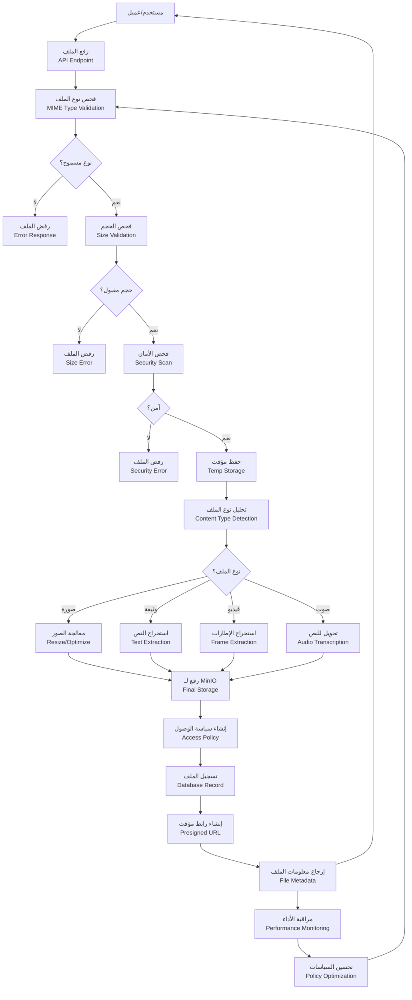
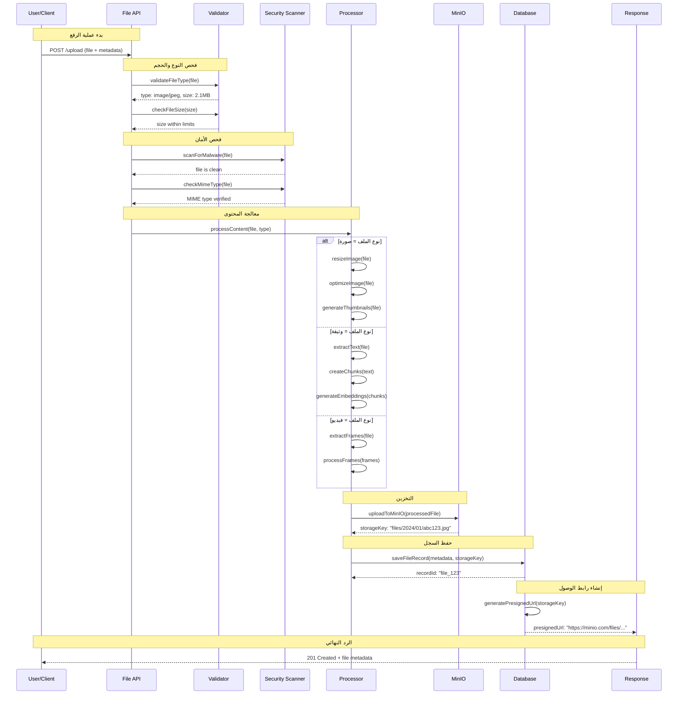
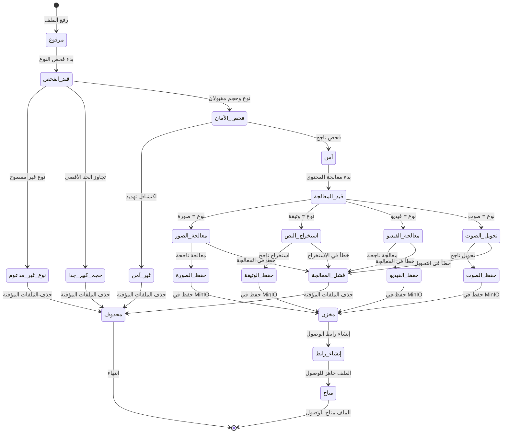

# إدارة الملفات والوسائط (MinIO) + فحص النوع + سياسات الوصول - نظام كليم

## نظرة عامة على النظام

نظام كليم يدعم إدارة متقدمة للملفات والوسائط مع MinIO للتخزين المركزي:

- **MinIO Integration**: تخزين موزع وموثوق للملفات
- **File Type Validation**: فحص أنواع الملفات المسموحة
- **Security Scanning**: فحص الأمان للملفات المرفوعة
- **Access Control**: سياسات وصول متقدمة للملفات
- **Media Processing**: معالجة الوسائط (صور، فيديو، وثائق)
- **Content Extraction**: استخراج النصوص من الملفات

## 1. مخطط تدفق البيانات (Data Flow Diagram)



## 2. مخطط التسلسل - Upload→Scan→Store (Sequence Diagram)



## 3. آلة الحالات - حالة الملف (State Machine)



### تعريف الحالات

| الحالة           | الوصف                 | الإجراءات المسموحة             |
| ---------------- | --------------------- | ------------------------------ |
| `مرفوع`          | تم رفع الملف مؤقتاً   | فحص النوع والحجم               |
| `قيد_الفحص`      | فحص نوع وحجم الملف    | التحقق من الامتداد والـ MIME   |
| `نوع_غير_مدعوم`  | نوع الملف غير مسموح   | رفض الملف وحذف المؤقت          |
| `حجم_كبير_جدا`   | حجم الملف تجاوز الحد  | رفض الملف وحذف المؤقت          |
| `فحص_الأمان`     | فحص الأمان والفيروسات | فحص المحتوى بحثاً عن التهديدات |
| `غير_آمن`        | تم اكتشاف تهديد أمني  | رفض الملف وحذف المؤقت          |
| `آمن`            | الملف آمن ومقبول      | بدء معالجة المحتوى             |
| `قيد_المعالجة`   | معالجة محتوى الملف    | تحليل حسب النوع                |
| `معالجة_الصور`   | معالجة ملف صورة       | تغيير الحجم وتحسين الجودة      |
| `استخراج_النص`   | استخراج النص من وثيقة | تحويل PDF/Word إلى نص          |
| `معالجة_الفيديو` | معالجة ملف فيديو      | استخراج إطارات ومعلومات        |
| `تحويل_الصوت`    | تحويل صوت للنص        | استخدام OCR أو TTS             |
| `حفظ_الصورة`     | حفظ الصورة المعالجة   | رفع لـ MinIO                   |
| `حفظ_الوثيقة`    | حفظ الوثيقة المعالجة  | رفع لـ MinIO                   |
| `حفظ_الفيديو`    | حفظ الفيديو المعالج   | رفع لـ MinIO                   |
| `حفظ_الصوت`      | حفظ الصوت المعالج     | رفع لـ MinIO                   |
| `مخزن`           | تم حفظ الملف في MinIO | إنشاء سياسة الوصول             |
| `إنشاء_رابط`     | إنشاء رابط الوصول     | إنشاء presigned URL            |
| `متاح`           | الملف متاح للوصول     | تقديم الخدمة                   |
| `محذوف`          | تم حذف الملف والمؤقت  | تنظيف الموارد                  |
| `فشل_المعالجة`   | فشل في معالجة الملف   | حذف المؤقت وتسجيل الخطأ        |

## 4. تفاصيل تقنية لكل مرحلة

### 4.1 مرحلة فحص النوع والحجم

#### 4.1.1 فحص أنواع الملفات المسموحة

```typescript
// src/common/validators/file-type.validator.ts
export class FileTypeValidator {
  private readonly allowedTypes: string[];

  constructor(allowedTypes: string[]) {
    this.allowedTypes = allowedTypes;
  }

  validate(file: Express.Multer.File): boolean {
    const fileType = file.mimetype;
    const fileExt = path.extname(file.originalname).toLowerCase();

    // فحص MIME type
    const mimeValid = this.allowedTypes.some(type =>
      fileType.includes(type) || fileType === type
    );

    // فحص الامتداد
    const extValid = this.allowedTypes.some(type =>
      fileExt.includes(type.replace('/', '.')) ||
      fileExt === `.${type.split('/')[1]}`
    );

    return mimeValid && extValid;
  }
}

// استخدام في controller
@Post('upload')
@UseInterceptors(FileInterceptor('file'))
async upload(
  @UploadedFile(
    new ParseFilePipe({
      validators: [
        new MaxFileSizeValidator({ maxSize: 10 * 1024 * 1024 }), // 10MB
        new FileTypeValidator([
          'image/jpeg',
          'image/png',
          'image/gif',
          'application/pdf',
          'application/msword',
          'application/vnd.openxmlformats-officedocument.wordprocessingml.document'
        ]),
      ],
    }),
  )
  file: Express.Multer.File,
) {
  // معالجة الملف
}
```

#### 4.1.2 فحص الحجم

```typescript
export class FileSizeValidator {
  private readonly maxSize: number;

  constructor(maxSize: number) {
    this.maxSize = maxSize;
  }

  validate(file: Express.Multer.File): boolean {
    return file.size <= this.maxSize;
  }

  getErrorMessage(): string {
    const maxSizeMB = this.maxSize / (1024 * 1024);
    return `حجم الملف يجب أن يكون أقل من ${maxSizeMB}MB`;
  }
}
```

### 4.2 مرحلة فحص الأمان

#### 4.2.1 فحص الفيروسات والمالوير

```typescript
export class SecurityScanner {
  async scanForMalware(file: Express.Multer.File): Promise<boolean> {
    // 1. فحص التوقيعات المعروفة
    const signatureScan = await this.signatureScan(file.buffer);
    if (!signatureScan.safe) {
      return false;
    }

    // 2. فحص السلوك الضار
    const behaviorScan = await this.behavioralScan(file.buffer);
    if (!behaviorScan.safe) {
      return false;
    }

    // 3. فحص المحتوى المشبوه
    const contentScan = await this.contentScan(file);
    return contentScan.safe;
  }

  private async signatureScan(buffer: Buffer): Promise<ScanResult> {
    // فحص ضد قاعدة بيانات التوقيعات
    const signatures = await this.loadMalwareSignatures();
    for (const signature of signatures) {
      if (buffer.includes(signature)) {
        return { safe: false, threat: 'malware_signature' };
      }
    }
    return { safe: true };
  }

  private async behavioralScan(buffer: Buffer): Promise<ScanResult> {
    // فحص السلوك المشبوه (مثل محاولات التنفيذ)
    const suspiciousPatterns = [
      /exec\(/gi,
      /eval\(/gi,
      /system\(/gi,
      /shell_exec\(/gi,
    ];

    const content = buffer.toString('utf8');
    for (const pattern of suspiciousPatterns) {
      if (pattern.test(content)) {
        return { safe: false, threat: 'suspicious_behavior' };
      }
    }
    return { safe: true };
  }
}
```

#### 4.2.2 فحص نوع الملف الفعلي

```typescript
// في DocumentsController - فحص النوع والحجم
@UseInterceptors(FileInterceptor('file'))
async upload(
  @UploadedFile(
    new ParseFilePipe({
      validators: [
        new MaxFileSizeValidator({ maxSize: MAX_FILE_SIZE_BYTES }),
        new FileTypeValidator({
          fileType:
            /(pdf|msword|vnd\.openxmlformats-officedocument\.wordprocessingml\.document|jpeg|png)$/,
        }),
      ],
    }),
  )
  file: Express.Multer.File & { key?: string },
): Promise<{ success: true; data: DocumentSchemaClass }> {
  // فحص إضافي للنوع الفعلي في الخدمة
  const actualType = this.detectActualFileType(file.buffer);
  if (actualType !== file.mimetype) {
    throw new BadRequestException('نوع الملف المعلن لا يطابق النوع الفعلي');
  }

  return this.svc.uploadFile(merchantId, file);
}

private detectActualFileType(buffer: Buffer): string {
  // فحص التوقيعات السحرية (magic numbers)
  if (buffer.length < 4) return 'unknown';

  const header = buffer.subarray(0, 4);

  // صور JPEG
  if (header[0] === 0xff && header[1] === 0xd8 && header[2] === 0xff) {
    return 'image/jpeg';
  }

  // صور PNG
  if (
    header[0] === 0x89 &&
    header[1] === 0x50 &&
    header[2] === 0x4e &&
    header[3] === 0x47
  ) {
    return 'image/png';
  }

  // PDF
  if (
    header[0] === 0x25 &&
    header[1] === 0x50 &&
    header[2] === 0x44 &&
    header[3] === 0x46
  ) {
    return 'application/pdf';
  }

  // DOCX (ZIP header)
  if (
    header[0] === 0x50 &&
    header[1] === 0x4b &&
    header[2] === 0x03 &&
    header[3] === 0x04
  ) {
    return 'application/vnd.openxmlformats-officedocument.wordprocessingml.document';
  }

  return 'unknown';
}
```

### 4.3 مرحلة معالجة المحتوى

#### 4.3.1 معالجة الصور

```typescript
export class ImageProcessor {
  async processImage(file: Express.Multer.File): Promise<ProcessedImage> {
    const sharp = require('sharp');
    const buffer = file.buffer;

    // 1. قراءة معلومات الصورة
    const metadata = await sharp(buffer).metadata();

    // 2. تغيير الحجم إذا لزم الأمر
    let processedBuffer = buffer;
    if (metadata.width > 2000 || metadata.height > 2000) {
      processedBuffer = await sharp(buffer)
        .resize(2000, 2000, { fit: 'inside', withoutEnlargement: true })
        .jpeg({ quality: 85 })
        .toBuffer();
    }

    // 3. إنشاء صور مصغرة
    const thumbnail = await sharp(buffer)
      .resize(300, 300, { fit: 'cover' })
      .jpeg({ quality: 80 })
      .toBuffer();

    // 4. تحسين الصورة الأصلية
    const optimized = await sharp(processedBuffer)
      .jpeg({ quality: 90, progressive: true })
      .toBuffer();

    return {
      original: optimized,
      thumbnail,
      metadata: {
        width: metadata.width,
        height: metadata.height,
        format: metadata.format,
        size: optimized.length,
      },
    };
  }
}
```

#### 4.3.2 استخراج النص من الوثائق

```typescript
// في DocumentProcessor - معالجة متقدمة فعلية
@Processor(Q_PROCESS)
export class DocumentProcessor {
  async process(job: Job<DocumentJobData>): Promise<void> {
    const { docId } = job.data;

    try {
      await this.updateStatus(docId, STATUS_PROCESSING);

      const doc = await this.fetchLeanDoc(docId);
      const bucket = this.getBucketName();

      // تنزيل الملف من MinIO
      filePath = await downloadFromMinioToTemp(
        this.docsSvc.minio,
        doc.storageKey,
        bucket,
      );

      // استخراج النص حسب النوع
      const text = await extractTextFromFile(filePath, doc.fileType);
      const chunks = splitTextIntoChunks(text, MAX_CHUNK_SIZE);

      if (chunks.length === 0) {
        throw new Error('No text chunks created');
      }

      // توليد التضمينات وحفظها في Qdrant
      const vectors = await this.embedChunks(docId, doc.merchantId, chunks);
      await this.vectorService.upsertDocumentChunks(vectors);

      await this.updateStatus(docId, STATUS_COMPLETED);
    } catch (err: unknown) {
      const msg = err instanceof Error ? err.message : 'Unknown error';
      await this.updateStatus(docId, STATUS_FAILED, msg);
    }
  }

  private async extractTextFromFile(filePath: string, fileType: string): Promise<string> {
    if (fileType === CT_DOCX) {
      const result = await mammoth.extractRawText({ path: filePath });
      return result.value ?? '';
    }

    if (fileType === CT_PDF) {
      const buffer = readFileSync(filePath);
      const parsed = await pdfParse(buffer);
      return parsed.text ?? '';
    }

    if (fileType === CT_XLSX) {
      return extractTextFromXlsxWithExceljs(filePath);
    }

    throw new Error(`Unsupported file type: ${fileType}`);
  }

  private async extractTextFromXlsxWithExceljs(filePath: string): Promise<string> {
    const wb = new ExcelJS.Workbook();
    await wb.xlsx.readFile(filePath);

    const lines: string[] = [];
    wb.worksheets.forEach((sheet) => {
      lines.push(`# Sheet: ${sheet.name}`);
      sheet.eachRow((row) => {
        const values = row.values;
        if (!values || !Array.isArray(values)) return;

        const cells = values
          .filter((v): v is NonNullable<typeof v> => v !== undefined && v !== null)
          .map((v) => {
            if (typeof v === 'string') return v.trim();
            if (typeof v === 'number') return String(v);
            if (typeof v === 'boolean') return v ? 'true' : 'false';
            return String(v);
          });
        lines.push(cells.join(','));
      });
      lines.push('');
    });

    return lines.join('\n');
  }
}
```

### 4.4 مرحلة التخزين في MinIO

#### 4.4.1 رفع الملفات في الممارسة العملية

```typescript
// في DocumentsService - رفع فعلي لـ MinIO
export class DocumentsService {
  public minio: MinioClient;

  constructor() {
    this.minio = new MinioClient({
      endPoint: process.env.MINIO_ENDPOINT!,
      port: parseInt(process.env.MINIO_PORT ?? '9000', 10),
      useSSL: process.env.MINIO_USE_SSL === 'true',
      accessKey: process.env.MINIO_ACCESS_KEY!,
      secretKey: process.env.MINIO_SECRET_KEY!,
    });
  }

  async uploadFile(
    merchantId: string,
    file: Express.Multer.File & { key?: string },
  ): Promise<DocumentSchemaClass> {
    const storageKey = `${Date.now()}-${file.originalname}`;

    try {
      // 1. رفع الملف لـ MinIO
      await this.minio.fPutObject(
        process.env.MINIO_BUCKET!,
        storageKey,
        file.path,
        { 'Content-Type': file.mimetype },
      );

      // 2. حفظ السجل في MongoDB
      const doc = await this.repo.create({
        merchantId,
        filename: file.originalname,
        fileType: file.mimetype,
        storageKey,
        status: 'pending',
      });

      // 3. إضافة مهمة للمعالجة
      await this.queue.add('process', { docId: String(doc._id), merchantId });

      return doc.toObject() as unknown as DocumentSchemaClass;
    } finally {
      // حذف الملف المؤقت محليًا دائمًا
      try {
        await unlink(file.path);
      } catch {
        // تجاهل أخطاء الحذف
      }
    }
  }

  async getPresignedUrl(merchantId: string, docId: string): Promise<string> {
    const doc = await this.repo.findByIdForMerchant(docId, merchantId);
    if (!doc) throw new NotFoundException('Document not found');

    // إنشاء رابط مؤقت للوصول (24 ساعة)
    return this.minio.presignedUrl(
      'GET',
      process.env.MINIO_BUCKET!,
      doc.storageKey,
      24 * 60 * 60, // 24 ساعة بالثواني
    );
  }
}
```

#### 4.4.2 إدارة الـ Buckets

```typescript
export class BucketManager {
  async createBucket(bucketName: string): Promise<void> {
    const exists = await this.minioClient.bucketExists(bucketName);
    if (!exists) {
      await this.minioClient.makeBucket(bucketName);
      await this.setBucketPolicy(bucketName);
    }
  }

  private async setBucketPolicy(bucketName: string): Promise<void> {
    const policy = {
      Version: '2012-10-17',
      Statement: [
        {
          Effect: 'Allow',
          Principal: { AWS: ['*'] },
          Action: ['s3:GetObject'],
          Resource: [`arn:aws:s3:::${bucketName}/*`],
          Condition: {
            StringEquals: {
              's3:signatureversion': 'AWS4-HMAC-SHA256',
            },
          },
        },
      ],
    };

    await this.minioClient.setBucketPolicy(bucketName, JSON.stringify(policy));
  }
}
```

## 5. سياسات الوصول والأمان

### 5.1 سياسات الوصول للملفات

```typescript
export enum FileAccessLevel {
  PUBLIC = 'public', // متاح للجميع
  AUTHENTICATED = 'authenticated', // متاح للمستخدمين المسجلين
  PRIVATE = 'private', // متاح للمالك فقط
  TEMPORARY = 'temporary', // متاح مؤقتاً لفترة محددة
}

export class AccessControlService {
  async canAccessFile(
    userId: string,
    fileId: string,
    requiredLevel: FileAccessLevel,
  ): Promise<boolean> {
    const file = await this.fileRepository.findById(fileId);

    switch (requiredLevel) {
      case FileAccessLevel.PUBLIC:
        return file.accessLevel === FileAccessLevel.PUBLIC;

      case FileAccessLevel.AUTHENTICATED:
        return (
          file.accessLevel === FileAccessLevel.PUBLIC ||
          file.accessLevel === FileAccessLevel.AUTHENTICATED
        );

      case FileAccessLevel.PRIVATE:
        return file.ownerId === userId;

      case FileAccessLevel.TEMPORARY:
        return file.ownerId === userId && file.expiresAt > new Date();

      default:
        return false;
    }
  }
}
```

### 5.2 تشفير الملفات الحساسة

```typescript
export class FileEncryptionService {
  async encryptFile(buffer: Buffer): Promise<Buffer> {
    const algorithm = 'aes-256-gcm';
    const key = crypto.randomBytes(32);
    const iv = crypto.randomBytes(16);

    const cipher = crypto.createCipher(algorithm, key);
    cipher.setAAD(Buffer.from('file-metadata'));

    let encrypted = Buffer.concat([cipher.update(buffer), cipher.final()]);

    const authTag = cipher.getAuthTag();

    return Buffer.concat([key, iv, authTag, encrypted]);
  }

  async decryptFile(encryptedBuffer: Buffer): Promise<Buffer> {
    const key = encryptedBuffer.subarray(0, 32);
    const iv = encryptedBuffer.subarray(32, 48);
    const authTag = encryptedBuffer.subarray(48, 64);
    const encrypted = encryptedBuffer.subarray(64);

    const decipher = crypto.createDecipher('aes-256-gcm', key);
    decipher.setAuthTag(authTag);
    decipher.setAAD(Buffer.from('file-metadata'));

    return Buffer.concat([decipher.update(encrypted), decipher.final()]);
  }
}
```

## 6. مراقبة الأداء والأمان

### 6.1 مقاييس الأداء والمراقبة

```yaml
# observability/prometheus.yml - مقاييس الملفات والتخزين
scrape_configs:
  - job_name: 'kaleem-api'
    static_configs:
      - targets: ['api:3000']
    metrics_path: '/metrics'
    scrape_interval: 30s

  - job_name: 'minio'
    static_configs:
      - targets: ['minio:9000']
    metrics_path: '/minio/v2/metrics/cluster'
    scrape_interval: 60s

# مقاييس محددة للملفات في التطبيق
- name: file_upload_total
  type: counter
  help: 'إجمالي عمليات رفع الملفات'
  labelnames: [file_type, file_size_bucket, merchant_id, status]

- name: file_processing_duration_seconds
  type: histogram
  help: 'زمن معالجة الملفات (استخراج النص، توليد التضمينات)'
  buckets: [0.1, 0.5, 1, 2, 5, 10, 30, 60]

- name: file_security_scan_total
  type: counter
  help: 'إجمالي عمليات فحص الأمان للملفات'
  labelnames: [scan_result, threat_type, file_type]

- name: minio_operation_duration_seconds
  type: histogram
  help: 'زمن عمليات MinIO (رفع، حذف، إنشاء روابط)'
  labelnames: [operation, bucket, status_code]
```

### 6.2 تنبيهات الأمان الفعلية

```yaml
# observability/alerts/api-alerts.yml
groups:
  - name: kaleem-api-alerts
    rules:
      # ===== تنبيهات قاعدة البيانات =====
      - alert: DatabaseConnectionsHigh
        expr: mongodb_connections{state="current"} > 80
        for: 2m
        labels:
          severity: warning
          service: mongodb
        annotations:
          summary: 'اتصالات قاعدة البيانات عالية'
          description: 'عدد الاتصالات الحالية {{ $value }} تجاوز الحد المسموح'
          runbook_url: 'https://kb.kaleem-ai.com/runbooks/database-high-connections'

      # ===== تنبيهات التخزين =====
      - alert: MinIODown
        expr: up{job="minio"} == 0
        for: 2m
        labels:
          severity: critical
          service: minio
        annotations:
          summary: 'MinIO متوقف'
          description: 'خدمة تخزين الملفات غير متاحة'
          runbook_url: 'https://kb.kaleem-ai.com/runbooks/minio-down'

      - alert: HighFileProcessingErrors
        expr: increase(file_processing_duration_seconds_count{status="error"}[5m]) > 10
        for: 5m
        labels:
          severity: warning
          service: kaleem-api
        annotations:
          summary: 'أخطاء معالجة الملفات عالية'
          description: 'عدد أخطاء معالجة الملفات تجاوز {{ $value }} خطأ في 5 دقائق'
          runbook_url: 'https://kb.kaleem-ai.com/runbooks/file-processing-errors'
```

## 7. خطة الاختبار والتحقق

### 7.1 اختبارات فحص النوع

- اختبار جميع أنواع الملفات المسموحة
- اختبار رفض أنواع الملفات الممنوعة
- اختبار فحص MIME type مقابل النوع الفعلي
- اختبار الحدود والقيم المتطرفة للحجم

### 7.2 اختبارات فحص الأمان

- اختبار اكتشاف الملفات المصابة
- اختبار اكتشاف السلوكيات المشبوهة
- اختبار فحص التوقيعات السحرية
- اختبار معالجة الأخطاء في الفحص

### 7.3 اختبارات معالجة المحتوى

- اختبار استخراج النص من جميع أنواع الوثائق
- اختبار معالجة الصور وتغيير الحجم
- اختبار استخراج إطارات الفيديو
- اختبار تحويل الصوت للنص

### 7.4 اختبارات التخزين والمعالجة

- اختبار رفع وحذف الملفات في MinIO (`documents.service.spec.ts`)
- اختبار إنشاء روابط الوصول المؤقتة (24 ساعة)
- اختبار معالجة الأخطاء في MinIO وإعادة المحاولة
- اختبار استخراج النص من مختلف أنواع الملفات (`document.processor.spec.ts`)
- اختبار توليد التضمينات وحفظها في Qdrant

### 7.5 اختبارات التكامل

- اختبار التدفق الكامل: رفع → فحص → معالجة → تخزين
- اختبار معالجة الأخطاء في كل مرحلة
- اختبار الأداء تحت الحمل العالي
- اختبار استهلاك الموارد والذاكرة

---

_تم إنشاء هذا التوثيق بواسطة نظام كليم لإدارة المتاجر الذكية_
