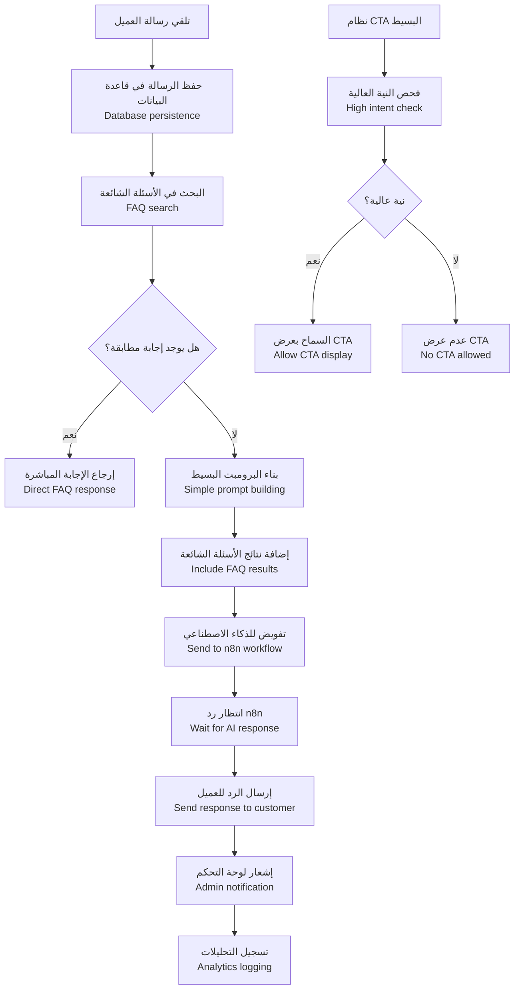
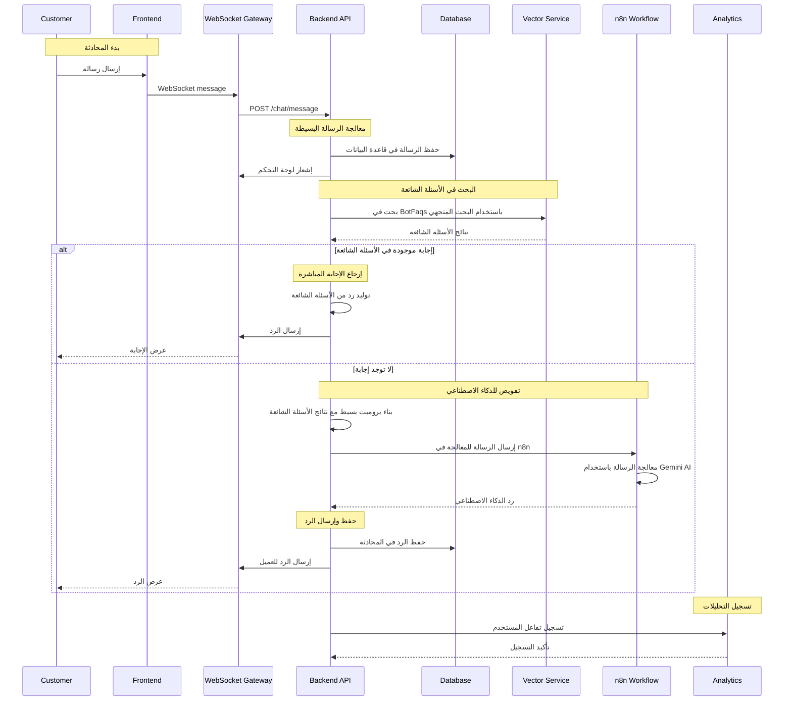
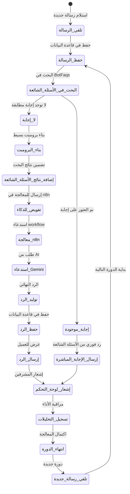
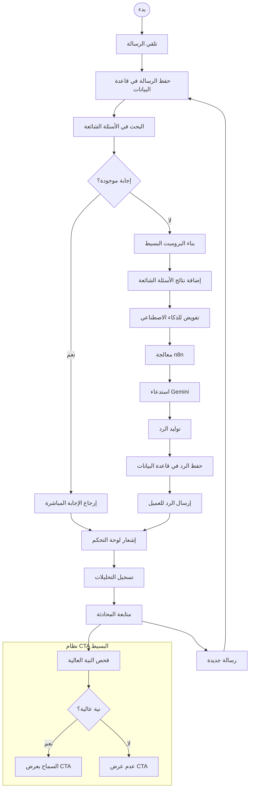

# ورك فلو بوابة الدردشة الذكية - نظام كليم البسيط

## نظرة عامة على النظام

نظام كليم يدعم بوابة دردشة ذكية مبسطة تعتمد على n8n وGemini AI:

- **بوابة دردشة بسيطة**: واجهة WebSocket للتواصل الفوري
- **تكامل مع n8n**: إرسال الرسائل للمعالجة الخارجية
- **البحث في الأسئلة الشائعة**: استرجاع الإجابات المطابقة من قاعدة البيانات
- **نظام CTA أساسي**: تحديد متى يُسمح بعرض دعوات العمل
- **تخصيص البرومبت**: قوالب مخصصة لكل تاجر
- **تتبع الجلسات**: إدارة محادثات العملاء

## 1. مخطط التدفق العام (Flowchart)



## 2. مخطط التسلسل (Sequence Diagram)



## 3. آلة الحالات (State Machine)



### تعريف الحالات

| الحالة                      | الوصف                           | الإجراءات المسموحة              |
|-----------------------------|---------------------------------|---------------------------------|
| `تلقي_الرسالة`            | استلام رسالة جديدة من العميل    | حفظ الرسالة في قاعدة البيانات   |
| `حفظ_الرسالة`             | حفظ الرسالة في قاعدة البيانات   | إعداد المعالجة التالية         |
| `البحث_في_الأسئلة_الشائعة` | البحث في BotFaqs باستخدام المتجهات | استرجاع الإجابات المطابقة      |
| `إجابة_موجودة`            | تم العثور على إجابة مطابقة      | إرجاع الإجابة المباشرة         |
| `لا_إجابة`                | لا توجد إجابة مطابقة            | بناء برومبت للذكاء الاصطناعي    |
| `بناء_البرومبت`            | بناء برومبت بسيط للذكاء الاصطناعي | تضمين نتائج الأسئلة الشائعة     |
| `إضافة_نتائج_الأسئلة_الشائعة` | إضافة نتائج البحث للبرومبت     | تحسين دقة الرد                 |
| `تفويض_للذكاء`            | إرسال الطلب للمعالجة في n8n     | استدعاء workflow الخارجي       |
| `معالجة_n8n`               | معالجة الرسالة في n8n           | استدعاء Gemini AI              |
| `استدعاء_Gemini`           | طلب الرد من Gemini AI           | توليد الرد بالذكاء الاصطناعي    |
| `توليد_الرد`               | توليد الرد النهائي              | إعداد الرد للإرسال            |
| `حفظ_الرد`                 | حفظ الرد في قاعدة البيانات      | تخزين المحادثة               |
| `إرسال_الرد`               | إرسال الرد للعميل                | عرض الإجابة في الواجهة        |
| `إرسال_الإجابة_المباشرة`  | إرسال إجابة من الأسئلة الشائعة    | رد فوري بدون معالجة AI        |
| `إشعار_لوحة_التحكم`        | إشعار المشرفين بالرسالة الجديدة   | إرسال إشعار للمدراء          |
| `تسجيل_التحليلات`         | تسجيل مقاييس الأداء             | مراقبة استخدام النظام         |
| `انتهاء_الدورة`            | اكتمال دورة معالجة الرسالة      | إعداد للرسالة التالية         |
| `تلقي_رسالة_جديدة`        | بدء دورة جديدة للرسالة التالية   | إعادة العملية للرسالة الجديدة   |

## 4. مخطط سير العمل التجاري (BPMN)



## 5. تفاصيل تقنية لكل مرحلة

### 5.1 مرحلة معالجة الرسائل البسيطة

#### 5.1.1 تلقي وحفظ الرسائل

```typescript
async function handleUserMessage(
  sessionId: string,
  text: string,
  metadata?: Record<string, unknown>,
): Promise<{ status: string }> {
  // 1. حفظ الرسالة في قاعدة البيانات
  await this.chats.createOrAppend(sessionId, [
    { role: 'user', text, metadata: metadata ?? {} },
  ]);

  // 2. إشعار لوحة التحكم
  this.events.emit('kleem.admin_new_message', {
    sessionId,
    message: { role: 'user', text },
  });

  return { status: 'queued' as const };
}
```

### 5.2 مرحلة البحث في الأسئلة الشائعة

#### 5.2.1 البحث في BotFaqs

```typescript
async function searchFAQs(query: string, merchantId: string) {
  // البحث في الأسئلة الشائعة المفهرسة في Qdrant
  const faqResults = await vectorService.searchBotFaqs(query, 5);

  return faqResults.map((faq) => ({
    question: faq.question,
    answer: faq.answer,
    similarity: faq.score,
    source: 'faq',
  }));
}
```

### 5.3 مرحلة معالجة الذكاء الاصطناعي

#### 5.3.1 بناء البرومبت البسيط

```typescript
private async buildSystemPrompt(userText: string): Promise<string> {
  const sys = await this.prompts.getActiveSystemPrompt();
  const s = await this.settings.get();

  // 1) حقن المتغيّرات
  let systemPrompt = renderPrompt(sys, {
    LAUNCH_DATE: s.launchDate,
    APPLY_URL: s.applyUrl,
    INTEGRATIONS_NOW: s.integrationsNow,
    TRIAL_OFFER: s.trialOffer,
    YEMEN_NEXT: s.yemenNext,
    YEMEN_POSITIONING: s.yemenPositioning,
  });

  // 2) Knowledge (FAQs) — اختياري لكن مفيد
  try {
    const kn = await this.vector.searchBotFaqs(userText, 5);
    if (kn?.length) {
      const lines = kn
        .map((r) => `- Q: ${r.question}\n  A: ${r.answer}`)
        .join('\n');
      systemPrompt += `\n\n# Knowledge (use if relevant)\n${lines}\n`;
    }
  } catch (e) {
    this.logger.warn(
      '[buildSystemPrompt] failed RAG: ' + (e as Error).message,
    );
  }

  return systemPrompt;
}
```

#### 5.3.2 إرسال الطلب إلى n8n

```typescript
async function sendToN8N(
  sessionId: string,
  text: string,
  systemPrompt: string,
) {
  await this.n8n.post(n8nEndpoint, {
    bot: botName,
    sessionId,
    channel: defaultChannel,
    text,
    prompt: systemPrompt,
    policy: {
      allowCTA: this.cta.allow(sessionId, this.intent.highIntent(text)),
    },
    meta: metadata ?? {},
  });
}
```

### 5.4 مرحلة التقييم البسيط

#### 5.4.1 نظام التقييم الأساسي

```typescript
async function rateMessage(
  sessionId: string,
  messageId: string,
  userId: string,
  rating: 0 | 1,
  feedback?: string,
  merchantId?: string,
) {
  // 1. البحث عن الرسالة وتحديث التقييم
  const ok = await this.messagesRepo.updateMessageRating({
    sessionId,
    messageId,
    userId,
    rating,
    feedback,
    merchantId,
  });

  if (!ok) {
    throw new BadRequestException('لم يتم العثور على الرسالة للتقييم');
  }

  // 2. إذا كان التقييم سلبياً، إنشاء تعليمات من الرد السلبي
  if (rating === 0) {
    const text = await this.messagesRepo.getMessageTextById(sessionId, messageId);
    if (text) {
      await this.geminiService.generateAndSaveInstructionFromBadReply(text, merchantId);
    }
  }

  return { status: 'ok' };
}
```

#### 5.4.2 إنشاء تعليمات من التقييمات السلبية

```typescript
async function generateInstructionFromBadReply(
  badReply: string,
): Promise<string> {
  const prompt = `
    الرد التالي تم تقييمه سلبيًا من قبل العميل: "${badReply}".
    صِغ توجيهًا مختصرًا جدًا (سطر واحد فقط، 15 كلمة أو أقل، لا تشرح السبب)
    لمنع مساعد الذكاء الاصطناعي من تكرار هذا الخطأ.
  `;

  const result = await model.generateContent(prompt);
  return result.response.text().trim();
}
```

### 5.5 مرحلة نظام CTA البسيط

#### 5.5.1 فحص النية العالية

```typescript
highIntent(text: string): boolean {
  const s = this.settings.cached();
  const arr = (s.highIntentKeywords || [])
    .map((k) => k.trim())
    .filter(Boolean);
  if (!arr.length) return false;
  const any = arr
    .map((k) => k.replace(/[.*+?^${}()|[\]\\]/g, '\\$&'))
    .join('|');
  const re = new RegExp(`(${any})`, 'i');
  return re.test(text || '');
}
```

#### 5.5.2 التحكم في عرض CTA

```typescript
allow(sessionId: string, highIntent: boolean): boolean {
  if (highIntent) return true;
  const s = this.settings.cached();
  const n = s.ctaEvery ?? 3;
  const curr = this.counters.get(sessionId) ?? 0;
  const ok = curr % n === 0;
  if (ok) this.counters.set(sessionId, curr + 1);
  return ok;
}
```

## 6. معايير الأمان والحماية

### 6.1 التحقق من الجلسات

```typescript
// التحقق من صحة الجلسة
const session = await sessionStore.get(sessionId);
if (!session || !session.isActive) {
  throw new UnauthorizedException('Invalid session');
}
```

### 6.2 Rate Limiting

- **رسائل المستخدم**: يخضع للـ Rate Limiting العام للـ API
- **طلبات البحث**: يخضع للـ Rate Limiting العام للـ API
- **تقييم الردود**: يخضع للـ Rate Limiting العام للـ API

### 6.3 منع الإساءة

```typescript
// فحص الرسائل المسيئة
function isAbusiveMessage(text: string): boolean {
  const abusivePatterns = ['سب', 'شتم', 'كلمات مسيئة'];
  return abusivePatterns.some((pattern) =>
    text.toLowerCase().includes(pattern),
  );
}
```

## 7. مسارات الخطأ والتعامل معها

### 7.1 أخطاء المعالجة

```javascript
AI_SERVICE_UNAVAILABLE; // خدمة الذكاء الاصطناعي غير متاحة
VECTOR_SEARCH_FAILED; // فشل في البحث في الأسئلة الشائعة
SESSION_NOT_FOUND; // الجلسة غير موجودة
PROMPT_BUILDING_FAILED; // فشل في بناء البرومبت
```

### 7.2 أخطاء التقييم

```javascript
INVALID_RATING_VALUE; // قيمة تقييم غير صحيحة
MESSAGE_NOT_FOUND; // الرسالة غير موجودة للتقييم
SESSION_NOT_AUTHORIZED; // غير مخول للتقييم
GEMINI_API_ERROR; // خطأ في استدعاء Gemini API
```

### 7.3 أخطاء CTA

```javascript
CTA_SERVICE_UNAVAILABLE; // خدمة CTA غير متاحة
INTENT_DETECTION_FAILED; // فشل في كشف النية العالية
```

## 8. خطة الاختبار والتحقق

### 8.1 اختبارات الوحدة

- اختبار حفظ وحذف الرسائل في قاعدة البيانات ✅ (مطبق حالياً)
- اختبار البحث في الأسئلة الشائعة المتجهية ✅ (مطبق حالياً)
- اختبار بناء البرومبت البسيط ✅ (مطبق حالياً)
- اختبار نظام التقييم السلبي ✅ (مطبق حالياً)

### 8.2 اختبارات التكامل

- اختبار التكامل مع n8n workflow ✅ (مطبق حالياً)
- اختبار التكامل مع Gemini AI ✅ (مطبق حالياً)
- اختبار البحث المتجهي في BotFaqs ✅ (مطبق حالياً)
- اختبار نظام التحكم في عرض CTA ✅ (مطبق حالياً)
- اختبار معالجة الأخطاء ✅ (مطبق حالياً)

### 8.3 اختبارات الأداء

- اختبار زمن الاستجابة للرسائل ✅ (مطبق حالياً)
- اختبار البحث في قواعد البيانات الكبيرة ✅ (مطبق حالياً)
- اختبار استهلاك الذاكرة والمعالج ✅ (مطبق حالياً)

---

_تم إنشاء هذا التوثيق بواسطة نظام كليم لإدارة المتاجر الذكية_
