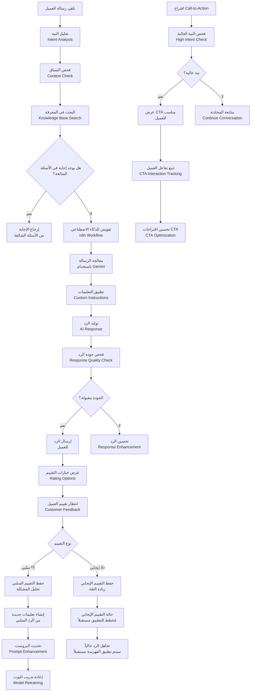
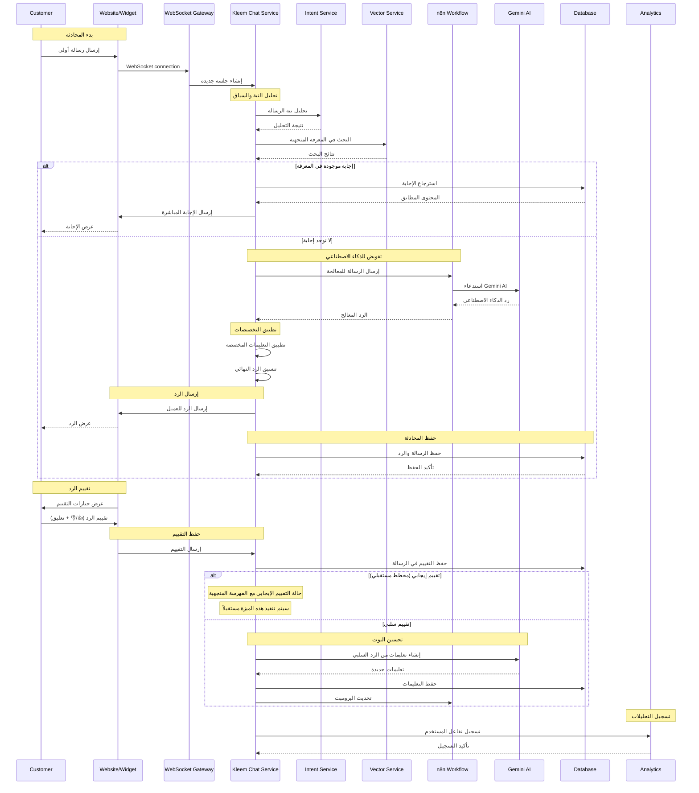
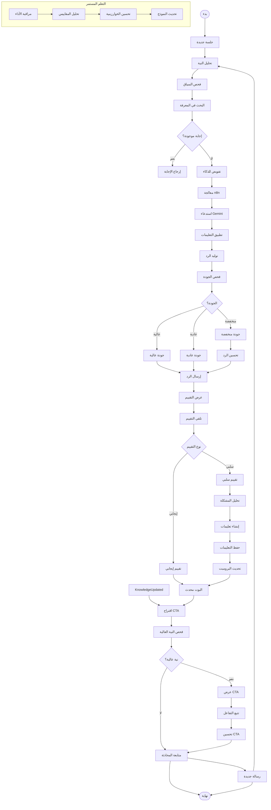

# ورك فلو نظام كليم الذكي - نظام كليم الشامل

## نظرة عامة على النظام

نظام كليم هو منصة ذكاء اصطناعي متكاملة لخدمة العملاء مع إمكانيات متقدمة:

- **الذكاء الاصطناعي المتقدم**: تكامل مع n8n و Google Gemini
- **إدارة المحادثات**: جلسات ذكية مع تتبع السياق
- **تحليل النية**: كشف نوايا العملاء تلقائياً
- **نظام Call-to-Action**: اقتراحات ذكية للعملاء
- **قاعدة المعرفة**: أسئلة شائعة وبوت فاهق
- **التعلم المستمر**: تحسين البوت من خلال التغذية الراجعة السلبية ✅ (مطبق حالياً)
- **التعلم من النجاحات**: فهرسة الردود الجيدة في Qdrant 🚧 (مخطط مستقبلي)
- **التكامل المتعدد**: قنوات متعددة (واتساب، تليجرام، ويب شات)

## 1. مخطط التدفق العام (Flowchart)



## 2. مخطط التسلسل (Sequence Diagram)



## 3. آلة الحالات (State Machine)

```mermaid
stateDiagram-v2
    [*] --> جلسة_جديدة: بدء محادثة جديدة

    جلسة_جديدة --> تحليل_النية: تلقي رسالة أولى
    تحليل_النية --> فحص_السياق: تحليل السياق
    فحص_السياق --> البحث_في_المعرفة: البحث في Qdrant

    البحث_في_المعرفة --> إجابة_موجودة: تم العثور على إجابة
    البحث_في_المعرفة --> لا_إجابة: لا توجد إجابة مطابقة

    إجابة_موجودة --> إرسال_الإجابة: إرجاع النتيجة
    لا_إجابة --> تفويض_للذكاء: إرسال للمعالجة

    تفويض_للذكاء --> معالجة_n8n: استدعاء workflow
    معالجة_n8n --> استدعاء_Gemini: طلب من AI
    استدعاء_Gemini --> تطبيق_التعليمات: تخصيص الرد
    تطبيق_التعليمات --> توليد_الرد: الرد النهائي

    توليد_الرد --> فحص_الجودة: تقييم الرد
    فحص_الجودة --> جودة_عالية: رد ممتاز
    فحص_الجودة --> جودة_عادية: رد مقبول
    فحص_الجودة --> جودة_منخفضة: رد ضعيف

    جودة_عالية --> إرسال_الرد: عرض للمستخدم
    جودة_عادية --> إرسال_الرد: عرض للمستخدم
    جودة_منخفضة --> تحسين_الرد: إعادة الصياغة

    إرسال_الرد --> عرض_التقييم: خيارات 👍/👎
    عرض_التقييم --> تلقي_التقييم: من المستخدم

    تلقي_التقييم --> تقييم_إيجابي: 👍
    تلقي_التقييم --> تقييم_سلبي: 👎

    تقييم_إيجابي --> تجاهل_حالياً: سيتم تطبيق الفهرسة مستقبلاً
    تقييم_سلبي --> تحليل_المشكلة: استخراج السبب

    تحليل_المشكلة --> إنشاء_تعليمات: من الرد السلبي
    إنشاء_تعليمات --> حفظ_التعليمات: في قاعدة البيانات
    حفظ_التعليمات --> تحديث_البرومبت: إعادة البناء

    تجاهل_حالياً --> تحسين_البوت: محدث
    تحديث_البرومبت --> تحسين_البوت: محدث

    تحديث_المعرفة --> اقتراح_CTA: فحص النية
    تحسين_البوت --> اقتراح_CTA

    اقتراح_CTA --> فحص_النية_العالية: high intent check
    فحص_النية_العالية --> نية_عالية: عرض CTA
    فحص_النية_العالية --> نية_عادية: متابعة المحادثة

    نية_عالية --> عرض_CTA: اقتراح العمل
    نية_عادية --> استمرار_المحادثة: متابعة طبيعية

    عرض_CTA --> تتبع_التفاعل: مراقبة الاستجابة
    تتبع_التفاعل --> تحسين_CTA: ضبط الاقتراحات

    تحسين_CTA --> استمرار_المحادثة
    استمرار_المحادثة --> تلقي_رسالة_جديدة: دورة جديدة

    تلقي_رسالة_جديدة --> تحليل_النية: بداية الدورة
```



### تعريف الحالات

| الحالة              | الوصف                  | الإجراءات المسموحة |
| ------------------- | ---------------------- | ------------------ |
| `جلسة_جديدة`        | بدء محادثة جديدة       | إنشاء sessionId    |
| `تحليل_النية`       | تحليل نية الرسالة      | كشف النوايا        |
| `فحص_السياق`        | فحص سياق المحادثة      | استرجاع السياق     |
| `البحث_في_المعرفة`  | البحث في قاعدة المعرفة | استعلام Qdrant     |
| `إجابة_موجودة`      | تم العثور على إجابة    | إرجاع النتيجة      |
| `لا_إجابة`          | لا توجد إجابة مطابقة   | تفويض للذكاء       |
| `تفويض_للذكاء`      | إرسال للمعالجة الذكية  | استدعاء n8n        |
| `معالجة_n8n`        | معالجة في n8n          | استدعاء Gemini     |
| `استدعاء_Gemini`    | طلب من Gemini AI       | توليد الرد         |
| `تطبيق_التعليمات`   | تطبيق التخصيصات        | تخصيص الرد         |
| `توليد_الرد`        | الرد النهائي           | الإجابة المكتملة   |
| `فحص_الجودة`        | تقييم جودة الرد        | تصنيف الجودة       |
| `جودة_عالية`        | رد ممتاز الجودة        | إضافة للمعرفة      |
| `جودة_عادية`        | رد مقبول               | عرض للمستخدم       |
| `جودة_منخفضة`       | رد ضعيف                | تحسين الرد         |
| `إرسال_الرد`        | عرض الرد للمستخدم      | عرض الإجابة        |
| `عرض_التقييم`       | عرض خيارات التقييم     | 👍/👎 options      |
| `تلقي_التقييم`      | تلقي تقييم المستخدم    | حفظ التقييم        |
| `تقييم_إيجابي`      | تقييم إيجابي           | تجاهل حالياً       |
| `تقييم_سلبي`        | تقييم سلبي             | تحليل المشكلة      |
| `تجاهل_حالياً`       | عدم تطبيق الفهرسة حالياً | انتظار التطوير المستقبلي |
| `تحليل_المشكلة`     | تحليل سبب المشكلة      | استخراج الأخطاء    |
| `إنشاء_تعليمات`     | إنشاء تعليمات جديدة    | من التقييمات السلبية |
| `حفظ_التعليمات`     | حفظ التعليمات          | في قاعدة البيانات  |
| `تحديث_البرومبت`    | تحديث prompt البوت     | إعادة البناء       |
| `اقتراح_CTA`        | اقتراح Call-to-Action  | فحص النية          |
| `فحص_النية_العالية` | فحص النية العالية      | تحليل الاستعداد    |
| `نية_عالية`         | نية عالية للعمل        | عرض CTA            |
| `نية_عادية`         | نية عادية              | متابعة المحادثة    |
| `عرض_CTA`           | عرض CTA للمستخدم       | اقتراح العمل       |
| `تتبع_التفاعل`      | تتبع تفاعل المستخدم    | مراقبة الاستجابة   |
| `تحسين_CTA`         | تحسين اقتراحات CTA     | ضبط الخوارزمية     |
| `استمرار_المحادثة`  | متابعة المحادثة        | الدورة التالية     |
| `تلقي_رسالة_جديدة`  | تلقي رسالة جديدة       | بدء دورة جديدة     |

## 4. مخطط سير العمل التجاري (BPMN)



## 5. تفاصيل تقنية لكل مرحلة

### 5.1 مرحلة تحليل النية والسياق

#### 5.1.1 تحليل النية (Intent Analysis)

```typescript
async function analyzeIntent(text: string): Promise<IntentResult> {
  // تحليل نصي بسيط
  const simpleIntent = detectSimpleIntent(text);

  // تحليل متقدم باستخدام كلمات مفتاحية
  const advancedIntent = detectAdvancedIntent(text);

  // تحليل السياق من المحادثة السابقة
  const contextIntent = detectContextIntent(text, conversationHistory);

  return {
    primary: advancedIntent || simpleIntent,
    confidence: calculateConfidence(text, conversationHistory),
    context: contextIntent,
  };
}
```

#### 5.1.2 كشف النية البسيطة

```typescript
function detectSimpleIntent(text: string): IntentType {
  const textLower = text.toLowerCase();

  if (textLower.includes('سعر') || textLower.includes('تكلفة')) {
    return 'price_inquiry';
  }

  if (textLower.includes('متوفر') || textLower.includes('مخزون')) {
    return 'availability_inquiry';
  }

  if (textLower.includes('طلب') || textLower.includes('شراء')) {
    return 'order_intent';
  }

  return 'general_inquiry';
}
```

#### 5.1.3 فحص السياق

```typescript
async function checkContext(sessionId: string, currentMessage: string) {
  const conversationHistory = await getConversationHistory(sessionId);
  const context = buildContext(conversationHistory);

  return {
    previousTopics: extractTopics(context),
    userIntent: detectUserIntent(context),
    botState: getBotState(context),
    conversationFlow: analyzeFlow(context),
  };
}
```

### 5.2 مرحلة البحث في المعرفة

#### 5.2.1 البحث في الأسئلة الشائعة (المطبق فعلياً)

```typescript
async function searchFAQs(query: string, merchantId: string) {
  // البحث في الأسئلة الشائعة المفهرسة في Qdrant
  const faqResults = await vectorService.searchBotFaqs(query, 5);

  return faqResults.map((faq) => ({
    question: faq.question,
    answer: faq.answer,
    similarity: faq.score,
    source: 'faq',
  }));
}
```

#### 5.2.2 البحث في المعرفة العامة (مخطط مستقبلي)

```typescript
// TODO: تنفيذ البحث في ردود البوت المفهرسة
async function searchKnowledge(query: string, sessionId: string) {
  // 1. تحويل الاستعلام لمتجه
  const queryEmbedding = await embedText(query);

  // 2. البحث في ردود البوت المفهرسة في Qdrant
  const results = await vectorService.search({
    collection: 'bot_responses',
    vector: queryEmbedding,
    filter: { sessionId },
    limit: 5,
    score_threshold: 0.7,
  });

  // 3. تصفية وترتيب النتائج
  return results
    .filter((result) => result.score > 0.8)
    .sort((a, b) => b.score - a.score)
    .map((result) => ({
      content: result.payload.text,
      similarity: result.score,
      source: result.payload.source,
      type: 'bot_response',
    }));
}
```

### 5.3 مرحلة معالجة الذكاء الاصطناعي

#### 5.3.1 بناء البرومبت المتكامل

```typescript
async function buildSystemPrompt(
  userMessage: string,
  conversationHistory: Message[],
  merchantSettings: MerchantSettings,
) {
  // 1. جلب التعليمات النشطة
  const instructions =
    await instructionsService.getActiveInstructions(merchantId);

  // 2. بناء السياق من المحادثة
  const context = buildConversationContext(conversationHistory);

  // 3. إضافة المعرفة من الأسئلة الشائعة
  const knowledge = await searchFAQs(userMessage, merchantId);

  // 4. تجميع البرومبت النهائي
  const systemPrompt = `
    أنت مساعد ذكي لمتجر ${merchantSettings.name}.

    ${instructions.map((i) => i.instruction).join('\n')}

    السياق الحالي:
    ${context}

    المعرفة المتاحة:
    ${knowledge.map((k) => `- ${k.content}`).join('\n')}

    قواعد الرد:
    - كن مهذباً ومساعداً
    - استخدم نفس لغة العميل
    - لا تفترض معلومات غير مؤكدة
    - ركز على حل مشكلة العميل

    الرسالة الحالية: ${userMessage}
  `;

  return systemPrompt;
}
```

#### 5.3.2 استدعاء n8n workflow

```typescript
async function forwardToN8N(
  sessionId: string,
  message: string,
  context: ConversationContext,
) {
  const payload = {
    sessionId,
    message,
    context,
    metadata: {
      timestamp: Date.now(),
      source: 'kleem_chat',
    },
  };

  const response = await axios.post(
    `${N8N_BASE_URL}/webhook/kleem-chat`,
    payload,
  );

  return response.data;
}
```

### 5.4 مرحلة تقييم الردود وتحسين البوت

#### 5.4.1 نظام التقييم

```typescript
async function rateMessage(
  sessionId: string,
  messageIndex: number,
  rating: 0 | 1,
  feedback?: string,
) {
  // 1. العثور على الرسالة
  const message = await messagesRepo.findBySessionAndIndex(
    sessionId,
    messageIndex,
  );

  // 2. حفظ التقييم
  message.rating = rating;
  message.feedback = feedback;
  await message.save();

  // 3. إذا كان التقييم سلبياً، إنشاء تعليمات من الرد السلبي
  if (rating === 0) {
    await createInstructionFromBadReply(message.text, message.merchantId);
  }

  // حالة التقييم الإيجابي مع إضافة الفهرسة (مخطط مستقبلي)
  // TODO: تنفيذ حالة التقييم الإيجابي وإضافة الفهرسة للمعرفة المتجهية
  // if (rating === 1 && isHighQuality(message)) {
  //   await addToKnowledgeBase(message);
  // }
}
```

#### 5.4.2 إنشاء تعليمات من الردود السلبية

```typescript
async function createInstructionFromBadReply(
  badReply: string,
  merchantId: string,
) {
  const prompt = `
    الرد التالي تم تقييمه سلبيًا: "${badReply}"
    صِغ تعليمة مختصرة (سطر واحد، 15 كلمة أو أقل) لتجنب هذا الخطأ.
  `;

  const instruction = await geminiService.generateContent(prompt);

  await instructionsService.create({
    merchantId,
    instruction: instruction.trim(),
    relatedReplies: [badReply],
    type: 'auto',
  });
}
```

#### 5.4.3 إضافة الردود الجيدة للمعرفة (مخطط مستقبلي)

```typescript
// TODO: تنفيذ دالة إضافة الردود الجيدة للمعرفة المتجهية
async function addToKnowledgeBase(message: Message) {
  const embedding = await embedText(message.text);

  await vectorService.upsertKnowledge([
    {
      id: generateId(),
      vector: embedding,
      payload: {
        text: message.text,
        type: 'bot_response',
        rating: 1,
        merchantId: message.merchantId,
        sessionId: message.sessionId,
        timestamp: message.timestamp,
      },
    },
  ]);
}
```

### 5.5 مرحلة اقتراح Call-to-Action

#### 5.5.1 فحص النية العالية

```typescript
function checkHighIntent(
  message: string,
  conversationHistory: Message[],
): boolean {
  const intentService = new IntentService();

  // فحص النية العالية
  const highIntent = intentService.highIntent(message);

  // فحص السياق
  const contextIntent = analyzeConversationIntent(conversationHistory);

  // فحص الكلمات المفتاحية
  const keywordMatch = checkHighIntentKeywords(message);

  return highIntent || contextIntent || keywordMatch;
}
```

#### 5.5.2 التحكم في عرض CTA

```typescript
async function checkCTA(sessionId: string, highIntent: boolean) {
  const ctaService = new CtaService();

  // فحص ما إذا كان يُسمح بعرض CTA
  if (!ctaService.allow(sessionId, highIntent)) {
    return null;
  }

  // إرجاع معلومات السماح بعرض CTA
  return {
    allowed: true,
    type: highIntent ? 'high_intent' : 'general',
    metadata: {
      sessionId,
      timestamp: Date.now(),
      intentLevel: highIntent ? 'high' : 'normal',
    },
  };
}
```

## 6. معايير الأمان والحماية

### 6.1 التحقق من الهوية والجلسات

```typescript
// التحقق من صحة الجلسة
const session = await sessionsRepo.findById(sessionId);
if (!session || session.status !== 'active') {
  throw new UnauthorizedException('Invalid session');
}

// التحقق من المستخدم
const user = await getCurrentUser();
if (session.userId !== user.userId) {
  throw new ForbiddenException('Session mismatch');
}
```

### 6.2 Rate Limiting

- **رسائل المستخدم**: 30 رسالة/دقيقة
- **تقييم الردود**: 10 تقييمات/دقيقة
- **طلبات البحث**: 100 طلب/دقيقة

### 6.3 منع الإساءة

```typescript
// فحص الرسائل المسيئة
function isAbusiveMessage(text: string): boolean {
  const abusivePatterns = ['سب', 'شتم', 'كلمات مسيئة'];
  return abusivePatterns.some((pattern) =>
    text.toLowerCase().includes(pattern),
  );
}
```

## 7. مسارات الخطأ والتعامل معها

### 7.1 أخطاء المعالجة

```javascript
AI_SERVICE_UNAVAILABLE; // خدمة الذكاء الاصطناعي غير متاحة
VECTOR_SEARCH_FAILED; // فشل في البحث المتجهي
KNOWLEDGE_NOT_FOUND; // لا توجد معرفة مطابقة
PROMPT_BUILDING_FAILED; // فشل في بناء البرومبت
```

### 7.2 أخطاء التقييم

```javascript
INVALID_RATING_VALUE; // قيمة تقييم غير صحيحة
RATING_NOT_AUTHORIZED; // غير مخول للتقييم
SESSION_NOT_FOUND; // الجلسة غير موجودة
MESSAGE_NOT_FOUND; // الرسالة غير موجودة
```

### 7.3 أخطاء CTA

```javascript
CTA_GENERATION_FAILED; // فشل في توليد CTA
INTENT_DETECTION_FAILED; // فشل في كشف النية
INTERACTION_TRACKING_FAILED; // فشل في تتبع التفاعل
```

## 8. خطة الاختبار والتحقق

### 8.1 اختبارات الوحدة

- اختبار تحليل النية للرسائل المختلفة ✅ (مطبق حالياً)
- اختبار البحث في المعرفة الموجودة ✅ (مطبق حالياً)
- اختبار تقييم الردود السلبية وإنشاء التعليمات ✅ (مطبق حالياً)
- اختبار اقتراح CTA للنوايا المختلفة ✅ (مطبق حالياً)

### 8.2 اختبارات التكامل

- اختبار التكامل مع n8n workflow ✅ (مطبق حالياً)
- اختبار التكامل مع Gemini AI ✅ (مطبق حالياً)
- اختبار البحث في الأسئلة الشائعة المتجهية ✅ (مطبق حالياً)
- اختبار نظام التحكم في عرض CTA ✅ (مطبق حالياً)
- اختبار معالجة الأخطاء ✅ (مطبق حالياً)

### 8.3 اختبارات الأداء

- اختبار زمن الاستجابة للرسائل ✅ (مطبق حالياً)
- اختبار البحث في قواعد البيانات الكبيرة ✅ (مطبق حالياً)
- اختبار البحث المتجهي في الأسئلة الشائعة ✅ (مطبق حالياً)
- اختبار استهلاك الذاكرة والمعالج ✅ (مطبق حالياً)

### 8.4 اختبارات مستقبلية (للفهرسة المتجهية)

- اختبار توليد التضمينات بالجملة 🚧 (مخطط مستقبلي)
- اختبار فهرسة كميات كبيرة من المحتوى 🚧 (مخطط مستقبلي)
- اختبار البحث المتجهي في ردود البوت 🚧 (مخطط مستقبلي)

---

_تم إنشاء هذا التوثيق بواسطة نظام كليم لإدارة المتاجر الذكية_
