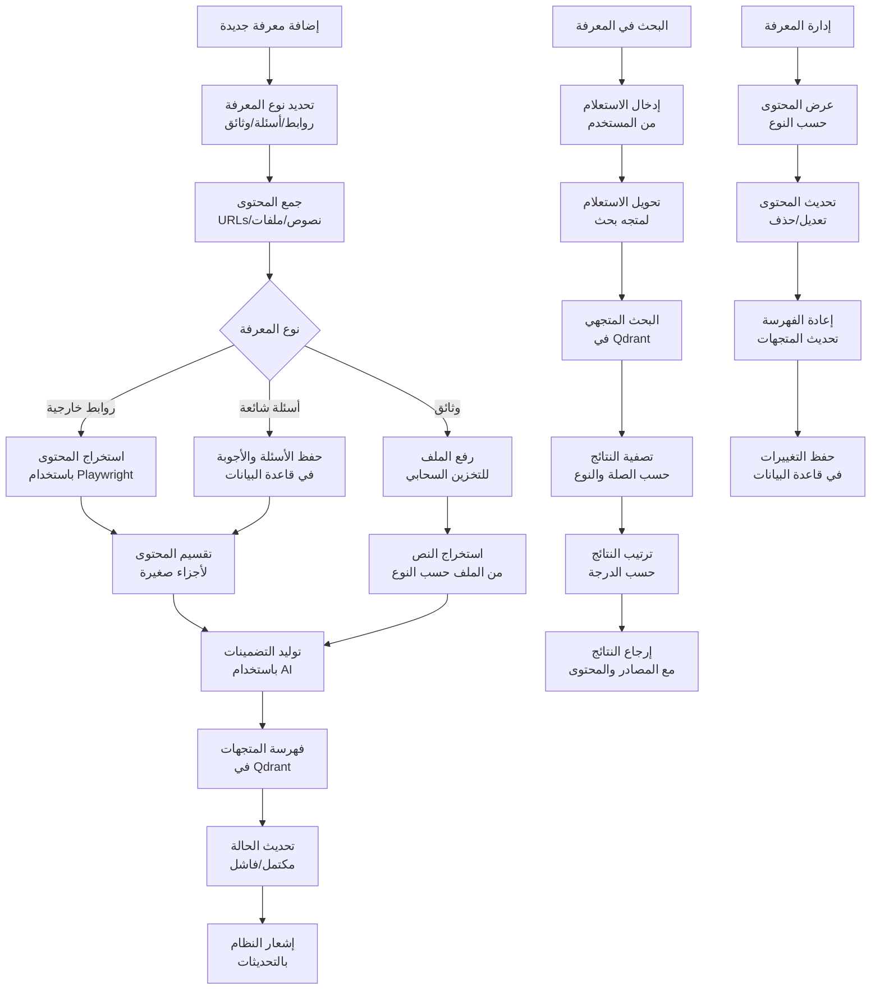
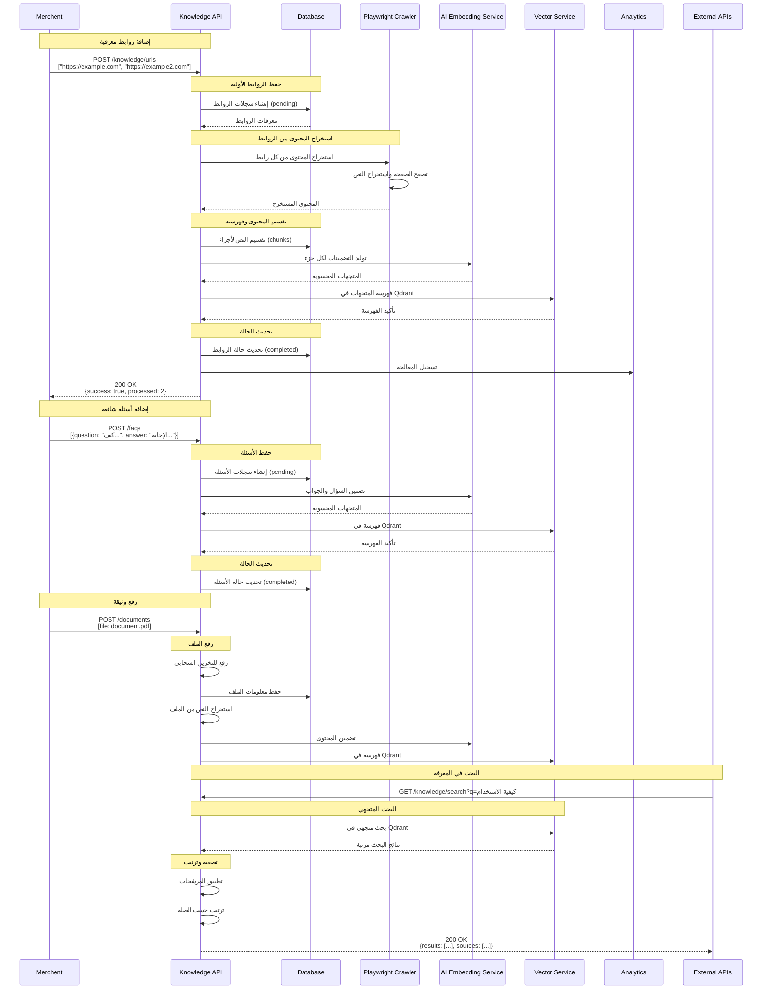
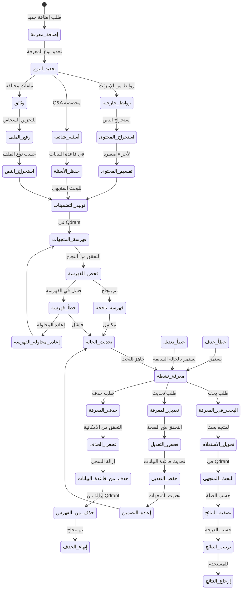
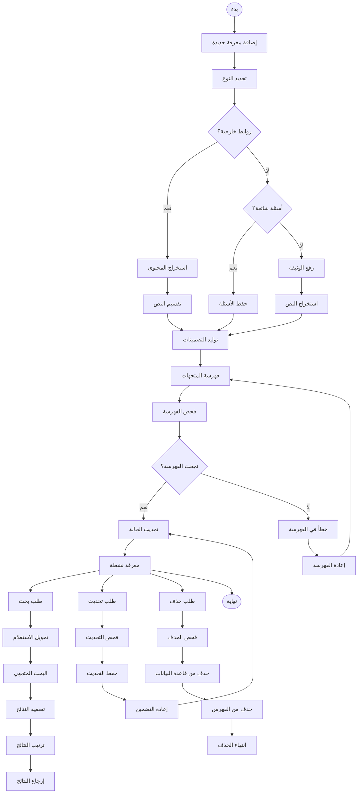

# ورك فلو إدارة المعرفة - نظام كليم الشامل

## نظرة عامة على النظام

نظام كليم يدعم إدارة شاملة للمعرفة من خلال ثلاثة أنواع رئيسية:

- **قاعدة المعرفة العامة**: استخراج وفهرسة المحتوى من الروابط الخارجية
- **الأسئلة الشائعة**: إدارة الأسئلة والأجوبة المخصصة
- **الوثائق**: رفع ومعالجة الملفات المختلفة (PDF, DOC, XLS)
- **التكامل الذكي**: فهرسة جميع المحتوى في Qdrant للبحث المتجهي

## 1. مخطط التدفق العام (Flowchart)



## 2. مخطط التسلسل (Sequence Diagram)



## 3. آلة الحالات (State Machine)



### تعريف الحالات


| الحالة                     | الوصف                                                   | الإجراءات المسموحة |
| -------------------------------- | ------------------------------------------------------------ | ----------------------------------- |
| `إضافة_معرفة`          | بدء عملية إضافة معرفة جديدة           | تحديد نوع المعرفة    |
| `تحديد_النوع`          | تحديد نوع المعرفة المراد إضافتها | تصنيف المدخلات         |
| `روابط_خارجية`        | معالجة روابط من الإنترنت                | استخراج المحتوى       |
| `أسئلة_شائعة`          | معالجة الأسئلة والأجوبة                 | حفظ مباشرة                 |
| `وثائق`                     | معالجة الملفات المرفوعة                 | استخراج النص             |
| `استخراج_المحتوى`  | استخراج النص من الروابط                  | تصفح واستخراج           |
| `حفظ_الأسئلة`          | حفظ الأسئلة في قاعدة البيانات       | إدراج السجلات           |
| `رفع_الملف`              | رفع الملف للتخزين السحابي              | حفظ في MinIO                   |
| `تقسيم_المحتوى`      | تقسيم النص لأجزاء صغيرة                  | معالجة الأجزاء         |
| `استخراج_النص`        | استخراج النص من الملفات                  | حسب نوع الملف            |
| `توليد_التضمينات`  | إنشاء المتجهات للمحتوى                   | استدعاء AI                   |
| `فهرسة_المتجهات`    | إضافة المتجهات لـ Qdrant                      | فهرسة البحث               |
| `فحص_الفهرسة`          | التحقق من نجاح الفهرسة                    | اختبار الإضافة         |
| `تحديث_الحالة`        | تحديث حالة المعرفة                           | تعيين النتيجة           |
| `معرفة_نشطة`            | المعرفة جاهزة للبحث                         | جميع العمليات           |
| `البحث_في_المعرفة` | طلب بحث في المعرفة                            | تنفيذ الاستعلام       |
| `تحويل_الاستعلام`  | تحويل نص البحث لمتجه                        | معالجة الاستعلام     |
| `البحث_المتجهي`      | البحث في Qdrant                                       | استرجاع النتائج       |
| `تصفية_النتائج`      | ترتيب وتصفية النتائج                       | تحسين العرض               |
| `ترتيب_النتائج`      | ترتيب حسب الصلة                                 | إعداد النتائج           |
| `إرجاع_النتائج`      | إرجاع النتائج للمستخدم                   | عرض المحتوى               |
| `تعديل_المعرفة`      | طلب تحديث المعرفة                             | تعديل المحتوى           |
| `حذف_المعرفة`          | طلب حذف المعرفة                                 | إزالة المحتوى           |

## 4. مخطط سير العمل التجاري (BPMN)



## 5. تفاصيل تقنية لكل مرحلة

### 5.1 مرحلة إضافة المعرفة

#### 5.1.1 إضافة روابط خارجية

**Endpoint**: `POST /merchants/{merchantId}/knowledge/urls`

**البيانات المطلوبة**:

```typescript
interface AddUrlsDto {
  urls: string[]; // قائمة الروابط
}
```

**عملية المعالجة**:

```typescript
async function addUrls(merchantId: string, urls: string[]) {
  // 1. حفظ الروابط في قاعدة البيانات (حالة pending)
  const records = await sourceUrls.createMany(
    urls.map((url) => ({ merchantId, url, status: 'pending' })),
  );

  // 2. معالجة كل رابط بالخلفية
  await processUrlsInBackground(merchantId, records);

  // 3. إشعار المستخدم
  await notifications.notifyUser(userId, {
    type: 'knowledge.urls.queued',
    title: 'تمت جدولة روابط للمعرفة',
    data: { count: records.length },
  });
}
```

#### 5.1.2 استخراج المحتوى من الروابط

```typescript
async function extractContent(url: string) {
  const browser = await chromium.launch({
    headless: true,
    args: ['--no-sandbox', '--disable-setuid-sandbox'],
  });

  try {
    const page = await browser.newPage();
    await page.goto(url, { waitUntil: 'networkidle' });

    // استخراج النص الرئيسي
    const content = await page.evaluate(() => {
      // إزالة العناصر غير المرغوبة
      const elements = document.querySelectorAll(
        'script, style, nav, footer, header',
      );
      elements.forEach((el) => el.remove());

      return document.body.innerText;
    });

    return content;
  } finally {
    await browser.close();
  }
}
```

#### 5.1.3 إضافة أسئلة شائعة

**Endpoint**: `POST /merchants/{merchantId}/faqs`

**البيانات المطلوبة**:

```typescript
interface CreateFaqDto {
  question: string; // السؤال
  answer: string; // الإجابة
}
```

**عملية المعالجة**:

```typescript
async function createMany(merchantId: string, faqs: CreateFaqDto[]) {
  // 1. حفظ الأسئلة في قاعدة البيانات (حالة pending)
  const created = await faqRepo.insertManyPending(merchantId, faqs);

  // 2. معالجة كل سؤال بالخلفية
  await processFaqsInBackground(
    merchantId,
    created.map((f) => f._id),
  );

  return {
    success: true,
    queued: created.length,
    ids: created.map((f) => f._id.toString()),
  };
}
```

#### 5.1.4 رفع الوثائق

**Endpoint**: `POST /merchants/{merchantId}/documents`

**البيانات المطلوبة**:

```typescript
// multipart/form-data
interface UploadDocumentDto {
  file: Express.Multer.File; // الملف المرفوع
}
```

**عملية المعالجة**:

```typescript
async function uploadFile(merchantId: string, file: Express.Multer.File) {
  // 1. رفع الملف لـ MinIO
  const storageKey = `${Date.now()}-${file.originalname}`;
  await minio.fPutObject(bucket, storageKey, file.path);

  // 2. حفظ السجل في MongoDB
  const doc = await documentsRepo.create({
    merchantId,
    filename: file.originalname,
    fileType: file.mimetype,
    storageKey,
    status: 'pending',
  });

  // 3. إضافة مهمة للمعالجة
  await queue.add('process', { docId: doc._id, merchantId });

  return doc;
}
```

### 5.2 مرحلة معالجة المحتوى

#### 5.2.1 استخراج النص من الوثائق

```typescript
async function extractTextFromFile(filePath: string, mimeType: string) {
  switch (mimeType) {
    case 'application/pdf':
      const pdfBuffer = await fs.readFile(filePath);
      const pdfData = await pdfParse(pdfBuffer);
      return pdfData.text;

    case 'application/vnd.openxmlformats-officedocument.wordprocessingml.document':
      const docxResult = await mammoth.extractRawText({ path: filePath });
      return docxResult.value;

    case 'application/vnd.openxmlformats-officedocument.spreadsheetml.sheet':
      const workbook = new ExcelJS.Workbook();
      await workbook.xlsx.readFile(filePath);
      let excelText = '';

      workbook.eachSheet((sheet) => {
        sheet.eachRow((row) => {
          row.eachCell((cell) => {
            if (cell.value) excelText += cell.value.toString() + ' ';
          });
          excelText += '\n';
        });
      });

      return excelText;

    default:
      return await fs.readFile(filePath, 'utf8');
  }
}
```

#### 5.2.2 تقسيم النص لأجزاء

```typescript
function splitIntoChunks(text: string, size = 1000): string[] {
  if (!text) return [];

  const chunks: string[] = [];
  const sentences = text.split(/[.!؟\n]/);

  let currentChunk = '';

  for (const sentence of sentences) {
    if ((currentChunk + sentence).length <= size) {
      currentChunk += sentence + '. ';
    } else {
      if (currentChunk.trim()) {
        chunks.push(currentChunk.trim());
      }
      currentChunk = sentence + '. ';
    }
  }

  if (currentChunk.trim()) {
    chunks.push(currentChunk.trim());
  }

  return chunks;
}
```

#### 5.2.3 توليد التضمينات

```typescript
async function generateEmbeddings(chunks: string[]) {
  // استدعاء خدمة التضمين (OpenAI, Hugging Face, etc.)
  const embeddings = await embeddingService.embedTexts(chunks);

  return chunks.map((chunk, index) => ({
    id: generateId(),
    vector: embeddings[index],
    payload: {
      text: chunk,
      type: 'knowledge',
      source: 'extracted',
    },
  }));
}
```

### 5.3 مرحلة البحث والاستعلام

#### 5.3.1 البحث المتجهي

```typescript
async function searchKnowledge(query: string, merchantId: string) {
  // 1. تحويل الاستعلام لمتجه
  const queryEmbedding = await embeddingService.embedText(query);

  // 2. البحث في Qdrant
  const results = await vectorService.search({
    vector: queryEmbedding,
    filter: { merchantId },
    limit: 10,
    with_payload: true,
  });

  // 3. تصفية وترتيب النتائج
  const filteredResults = results
    .filter((result) => result.score > 0.7) // حد أدنى للصلة
    .sort((a, b) => b.score - a.score)
    .slice(0, 5); // أفضل 5 نتائج

  return filteredResults;
}
```

#### 5.3.2 استرجاع المحتوى المرتبط

```typescript
async function getContentWithSources(results: SearchResult[]) {
  const contentWithSources = [];

  for (const result of results) {
    const source = await getSourceInfo(result.payload.sourceId);

    contentWithSources.push({
      content: result.payload.text,
      source: source,
      relevance: result.score,
      type: result.payload.type,
    });
  }

  return contentWithSources;
}
```

## 6. معايير الأمان والحماية

### 6.1 التحقق من الملكية

```typescript
// التحقق من صلاحية التاجر
const user = await getCurrentUser();
const merchant = await merchants.findById(merchantId);

if (!canAccessMerchant(user, merchant)) {
  throw new ForbiddenException('Access denied');
}
```

### 6.2 Rate Limiting

- **إضافة روابط**: 10 روابط/دقيقة لكل تاجر
- **البحث**: 100 طلب/دقيقة لكل تاجر
- **رفع الوثائق**: 20 ملف/ساعة لكل تاجر

### 6.3 تنظيف المحتوى

```typescript
// تنظيف النص المستخرج
function cleanExtractedText(text: string): string {
  return text
    .replace(/\s+/g, ' ') // إزالة المسافات المتعددة
    .replace(/[^\u0600-\u06FF\u0020-\u007E]/g, '') // الاحتفاظ بالعربية والإنجليزية فقط
    .trim();
}
```

## 7. مسارات الخطأ والتعامل معها

### 7.1 أخطاء الاستخراج

```javascript
EXTRACTION_FAILED; // فشل في استخراج المحتوى
INVALID_URL; // رابط غير صحيح
CRAWLING_TIMEOUT; // انتهت مهلة التصفح
CONTENT_TOO_SHORT; // المحتوى قصير جداً
```

### 7.2 أخطاء الفهرسة

```javascript
EMBEDDING_FAILED; // فشل في توليد التضمينات
VECTOR_INDEX_FAILED; // فشل في فهرسة Qdrant
DUPLICATE_CONTENT; // محتوى مكرر موجود مسبقاً
```

### 7.3 أخطاء البحث

```javascript
SEARCH_TIMEOUT; // انتهت مهلة البحث
NO_RESULTS_FOUND; // لا توجد نتائج
INVALID_QUERY; // استعلام غير صحيح
```

## 8. خطة الاختبار والتحقق

### 8.1 اختبارات الوحدة

- اختبار استخراج المحتوى من الروابط
- اختبار تقسيم النص لأجزاء
- اختبار توليد التضمينات
- اختبار البحث المتجهي

### 8.2 اختبارات التكامل

- اختبار المعالجة الكاملة للوثائق
- اختبار التكامل مع Qdrant
- اختبار التكامل مع خدمات الـ AI
- اختبار معالجة الأخطاء

### 8.3 اختبارات الأداء

- اختبار استخراج المحتوى من مواقع كبيرة
- اختبار فهرسة كميات كبيرة من المحتوى
- اختبار البحث في قواعد بيانات كبيرة
- اختبار استهلاك الذاكرة والمعالج

---

_تم إنشاء هذا التوثيق بواسطة نظام كليم لإدارة المتاجر الذكية_
