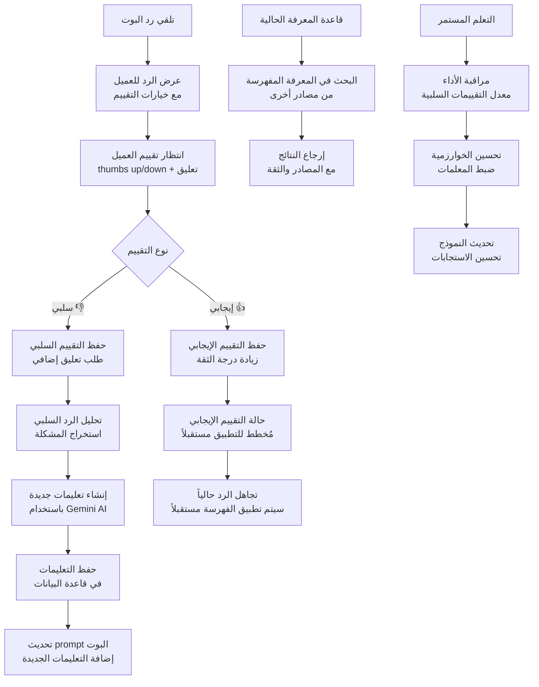
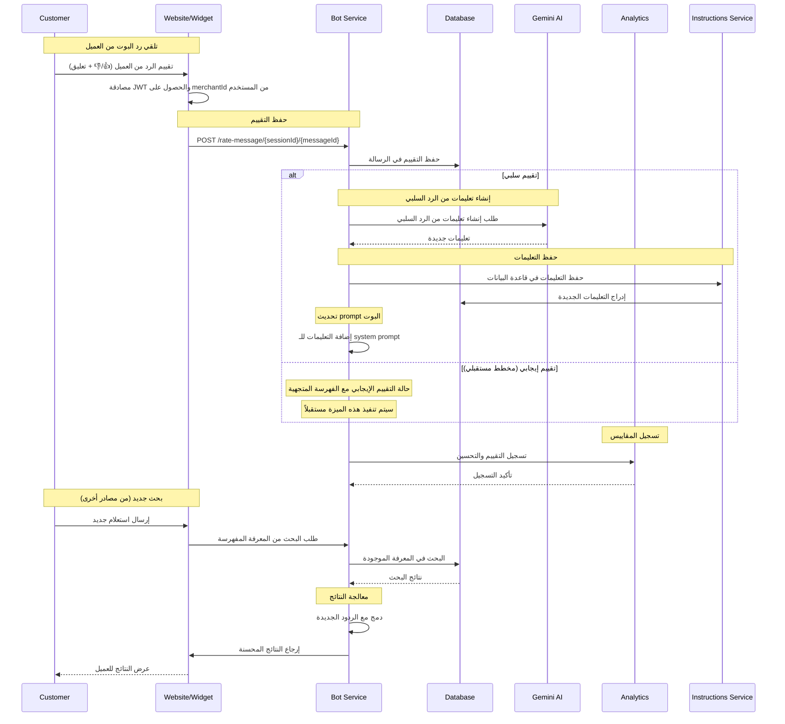
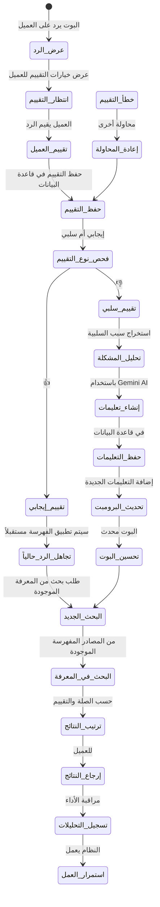
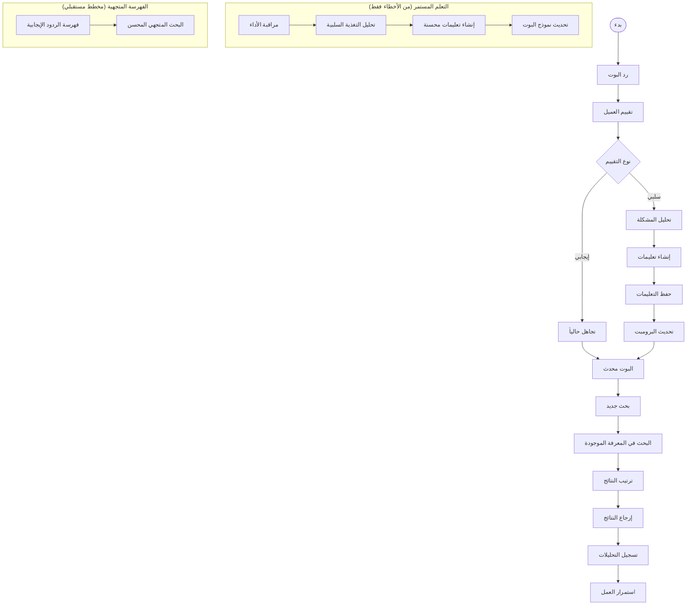

# ورك فلو تقييم الرسائل - نظام كليم الشامل

## نظرة عامة على النظام

نظام كليم يدعم تقييماً أساسياً لرسائل البوت مع التركيز على تحسين الاستجابات من خلال التغذية الراجعة السلبية:

- **تقييم الرسائل**: نظام تصنيف الردود من قبل العملاء المصادق عليهم (جيد/سيء) مع تعليقات
- **تحسين الذكاء الاصطناعي**: إنشاء تعليمات من الردود السيئة ✅ (مطبق حالياً)
- **التعلم من الأخطاء**: تحسين البوت بناءً على التغذية الراجعة السلبية
- **الانتقال للمتجهات**: فهرسة الردود الجيدة في Qdrant 🚧 (مخطط مستقبلي)
- **البحث الذكي**: استرجاع الردود المشابهة من المعرفة المفهرسة

## 1. مخطط التدفق العام (Flowchart)



## 2. مخطط التسلسل (Sequence Diagram)



## 3. آلة الحالات (State Machine)



### تعريف الحالات

| الحالة                | الوصف                              | الإجراءات المسموحة          |
| --------------------- | ---------------------------------- | ----------------------------- |
| `عرض_الرد`           | عرض رد البوت للعميل               | عرض خيارات التقييم          |
| `انتظار_التقييم`     | انتظار تقييم العميل               | عرض خيارات 👍/👎            |
| `تقييم_العميل`       | العميل يقيم الرد                  | حفظ التقييم                 |
| `حفظ_التقييم`        | حفظ التقييم في قاعدة البيانات     | تحديث سجل الرسالة           |
| `فحص_نوع_التقييم`    | تحديد نوع التقييم                 | تصنيف التقييم               |
| `تقييم_إيجابي`       | تقييم إيجابي من العميل           | تجاهل حالياً                |
| `تقييم_سلبي`         | تقييم سلبي من العميل             | تحليل المشكلة               |
| `تجاهل_الرد_حالياً`   | عدم تطبيق الفهرسة حالياً         | انتظار التطوير المستقبلي    |
| `تحليل_المشكلة`      | تحليل سبب التقييم السلبي          | استخراج المشكلة             |
| `إنشاء_تعليمات`      | إنشاء تعليمات جديدة               | استدعاء Gemini AI           |
| `حفظ_التعليمات`      | حفظ التعليمات في قاعدة البيانات   | إدراج التعليمات             |
| `تحديث_البرومبت`     | تحديث prompt البوت                | إضافة التعليمات الجديدة     |
| `تحسين_البوت`        | البوت محدث بالتعليمات الجديدة     | تحسين الاستجابات            |
| `البحث_الجديد`       | طلب بحث جديد                      | البحث في المعرفة الموجودة   |
| `البحث_في_المعرفة`   | البحث في المعرفة المفهرسة الموجودة | استرجاع النتائج             |
| `ترتيب_النتائج`      | ترتيب حسب الصلة والتقييم          | إعداد النتائج               |
| `إرجاع_النتائج`      | إرجاع النتائج للعميل              | عرض المحتوى                 |
| `تسجيل_التحليلات`    | تسجيل المقاييس والإحصائيات        | مراقبة الأداء               |

## 4. مخطط سير العمل التجاري (BPMN)



## 5. تفاصيل تقنية لكل مرحلة

### 5.1 مرحلة تقييم الرسائل

#### 5.1.1 نظام التقييم

**Endpoint**: `POST /rate-message/{sessionId}/{messageId}`

**المتطلبات**: مصادقة JWT مطلوبة

**كيفية الحصول على merchantId**: يتم استخراجه من `req.user.merchantId` للمستخدم المصادق عليه

**البيانات المطلوبة**:

```typescript
interface RateMessageDto {
  rating: 0 | 1; // 0 = سلبي، 1 = إيجابي
  feedback?: string; // تعليق إضافي (اختياري)
}
```

**عملية المعالجة**:

```typescript
async function rateMessage(
  sessionId: string,
  messageId: string,
  userId: string,
  rating: 0 | 1,
  feedback?: string,
  merchantId?: string,
) {
  // 1. البحث عن الرسالة وتحديث التقييم
  const ok = await this.messagesRepo.updateMessageRating({
    sessionId,
    messageId,
    userId,
    rating,
    feedback,
    merchantId,
  });

  if (!ok) {
    throw new BadRequestException('لم يتم العثور على الرسالة للتقييم');
  }

  // 2. إذا كان التقييم سلبياً، إنشاء تعليمات من الرد السلبي
  if (rating === 0) {
    const text = await this.messagesRepo.getMessageTextById(sessionId, messageId);
    if (text) {
      await this.geminiService.generateAndSaveInstructionFromBadReply(text, merchantId);
    }
  }

  // حالة التقييم الإيجابي مع إضافة الفهرسة (مخطط مستقبلي)
  // TODO: تنفيذ حالة التقييم الإيجابي وإضافة الفهرسة للمعرفة المتجهية
  // if (rating === 1 && isHighQuality(message)) {
  //   await vectorService.upsertKnowledge([...]);
  // }

  return { status: 'ok' };
}
```

#### 5.1.2 إنشاء تعليمات من الردود السلبية

**استدعاء Gemini AI**:

```typescript
async function generateInstructionFromBadReply(
  badReply: string,
): Promise<string> {
  const prompt = `
    الرد التالي تم تقييمه سلبيًا من قبل العميل: "${badReply}".
    صِغ توجيهًا مختصرًا جدًا (سطر واحد فقط، 15 كلمة أو أقل، لا تشرح السبب)
    لمنع مساعد الذكاء الاصطناعي من تكرار هذا الخطأ.
  `;

  const result = await model.generateContent(prompt);
  return result.response.text().trim();
}
```

**أمثلة للتعليمات المُنشأة**:

- "لا تقدم معلومات خاطئة عن الأسعار"
- "تأكد من فهم السؤال قبل الإجابة"
- "لا تفترض المعلومات، اطلب التوضيح"
- "ركز على حل مشكلة العميل"

### 5.2 مرحلة البحث في المعرفة الحالية

#### 5.2.1 البحث في المعرفة المفهرسة الموجودة

```typescript
async function searchExistingKnowledge(query: string, merchantId: string) {
  // البحث في المعرفة المفهرسة من مصادر أخرى (الأسئلة الشائعة، المنتجات، إلخ)
  const results = await searchService.search(query, merchantId);

  return results.map((result) => ({
    text: result.content,
    similarity: result.score,
    source: result.source,
  }));
}
```

## 6. معايير الأمان والحماية

### 6.1 التحقق من الصلاحية

```typescript
// التحقق من الصلاحية يتم من خلال JWT Auth Guard
// والتحقق من merchantId يتم من خلال req.user.merchantId
// الذي يتم تمريره تلقائياً من خلال AuthenticatedRequest interface
```

### 6.2 Rate Limiting

- **تقييم الرسائل**: يخضع للـ Rate Limiting العام للـ API
- **إنشاء التعليمات**: يخضع للـ Rate Limiting العام للـ API
- **البحث في المعرفة**: يخضع للـ Rate Limiting العام للـ API

### 6.3 منع الإساءة

```typescript
// فحص التعليقات المسيئة
function isAbusiveFeedback(feedback: string): boolean {
  const abusivePatterns = ['كلمة مسيئة', 'سب', 'شتم'];
  return abusivePatterns.some((pattern) =>
    feedback.toLowerCase().includes(pattern),
  );
}
```

## 7. مسارات الخطأ والتعامل معها

### 7.1 أخطاء التقييم

```javascript
INVALID_RATING; // قيمة تقييم غير صحيحة
MESSAGE_NOT_FOUND; // الرسالة غير موجودة
UNAUTHORIZED_ACCESS; // غير مخول للتقييم
SESSION_EXPIRED; // انتهت صلاحية الجلسة
```

### 7.2 أخطاء إنشاء التعليمات

```javascript
AI_GENERATION_FAILED; // فشل في إنشاء التعليمات
INSTRUCTION_TOO_LONG; // التعليمات طويلة جداً
INVALID_INSTRUCTION; // التعليمات غير صحيحة
GEMINI_API_ERROR; // خطأ في استدعاء Gemini API
```

## 8. خطة الاختبار والتحقق

### 8.1 اختبارات الوحدة

- اختبار نظام التقييم (إيجابي/سلبي) ✅ (مطبق حالياً)
- اختبار إنشاء التعليمات من الردود السلبية ✅ (مطبق حالياً)
- اختبار حفظ التقييم في قاعدة البيانات ✅ (مطبق حالياً)
- اختبار معالجة الأخطاء في التقييم ✅ (مطبق حالياً)

### 8.2 اختبارات التكامل

- اختبار التكامل مع Gemini AI ✅ (مطبق حالياً)
- اختبار تحديث prompt البوت ✅ (مطبق حالياً)
- اختبار معالجة الأخطاء في API ✅ (مطبق حالياً)
- اختبار المصادقة JWT ✅ (مطبق حالياً)

### 8.3 اختبارات الأداء

- اختبار أداء نظام التقييم ✅ (مطبق حالياً)
- اختبار أداء إنشاء التعليمات ✅ (مطبق حالياً)
- اختبار استهلاك الذاكرة والمعالج ✅ (مطبق حالياً)
- اختبار معدل الاستجابة للـ API ✅ (مطبق حالياً)

### 8.4 اختبارات مستقبلية (للفهرسة المتجهية)

- اختبار فهرسة الردود الجيدة 🚧 (مخطط مستقبلي)
- اختبار البحث المتجهي 🚧 (مخطط مستقبلي)
- اختبار توليد التضمينات بالجملة 🚧 (مخطط مستقبلي)
- اختبار فهرسة كميات كبيرة من المحتوى 🚧 (مخطط مستقبلي)

---

_تم إنشاء هذا التوثيق بواسطة نظام كليم لإدارة المتاجر الذكية_
