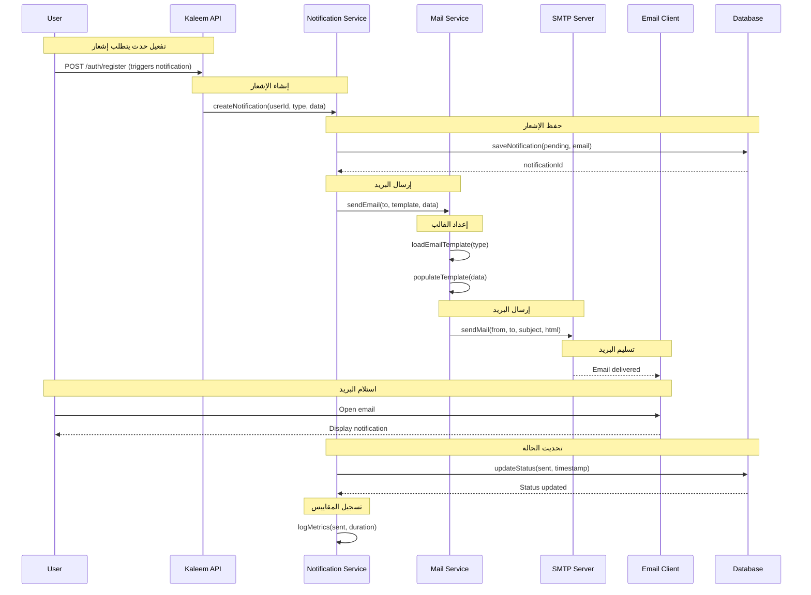
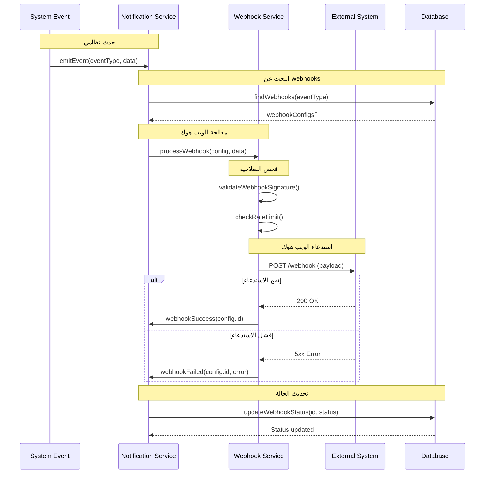
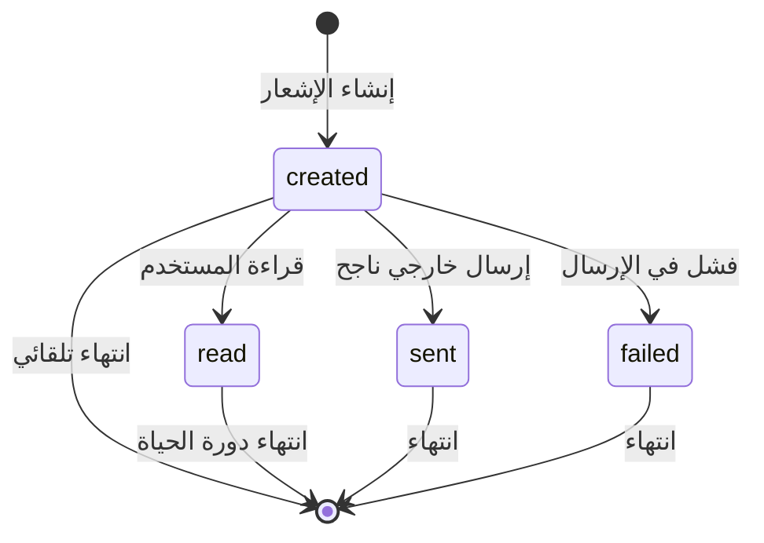
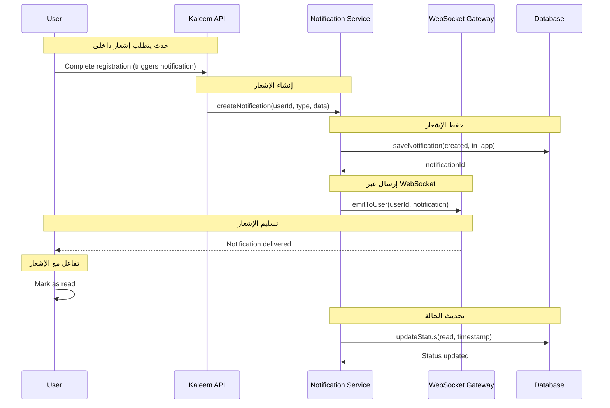
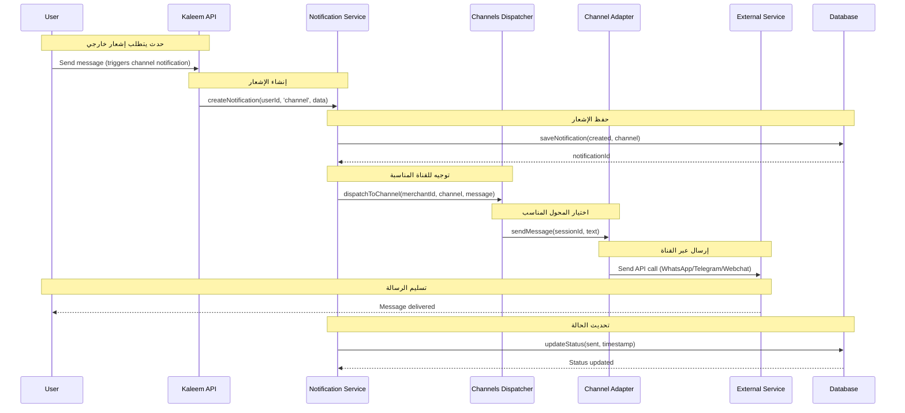

# نظام الإشعارات (Email/In-App/Channels/Webhooks) - نظام كليم

## نظرة عامة على النظام

نظام كليم يدعم نظام إشعارات متعدد القنوات مع تتبع حالات أساسي:

- **Email Notifications**: إرسال البريد الإلكتروني مع قوالب HTML متقدمة
- **In-App Notifications**: إشعارات داخل التطبيق مع نظام أحداث
- **Webhook Notifications**: استدعاءات HTTP للنظم الخارجية عبر نظام Channels
- **Channel-based Notifications**: إشعارات عبر قنوات متعددة (WhatsApp، Telegram، Webchat)
- **Notification States**: تتبع حالات الإشعارات (created/sent/failed)
- **Event-Driven Architecture**: نظام أحداث للتفعيل والتوزيع

## 1. مخطط التسلسل - Email Notification (Sequence Diagram)



## 2. مخطط التسلسل - Webhook Notification (Sequence Diagram)



## 3. آلة الحالات - Notification States (State Machine)



### تعريف الحالات

| الحالة      | الوصف                           | الإجراءات المسموحة         |
| ----------- | ------------------------------- | --------------------------- |
| `created`   | تم إنشاء الإشعار وجاهز للعرض   | عرض للمستخدم أو إرسال خارجي |
| `sent`      | تم إرسال الإشعار خارجياً بنجاح | انتهاء دورة الحياة         |
| `read`      | تم قراءة الإشعار من المستخدم   | انتهاء دورة الحياة         |
| `failed`    | فشل في إرسال الإشعار خارجياً   | تسجيل الخطأ وانتهاء       |

## 4. مخطط التسلسل - In-App Notification (Sequence Diagram)



## 5. مخطط التسلسل - Channel-based Notification (Sequence Diagram)



## 6. تفاصيل تقنية لكل مرحلة

### 6.1 مرحلة إنشاء الإشعار

#### 6.1.1 إنشاء الإشعار من حدث

```typescript
// src/modules/notifications/notifications.service.ts
async createNotification(input: NotifyInput): Promise<NotificationPayload> {
  const doc = await this.repo.create({
    userId: toObjectId(input.userId),
    merchantId: input.merchantId ? toObjectId(input.merchantId) : undefined,
    type: input.type,
    title: input.title,
    body: input.body,
    data: input.data,
    severity: input.severity || DEFAULT_SEVERITY,
    read: false,
  });

  // إشعار الأحداث
  this.eventEmitter.emit(EVENT_NOTIFY_USER, {
    userId: input.userId,
    notification: buildPayload(doc, toObjectId(input.userId), input),
  });

  return buildPayload(doc, toObjectId(input.userId), input);
}
```

#### 6.1.2 معالجة الأحداث

```typescript
// src/modules/notifications/notifications.module.ts
@Module({
  providers: [
    {
      provide: 'NOTIFICATION_EVENT_HANDLER',
      useFactory: (
        eventEmitter: EventEmitter2,
        notificationsService: NotificationsService,
      ) => {
        eventEmitter.on('notify.user', async (payload) => {
          await notificationsService.processNotificationEvent(payload);
        });
      },
      inject: [EventEmitter2, NotificationsService],
    },
  ],
})
export class NotificationsModule {}
```

### 6.2 مرحلة معالجة الإشعار

#### 6.2.1 معالجة البريد الإلكتروني

```typescript
// src/modules/mail/mail.service.ts
async sendVerificationEmail(email: string, code: string): Promise<void> {
  const link = this.buildVerificationLink(email, code);
  const html = this.generateVerificationTemplate(code, link);

  try {
    await this.transporter.sendMail({
      from: this.mailFrom,
      to: email,
      subject: 'تفعيل حسابك على منصة كليم',
      html,
    });

    this.logger.log(`Verification email sent to ${email}`);
  } catch (error) {
    this.logger.error(`Failed to send email to ${email}`, error);
    throw new InternalServerErrorException('فشل في إرسال بريد التفعيل');
  }
}
```

#### 6.2.2 معالجة الويب هوك

```typescript
// src/modules/webhooks/webhooks.service.ts
async processWebhookNotification(
  webhookConfig: WebhookConfig,
  eventType: string,
  data: unknown
): Promise<void> {
  const payload = {
    event: eventType,
    timestamp: new Date().toISOString(),
    data,
    webhookId: webhookConfig.id,
  };

  try {
    await this.httpService.post(webhookConfig.url, payload, {
      headers: {
        'Content-Type': 'application/json',
        'X-Webhook-Signature': this.generateSignature(payload, webhookConfig.secret),
      },
      timeout: 10000,
    });

    await this.updateWebhookStatus(webhookConfig.id, 'sent');
  } catch (error) {
    await this.updateWebhookStatus(webhookConfig.id, 'failed', error.message);
    throw error;
  }
}
```

### 6.3 مرحلة تتبع الحالات

#### 6.3.1 تحديث حالة الإشعار

```typescript
// src/modules/notifications/notifications.service.ts
async updateNotificationStatus(
  notificationId: string,
  status: NotificationStatus,
  metadata?: Record<string, unknown>
): Promise<void> {
  const update: UpdateQuery<NotificationDocument> = {
    status,
    ...(status === 'sent' && { sentAt: new Date() }),
    ...(status === 'failed' && { failedAt: new Date(), errorDetails: metadata }),
    ...(status === 'read' && { readAt: new Date() }),
  };

  await this.repo.update(notificationId, update);

  // تسجيل المقاييس
  this.metrics.recordNotificationStatus(notificationId, status);
}
```

#### 6.3.2 جدولة إعادة المحاولة

```typescript
// src/modules/notifications/notifications.service.ts
async scheduleRetry(notificationId: string, delayMs: number = 60000): Promise<void> {
  await this.queue.add('retry-notification', { notificationId }, {
    delay: delayMs,
    attempts: 3,
    backoff: {
      type: 'exponential',
      delay: 60000,
    },
  });
}
```

### 6.4 مرحلة إدارة القوالب

#### 6.4.1 قوالب البريد الإلكتروني

نظام البريد الإلكتروني يدعم قوالب HTML متقدمة للرسائل المهمة:

```typescript
// src/modules/mail/mail.service.ts
private generateVerificationTemplate(code: string, link: string): string {
  const year = new Date().getFullYear();
  return `
<!DOCTYPE html>
<html dir="rtl" lang="ar">
<head>
  <meta charset="UTF-8">
  <meta name="viewport" content="width=device-width, initial-scale=1.0">
  <title>تفعيل الحساب</title>
  <style>
    * { font-family: 'Segoe UI', Tahoma, Geneva, Verdana, sans-serif; box-sizing: border-box; }
    body { background-color: #f7f9fc; margin: 0; padding: 20px; }
    .container { max-width: 600px; margin: 0 auto; background: white; border-radius: 12px; overflow: hidden; box-shadow: 0 5px 15px rgba(0, 0, 0, 0.05); }
    .header { background: linear-gradient(135deg, #4f46e5, #7c3aed); padding: 30px 20px; text-align: center; }
    .logo { color: white; font-size: 28px; font-weight: bold; margin: 0; }
    .content { padding: 40px 30px; color: #333; line-height: 1.6; }
    .title { color: #2d3748; font-size: 24px; margin-top: 0; text-align: center; }
    .code-container { background: #f0f7ff; border: 1px dashed #4f46e5; border-radius: 8px; padding: 20px; margin: 30px 0; text-align: center; }
    .verification-code { font-size: 32px; font-weight: bold; letter-spacing: 3px; color: #4f46e5; margin: 10px 0; }
    .cta-button { display: block; width: 80%; max-width: 300px; margin: 30px auto; padding: 14px; background: #4f46e5; color: white !important; text-align: center; border-radius: 8px; text-decoration: none; font-weight: bold; font-size: 18px; transition: all 0.3s ease; }
    .cta-button:hover { background: #4338ca; transform: translateY(-2px); box-shadow: 0 4px 10px rgba(79, 70, 229, 0.3); }
    .footer { text-align: center; padding: 20px; color: #718096; font-size: 14px; border-top: 1px solid #e2e8f0; }
    .note { background: #fffaf0; padding: 15px; border-radius: 8px; border-right: 4px solid #f6ad55; margin-top: 25px; }
    @media (max-width: 480px) { .content { padding: 25px 20px; } .verification-code { font-size: 28px; } }
  </style>
</head>
<body>
  <div class="container">
    <div class="header"><h1 class="logo">كليم</h1></div>
    <div class="content">
      <h2 class="title">تفعيل حسابك</h2>
      <p>مرحباً بك في كليم</p>
      <p>لإكمال عملية إنشاء حسابك، يرجى استخدام كود التفعيل التالي:</p>
      <div class="code-container">
        <p>كود التفعيل</p>
        <div class="verification-code">${code}</div>
        <p>صالح لمدة <b>15 دقيقة</b> فقط</p>
      </div>
      <p>أو يمكنك الضغط على الزر أدناه لتفعيل حسابك مباشرةً:</p>
      <a href="${verificationLink}" class="cta-button">تفعيل الحساب</a>
      <div class="note"><p>إذا لم تطلب هذا البريد، يمكنك تجاهله بأمان.</p></div>
    </div>
    <div class="footer">
      <p>© ${year} كليم . جميع الحقوق محفوظة</p>
      <p>هذه الرسالة أرسلت تلقائياً، يرجى عدم الرد عليها</p>
    </div>
  </div>
</body>
</html>
  `.trim();
}
```

#### 6.4.2 قوالب الإشعارات البسيطة

```typescript
// src/modules/notifications/notification-templates.ts
export type TemplateKey =
  | 'faq.updated'
  | 'faq.deleted'
  | 'embeddings.completed'
  | 'embeddings.failed'
  | 'knowledge.urls.queued'
  | 'embeddings.batch.completed'
  | 'missingResponses.stats';

export function buildNotification(key: TemplateKey): {
  title: string;
  body: string;
} {
  switch (key) {
    case 'faq.updated':
      return {
        title: 'تم تحديث سؤال شائع',
        body: 'تم تحديث السؤال/الجواب بنجاح.',
      };
    case 'faq.deleted':
      return {
        title: 'تم حذف سؤال/جواب نهائيًا',
        body: 'تم حذف العنصر ولن يظهر في النتائج.',
      };
    // ... المزيد من القوالب للنظام الداخلي
    default:
      return { title: 'إشعار', body: '' };
  }
}
```

## 7. سياسات الأمان والحماية

### 7.1 حماية البيانات الأساسية

نظام الإشعارات يطبق إجراءات أمان أساسية لحماية البيانات:

```typescript
// src/modules/notifications/notifications.service.ts
async notifyUser(
  userId: string,
  input: Omit<NotifyInput, 'userId'> & { userId?: string },
): Promise<NotificationDocument> {
  // التحقق من صحة البيانات الأساسية
  if (!input.title || input.title.length > 200) {
    throw new BadRequestException('عنوان الإشعار غير صالح');
  }

  if (input.body && input.body.length > 1000) {
    throw new BadRequestException('محتوى الإشعار طويل جداً');
  }

  // إنشاء الإشعار بأمان
  const doc = await this._createNotificationDocument(uid, input);

  return doc;
}
```

### 7.2 منع الهجمات الأساسية

```typescript
// src/modules/notifications/schemas/notification.schema.ts
@Schema({ timestamps: true })
export class Notification {
  @Prop({ type: Types.ObjectId, ref: 'User', index: true })
  userId: Types.ObjectId; // ربط بالمستخدم فقط

  @Prop({ required: true })
  title: string; // نص عادي فقط

  @Prop()
  body?: string; // نص عادي فقط

  @Prop({ type: Object })
  data?: Record<string, unknown>; // بيانات منظمة آمنة

  // ... باقي الحقول
}
```

### 7.3 حماية من التكرار والإساءة

```typescript
// src/modules/notifications/notifications.service.ts
async markRead(userId: string, notifId: string): Promise<{ ok: true }> {
  // التحقق من ملكية الإشعار للمستخدم
  const filter: FilterQuery<NotificationDocument> = {
    _id: toObjectId(notifId),
    userId: toObjectId(userId), // أمان: المستخدم يرى إشعاراته فقط
  };

  await this.notifModel.updateOne(filter, {
    $set: { read: true, readAt: new Date() },
  });

  return { ok: true };
}
```

## 8. مراقبة الأداء والأمان

### 8.1 مراقبة الأداء الأساسية

نظام الإشعارات يتضمن مراقبة أساسية للأداء والأخطاء:

```typescript
// src/modules/notifications/notifications.service.ts
@Injectable()
export class NotificationsService {
  private readonly logger = new Logger(NotificationsService.name);

  async notifyUser(
    userId: string,
    input: Omit<NotifyInput, 'userId'> & { userId?: string },
  ): Promise<NotificationDocument> {
    this.logger.log(`Creating notification for user ${userId}, type: ${input.type}`);

    try {
      const doc = await this._createNotificationDocument(uid, input);
      this.logger.log(`Notification created successfully: ${doc._id}`);
      return doc;
    } catch (error) {
      this.logger.error(`Failed to create notification for user ${userId}`, error);
      throw error;
    }
  }
}
```

### 8.2 مراقبة أخطاء البريد الإلكتروني

```typescript
// src/modules/mail/mail.service.ts
@Injectable()
export class MailService {
  private readonly logger = new Logger(MailService.name);

  async sendVerificationEmail(email: string, code: string): Promise<void> {
    try {
      await this.transporter.sendMail({
        from: this.mailFrom,
        to: email,
        subject: SUBJECT_VERIFY,
        html,
      });
      this.logger.log(`Verification email sent to ${email}`);
    } catch (err: unknown) {
      const stack = err instanceof Error ? err.stack : undefined;
      this.logger.error(`Failed to send email to ${email}`, stack);
      throw new InternalServerErrorException('فشل في إرسال بريد التفعيل');
    }
  }
}
```

### 8.3 مراقبة حالة النظام

النظام يعتمد على مراقبة عامة للخدمات الأساسية:
- مراقبة حالة قاعدة البيانات
- مراقبة حالة خدمة البريد الإلكتروني
- مراقبة حالة خدمة WebSocket للإشعارات الداخلية

## 9. خطة الاختبار والتحقق

### 9.1 اختبارات الوحدة

- اختبار إنشاء الإشعارات الأساسية
- اختبار قراءة وتحديث حالة الإشعارات
- اختبار قوالب الإشعارات البسيطة

### 9.2 اختبارات التكامل

- اختبار إرسال البريد الإلكتروني للتفعيل وإعادة تعيين كلمة المرور
- اختبار إرسال الإشعارات عبر WebSocket
- اختبار استدعاء الـ webhooks للنظم الخارجية

### 9.3 اختبارات الأداء

- اختبار معالجة الإشعارات تحت الحمل العادي
- اختبار زمن الاستجابة للإشعارات الداخلية
- اختبار استهلاك الموارد لخدمة البريد الإلكتروني

### 9.4 اختبارات الأمان

- اختبار التحقق من ملكية الإشعارات للمستخدمين
- اختبار حماية البيانات من التسريب
- اختبار منع الوصول غير المصرح به

---

_تم إنشاء هذا التوثيق بواسطة نظام كليم لإدارة المتاجر الذكية_
