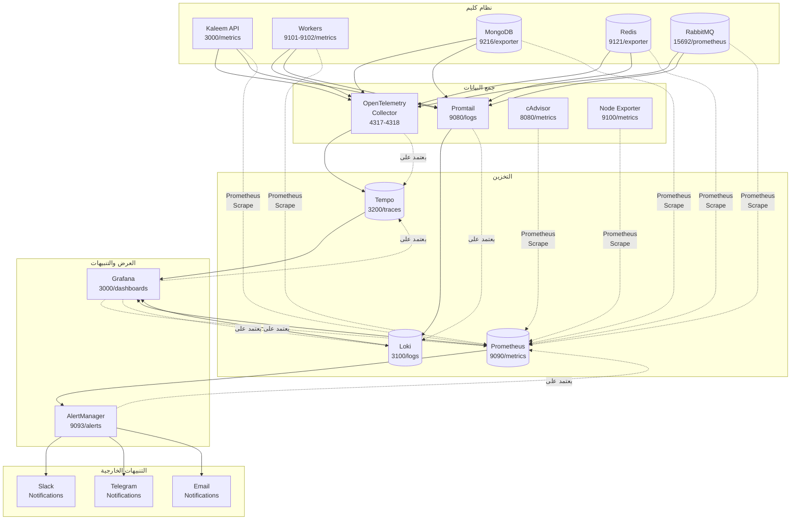
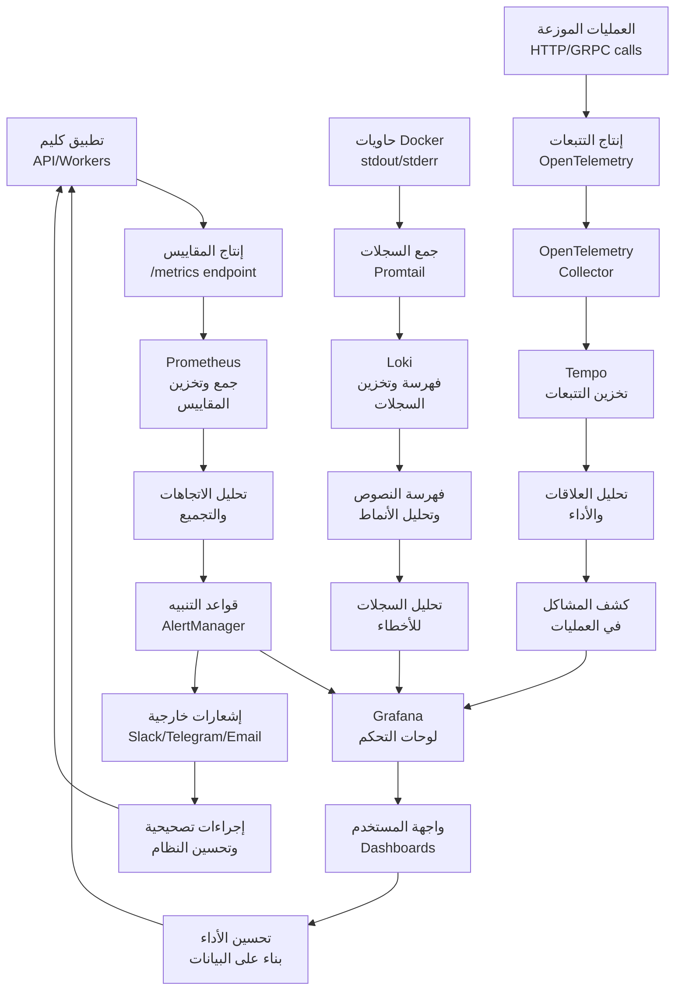
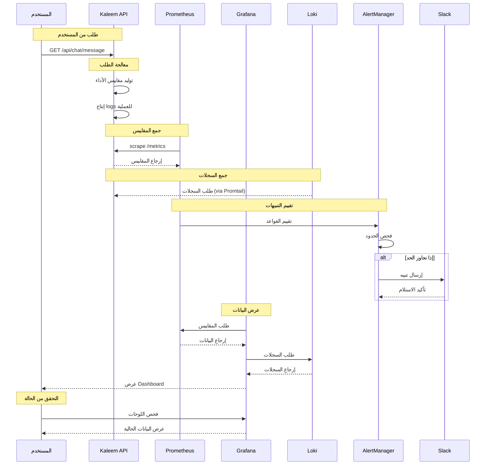
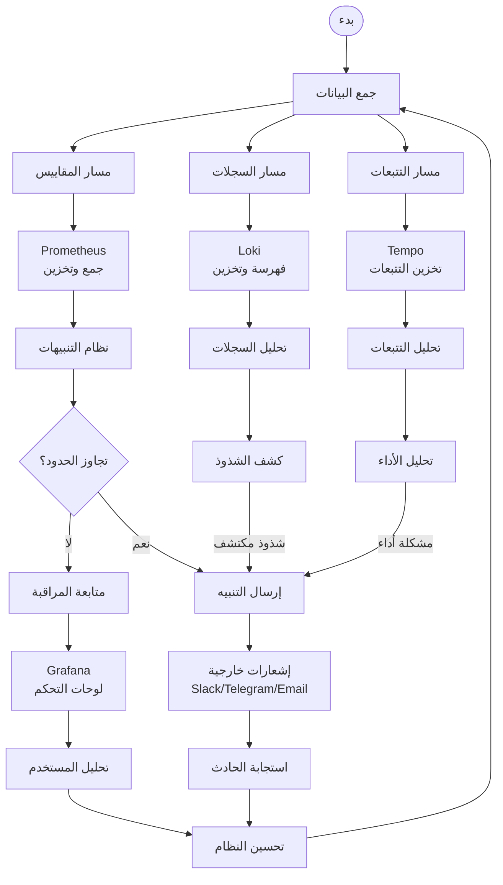

# ورك فلو المراقبة والـ Observability - نظام كليم الشامل

## نظرة عامة على النظام

نظام كليم يدعم منظومة مراقبة ومرصد متقدمة لضمان التوافرية العالية والأداء المثالي:

- **Prometheus**: جمع وتخزين المقاييس
- **Grafana**: لوحات تحكم بصرية وتحليلات
- **Loki**: جمع وتخزين السجلات المركزي
- **AlertManager**: نظام التنبيهات والإشعارات
- **OpenTelemetry**: تتبع العمليات الموزعة
- **Tempo**: تخزين وتحليل التتبعات
- **Promtail**: جمع السجلات من Docker
- **cAdvisor**: مراقبة موارد الحاويات
- **Runbooks**: دليل التعامل مع الحوادث

## 1. مخطط التكامل والنشر (Deployment/Component Diagram)



## 2. مخطط تدفق البيانات (Data Flow Diagram)



## 3. مخطط التسلسل (Sequence Diagram)



## 4. مخطط سير العمل التجاري (BPMN)



## 5. تفاصيل تقنية لكل مرحلة

### 5.1 مرحلة جمع البيانات

#### 5.1.1 مقاييس Prometheus

```yaml
# observability/prometheus.yml - scrape configurations
scrape_configs:
  - job_name: 'kaleem-api'
    static_configs:
      - targets: ['api:3000']
    metrics_path: '/metrics'
    scrape_interval: 30s
    scrape_timeout: 10s
    honor_labels: true
    params:
      format: ['prometheus']

  - job_name: 'kaleem-workers'
    static_configs:
      - targets:
          - 'ai-reply-worker:9101'
          - 'webhook-dispatcher:9102'
    metrics_path: '/metrics'
    scrape_interval: 30s

  - job_name: 'mongodb'
    static_configs:
      - targets: ['mongodb-exporter:9216']
    scrape_interval: 30s

  - job_name: 'redis'
    static_configs:
      - targets: ['redis-exporter:9121']
    scrape_interval: 30s

  - job_name: 'rabbitmq'
    static_configs:
      - targets: ['rabbitmq:15692']
    scrape_interval: 30s

  - job_name: 'node-exporter'
    static_configs:
      - targets: ['node-exporter:9100']
    scrape_interval: 30s

  - job_name: 'cadvisor'
    static_configs:
      - targets: ['cadvisor:8080']
    scrape_interval: 30s
```

#### 5.1.2 جمع السجلات

```yaml
# promtail/config.yml
scrape_configs:
  - job_name: docker-logs
    docker_sd_configs:
      - host: unix:///var/run/docker.sock
        refresh_interval: 10s
    relabel_configs:
      - source_labels: ['__meta_docker_container_name']
        target_label: 'container'
      - source_labels:
          ['__meta_docker_container_label_com_docker_compose_service']
        target_label: 'service'
```

#### 5.1.3 تتبع OpenTelemetry

```typescript
// src/tracing.ts
import { NodeSDK } from '@opentelemetry/sdk-node';
import { getNodeAutoInstrumentations } from '@opentelemetry/auto-instrumentations-node';

const sdk = new NodeSDK({
  serviceName: 'kaleem-api',
  serviceVersion: '1.0.0',
  instrumentations: [getNodeAutoInstrumentations()],
});

sdk.start();
```

### 5.2 مرحلة التخزين والفهرسة

#### 5.2.1 تخزين Prometheus

```yaml
# prometheus.yml
storage:
  tsdb:
    path: /prometheus
    retention.time: 15d
    retention.size: 0
```

#### 5.2.2 تخزين Loki

```yaml
# loki/config.yml
schema_config:
  configs:
    - from: 2020-10-24
      store: boltdb-shipper
      object_store: filesystem
      schema: v13

limits_config:
  ingestion_rate_mb: 16
  max_global_streams_per_user: 0
  retention_period: 168h
```

#### 5.2.3 تخزين Tempo

```yaml
# tempo/tempo.yml
storage:
  trace:
    backend: local
    local:
      path: /var/tempo/blocks

compactor:
  compaction:
    block_retention: 168h
```

### 5.3 مرحلة التنبيهات

#### 5.3.1 قواعد التنبيهات

```yaml
# alerts/core.yml
groups:
  - name: core
    rules:
      - alert: APIHighErrorRate
        expr: |
          sum(rate(http_requests_total{job="kaleem-api",status_code=~"5.."}[5m]))
          / sum(rate(http_requests_total{job="kaleem-api"}[5m])) > 0.01
        for: 5m
        labels:
          severity: warning
        annotations:
          summary: 'API 5xx > 1% لمدة 5 دقائق'
          runbook_url: 'https://kb.kaleem-ai.com/runbooks/api-high-error-rate'
```

#### 5.3.2 إعدادات AlertManager

```yaml
# alertmanager.yml
route:
  group_by: ['alertname']
  group_wait: 10s
  group_interval: 10s
  repeat_interval: 1h
  receiver: 'default'

receivers:
  - name: 'default'
    slack_configs:
      - api_url: '${SLACK_WEBHOOK_URL}'
        channel: '#alerts'
        title: 'Kaleem Alert'
        text: '{{ range .Alerts }}{{ .Annotations.summary }}{{ end }}'
```

### 5.4 مرحلة العرض والتحليل

#### 5.4.1 لوحات Grafana

```json
// observability/grafana/dashboards/api-health.json
{
  "dashboard": {
    "title": "Kaleem API Health",
    "panels": [
      {
        "title": "Request Rate (RPS)",
        "type": "timeseries",
        "targets": [
          {
            "expr": "rate(http_requests_total[5m])",
            "legendFormat": "{{method}} {{route}}"
          }
        ]
      }
    ]
  }
}
```

#### 5.4.2 مصادر البيانات

```yaml
# observability/grafana/datasource.yml
apiVersion: 1
datasources:
  - name: Prometheus
    type: prometheus
    access: proxy
    url: http://prometheus:9090
    isDefault: true

  - name: Loki
    type: loki
    access: proxy
    url: http://loki:3100

  - name: Tempo
    type: tempo
    access: proxy
    url: http://tempo:3200
```

## 6. مراقبة الأخطاء والحوادث

### 6.1 نظام مراقبة الأخطاء مع Sentry

```typescript
// src/common/services/sentry.service.ts
@Injectable()
export class SentryService {
  private readonly logger = new Logger(SentryService.name);
  private isInitialized = false;

  constructor(private readonly configService: ConfigService) {}

  initialize(): void {
    const enabled = this.configService.get<string>('SENTRY_ENABLED', 'true') === 'true';
    if (!enabled) {
      this.logger.log('Sentry disabled by SENTRY_ENABLED=false');
      return;
    }

    const dsn = this.configService.get<string>('SENTRY_DSN');
    const environment = this.configService.get<string>('NODE_ENV', 'development');
    const release = this.configService.get<string>('APP_VERSION', '1.0.0');

    Sentry.init({
      dsn,
      environment,
      release,
      integrations: [
        new Sentry.Integrations.Http({ tracing: true }),
        new Sentry.Integrations.Console(),
        nodeProfilingIntegration(),
      ],
      tracesSampleRate: environment === 'production' ? 0.1 : 1.0,
    });

    this.isInitialized = true;
  }

  captureException(exception: unknown, context?: SentryContext): void {
    if (!this.isInitialized) return;

    Sentry.withScope((scope) => {
      if (context) {
        if (context.userId) scope.setUser({ id: context.userId });
        if (context.merchantId) scope.setTag('merchantId', context.merchantId);
        if (context.requestId) scope.setTag('requestId', context.requestId);
        if (context.tags) {
          Object.entries(context.tags).forEach(([key, value]) => {
            scope.setTag(key, value);
          });
        }
        if (context.extra) {
          Object.entries(context.extra).forEach(([key, value]) => {
            scope.setExtra(key, value);
          });
        }
      }
      Sentry.captureException(exception);
    });
  }
}
```

### 6.2 مقاييس Prometheus وقواعد التنبيهات

```yaml
# observability/alerts/core.yml
groups:
  - name: error_monitoring
    rules:
      - alert: APIHighErrorRate
        expr: |
          sum(rate(http_requests_total{job="kaleem-api",status_code=~"5.."}[5m]))
          / sum(rate(http_requests_total{job="kaleem-api"}[5m])) > 0.01
        for: 5m
        labels:
          severity: warning
        annotations:
          summary: 'API 5xx > 1% لمدة 5 دقائق'
          description: 'راجع logs و traces للمسارات الأكثر تأثراً.'
          runbook_url: 'https://kb.kaleem-ai.com/runbooks/api-high-error-rate'

      - alert: RabbitMQQueueBacklog
        expr: rabbitmq_queue_messages{queue=~".*\\.q$"} > 1000
        for: 10m
        labels:
          severity: warning
        annotations:
          summary: 'RabbitMQ backlog مرتفع'
          description: 'الطابور {{ $labels.queue }} تجاوز 1000 رسالة.'
          runbook_url: 'https://kb.kaleem-ai.com/runbooks/rabbitmq-backlog'
```

## 7. Runbooks والتعامل مع الحوادث

### 7.1 هيكل Runbooks

```
docs/runbooks/
├── README.md                     # دليل الاستخدام
├── incident-template.md          # قالب الحادث
├── api-high-error-rate.md        # 5xx عالي
├── high-5xx-error-rate.md        # أخطاء 5xx عامة
├── high-latency.md               # زمن استجابة عالي
├── db-connections-saturation.md  # تشبع قاعدة البيانات
├── redis-connection-exhaustion.md # نفدت اتصالات Redis
├── cache-miss-spike.md           # زيادة في فشل الكاش
├── qdrant-latency-spikes.md      # تأخر Qdrant
├── minio-bucket-growth.md        # نمو MinIO كبير
├── auth-anomaly.md               # شذوذ في المصادقة
├── webhook-signature-failures.md # فشل تواقيع الويب هوك
├── api-high-error-rate.md        # معدل خطأ API عالي
├── slow-query-hotspot.md         # استعلامات بطيئة
├── disk-space-critical.md        # نفدت مساحة القرص
└── high-p95-latency.md           # زمن استجابة p95 عالي
```

### 7.2 هيكل Runbook نموذجي

````markdown
# Runbook — [اسم المشكلة]

## الأعراض

- [وصف الأعراض المرصودة]
- [مؤشرات في Grafana]
- [سجلات ذات صلة]

## التشخيص السريع

### 1. التحقق من اللوحات

```promql
# Prometheus Query
up{job="kaleem-api"} == 0
```
````

### 2. فحص السجلات

```logql
# Loki Query
{job="kaleem-api"} | json | level="error"
```

### 3. فحص التتبعات

```tempo
# Tempo Query
{ service.name = "kaleem-api" && status.code = "ERROR" }
```

## الإجراءات المطلوبة

### المستوى 1: التحقق الآلي

- [ ] فحص حالة الخدمات
- [ ] إعادة تشغيل الخدمات المتأثرة

### المستوى 2: التحقيق العميق

- [ ] تحليل الأسباب الجذرية
- [ ] مراجعة التغييرات الأخيرة

### المستوى 3: الإصلاح الجذري

- [ ] تحديث الكود
- [ ] تحسين الإعدادات
- [ ] ترقية البنية التحتية

## الوقاية

### تحسينات فورية

- [ ] زيادة الموارد
- [ ] تحسين الاستعلامات
- [ ] إضافة كاش إضافي

### تحسينات طويلة الأمد

- [ ] مراجعة البنية التحتية
- [ ] إضافة مراقبة إضافية
- [ ] تحسين خوارزميات التجميع

````

## 7. معايير الأمان والحماية

### 7.1 أمان المراقبة
```typescript
// مصادقة Grafana
GF_SECURITY_ADMIN_USER=admin
GF_SECURITY_ADMIN_PASSWORD=${SECURE_PASSWORD}
GF_USERS_ALLOW_SIGN_UP=false

// حماية Prometheus
--web.enable-lifecycle=false
--web.config.file=/etc/prometheus/web.yml
````

### 7.2 تشفير البيانات

```yaml
# Loki encryption
limits_config:
  ingestion_rate_mb: 16
  ingestion_burst_size_mb: 32

# Tempo encryption
auth_enabled: true
```

### 7.3 حماية من الهجمات

```yaml
# Rate limiting في Promtail
limits_config:
  max_streams: 10000
  max_line_size: 262144
```

## 8. أمان المراقبة والحماية

### 8.1 أمان Grafana و Prometheus

```yaml
# docker-compose.mvp.yml - أمان Grafana
grafana:
  environment:
    - GF_SECURITY_ADMIN_USER=admin
    - GF_SECURITY_ADMIN_PASSWORD=${GRAFANA_ADMIN_PASSWORD}
    - GF_USERS_ALLOW_SIGN_UP=false
    - GF_SERVER_ROOT_URL=https://grafana.kaleem-ai.com/

# docker-compose.mvp.yml - أمان Prometheus
prometheus:
  command:
    - '--web.enable-lifecycle'
    - '--web.config.file=/etc/prometheus/web.yml'
```

### 8.2 تشفير البيانات الحساسة

```yaml
# observability/loki/config.yml
limits_config:
  ingestion_rate_mb: 16
  ingestion_burst_size_mb: 32

# observability/tempo/tempo.yml
auth_enabled: true
```

## 9. خطة الاختبار والتحقق

### 9.1 اختبارات الوحدة

- اختبار قواعد التنبيهات (`alerts/core.yml`)
- اختبار استيراد لوحات Grafana (`grafana/dashboards/`)
- اختبار جمع المقاييس (`prometheus.yml`)
- اختبار فهرسة السجلات (`loki/config.yml`)
- اختبار تتبع OpenTelemetry (`otel/config.yaml`)

### 9.2 اختبارات التكامل

- اختبار تكامل Prometheus مع API (`docker-compose.mvp.yml`)
- اختبار تكامل Loki مع Promtail (`observability/`)
- اختبار تكامل Grafana مع جميع مصادر البيانات
- اختبار نظام التنبيهات (`alertmanager.yml`)
- اختبار تكامل Sentry مع نظام الأخطاء

### 9.3 اختبارات الأداء

- اختبار أداء جمع المقاييس تحت الحمل
- اختبار أداء فهرسة السجلات (1000+ سجل/ثانية)
- اختبار أداء عرض اللوحات في Grafana
- اختبار أداء التنبيهات وسرعة الاستجابة
- اختبار استهلاك الموارد للـ stack كامل

### 9.4 اختبارات التحميل والضغط

- اختبار تحت الحمل العالي (10000+ طلب/دقيقة)
- اختبار استهلاك الموارد مع نمو البيانات
- اختبار زمن الاستجابة للمقاييس والسجلات
- اختبار استهلاك الشبكة مع Promtail
- اختبار توافرية النظام عند فشل مكون واحد

---

_تم إنشاء هذا التوثيق بواسطة نظام كليم لإدارة المتاجر الذكية_
