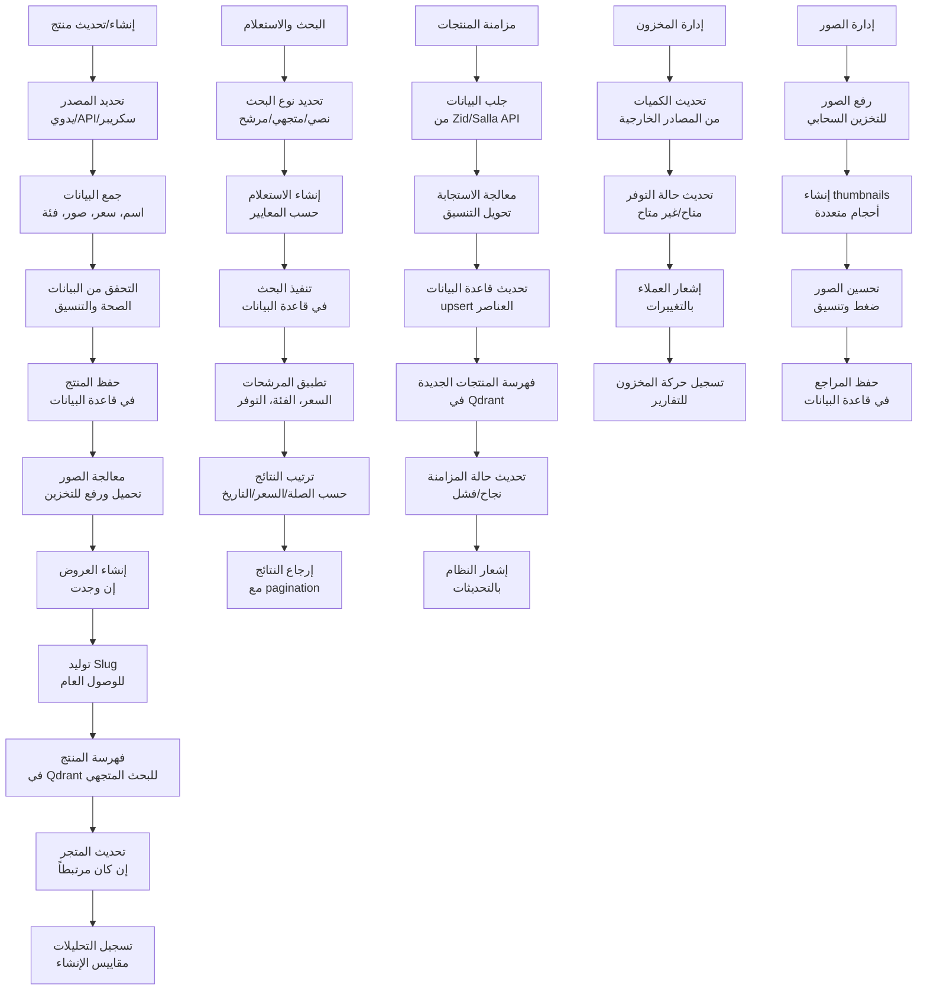
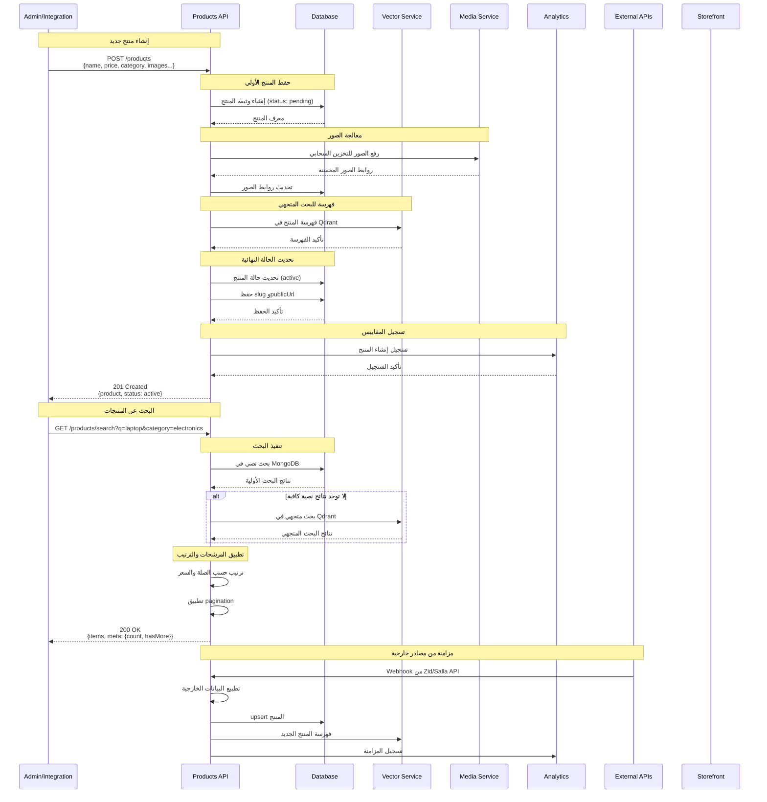
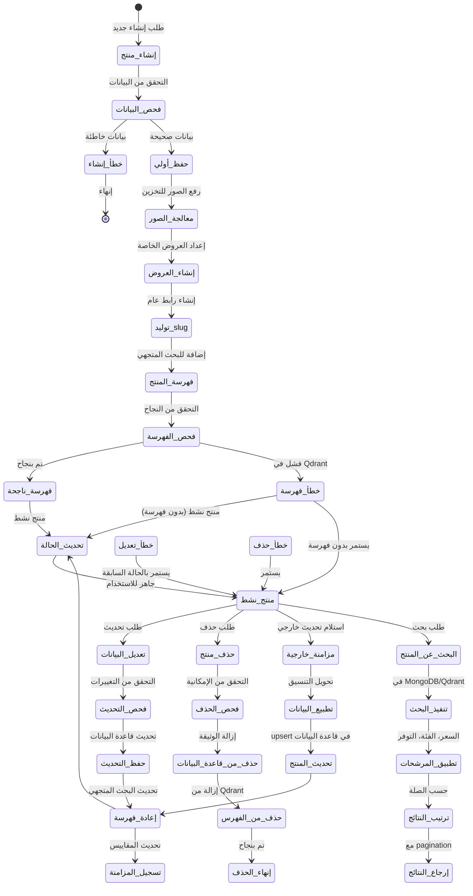
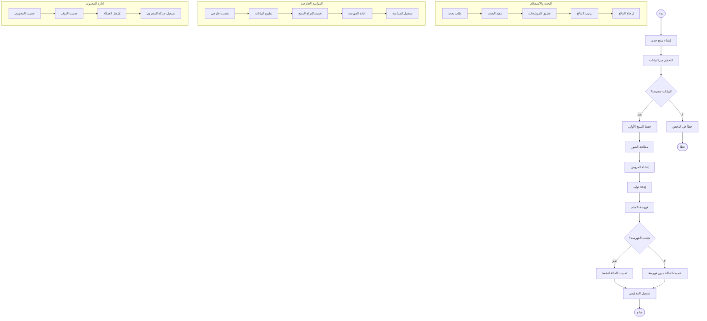

# ورك فلو إدارة المنتجات - نظام كليم الشامل

## نظرة عامة على النظام

نظام كليم يدعم إدارة شاملة للمنتجات مع تكامل متقدم للمزامنة والفهرسة:

- **مصادر المنتجات**: يدوي، API (Zid/Salla)، سكريبر
- **إدارة البيانات**: CRUD كامل مع دعم الصور والعروض
- **فهرسة ذكية**: تكامل مع Qdrant للبحث المتجهي
- **مزامنة تلقائية**: من المتاجر الخارجية
- **إدارة المخزون**: تتبع الكميات والتوفر
- **البحث المتقدم**: نصي ومتجهي مع pagination

## 1. مخطط التدفق العام (Flowchart)



## 2. مخطط التسلسل (Sequence Diagram)



## 3. آلة الحالات (State Machine)



### تعريف الحالات


| الحالة                   | الوصف                                               | الإجراءات المسموحة           |
| ------------------------------ | -------------------------------------------------------- | --------------------------------------------- |
| `إنشاء_منتج`          | بدء عملية إنشاء منتج جديد           | جمع البيانات المطلوبة      |
| `فحص_البيانات`      | التحقق من صحة البيانات المدخلة | التحقق من الأنواع والقيم |
| `حفظ_أولي`              | حفظ المنتج في قاعدة البيانات     | إدراج الوثيقة الأولية      |
| `معالجة_الصور`      | رفع وتحسين الصور                           | تحميل للتخزين السحابي      |
| `إنشاء_العروض`      | إعداد العروض والتخفيضات             | حساب الأسعار الجديدة        |
| `توليد_slug`              | إنشاء رابط عام للمنتج                  | توليد slug فريد                      |
| `فهرسة_المنتج`      | إضافة المنتج للبحث المتجهي        | فهرسة في Qdrant                        |
| `فحص_الفهرسة`        | التحقق من نجاح الفهرسة                | اختبار الإضافة                   |
| `تحديث_الحالة`      | تحديث حالة المنتج                         | تعيين الحالة النهائية      |
| `منتج_نشط`              | المنتج جاهز ومتاح للبحث              | جميع العمليات                     |
| `تعديل_البيانات`  | طلب تحديث بيانات المنتج              | تعديل الحقول                       |
| `حذف_منتج`              | طلب حذف المنتج                               | إزالة من النظام                  |
| `مزامنة_خارجية`    | استلام تحديث من مصدر خارجي         | تحديث تلقائي                       |
| `البحث_عن_المنتج` | طلب بحث عن منتجات                          | تنفيذ الاستعلام                 |

## 4. مخطط سير العمل التجاري (BPMN)



## 5. تفاصيل تقنية لكل مرحلة

### 5.1 مرحلة الإنشاء والإعداد

#### 5.1.1 إنشاء منتج جديد

**Endpoint**: `POST /products`

**البيانات المطلوبة**:

```typescript
interface CreateProductDto {
  // البيانات الأساسية
  name: string; // اسم المنتج (مطلوب)
  price: number; // السعر (مطلوب)
  category: string; // معرف الفئة (مطلوب)
  currency?: Currency; // العملة (افتراضي: SAR)

  // البيانات الاختيارية
  description?: string; // وصف المنتج
  images?: string[]; // روابط الصور
  specsBlock?: string[]; // مواصفات المنتج
  keywords?: string[]; // كلمات مفتاحية
  isAvailable?: boolean; // حالة التوفر
  offer?: OfferDto; // معلومات العرض

  // مصدر البيانات
  source?: ProductSource; // manual/api/scraper
  originalUrl?: string; // رابط المصدر
  sourceUrl?: string; // رابط إضافي
  externalId?: string; // معرف خارجي

  // روابط عامة
  slug?: string; // رابط مخصص
  storefrontSlug?: string; // رابط المتجر
  storefrontDomain?: string; // نطاق مخصص
}
```

#### 5.1.2 حفظ المنتج الأولي

```typescript
const product = await productsRepo.create({
  merchantId: new Types.ObjectId(merchantId),
  name: dto.name,
  price: dto.price,
  category: new Types.ObjectId(dto.category),
  currency: dto.currency || Currency.SAR,
  description: dto.description || '',
  images: dto.images || [],
  specsBlock: dto.specsBlock || [],
  keywords: dto.keywords || [],
  isAvailable: dto.isAvailable ?? true,
  source: mapSource(dto.source),
  status: 'active',
  syncStatus: dto.source === ProductSource.API ? 'pending' : 'ok',
});
```

#### 5.1.3 معالجة الصور

```typescript
// رفع الصور للتخزين السحابي
const uploadResult = await productMediaService.uploadProductImagesToMinio(
  productId,
  merchantId,
  files,
);

// تحديث قاعدة البيانات
product.images = uploadResult.urls;
await product.save();
```

#### 5.1.4 إنشاء العروض

```typescript
// إنشاء عرض جديد
const offer = {
  enabled: true,
  oldPrice: product.price,
  newPrice: dto.offer.newPrice,
  startAt: new Date(dto.offer.startAt),
  endAt: new Date(dto.offer.endAt),
};

product.offer = offer;
product.hasActiveOffer = true;
product.priceEffective = offer.newPrice;
```

### 5.2 مرحلة الفهرسة والبحث

#### 5.2.1 فهرسة المنتج في Qdrant

```typescript
// تحويل المنتج للتنسيق المناسب للفهرسة
const embeddableProduct = toEmbeddable(product, storefront, categoryName);

// إضافة لقاعدة البيانات المتجهية
await vectorService.upsertProducts([embeddableProduct]);
```

#### 5.2.2 البحث النصي في MongoDB

```typescript
// بحث بسيط في MongoDB
const textResults = await productsRepo.searchText(merchantId, query, limit);

// بحث متقدم مع المرشحات
const filteredResults = await productsRepo.list(merchantId, {
  category: categoryId,
  minPrice: minPrice,
  maxPrice: maxPrice,
  isAvailable: true,
  limit: 20,
  cursor: cursor,
});
```

#### 5.2.3 البحث المتجهي في Qdrant

```typescript
// البحث المتجهي للمنتجات المشابهة
const vectorResults = await vectorService.searchProducts({
  query,
  merchantId,
  topK: 10,
  filters: {
    category: categoryId,
    isAvailable: true,
  },
});
```

### 5.3 مرحلة المزامنة الخارجية

#### 5.3.1 مزامنة من Zid API

```typescript
// استلام webhook من Zid
async function handleZidWebhook(payload: ZidWebhookPayload) {
  const externalProduct: ExternalProduct = {
    externalId: payload.id,
    name: payload.name,
    price: payload.price,
    images: payload.images,
    category: payload.category,
    stock: payload.stock,
    raw: payload,
  };

  // تحديث أو إنشاء المنتج
  await productsSyncService.upsertExternalProduct(
    payload.merchantId,
    'zid',
    externalProduct,
  );
}
```

#### 5.3.2 مزامنة من Salla API

```typescript
// معالجة webhook من Salla
async function handleSallaWebhook(payload: SallaWebhookPayload) {
  const externalProduct: ExternalProduct = {
    externalId: payload.data.id,
    name: payload.data.name,
    price: payload.data.price,
    images: payload.data.images,
    category: payload.data.category_id,
    stock: payload.data.stock_quantity,
    raw: payload.data,
  };

  await productsSyncService.upsertExternalProduct(
    payload.merchant_id,
    'salla',
    externalProduct,
  );
}
```

### 5.4 مرحلة إدارة المخزون

#### 5.4.1 تحديث حالة التوفر

```typescript
// تحديث تلقائي من المصادر الخارجية
async function updateProductAvailability(productId: string, stock: number) {
  const isAvailable = stock > 0;

  await productsRepo.updateOne(
    { _id: new Types.ObjectId(productId) },
    {
      $set: {
        isAvailable,
        lowQuantity: stock <= 10 ? 'نفد قريباً' : undefined,
        lastSync: new Date(),
      },
    },
  );
}
```

#### 5.4.2 إشعارات المخزون

```typescript
// إشعار العملاء بانخفاض المخزون
async function notifyLowStock(productId: string) {
  const product = await productsRepo.findById(productId);

  if (product?.lowQuantity) {
    await notificationService.sendToCustomers({
      type: 'low_stock',
      productId,
      productName: product.name,
      message: `المنتج ${product.name} نفد قريباً من المخزون`,
    });
  }
}
```

## 6. معايير الأمان والحماية

### 6.1 التحقق من الملكية

```typescript
// التحقق من صلاحية التاجر
const product = await productsService.findOne(productId);
if (String(product.merchantId) !== String(jwtMerchantId)) {
  throw new ForbiddenException('Access denied');
}
```

### 6.2 تشفير الصور

```typescript
// تشفير أسماء الملفات
const encryptedFileName = encryptFileName(originalName);
const presignedUrl = await minioService.getPresignedUrl(encryptedFileName);
```

### 6.3 Rate Limiting

- **إنشاء المنتجات**: 50 منتج/ساعة لكل تاجر
- **رفع الصور**: 100 صورة/ساعة
- **البحث**: 1000 طلب/ساعة

## 7. مسارات الخطأ والتعامل معها

### 7.1 أخطاء الإنشاء

```javascript
INVALID_PRODUCT_DATA; // بيانات المنتج غير صحيحة
DUPLICATE_EXTERNAL_ID; // معرف خارجي مكرر
MERCHANT_NOT_FOUND; // التاجر غير موجود
CATEGORY_NOT_FOUND; // الفئة غير موجودة
```

### 7.2 أخطاء الفهرسة

```javascript
VECTOR_INDEX_FAILED; // فشل في فهرسة Qdrant
INVALID_EMBEDDING; // بيانات غير مناسبة للفهرسة
QDRANT_CONNECTION_ERROR; // مشكلة في الاتصال بـ Qdrant
```

### 7.3 أخطاء المزامنة

```javascript
EXTERNAL_API_ERROR; // خطأ في API المصدر
INVALID_WEBHOOK_DATA; // بيانات webhook غير صحيحة
SYNC_TIMEOUT; // انتهت مهلة المزامنة
```

## 8. خطة الاختبار والتحقق

### 8.1 اختبارات الوحدة

- اختبار إنشاء المنتجات بمختلف المصادر
- اختبار فهرسة المنتجات في Qdrant
- اختبار البحث النصي والمتجهي
- اختبار رفع ومعالجة الصور

### 8.2 اختبارات التكامل

- اختبار المزامنة من Zid/Salla
- اختبار webhook endpoints
- اختبار تكامل مع المتاجر
- اختبار معالجة الأخطاء

### 8.3 اختبارات الأداء

- اختبار الحمل على البحث
- اختبار فهرسة المنتجات بالجملة
- اختبار رفع الصور المتعددة
- اختبار استهلاك الذاكرة

---

_تم إنشاء هذا التوثيق بواسطة نظام كليم لإدارة المتاجر الذكية_
