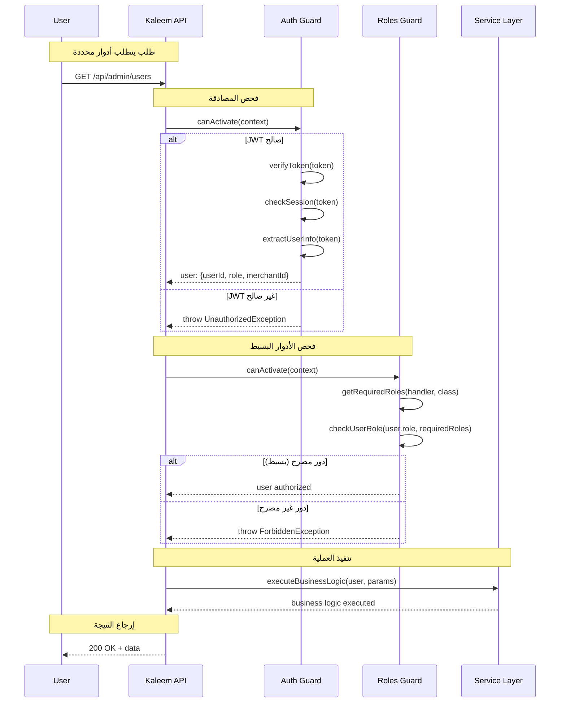
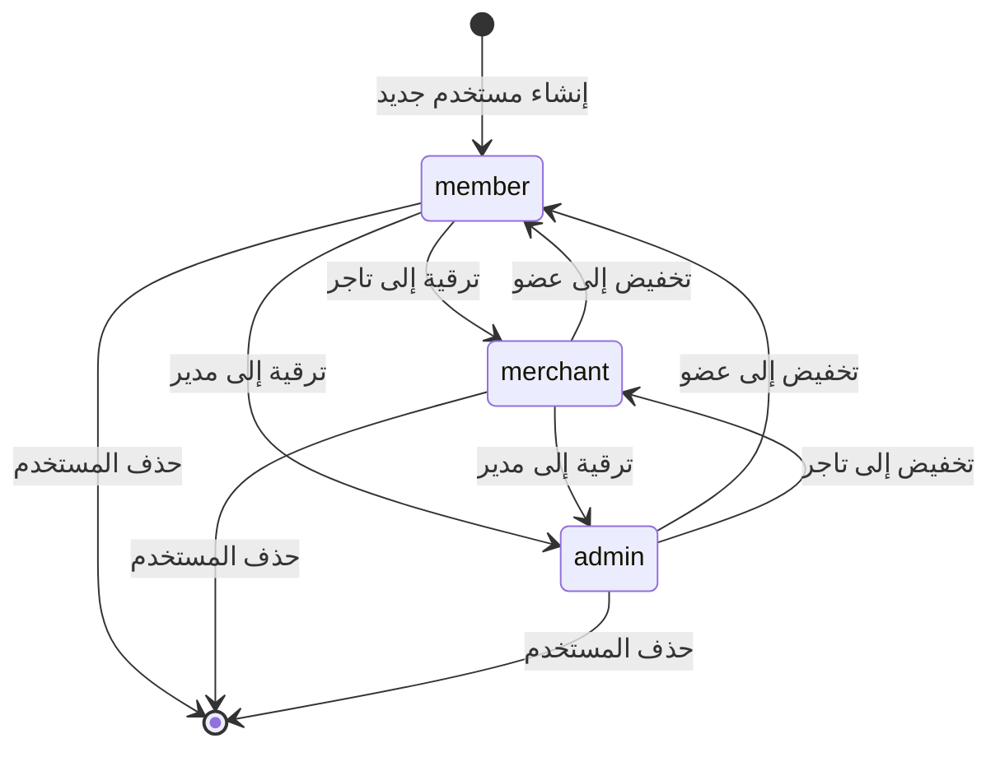
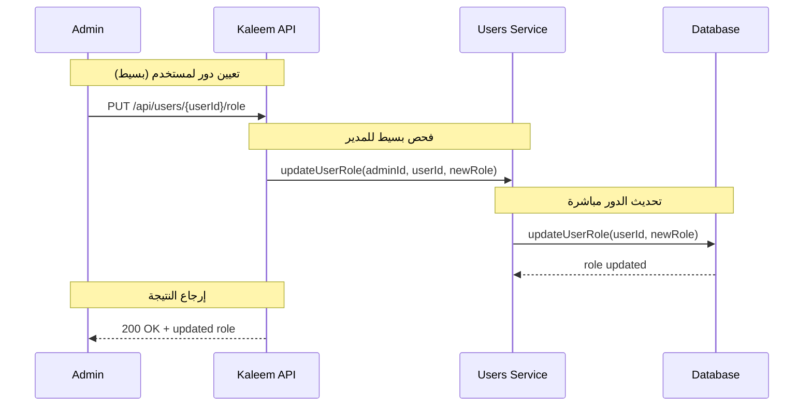

# نظام الأدوار البسيط (Simple Role-Based Access) - نظام كليم

## نظرة عامة على النظام

نظام كليم يدعم نظام أدوار بسيط للتحكم في الوصول:

- **Role-Based Access Control (RBAC)**: نظام صلاحيات مبني على الأدوار البسيطة
- **Simple Roles**: ثلاثة أدوار أساسية فقط
- **Static Assignment**: تعيين الأدوار يدوياً عند إنشاء المستخدمين
- **No Granular Permissions**: لا يوجد نظام صلاحيات دقيق معقد
- **No Audit Trail**: لا يوجد تتبع لتغييرات الأدوار

## 1. مخطط التسلسل - فحص الأدوار البسيط (Sequence Diagram)



## 2. مصفوفة الأدوار البسيطة (Simple Roles Matrix)

| **الدور**      | **الوصف**                          | **المسارات المسموحة** | **الميزات** |
| -------------- | ----------------------------------- | ---------------------- | ----------- |
| **ADMIN**      | مدير نظام كامل                    | جميع مسارات `/api/admin/*` | صلاحيات كاملة على النظام |
| **MERCHANT**   | تاجر (صاحب متجر)                  | مسارات متجره + بعض المسارات العامة | إدارة متجره الخاص فقط |
| **MEMBER**     | عضو عادي                          | مسارات محدودة جداً    | صلاحيات قراءة محدودة |

### تفسير المصفوفة:

- **ADMIN**: يمكنه الوصول لجميع مسارات `/api/admin/*` وإدارة النظام بالكامل
- **MERCHANT**: يمكنه إدارة متجره الخاص فقط، لا يمكنه الوصول لمسارات الإدارة
- **MEMBER**: صلاحيات محدودة جداً، يُستخدم للعملاء أو المستخدمين العاديين

### أمثلة على استخدام الديكوراتور:

```typescript
// مسار يتطلب ADMIN فقط
@Get('admin/users')
@Roles('ADMIN')
async getUsers() {
  return this.usersService.findAll();
}

// مسار يتطلب MERCHANT أو ADMIN
@Get('merchants/:id')
@Roles('MERCHANT', 'ADMIN')
async getMerchant() {
  return this.merchantsService.findOne();
}
```

## 3. آلة الحالات البسيطة - دور المستخدم (State Machine)



### تعريف الحالات

| الحالة     | الوصف                    | الإجراءات المسموحة          |
| ---------- | ------------------------ | --------------------------- |
| `member`   | عضو عادي                | صلاحيات محدودة جداً        |
| `merchant` | تاجر (صاحب متجر)        | إدارة متجره الخاص فقط       |
| `admin`    | مدير نظام               | صلاحيات كاملة على النظام   |

### آلية تعيين الأدوار:

```typescript
// في User Schema
@Prop({ type: String, enum: UserRole, default: UserRole.MEMBER })
role: UserRole;

// في AuthService - التسجيل
const userDoc = await this.repo.createUser({
  name,
  email,
  password,
  role: 'MERCHANT', // تعيين يدوي حسب نوع المستخدم
  active: true,
  firstLogin: true,
  emailVerified: false,
});
```

## 4. مخطط التسلسل - تعيين الأدوار البسيط (Sequence Diagram)



### آلية تعيين الأدوار في الكود الفعلي:

```typescript
// في UsersService - تحديث الدور مباشرة
async updateUserRole(
  adminId: string,
  userId: string,
  newRole: UserRole,
): Promise<UserDocument> {
  // فحص بسيط: هل المدير لديه صلاحية ADMIN؟
  const admin = await this.usersRepo.findById(adminId);
  if (admin?.role !== 'ADMIN') {
    throw new ForbiddenException('Only admins can update roles');
  }

  // تحديث الدور مباشرة
  const user = await this.usersRepo.findById(userId);
  if (!user) {
    throw new NotFoundException('User not found');
  }

  user.role = newRole;
  return await this.usersRepo.save(user);
}
```

## 5. تفاصيل تقنية للنظام البسيط

### 5.1 تعريف الأدوار في النظام

#### 5.1.1 User Schema - تعريف الأدوار

```typescript
// src/modules/users/schemas/user.schema.ts
export enum UserRole {
  MERCHANT = 'MERCHANT',  // تاجر (له متجر خاص)
  ADMIN = 'ADMIN',        // مدير نظام (صلاحيات كاملة)
  MEMBER = 'MEMBER',      // عضو عادي (صلاحيات محدودة)
}

@Schema({...})
export class User {
  @Prop({ type: String, enum: UserRole, default: UserRole.MEMBER })
  role: UserRole;

  @Prop({ type: Types.ObjectId, ref: 'Merchant' })
  merchantId?: Types.ObjectId; // للتاجر فقط
}
```

#### 5.1.2 Roles Guard - فحص الأدوار البسيط

```typescript
// src/common/guards/roles.guard.ts
@Injectable()
export class RolesGuard implements CanActivate {
  constructor(private reflector: Reflector) {}

  canActivate(context: ExecutionContext): boolean {
    // احترام @Public() decorator
    const isPublic = this.reflector.getAllAndOverride<boolean>('isPublic', [
      context.getHandler(),
      context.getClass(),
    ]);
    if (isPublic) return true;

    // قراءة الأدوار المطلوبة
    const requiredRoles = this.reflector.getAllAndOverride<string[]>(
      ROLES_KEY,
      [context.getHandler(), context.getClass()],
    );

    if (!requiredRoles || requiredRoles.length === 0) return true;

    // فحص دور المستخدم
    const request = context.switchToHttp().getRequest<RequestWithUser>();
    const user = request.user;

    if (!user) {
      throw new UnauthorizedException('Unauthorized');
    }

    if (!requiredRoles.includes(user.role)) {
      throw new ForbiddenException('Insufficient role');
    }

    return true;
  }
}
```

### 5.2 مرحلة إدارة الأدوار البسيطة

#### 5.2.1 استخدام الديكوراتور للتحكم في الوصول

```typescript
// src/common/decorators/roles.decorator.ts
export const ROLES_KEY = 'roles';
export const Roles = (...roles: string[]): ReturnType<typeof SetMetadata> =>
  SetMetadata(ROLES_KEY, roles);

// مثال على استخدام الديكوراتور في Controller
@Controller('admin/users')
export class UsersController {
  @Get()
  @Roles('ADMIN') // يتطلب دور ADMIN فقط
  async getAllUsers() {
    return this.usersService.findAll();
  }

  @Get(':id')
  @Roles('ADMIN', 'MERCHANT') // يتطلب ADMIN أو MERCHANT
  async getUserById(@Param('id') id: string) {
    return this.usersService.findById(id);
  }

  @Post()
  @Roles('ADMIN') // إنشاء مستخدمين جدد يتطلب ADMIN فقط
  async createUser(@Body() createUserDto: CreateUserDto) {
    return this.usersService.create(createUserDto);
  }
}
```

#### 5.2.2 تعيين الأدوار عند إنشاء المستخدمين

```typescript
// في AuthService - التسجيل
async register(registerDto: RegisterDto): Promise<TokenPair> {
  const { password, confirmPassword, email, name } = registerDto;

  // إنشاء مستخدم جديد بدور MERCHANT افتراضياً
  const userDoc = await this.repo.createUser({
    name,
    email,
    password,
    role: 'MERCHANT', // تعيين دور افتراضي
    active: true,
    firstLogin: true,
    emailVerified: false,
  });

  // إنشاء merchant للمستخدم الجديد
  const merchant = await this.merchants.ensureForUser(userDoc._id, {
    name: userDoc.name,
  });

  return this.tokenService.createTokenPair({
    userId: String(userDoc._id),
    role: userDoc.role,
    merchantId: String(merchant._id),
  });
}
```

### 5.3 ملاحظات مهمة حول النظام الحالي

**ملاحظة مهمة**: نظام كليم الحالي يستخدم نظام أدوار بسيط جداً بدون أي نظام صلاحيات دقيق. هذا يعني:

1. **لا يوجد نظام صلاحيات دقيق** - النظام يعتمد على الأدوار فقط
2. **لا يوجد نظام تعيين صلاحيات منفصل** - الصلاحيات مرتبطة بالأدوار فقط
3. **لا يوجد نظام تتبع للتغييرات** - لا يوجد audit trail للأدوار

**هيكل المسارات حسب الأدوار**:

- **مسارات `/api/admin/*`**: تتطلب دور `ADMIN` فقط
- **مسارات متجر محدد**: تتطلب دور `MERCHANT` أو `ADMIN`
- **مسارات عامة**: متاحة للجميع أو للأعضاء المسجلين

**مثال على الحماية في Controller**:

```typescript
@Controller('products')
export class ProductsController {
  @Get()
  async getProducts() {
    // متاح للجميع
    return this.productsService.findAll();
  }

  @Post()
  @Roles('MERCHANT') // يتطلب تاجر أو مدير
  async createProduct(@Body() dto: CreateProductDto) {
    return this.productsService.create(dto);
  }

  @Put(':id')
  @Roles('ADMIN') // يتطلب مدير فقط
  async updateProduct(@Param('id') id: string, @Body() dto: UpdateProductDto) {
    return this.productsService.update(id, dto);
  }
}
```

## 6. خطة الاختبار والتحقق

### 6.1 اختبارات الأدوار البسيطة

- اختبار تعيين الأدوار الثلاثة (ADMIN, MERCHANT, MEMBER)
- اختبار فحص صلاحية الوصول للمسارات المحمية
- اختبار رفض الوصول للأدوار غير المصرحة
- اختبار عمل RolesGuard مع مختلف المسارات

### 6.2 اختبارات التكامل البسيطة

- اختبار تكامل RolesGuard مع JwtAuthGuard
- اختبار تكامل مع نظام المصادقة
- اختبار تعيين الأدوار عند التسجيل
- اختبار تحديث الأدوار يدوياً

### 6.3 اختبارات الحماية

- اختبار حماية مسارات `/api/admin/*` بدور ADMIN فقط
- اختبار حماية مسارات المتاجر بدور MERCHANT أو ADMIN
- اختبار رفض الوصول للأعضاء العاديين
- اختبار عمل الـ decorator على مستويات مختلفة

### 6.4 اختبارات بسيطة للأداء

- اختبار سرعة فحص الأدوار (يجب أن يكون سريعاً جداً)
- اختبار عدم وجود تأثير على الأداء
- اختبار تحت حمل متوسط

---

_تم إنشاء هذا التوثيق بواسطة نظام كليم لإدارة المتاجر الذكية_
