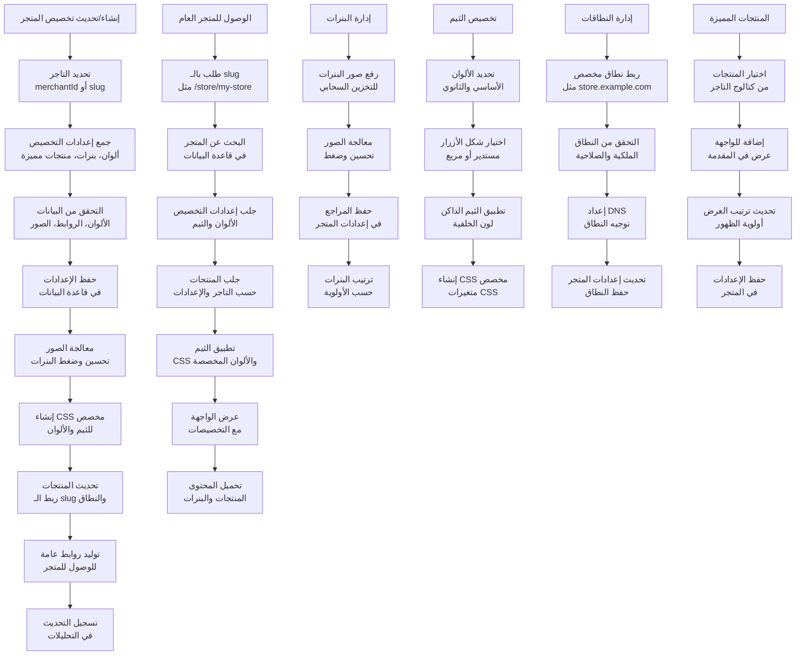
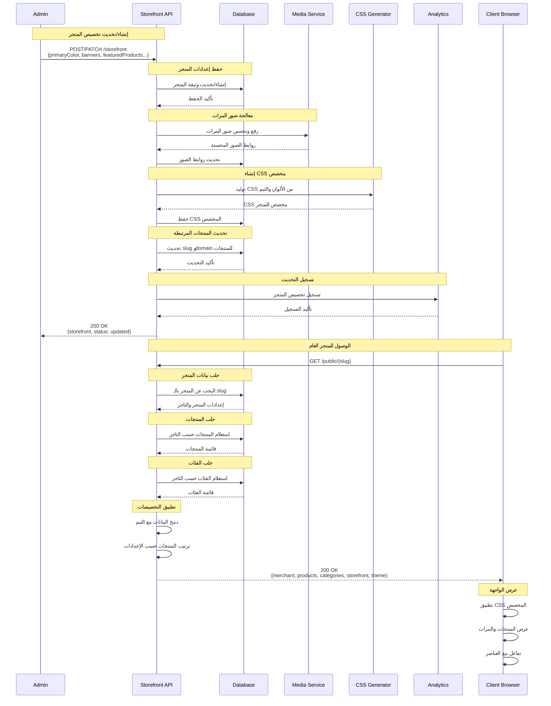
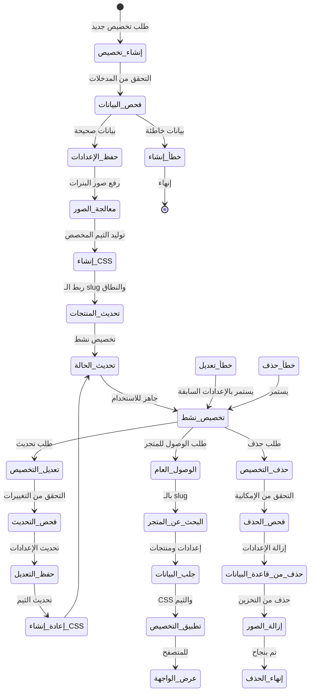
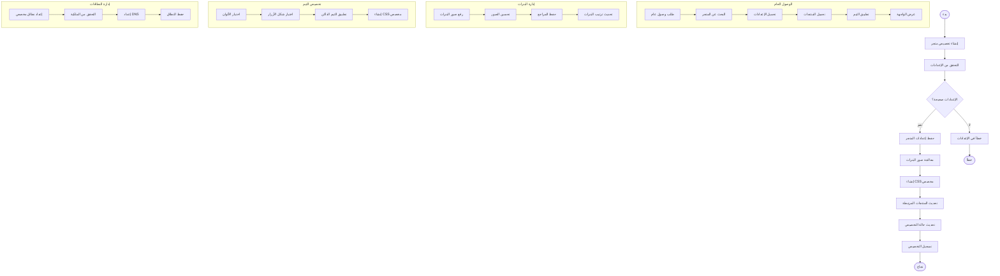

# ورك فلو تخصيص المتجر - نظام كليم الشامل

## نظرة عامة على النظام

نظام كليم يدعم تخصيص شامل لواجهات المتاجر مع إمكانيات متقدمة:

- **تصميم مرئي**: ألوان مخصصة، أشكال الأزرار، ثيمات داكنة
- **البنرات والسلايدر**: صور ونصوص متحركة قابلة للتخصيص
- **المنتجات المميزة**: عرض منتجات محددة في الواجهة
- **نطاقات مخصصة**: ربط نطاقات فريدة للمتاجر
- **الوصول العام**: روابط slug مخصصة للوصول
- **التصميم المتجاوب**: تكيف مع جميع الأجهزة

## 1. مخطط التدفق العام (Flowchart)



## 2. مخطط التسلسل (Sequence Diagram)



## 3. آلة الحالات (State Machine)



### تعريف الحالات


| الحالة                   | الوصف                                                          | الإجراءات المسموحة               |
| ------------------------------ | ------------------------------------------------------------------- | ------------------------------------------------- |
| `إنشاء_تخصيص`        | بدء عملية تخصيص متجر جديد                      | جمع البيانات والإعدادات      |
| `فحص_البيانات`      | التحقق من صحة البيانات المدخلة            | التحقق من الألوان والروابط |
| `حفظ_الإعدادات`    | حفظ إعدادات المتجر في قاعدة البيانات | إدراج/تحديث الوثيقة              |
| `معالجة_الصور`      | رفع وتحسين صور البنرات                           | تحميل للتخزين السحابي          |
| `إنشاء_CSS`               | توليد CSS مخصص للثيم                                  | إنشاء متغيرات CSS                     |
| `تحديث_المنتجات`  | ربط slug والنطاق بالمنتجات                       | تحديث مراجع المنتجات            |
| `تحديث_الحالة`      | تحديث حالة التخصيص                                  | تعيين الحالة النهائية          |
| `تخصيص_نشط`            | التخصيص جاهز ومتاح                                  | جميع العمليات                         |
| `تعديل_التخصيص`    | طلب تحديث التخصيصات                                | تعديل الإعدادات                     |
| `الوصول_العام`      | طلب الوصول للمتجر العام                         | عرض الواجهة                             |
| `البحث_عن_المتجر` | البحث عن المتجر بالـ slug                          | استعلام قاعدة البيانات        |
| `جلب_البيانات`      | جلب بيانات المتجر والمنتجات                 | استرجاع المعلومات                 |
| `تطبيق_التخصيص`    | تطبيق CSS والثيم المخصص                            | إعداد العرض                             |
| `عرض_الواجهة`        | عرض الواجهة للمتصفح                                | إرجاع HTML/CSS                               |
| `حذف_التخصيص`        | طلب حذف التخصيصات                                    | إزالة الإعدادات                     |

## 4. مخطط سير العمل التجاري (BPMN)



## 5. تفاصيل تقنية لكل مرحلة

### 5.1 مرحلة الإنشاء والتخصيص

#### 5.1.1 إنشاء تخصيص متجر جديد

**Endpoint**: `POST /storefront`

**البيانات المطلوبة**:

```typescript
interface CreateStorefrontDto {
  merchant: string; // معرف التاجر (مطلوب)

  // إعدادات الثيم
  primaryColor?: string; // لون أساسي (افتراضي: #FF8500)
  secondaryColor?: string; // لون ثانوي (افتراضي: #2575fc)
  buttonStyle?: 'rounded' | 'square'; // شكل الأزرار (افتراضي: rounded)
  brandDark?: string; // لون الثيم الداكن

  // النطاق المخصص
  domain?: string; // نطاق مخصص مثل store.example.com

  // البنرات
  banners?: BannerDto[]; // قائمة البنرات (حد أقصى 5)

  // المنتجات المميزة
  featuredProductIds?: string[]; // معرفات المنتجات المميزة
}
```

#### 5.1.2 حفظ إعدادات المتجر

```typescript
const storefront = await storefronts.findOneAndUpdate(
  { merchant: merchantId },
  {
    $setOnInsert: {
      merchant: merchantId,
      slug: merchant.publicSlug,
      primaryColor: '#FF8500',
      secondaryColor: '#2575fc',
      buttonStyle: 'rounded',
      brandDark: '#111827',
      banners: [],
      featuredProductIds: [],
    },
  },
  { new: true, upsert: true, setDefaultsOnInsert: true },
);
```

#### 5.1.3 معالجة صور البنرات

```typescript
// رفع صور البنرات للتخزين السحابي
const uploadResult = await mediaService.uploadBannerImagesToMinio(
  merchantId,
  files,
);

// تحسين الصور وضغطها
const optimizedImages = await Promise.all(
  files.map(async (file) => {
    const processed = await sharp(file.path)
      .resize(1200, 600, { fit: 'cover' })
      .webp({ quality: 80 })
      .toBuffer();
    return processed;
  }),
);
```

### 5.2 مرحلة الثيم والتخصيص المرئي

#### 5.2.1 إنشاء CSS مخصص

```typescript
private toCssVars(brandDark: string): string {
  const hover = this.lighten(brandDark, 8);
  return `
:root {
  --brand: ${brandDark};
  --on-brand: #FFFFFF;
  --brand-hover: ${hover};
}
.sf-dark, .navbar, footer {
  background: var(--brand);
  color: var(--on-brand);
}
.btn-primary, .MuiButton-containedPrimary {
  background: var(--brand);
  color: #FFFFFF;
}
.btn-primary:hover, .MuiButton-containedPrimary:hover {
  background: var(--brand-hover);
}
`.trim();
}
```

#### 5.2.2 حساب الألوان المشتقة

```typescript
private lighten(hex: string, percent: number): string {
  const clamped = Math.max(-100, Math.min(100, percent)) / 100;
  const n = (x: number) => Math.round(x + (255 - x) * clamped);
  const hexBody = hex.replace('#', '');
  const pairs = hexBody.match(/.{2}/g);

  if (!pairs || pairs.length < 3) return hex;

  const [r, g, b] = pairs.map((h) => parseInt(h, 16));
  return `#${[n(r), n(g), n(b)]
    .map((v) => v.toString(16).padStart(2, '0'))
    .join('')}`;
}
```

### 5.3 مرحلة الوصول العام والعرض

#### 5.3.1 الوصول بالـ Slug

```typescript
// الوصول للمتجر العام
GET /public/{slug}
// مثال: /public/my-awesome-store

// إرجاع البيانات
{
  "merchant": {
    "id": "60d21b4667d0d8992e610c85",
    "name": "متجري الرائع",
    "slug": "my-awesome-store"
  },
  "storefront": {
    "primaryColor": "#FF8500",
    "secondaryColor": "#2575fc",
    "buttonStyle": "rounded",
    "banners": [...],
    "featuredProductIds": [...]
  },
  "products": [...],
  "categories": [...]
}
```

#### 5.3.2 توليد CSS مخصص للمتجر

```typescript
// CSS مخصص لكل متجر
GET /public/storefront/{slug}/brand.css

// إرجاع CSS
:root {
  --brand: #111827;
  --brand-hover: #1f2937;
  --primary: #FF8500;
  --secondary: #2575fc;
}
```

#### 5.3.3 الوصول بالنطاق المخصص

```typescript
// إذا كان للمتجر نطاق مخصص
// https://store.example.com -> يتم توجيهه للمتجر

// التحقق من النطاق
const domainExists = await storefronts.findOne({
  domain: 'store.example.com',
});

if (domainExists) {
  // عرض المتجر بالنطاق المخصص
}
```

### 5.4 مرحلة إدارة البنرات

#### 5.4.1 إنشاء بانر جديد

```typescript
interface BannerDto {
  image?: string; // رابط صورة البانر
  text: string; // نص البانر (مطلوب)
  url?: string; // رابط البانر (اختياري)
  color?: string; // لون خلفية البانر
  active?: boolean; // حالة التفعيل
  order?: number; // ترتيب الظهور
}
```

#### 5.4.2 رفع صور البنرات

```typescript
// رفع صور البنرات (حد أقصى 5 صور)
POST / storefront / by - merchant / { merchantId } / banners / upload;

// معالجة الصور
const processedImages = await Promise.all(
  files.map(async (file) => {
    // تحسين الصورة وضغطها
    const buffer = await sharp(file.buffer)
      .resize(1200, 600, { fit: 'cover' })
      .webp({ quality: 80 })
      .toBuffer();

    // رفع للتخزين السحابي
    const url = await minioService.putObject(
      bucketName,
      `banners/${merchantId}/${Date.now()}.webp`,
      buffer,
    );

    return { url, size: buffer.length };
  }),
);
```

### 5.5 مرحلة المنتجات المميزة

#### 5.5.1 اختيار المنتجات المميزة

```typescript
// تحديث قائمة المنتجات المميزة
await storefronts.updateOne(
  { merchant: merchantId },
  {
    $set: {
      featuredProductIds: selectedProductIds,
      updatedAt: new Date(),
    },
  },
);
```

#### 5.5.2 عرض المنتجات المميزة

```typescript
// جلب المنتجات المميزة في الواجهة
const featuredProducts = await products
  .find({
    _id: { $in: storefront.featuredProductIds },
    merchantId: merchantId,
    isAvailable: true,
  })
  .limit(10);
```

## 6. معايير الأمان والحماية

### 6.1 التحقق من الملكية

```typescript
// التحقق من صلاحية التاجر
const user = await getCurrentUser();
const merchant = await merchants.findById(merchantId);

if (!canAccessMerchant(user, merchant)) {
  throw new ForbiddenException('Access denied');
}
```

### 6.2 تشفير الصور

```typescript
// تشفير أسماء ملفات الصور
const encryptedFileName = encryptFileName(originalName);
const presignedUrl = await minioService.getPresignedUrl(encryptedFileName);
```

### 6.3 Rate Limiting

- **إنشاء التخصيص**: 10 تخصيصات/ساعة لكل تاجر
- **رفع الصور**: 50 صورة/ساعة
- **الوصول العام**: 1000 طلب/ساعة لكل slug

## 7. مسارات الخطأ والتعامل معها

### 7.1 أخطاء الإنشاء

```javascript
INVALID_MERCHANT_ID; // معرف تاجر غير صحيح
INVALID_COLOR_FORMAT; // تنسيق لون غير صحيح
INVALID_SLUG; // slug غير صالح
DUPLICATE_SLUG; // slug موجود مسبقاً
```

### 7.2 أخطاء المعالجة

```javascript
IMAGE_PROCESSING_FAILED; // فشل في معالجة الصور
CSS_GENERATION_FAILED; // فشل في إنشاء CSS
BANNER_UPLOAD_FAILED; // فشل في رفع البنرات
DOMAIN_VERIFICATION_FAILED; // فشل في التحقق من النطاق
```

### 7.3 أخطاء الوصول

```javascript
STOREFRONT_NOT_FOUND; // المتجر غير موجود
SLUG_NOT_FOUND; // slug غير موجود
MERCHANT_DISABLED; // التاجر معطل
```

## 8. خطة الاختبار والتحقق

### 8.1 اختبارات الوحدة

- اختبار إنشاء التخصيصات للمتاجر
- اختبار إنشاء CSS من الألوان
- اختبار رفع ومعالجة الصور
- اختبار الوصول بالـ slug

### 8.2 اختبارات التكامل

- اختبار الوصول العام للمتاجر
- اختبار تطبيق الثيمات
- اختبار عرض البنرات والمنتجات
- اختبار معالجة الأخطاء

### 8.3 اختبارات الأداء

- اختبار الحمل على الوصول العام
- اختبار توليد CSS للمتاجر
- اختبار معالجة الصور بالجملة
- اختبار استهلاك الذاكرة

---

_تم إنشاء هذا التوثيق بواسطة نظام كليم لإدارة المتاجر الذكية_
