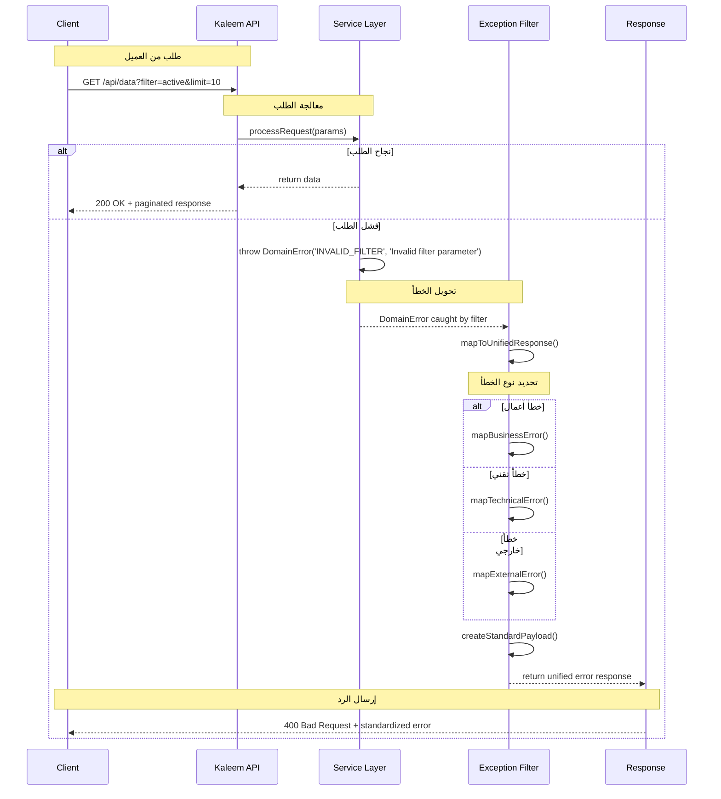
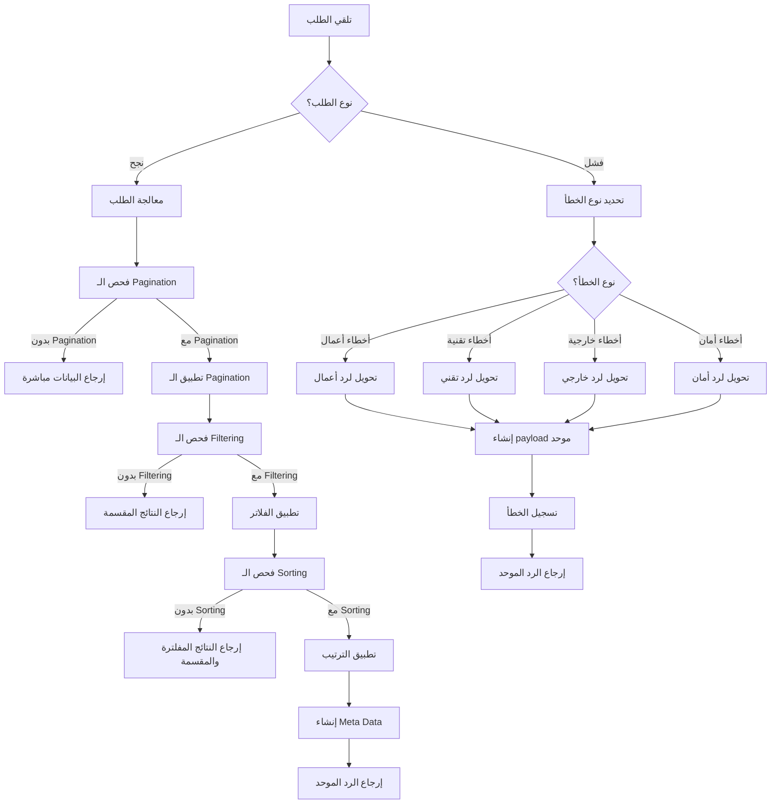

# سياسة الأخطاء والردود الموحدة + Pagination/Filtering - نظام كليم

## نظرة عامة على النظام

نظام كليم يدعم سياسة موحدة للأخطاء والردود مع نظام pagination وfiltering متقدم:

- **Unified Error Policy**: نظام أخطاء موحد ومنظم
- **Error Mapping**: تحويل الأخطاء لردود متسقة
- **Pagination System**: نظام تقسيم النتائج متقدم
- **Filtering**: فلترة ذكية للبيانات
- **Response Standardization**: توحيد شكل الردود

## 1. مخطط التسلسل - Error Mapping (Sequence Diagram)



## 2. مخطط التدفق - Decision Flow (Flowchart)



## 3. مصفوفة الأمثلة (Examples Matrix)

| **السيناريو**          | **نوع الطلب**                                     | **الرد المتوقع**                                                                                                                                                                                        | **رمز الحالة**         | **الأخطاء المحتملة**     |
| ---------------------- | ------------------------------------------------- | ------------------------------------------------------------------------------------------------------------------------------------------------------------------------------------------------------- | ---------------------- | ------------------------ | ---------------- |
| **نجاح كامل**          | `GET /api/products?limit=10&category=electronics` | `json<br>{<br>  "items": [...],<br>  "meta": {<br>    "nextCursor": "eyJ0IjoxNjk5ODg4ODAwMDAwLCJpZCI6IjY1NGY5YzAwMTIzNDU2Nzg5YWJjZGVmMCJ9",<br>    "hasMore": true,<br>    "count": 10<br>  }<br>}<br>` | 200                    | -                        |
| **صفحة غير موجودة**    | `GET /api/products?cursor=invalid&limit=10`       | `json<br>{<br>  "code": "INVALID_CURSOR",<br>  "message": "Cursor غير صحيح",<br>  "requestId": "req-123",<br>  "timestamp": "2024-01-01T00:00:00Z"<br>}<br>`                                            | 400                    | `INVALID_CURSOR`         |
| **فلتر غير صحيح**      | `GET /api/products?filter=invalid`                | ```json<br>{<br> "code": "INVALID_FILTER",<br> "message": "معامل الفلتر غير صحيح",<br> "details": {"field": "filter", "expected": "active                                                               | inactive"}<br>}<br>``` | 400                      | `INVALID_FILTER` |
| **حدود غير صحيحة**     | `GET /api/products?limit=1000`                    | `json<br>{<br>  "code": "INVALID_LIMIT",<br>  "message": "الحد يجب أن يكون بين 1 و 100",<br>  "details": {"provided": 1000, "min": 1, "max": 100}<br>}<br>`                                             | 400                    | `INVALID_LIMIT`          |
| **خطأ قاعدة البيانات** | `GET /api/products`                               | `json<br>{<br>  "code": "DATABASE_ERROR",<br>  "message": "خطأ في قاعدة البيانات",<br>  "requestId": "req-123",<br>  "timestamp": "2024-01-01T00:00:00Z"<br>}<br>`                                      | 500                    | `DATABASE_ERROR`         |
| **خدمة خارجية معطلة**  | `GET /api/external`                               | `json<br>{<br>  "code": "EXTERNAL_SERVICE_ERROR",<br>  "message": "خطأ في الخدمة الخارجية",<br>  "details": {"url": "https://external.com", "status": 503}<br>}<br>`                                    | 502                    | `EXTERNAL_SERVICE_ERROR` |

## 4. تفاصيل تقنية لكل مرحلة

### 4.1 مرحلة معالجة الأخطاء

#### 4.1.1 نظام الأخطاء الموحد

```typescript
// src/common/errors/domain-error.ts
export class DomainError extends HttpException {
  constructor(
    code: string,
    message: string,
    status: number = HttpStatus.BAD_REQUEST,
    details?: Record<string, unknown>,
  ) {
    super({ code, message, details }, status);
  }
}

// أمثلة للأخطاء المخصصة
export class OutOfStockError extends DomainError {
  constructor(productId: string) {
    super('OUT_OF_STOCK', 'المنتج غير متوفر حاليًا', HttpStatus.CONFLICT, {
      productId,
    });
  }
}
```

#### 4.1.2 معالجة الأخطاء المركزية

```typescript
// src/common/filters/all-exceptions.filter.ts
@Catch()
export class AllExceptionsFilter implements ExceptionFilter {
  catch(exception: unknown, host: ArgumentsHost): void {
    const response = host.switchToHttp().getResponse();
    const request = host.switchToHttp().getRequest();

    // تحويل جميع الأخطاء لرد موحد مع تسجيل مفصل
    const payload = this.mapErrorToUnifiedResponse(exception, request);
    this.logError(payload, request, exception);
    response.status(payload.status).json(payload);
  }

  private mapErrorToUnifiedResponse(exception: unknown, request: Request) {
    const requestId = request.requestId;
    const timestamp = new Date().toISOString();

    // معالجة أنواع مختلفة من الأخطاء
    if (exception instanceof HttpException) {
      return this.handleHttpException(exception, requestId, timestamp);
    }

    if (isMongoValidationError(exception) || isMongoCastError(exception)) {
      return this.handleMongoError(exception, requestId, timestamp);
    }

    if (isAxiosError(exception)) {
      return this.handleAxiosError(exception, requestId, timestamp);
    }

    if (isJwtError(exception, 'JsonWebTokenError')) {
      return this.handleJwtError(exception, requestId, timestamp);
    }

    // رد افتراضي للأخطاء غير المتوقعة
    return {
      code: 'INTERNAL_SERVER_ERROR',
      message: 'خطأ داخلي في الخادم',
      requestId,
      timestamp,
    };
  }
}
```

### 4.2 مرحلة نظام الـ Pagination

#### 4.2.1 DTO للـ Pagination

```typescript
// src/common/dto/pagination.dto.ts
export class CursorDto {
  @IsOptional()
  @Transform(({ value }) => parseInt(value as string))
  @IsInt()
  @Min(MIN_LIMIT)
  @Max(MAX_LIMIT)
  limit?: number = DEFAULT_LIMIT;

  @IsOptional()
  cursor?: string;
}
```

#### 4.2.2 إنشاء النتائج المقسمة

```typescript
// src/common/dto/pagination.dto.ts
export interface PaginationResult<T> {
  items: T[];
  meta: {
    nextCursor?: string;
    hasMore: boolean;
    count: number;
  };
}

export function createPaginationResult<T>(
  items: T[],
  cursor?: string,
  sortField: string = 'createdAt',
  sortOrder: 1 | -1 = -1,
): PaginationResult<T> {
  const hasMore = items.length === limit;
  const nextCursor = hasMore
    ? encodeCursor(
        items[items.length - 1][sortField],
        items[items.length - 1]._id,
      )
    : undefined;

  return {
    items,
    meta: {
      nextCursor,
      hasMore,
      count: items.length,
    },
  };
}

// مثال استخدام في Service
async findUsers(dto: GetUsersDto): Promise<PaginationResult<UserDocument>> {
  const { limit = 20, cursor, sortBy = 'createdAt', sortOrder = 'desc' } = dto;

  const filter = this.buildFilter(dto);
  const sort = { [sortBy]: sortOrder === 'desc' ? -1 : 1 };

  const users = await this.usersRepository.find({
    filter,
    sort,
    limit: limit + 1, // لمعرفة إذا كان هناك المزيد
    cursor,
  });

  return createPaginationResult(users, cursor, sortBy, sort[sortBy] as 1 | -1);
}
```

### 4.3 مرحلة نظام الـ Filtering

#### 4.3.1 أنواع الفلاتر المدعومة

```typescript
// src/common/dto/filtering.dto.ts
export class BaseFilteringDto {
  @IsOptional()
  @IsString()
  search?: string;

  @IsOptional()
  @IsArray()
  @IsString({ each: true })
  fields?: string[];

  @IsOptional()
  @IsObject()
  filters?: Record<string, unknown>;
}

export class ProductFilteringDto extends BaseFilteringDto {
  @IsOptional()
  @IsString()
  category?: string;

  @IsOptional()
  @IsNumberString()
  minPrice?: string;

  @IsOptional()
  @IsNumberString()
  maxPrice?: string;

  @IsOptional()
  @IsBooleanString()
  inStock?: string;
}
```

#### 4.3.2 تطبيق الفلاتر في الممارسة العملية

```typescript
// مثال من GetUsersDto - بناء الفلتر
private buildFilter(dto: GetUsersDto): Record<string, unknown> {
  const filter: Record<string, unknown> = {};

  // فلترة النص في الاسم والبريد الإلكتروني
  if (dto.search) {
    filter.$or = [
      { name: { $regex: dto.search, $options: 'i' } },
      { email: { $regex: dto.search, $options: 'i' } },
    ];
  }

  // فلترة حسب الدور
  if (dto.role) {
    filter.role = dto.role;
  }

  // فلترة حسب التاجر
  if (dto.merchantId) {
    filter.merchantId = dto.merchantId;
  }

  // فلترة حسب حالة التفعيل
  if (dto.active !== undefined) {
    filter.active = dto.active;
  }

  // فلترة حسب تفعيل البريد الإلكتروني
  if (dto.emailVerified !== undefined) {
    filter.emailVerified = dto.emailVerified;
  }

  return filter;
}

// مثال من Products Service - فلترة متقدمة
private buildProductFilter(dto: GetProductsDto): Record<string, unknown> {
  const filter: Record<string, unknown> = {};

  if (dto.category) {
    filter.category = dto.category;
  }

  if (dto.minPrice || dto.maxPrice) {
    filter.price = {};
    if (dto.minPrice) filter.price.$gte = dto.minPrice;
    if (dto.maxPrice) filter.price.$lte = dto.maxPrice;
  }

  if (dto.inStock !== undefined) {
    filter.quantity = dto.inStock ? { $gt: 0 } : { $lte: 0 };
  }

  if (dto.tags && dto.tags.length > 0) {
    filter.tags = { $in: dto.tags };
  }

  return filter;
}
```

### 4.4 مرحلة الردود الموحدة

#### 4.4.1 هيكل الرد الموحد

```typescript
interface UnifiedResponse<T = unknown> {
  // للنجاح
  data?: T;
  meta?: {
    pagination?: PaginationMeta;
    filters?: AppliedFilters;
    sorting?: SortingInfo;
  };

  // للأخطاء
  code?: string;
  message: string;
  details?: Record<string, unknown>;
  requestId: string;
  timestamp: string;
}

interface PaginationMeta {
  nextCursor?: string;
  hasMore: boolean;
  count: number;
  total?: number;
}

interface AppliedFilters {
  search?: string;
  category?: string;
  priceRange?: { min: number; max: number };
  inStock?: boolean;
}
```

#### 4.4.2 إنشاء الردود في الممارسة العملية

```typescript
// مثال من UsersController - رد نجاح مع Pagination
@Get()
@Roles('ADMIN')
async getUsers(@Query() dto: GetUsersDto): Promise<UnifiedResponse> {
  const result = await this.usersService.findUsers(dto);

  return this.responseService.success(result, {
    pagination: {
      nextCursor: result.meta.nextCursor,
      hasMore: result.meta.hasMore,
      count: result.meta.count,
    },
    filters: {
      search: dto.search,
      role: dto.role,
      active: dto.active,
    },
  });
}

// مثال من ProductsController - رد خطأ موحد
@Get(':id')
async getProduct(@Param('id') id: string): Promise<UnifiedResponse> {
  try {
    const product = await this.productsService.findById(id);
    return this.responseService.success(product);
  } catch (error) {
    if (error instanceof ProductNotFoundError) {
      throw error; // سيتم تحويله بواسطة AllExceptionsFilter
    }
    throw new InternalServerErrorException('فشل في جلب المنتج');
  }
}

// مثال من AuthController - رد خطأ مصادقة
@Post('login')
async login(@Body() dto: LoginDto): Promise<UnifiedResponse> {
  try {
    const result = await this.authService.login(dto);
    return this.responseService.success(result);
  } catch (error) {
    if (error instanceof InvalidCredentialsError) {
      throw error; // سيتم تحويله بواسطة AllExceptionsFilter
    }
    throw new InternalServerErrorException('فشل في تسجيل الدخول');
  }
}
```

## 5. رموز الأخطاء الموحدة

### 5.1 رموز أخطاء الأعمال الفعلية

```javascript
// src/common/constants/error-codes.ts
export const ERROR_CODES = {
  // أخطاء عامة
  NOT_FOUND: 'NOT_FOUND',
  VALIDATION_ERROR: 'VALIDATION_ERROR',
  DUPLICATE_ENTRY: 'DUPLICATE_ENTRY',

  // أخطاء المنتجات
  PRODUCT_NOT_FOUND: 'PRODUCT_NOT_FOUND',
  OUT_OF_STOCK: 'OUT_OF_STOCK',
  INVALID_PRODUCT_DATA: 'INVALID_PRODUCT_DATA',

  // أخطاء المستخدمين
  USER_NOT_FOUND: 'USER_NOT_FOUND',
  EMAIL_ALREADY_EXISTS: 'EMAIL_ALREADY_EXISTS',
  INVALID_CREDENTIALS: 'INVALID_CREDENTIALS',

  // أخطاء التجار
  MERCHANT_NOT_FOUND: 'MERCHANT_NOT_FOUND',
  MERCHANT_DISABLED: 'MERCHANT_DISABLED',

  // أخطاء الطلبات
  ORDER_NOT_FOUND: 'ORDER_NOT_FOUND',
  ORDER_ALREADY_PROCESSED: 'ORDER_ALREADY_PROCESSED',
} as const;
```

### 5.2 رموز أخطاء التقنية الفعلية

```javascript
// src/common/constants/error-codes.ts (تابع)
export const ERROR_CODES = {
  // أخطاء قاعدة البيانات
  DATABASE_ERROR: 'DATABASE_ERROR',
  DUPLICATE_KEY_ERROR: 'DUPLICATE_KEY_ERROR',

  // أخطاء الخدمات الخارجية
  EXTERNAL_SERVICE_ERROR: 'EXTERNAL_SERVICE_ERROR',
  WEBHOOK_FAILED: 'WEBHOOK_FAILED',
  EMAIL_SEND_FAILED: 'EMAIL_SEND_FAILED',

  // أخطاء الذكاء الاصطناعي
  AI_SERVICE_UNAVAILABLE: 'AI_SERVICE_UNAVAILABLE',
  AI_RATE_LIMIT_EXCEEDED: 'AI_RATE_LIMIT_EXCEEDED',

  // أخطاء التحقق من الهوية
  WEBHOOK_SIGNATURE_INVALID: 'WEBHOOK_SIGNATURE_INVALID',
  WEBHOOK_PAYLOAD_INVALID: 'WEBHOOK_PAYLOAD_INVALID',

  // أخطاء الملفات والوسائط
  MEDIA_UPLOAD_FAILED: 'MEDIA_UPLOAD_FAILED',
  MEDIA_NOT_FOUND: 'MEDIA_NOT_FOUND',

  // أخطاء الأمان والحدود
  RATE_LIMIT_EXCEEDED: 'RATE_LIMIT_EXCEEDED',
  SUSPICIOUS_ACTIVITY: 'SUSPICIOUS_ACTIVITY',
} as const;
```

### 5.3 رموز أخطاء الأمان الفعلية

```javascript
// src/common/constants/error-codes.ts (تابع)
export const ERROR_CODES = {
  // أخطاء المصادقة والتفويض
  UNAUTHORIZED: 'UNAUTHORIZED',
  FORBIDDEN: 'FORBIDDEN',
  INVALID_TOKEN: 'INVALID_TOKEN',
  TOKEN_EXPIRED: 'TOKEN_EXPIRED',

  // أخطاء الحساب
  ACCOUNT_DISABLED: 'ACCOUNT_DISABLED',
  EMAIL_NOT_VERIFIED: 'EMAIL_NOT_VERIFIED',
  MERCHANT_ACCOUNT_SUSPENDED: 'MERCHANT_ACCOUNT_SUSPENDED',

  // أخطاء كلمات المرور
  PASSWORD_MISMATCH: 'PASSWORD_MISMATCH',
  CURRENT_PASSWORD_INCORRECT: 'CURRENT_PASSWORD_INCORRECT',
  INVALID_VERIFICATION_CODE: 'INVALID_VERIFICATION_CODE',
} as const;
```

## 6. معايير الأداء والمراقبة

### 6.1 مراقبة الأخطاء مع Sentry

```typescript
// src/common/services/sentry.service.ts
@Injectable()
export class SentryService {
  private enabled: boolean;

  constructor() {
    this.enabled = process.env.SENTRY_DSN ? true : false;
  }

  captureException(exception: unknown, context?: Record<string, unknown>): void {
    if (!this.enabled) return;

    Sentry.withScope((scope) => {
      if (context) {
        Object.entries(context).forEach(([key, value]) => {
          scope.setTag(key, value);
        });
      }
      Sentry.captureException(exception);
    });
  }

  captureMessage(message: string, level: Sentry.Severity = 'info'): void {
    if (!this.enabled) return;
    Sentry.captureMessage(message, level);
  }
}

// في Error Management Controller
@Controller('monitoring/errors')
export class ErrorMonitoringController {
  @Get('sentry/status')
  @Roles('admin', 'super_admin')
  getSentryStatus(): Promise<{
    enabled: boolean;
    currentUserId: string | undefined;
    timestamp: string;
  }> {
    return Promise.resolve({
      enabled: this.sentryService.isEnabled(),
      currentUserId: this.sentryService.getCurrentUserId(),
      timestamp: new Date().toISOString(),
    });
  }
}
```

### 6.2 مقاييس Prometheus

```yaml
# prometheus.yml - قواعد مراقبة الأخطاء
groups:
  - name: error_monitoring
    rules:
      - alert: HighErrorRate
        expr: |
          sum(rate(http_requests_total{status_code=~"5.."}[5m]))
          / sum(rate(http_requests_total[5m])) > 0.01
        for: 5m
        labels:
          severity: warning
        annotations:
          summary: 'معدل الأخطاء مرتفع'
          runbook_url: 'https://kb.kaleem-ai.com/runbooks/high-error-rate'
```

### 6.2 مراقبة الـ Pagination

```yaml
# مقاييس الـ Pagination
- name: pagination_requests_total
  type: counter
  help: 'إجمالي طلبات الـ pagination'
  labelnames: [endpoint, limit, has_cursor]

- name: pagination_response_time_seconds
  type: histogram
  help: 'زمن استجابة الـ pagination'
  buckets: [0.1, 0.5, 1, 2, 5]
```

## 7. خطة الاختبار والتحقق

### 7.1 اختبارات الأخطاء

- اختبار تحويل جميع أنواع الأخطاء
- اختبار تسجيل الأخطاء بشكل صحيح
- اختبار هيكل الرد الموحد
- اختبار معالجة الأخطاء المتداخلة

### 7.2 اختبارات الـ Pagination

- اختبار تقسيم النتائج بشكل صحيح
- اختبار تشفير/فك تشفير الـ cursor
- اختبار الحدود والقيم المتطرفة
- اختبار الأداء مع كميات كبيرة من البيانات

### 7.3 اختبارات الـ Filtering

- اختبار جميع أنواع الفلاتر
- اختبار الفلاتر المركبة
- اختبار أداء الفلترة
- اختبار معالجة الفلاتر الخاطئة

### 7.4 اختبارات التكامل

- اختبار تكامل الأخطاء مع الـ pagination
- اختبار تكامل الفلترة مع الـ pagination
- اختبار تكامل مع نظام المراقبة
- اختبار تكامل مع نظام التسجيل

---

_تم إنشاء هذا التوثيق بواسطة نظام كليم لإدارة المتاجر الذكية_
