# تقرير شامل: نموذج البيانات وERD والفهارس

## نظام Kaleem AI - منصة التجارة الإلكترونية الذكية

---

## جدول المحتويات

1. [نظرة عامة على النظام](#نظرة-عامة-على-النظام)
2. [الهيكل التقني](#الهيكل-التقني)
3. [نموذج البيانات الشامل](#نموذج-البيانات-الشامل)
4. [العلاقات بين الكيانات (ERD)](#العلاقات-بين-الكيانات-erd)
5. [الفهارس والأداء](#الفهارس-والأداء)
6. [تحليل الأمان](#تحليل-الأمان)
7. [التوصيات والتحسينات](#التوصيات-والتحسينات)

---

## نظرة عامة على النظام

**Kaleem AI** هو نظام متقدم للتجارة الإلكترونية يدمج الذكاء الاصطناعي لتوفير تجربة تسوق ذكية. يستخدم النظام:

- **قاعدة البيانات**: MongoDB (NoSQL)
- **الإطار التقني**: NestJS مع TypeScript
- **ORM**: Mongoose
- **البنية المعمارية**: Microservices مع Event-Driven Architecture
- **التخزين المؤقت**: Redis
- **البحث المتجه**: Qdrant
- **المراقبة**: Prometheus, Grafana, OpenTelemetry

---

## الهيكل التقني

### البنية الأساسية

```
┌─────────────────┐    ┌─────────────────┐    ┌─────────────────┐
│   Frontend      │────│   API Gateway   │────│   Backend       │
│   (React/Vue)   │    │   (NestJS)      │    │   Services      │
└─────────────────┘    └─────────────────┘    └─────────────────┘
                                │
        ┌───────────────────────┼───────────────────────┐
        │                       │                       │
┌─────────────┐        ┌─────────────┐        ┌─────────────┐
│  MongoDB    │        │   Redis     │        │   Qdrant    │
│  (Primary)  │        │  (Cache)    │        │  (Vector)   │
└─────────────┘        └─────────────┘        └─────────────┘
```

---

## نموذج البيانات الشامل

### 1. إدارة المستخدمين والتجار

#### **User Schema**

```typescript
{
  _id: ObjectId,
  email: string (unique, indexed),
  password: string (hashed, select: false),
  name: string,
  phone?: string,
  role: 'MERCHANT' | 'ADMIN' | 'MEMBER',
  firstLogin: boolean,
  emailVerified: boolean,
  emailVerificationCode?: string,
  emailVerificationExpiresAt?: Date,
  merchantId?: ObjectId (ref: Merchant),
  passwordChangedAt?: Date,
  notificationsPrefs: {
    channels: {
      inApp: boolean,
      email: boolean,
      telegram?: boolean,
      whatsapp?: boolean
    },
    topics: {
      syncFailed: boolean,
      syncCompleted: boolean,
      webhookFailed: boolean,
      embeddingsCompleted: boolean,
      missingResponsesDigest: 'off' | 'daily' | 'weekly'
    },
    quietHours: {
      enabled: boolean,
      start?: string,
      end?: string,
      timezone?: string
    }
  },
  active: boolean (indexed),
  deletedAt?: Date,
  createdAt: Date,
  updatedAt: Date
}
```

#### **Merchant Schema**

```typescript
{
  _id: ObjectId,
  userId: ObjectId (ref: User, unique),
  name?: string,
  logoUrl?: string,
  logoKey?: string,
  publicSlug: string (unique, indexed),
  publicSlugEnabled: boolean,
  skippedChecklistItems: string[],

  // Product Configuration
  productSource: 'internal' | 'salla' | 'zid',
  productSourceConfig: {
    internal?: { enabled: boolean },
    salla?: {
      active: boolean,
      storeId?: string,
      storeUrl?: string,
      lastSync?: Date
    },
    zid?: {
      active: boolean,
      storeId?: string,
      lastSync?: Date
    }
  },

  // Business Information
  addresses: Address[],
  socialLinks?: Map<string, string>,
  categories: string[],
  customCategory?: string,
  businessType?: string,
  businessDescription?: string,
  phone: string,

  // AI Configuration
  workflowId?: string,
  quickConfig: QuickConfig,
  currentAdvancedConfig: AdvancedConfig,
  advancedConfigHistory: AdvancedConfig[],
  finalPromptTemplate: string,

  // Policies
  returnPolicy: string,
  exchangePolicy: string,
  shippingPolicy: string,

  // Subscription
  subscription: SubscriptionPlan,

  // Status & Activity
  status: 'active' | 'inactive' | 'suspended',
  active: boolean (indexed),
  lastActivity?: Date,
  deletedAt: Date | null (indexed),
  deletion?: MerchantDeletionMeta,

  // Storefront
  storefront?: ObjectId (ref: Storefront),
  workingHours: WorkingHour[],

  createdAt: Date,
  updatedAt: Date
}
```

### 2. إدارة المنتجات والفئات

#### **Product Schema**

```typescript
{
  _id: ObjectId,
  merchantId: ObjectId (ref: Merchant, indexed),

  // Basic Information
  name: string,
  description: string,
  price: number,
  currency: 'SAR' | 'USD' | 'AED' | 'YER',
  isAvailable: boolean,
  images: string[],
  category: ObjectId (ref: Category),
  keywords: string[],
  attributes?: Map<string, string[]>,

  // External Source
  originalUrl?: string,
  platform: string,
  source: 'manual' | 'api',
  sourceUrl?: string,
  externalId?: string,
  uniqueKey: string (unique, sparse),

  // Status & Sync
  status: 'active' | 'inactive' | 'out_of_stock',
  lastSync?: Date,
  syncStatus?: 'ok' | 'error' | 'pending',
  lastFetchedAt?: Date,
  lastFullScrapedAt?: Date,
  errorState?: string,

  // Offers
  offers: ObjectId[] (ref: Offer),
  offer?: {
    enabled: boolean,
    oldPrice?: number,
    newPrice?: number,
    startAt?: Date,
    endAt?: Date
  },

  // SEO & URLs
  slug?: string,
  publicUrlStored?: string,
  storefrontSlug?: string,
  storefrontDomain?: string,

  // Computed Fields (Virtual)
  hasActiveOffer?: boolean,
  priceEffective?: number,
  publicUrl?: string,

  createdAt: Date,
  updatedAt: Date
}
```

#### **Category Schema**

```typescript
{
  _id: ObjectId,
  merchantId: ObjectId (ref: Merchant, indexed),
  name: string,
  slug: string,
  description?: string,
  image?: string,
  keywords?: string[],

  // Hierarchy
  parent?: ObjectId (ref: Category, indexed),
  path: string,
  ancestors: ObjectId[] (ref: Category),
  depth: number,
  order: number,

  createdAt: Date,
  updatedAt: Date
}
```

### 3. إدارة الطلبات والعملاء

#### **Order Schema**

```typescript
{
  _id: ObjectId,
  merchantId: string (indexed),
  sessionId: string (indexed),

  customer: {
    name?: string,
    phone?: string,
    email?: string,
    address?: object,
    // ... other customer fields
  },

  products: [{
    product?: ObjectId (ref: Product),
    name: string,
    price: number,
    quantity: number
  }],

  status: 'pending' | 'paid' | 'canceled' | 'shipped' | 'delivered' | 'refunded',
  source: 'manual' | 'api' | 'imported' | 'mini-store' | 'widget' | 'storefront',
  externalId?: string,

  createdAt: Date,
  updatedAt: Date
}
```

#### **Lead Schema**

```typescript
{
  _id: ObjectId,
  merchantId: string (indexed),
  sessionId: string (indexed),
  data: Record<string, any>,
  source?: string,
  phoneNormalized?: string (indexed, sparse),
  name?: string,

  createdAt: Date,
  updatedAt: Date
}
```

### 4. نظام المراسلة والدردشة

#### **MessageSession Schema**

```typescript
{
  _id: ObjectId,
  merchantId: ObjectId (ref: Merchant, indexed),
  sessionId: string,
  transport?: 'api' | 'qr',
  channel: 'whatsapp' | 'telegram' | 'webchat',
  handoverToAgent: boolean,

  messages: [{
    _id: ObjectId,
    role: 'customer' | 'bot' | 'agent',
    text: string,
    timestamp: Date,
    metadata?: Record<string, any>,
    keywords?: string[],
    rating?: 1 | 0 | null,
    feedback?: string,
    ratedBy?: ObjectId (ref: User),
    ratedAt?: Date
  }],

  createdAt: Date,
  updatedAt: Date
}
```

#### **Channel Schema**

```typescript
{
  _id: ObjectId,
  merchantId: ObjectId (ref: Merchant, indexed),
  provider: 'telegram' | 'whatsapp_cloud' | 'whatsapp_qr' | 'instagram' | 'messenger' | 'webchat' | 'email' | 'sms',
  enabled: boolean,
  status: 'disconnected' | 'pending' | 'connected' | 'error' | 'revoked' | 'throttled',

  // Configuration
  accountLabel?: string,
  webhookUrl?: string,
  secretHash?: string,

  // OAuth & Tokens (Encrypted)
  accessTokenEnc?: string,
  refreshTokenEnc?: string,
  expiresAt?: Date,
  scopes?: string[],

  // WhatsApp Cloud
  phoneNumberId?: string,
  wabaId?: string,
  appSecretEnc?: string,
  verifyTokenHash?: string,

  // WhatsApp QR (Evolution)
  sessionId?: string,
  instanceId?: string,
  qr?: string,

  // Telegram
  botTokenEnc?: string,
  username?: string,
  defaultChatId?: string,

  // Instagram/Messenger
  pageId?: string,
  igBusinessId?: string,

  // Webchat
  widgetSettings?: Record<string, any>,

  isDefault?: boolean,
  deletedAt?: Date,

  createdAt: Date,
  updatedAt: Date
}
```

### 5. إدارة المحتوى والمعرفة

#### **FAQ Schema**

```typescript
{
  _id: ObjectId,
  merchantId: string (indexed),
  question: string,
  answer: string,
  status: 'pending' | 'completed' | 'failed' | 'deleted',
  errorMessage?: string,

  createdAt: Date,
  updatedAt: Date
}
```

#### **Document Schema**

```typescript
{
  _id: ObjectId,
  merchantId: string,
  filename: string,
  fileType: string,
  storageKey: string,
  status: 'pending' | 'processing' | 'completed' | 'failed',
  errorMessage?: string,

  createdAt: Date,
  updatedAt: Date
}
```

#### **SourceUrl Schema**

```typescript
{
  _id: ObjectId,
  merchantId: string (indexed),
  url: string,
  status: 'pending' | 'completed' | 'failed',
  errorMessage?: string,
  textExtracted?: string,

  createdAt: Date,
  updatedAt: Date
}
```

### 6. التكاملات والإشعارات

#### **Integration Schema**

```typescript
{
  _id: ObjectId,
  merchantId: ObjectId (ref: Merchant, indexed),
  provider: 'salla' | 'zid',
  active: boolean,

  // Tokens (Legacy)
  accessToken?: string,
  refreshToken?: string,
  tokenType?: string,
  expiresIn?: number,
  expiresAt?: Date,

  // ZID Modern Tokens
  managerToken?: string,
  authorizationToken?: string,

  // Store Info
  storeId?: string,
  storeUrl?: string,
  scopes?: string[],
  lastSync?: Date,

  createdAt: Date,
  updatedAt: Date
}
```

#### **Notification Schema**

```typescript
{
  _id: ObjectId,
  userId: ObjectId (ref: User, indexed),
  merchantId?: ObjectId (ref: Merchant, indexed),
  type: string,
  title: string,
  body?: string,
  data?: Record<string, unknown>,
  severity: 'info' | 'success' | 'warning' | 'error',
  read: boolean (indexed),
  readAt?: Date,

  createdAt: Date,
  updatedAt: Date
}
```

### 7. التحليلات والإحصائيات

#### **AnalyticsEvent Schema**

```typescript
{
  _id: ObjectId,
  merchantId: ObjectId (indexed),
  type: 'http_request' | 'chat_in' | 'chat_out' | 'product_query' | 'missing_response' | 'unavailable_product',
  channel: string,
  payload: any,

  createdAt: Date,
  updatedAt: Date
}
```

#### **UsageCounter Schema**

```typescript
{
  _id: ObjectId,
  merchantId: ObjectId (ref: Merchant, indexed),
  monthKey: string (YYYY-MM format, indexed),
  messagesUsed: number,

  createdAt: Date,
  updatedAt: Date
}
```

### 8. الخطط والاشتراكات

#### **Plan Schema**

```typescript
{
  _id: ObjectId,
  name: string (unique, indexed),
  priceCents: number,
  currency: 'USD' | 'SAR' | 'AED' | 'YER',
  durationDays: number,
  messageLimit?: number,
  llmEnabled?: boolean,
  isTrial?: boolean (indexed),
  isActive?: boolean (indexed),
  description?: string,
  features?: string[],
  billingPeriod?: 'monthly' | 'annual',
  trialPeriodDays?: number,
  archived?: boolean (indexed),

  createdAt: Date,
  updatedAt: Date
}
```

### 9. واجهة المتجر

#### **Storefront Schema**

```typescript
{
  _id: ObjectId,
  merchant: ObjectId (ref: Merchant),

  // Theme Settings
  primaryColor: string,
  secondaryColor: string,
  brandDark?: string,
  buttonStyle: 'rounded' | 'square',

  // Banners
  banners: [{
    image?: string,
    text?: string,
    url?: string,
    color?: string,
    active?: boolean,
    order?: number
  }],

  // URLs
  slug?: string (indexed),
  storefrontUrl?: string,
  domain?: string (unique, sparse),

  // Featured Content
  featuredProductIds: string[],

  createdAt: Date,
  updatedAt: Date
}
```

#### **ChatWidgetSettings Schema**

```typescript
{
  _id: ObjectId,
  merchantId: string (indexed),

  // Branding
  useStorefrontBrand: boolean,
  botName: string,
  welcomeMessage: string,

  // Appearance
  theme: 'default' | 'gray' | 'blue' | 'purple' | 'custom',
  brandColor: string,
  fontFamily: string,
  headerBgColor: string,
  bodyBgColor: string,

  // Leads Configuration
  leadsEnabled: boolean,
  leadsFormFields: [{
    fieldType: 'name' | 'email' | 'phone' | 'custom',
    label: string,
    placeholder: string,
    required: boolean,
    key: string
  }],

  // Handoff
  handoffEnabled: boolean,
  handoffChannel: 'slack' | 'email' | 'webhook',
  handoffConfig: Record<string, any>,

  // Tags
  topicsTags: string[],
  sentimentTags: string[],

  // Widget
  widgetSlug?: string (indexed, sparse),
  embedMode: 'bubble' | 'iframe' | 'bar' | 'conversational',

  createdAt: Date,
  updatedAt: Date
}
```

---

## العلاقات بين الكيانات (ERD)

```mermaid
erDiagram
    User ||--o{ Merchant : "owns"
    User ||--o{ Notification : "receives"

    Merchant ||--o{ Product : "has"
    Merchant ||--o{ Category : "has"
    Merchant ||--o{ Order : "receives"
    Merchant ||--o{ Lead : "captures"
    Merchant ||--o{ MessageSession : "manages"
    Merchant ||--o{ Channel : "configures"
    Merchant ||--o{ FAQ : "maintains"
    Merchant ||--o{ Document : "uploads"
    Merchant ||--o{ SourceUrl : "indexes"
    Merchant ||--o{ Integration : "connects"
    Merchant ||--o{ AnalyticsEvent : "generates"
    Merchant ||--o{ UsageCounter : "tracks"
    Merchant ||--o| Storefront : "customizes"
    Merchant ||--o| ChatWidgetSettings : "configures"

    Category ||--o{ Product : "categorizes"
    Category ||--o{ Category : "parent-child"

    Product ||--o{ OrderProduct : "ordered_as"
    Order ||--o{ OrderProduct : "contains"

    MessageSession ||--o{ SingleMessage : "contains"

    Plan ||--o{ SubscriptionPlan : "defines"
    Merchant ||--|| SubscriptionPlan : "subscribes_to"

    User {
        ObjectId _id PK
        string email UK
        string password
        string name
        string phone
        enum role
        boolean firstLogin
        boolean emailVerified
        ObjectId merchantId FK
        object notificationsPrefs
        boolean active
        Date deletedAt
        Date createdAt
        Date updatedAt
    }

    Merchant {
        ObjectId _id PK
        ObjectId userId FK,UK
        string name
        string publicSlug UK
        enum productSource
        object productSourceConfig
        Address[] addresses
        string[] categories
        string businessType
        string businessDescription
        object quickConfig
        object currentAdvancedConfig
        object subscription
        enum status
        boolean active
        Date deletedAt
        Date createdAt
        Date updatedAt
    }

    Product {
        ObjectId _id PK
        ObjectId merchantId FK
        string name
        string description
        number price
        enum currency
        boolean isAvailable
        string[] images
        ObjectId category FK
        string[] keywords
        enum source
        string status
        object offer
        string slug
        Date createdAt
        Date updatedAt
    }

    Category {
        ObjectId _id PK
        ObjectId merchantId FK
        string name
        string slug
        ObjectId parent FK
        string path
        ObjectId[] ancestors
        number depth
        number order
        Date createdAt
        Date updatedAt
    }

    Order {
        ObjectId _id PK
        string merchantId FK
        string sessionId
        object customer
        OrderProduct[] products
        enum status
        enum source
        string externalId
        Date createdAt
        Date updatedAt
    }

    OrderProduct {
        ObjectId product FK
        string name
        number price
        number quantity
    }

    MessageSession {
        ObjectId _id PK
        ObjectId merchantId FK
        string sessionId
        enum transport
        enum channel
        boolean handoverToAgent
        SingleMessage[] messages
        Date createdAt
        Date updatedAt
    }

    SingleMessage {
        ObjectId _id PK
        enum role
        string text
        Date timestamp
        object metadata
        string[] keywords
        number rating
        string feedback
        ObjectId ratedBy FK
        Date ratedAt
    }

    Channel {
        ObjectId _id PK
        ObjectId merchantId FK
        enum provider
        boolean enabled
        enum status
        string accountLabel
        string webhookUrl
        string accessTokenEnc
        object widgetSettings
        boolean isDefault
        Date deletedAt
        Date createdAt
        Date updatedAt
    }

    Lead {
        ObjectId _id PK
        string merchantId FK
        string sessionId
        object data
        string source
        string phoneNormalized
        string name
        Date createdAt
        Date updatedAt
    }

    FAQ {
        ObjectId _id PK
        string merchantId FK
        string question
        string answer
        enum status
        string errorMessage
        Date createdAt
        Date updatedAt
    }

    Document {
        ObjectId _id PK
        string merchantId FK
        string filename
        string fileType
        string storageKey
        enum status
        string errorMessage
        Date createdAt
        Date updatedAt
    }

    Integration {
        ObjectId _id PK
        ObjectId merchantId FK
        enum provider
        boolean active
        string accessToken
        string storeId
        string storeUrl
        Date lastSync
        Date createdAt
        Date updatedAt
    }

    Notification {
        ObjectId _id PK
        ObjectId userId FK
        ObjectId merchantId FK
        string type
        string title
        string body
        object data
        enum severity
        boolean read
        Date readAt
        Date createdAt
        Date updatedAt
    }

    AnalyticsEvent {
        ObjectId _id PK
        ObjectId merchantId FK
        enum type
        string channel
        object payload
        Date createdAt
        Date updatedAt
    }

    UsageCounter {
        ObjectId _id PK
        ObjectId merchantId FK
        string monthKey
        number messagesUsed
        Date createdAt
        Date updatedAt
    }

    Plan {
        ObjectId _id PK
        string name UK
        number priceCents
        enum currency
        number durationDays
        number messageLimit
        boolean llmEnabled
        boolean isTrial
        boolean isActive
        string description
        string[] features
        enum billingPeriod
        number trialPeriodDays
        boolean archived
        Date createdAt
        Date updatedAt
    }

    Storefront {
        ObjectId _id PK
        ObjectId merchant FK
        string primaryColor
        string secondaryColor
        object[] banners
        string slug
        string storefrontUrl
        string domain UK
        string[] featuredProductIds
        Date createdAt
        Date updatedAt
    }

    ChatWidgetSettings {
        ObjectId _id PK
        string merchantId FK
        boolean useStorefrontBrand
        string botName
        string welcomeMessage
        enum theme
        string brandColor
        boolean leadsEnabled
        object[] leadsFormFields
        boolean handoffEnabled
        enum handoffChannel
        string[] topicsTags
        string[] sentimentTags
        string widgetSlug
        enum embedMode
        Date createdAt
        Date updatedAt
    }
```



---

## الفهارس والأداء

### فهارس المجموعة Users

```javascript
// فهرس فريد للبريد الإلكتروني
{ email: 1 } // unique: true, background: true

// فهرس للـ pagination العام
{ role: 1, active: 1, createdAt: -1, _id: -1 } // background: true

// فهرس للـ merchantId
{ merchantId: 1, active: 1, createdAt: -1, _id: -1 } // background: true, sparse: true

// فهرس للبحث النصي
{ name: "text", email: "text" } // weights: { name: 3, email: 2 }, background: true

// فهرس للحالة النشطة
{ active: 1, createdAt: -1, _id: -1 } // background: true

// فهرس للتحقق من البريد الإلكتروني
{ emailVerified: 1, createdAt: -1, _id: -1 } // background: true
```

### فهارس المجموعة Merchants

```javascript
// فهرس فريد للـ userId
{ userId: 1 } // unique: true, background: true

// فهرس فريد للـ publicSlug
{ publicSlug: 1 } // unique: true, background: true

// فهرس للـ pagination العام
{ createdAt: -1, _id: -1 } // background: true

// فهرس للبحث النصي
{ name: "text", businessDescription: "text" }
// weights: { name: 5, businessDescription: 1 }, background: true

// فهرس للفئات
{ categories: 1, createdAt: -1, _id: -1 } // background: true

// فهرس لنوع المنتج
{ productSource: 1, createdAt: -1, _id: -1 } // background: true

// فهرس للاشتراك
{ "subscription.status": 1, "subscription.expiresAt": 1, createdAt: -1, _id: -1 }
// background: true
```

### فهارس المجموعة Products

```javascript
// فهرس أساسي للـ pagination مع merchantId
{ merchantId: 1, status: 1, createdAt: -1, _id: -1 } // background: true

// فهرس للبحث النصي
{ name: "text", description: "text" }
// weights: { name: 5, description: 1 }, background: true

// فهرس للفئات والحالة
{ merchantId: 1, category: 1, status: 1, isAvailable: 1, createdAt: -1, _id: -1 }
// background: true

// فهرس للعروض
{ merchantId: 1, "offer.enabled": 1, "offer.startAt": 1, "offer.endAt": 1, createdAt: -1, _id: -1 }
// background: true

// فهرس للمصدر
{ merchantId: 1, source: 1, createdAt: -1, _id: -1 } // background: true

// فهرس للسعر
{ merchantId: 1, price: 1, createdAt: -1, _id: -1 } // background: true

// فهرس فريد للـ uniqueKey
{ uniqueKey: 1 } // unique: true, sparse: true, background: true

// فهرس للـ slug
{ slug: 1 } // sparse: true, background: true
```

### فهارس المجموعة Categories

```javascript
// فهرس أساسي للـ pagination مع merchantId
{ merchantId: 1, parent: 1, order: 1, createdAt: -1, _id: -1 } // background: true

// فهرس فريد للـ slug ضمن نفس الـ merchant والـ parent
{ merchantId: 1, parent: 1, slug: 1 } // unique: true, background: true

// فهرس للبحث النصي
{ name: "text", description: "text" }
// weights: { name: 5, description: 1 }, background: true

// فهرس للـ path للبحث الهرمي
{ merchantId: 1, path: 1, createdAt: -1, _id: -1 } // background: true

// فهرس للعمق
{ merchantId: 1, depth: 1, order: 1, createdAt: -1, _id: -1 } // background: true

// فهرس للأجداد
{ merchantId: 1, ancestors: 1, createdAt: -1, _id: -1 } // background: true
```

### فهارس المجموعة Orders

```javascript
// فهرس أساسي للـ pagination مع merchantId
{ merchantId: 1, status: 1, createdAt: -1, _id: -1 } // background: true

// فهرس للجلسة
{ sessionId: 1, createdAt: -1, _id: -1 } // background: true

// فهرس للعميل (البحث بالهاتف)
{ "customer.phone": 1, merchantId: 1, createdAt: -1, _id: -1 }
// background: true, sparse: true

// فهرس للمصدر
{ merchantId: 1, source: 1, createdAt: -1, _id: -1 } // background: true

// فهرس فريد للـ externalId مع merchantId
{ merchantId: 1, externalId: 1 } // unique: true, sparse: true, background: true
```

### فهارس المجموعة MessageSessions

```javascript
// فهرس فريد للـ merchant, channel, session
{ merchantId: 1, channel: 1, sessionId: 1 }
// unique: true, name: 'uniq_merchant_channel_session'

// فهرس للتاريخ
{ createdAt: -1 }
```

### فهارس المجموعة Channels

```javascript
// فهرس للـ merchant, provider, status
{ merchantId: 1, provider: 1, status: 1 }

// فهرس فريد للـ default channel
{ merchantId: 1, provider: 1, isDefault: 1 }
// unique: true, partialFilterExpression: { isDefault: true, deletedAt: null }

// فهرس للحذف الناعم
{ merchantId: 1, provider: 1, deletedAt: 1 }
```

### فهارس المجموعة Leads

```javascript
// فهرس للـ merchant والهاتف
{ merchantId: 1, phoneNormalized: 1 }

// فهرس للـ merchant والجلسة
{ merchantId: 1, sessionId: 1 }
```

### فهارس المجموعة Integrations

```javascript
// فهرس فريد للـ merchant ومقدم الخدمة
{ merchantId: 1, provider: 1 } // unique: true
```

### فهارس المجموعة Notifications

```javascript
// فهرس للمستخدم والحالة والتاريخ
{ userId: 1, read: 1, createdAt: -1 }
```

### فهارس المجموعة AnalyticsEvents

```javascript
// فهرس للـ merchant والتاريخ
{ merchantId: 1, createdAt: -1 }
```

### فهارس المجموعة UsageCounters

```javascript
// فهرس فريد للـ merchant والشهر
{ merchantId: 1, monthKey: 1 } // unique: true
```

### فهارس المجموعة Plans

```javascript
// فهرس فريد للاسم
{ name: 1 } // unique: true, background: true

// فهرس للحالة النشطة
{ isActive: 1, archived: 1, createdAt: -1, _id: -1 } // background: true

// فهرس للتجربة المجانية
{ isTrial: 1, isActive: 1, createdAt: -1, _id: -1 } // background: true

// فهرس للعملة وفترة الفوترة
{ currency: 1, billingPeriod: 1, isActive: 1, createdAt: -1, _id: -1 } // background: true

// فهرس للسعر
{ priceCents: 1, currency: 1, createdAt: -1, _id: -1 } // background: true
```

### فهارس المجموعة FAQs

```javascript
// فهرس للـ merchant والحالة والتاريخ
{ merchantId: 1, status: 1, createdAt: -1 }
```

### فهارس المجموعة SourceUrls

```javascript
// فهرس فريد للـ merchant والـ URL
{ merchantId: 1, url: 1 } // unique: true
```

---

## تحليل الأمان

### 1. **تشفير البيانات الحساسة**

- كلمات المرور: مُشفرة باستخدام bcrypt مع salt
- التوكنات والأسرار: مُشفرة قبل التخزين (accessTokenEnc, botTokenEnc)
- البيانات الحساسة: محذوفة من مخرجات JSON

### 2. **التحقق من الهوية والتفويض**

- نظام JWT للمصادقة
- أدوار متعددة المستويات (ADMIN, MERCHANT, MEMBER)
- فصل البيانات حسب merchantId

### 3. **التحقق من صحة البيانات**

- استخدام class-validator للتحقق من المدخلات
- تطبيق قواعد التحقق على مستوى المخطط
- تنظيف وتطبيع البيانات قبل الحفظ

### 4. **الحذف الناعم**

- استخدام deletedAt للحذف الناعم
- الحفاظ على البيانات للمراجعة والاسترداد
- فلترة البيانات المحذوفة من الاستعلامات

### 5. **مراقبة الأمان**

- تسجيل جميع العمليات الحساسة
- مراقبة محاولات الوصول غير المصرح بها
- تتبع التغييرات في البيانات الحساسة

---

## التوصيات والتحسينات

### 1. **تحسينات الأداء**

#### **فهارس إضافية مقترحة**

```javascript
// للبحث المتقدم في المنتجات
Products.index(
  {
    merchantId: 1,
    price: 1,
    category: 1,
    isAvailable: 1,
  },
  { background: true },
);

// للتحليلات الزمنية
AnalyticsEvents.index(
  {
    merchantId: 1,
    type: 1,
    createdAt: -1,
  },
  { background: true },
);

// للرسائل حسب التقييم
MessageSessions.index(
  {
    merchantId: 1,
    'messages.rating': 1,
    createdAt: -1,
  },
  { background: true, sparse: true },
);
```

#### **تحسين الاستعلامات**

- استخدام aggregation pipelines للتحليلات المعقدة
- تطبيق cursor-based pagination بدلاً من offset
- استخدام projection لتقليل حجم البيانات المنقولة

### 2. **تحسينات الأمان**

#### **تشفير إضافي**

```typescript
// تشفير البيانات الشخصية الحساسة
@Prop({
  type: String,
  set: (value: string) => encrypt(value),
  get: (value: string) => decrypt(value)
})
phoneEncrypted: string;
```

#### **مراجعة الوصول**

- إضافة logs للوصول للبيانات الحساسة
- تطبيق rate limiting على API endpoints
- استخدام RBAC (Role-Based Access Control) محسن

### 3. **تحسينات البنية**

#### **فصل البيانات الكبيرة**

```typescript
// فصل رسائل الدردشة إلى مجموعة منفصلة
@Schema({ collection: 'message_archives' })
export class MessageArchive {
  // نقل الرسائل القديمة هنا
}
```

#### **إضافة metadata للتتبع**

```typescript
@Schema()
export class AuditLog {
  @Prop({ type: Types.ObjectId, ref: 'User' })
  userId: Types.ObjectId;

  @Prop() action: string;
  @Prop() resource: string;
  @Prop() resourceId: string;
  @Prop() changes: Record<string, any>;
  @Prop() ipAddress: string;
  @Prop() userAgent: string;

  @Prop({ default: Date.now })
  timestamp: Date;
}
```

### 4. **مراقبة ومتابعة**

#### **مقاييس الأداء**

- مراقبة أوقات استجابة الاستعلامات
- تتبع استخدام الفهارس
- مراقبة حجم البيانات ونموها

#### **تنبيهات**

- تنبيهات عند بطء الاستعلامات
- مراقبة استخدام الذاكرة والقرص
- تنبيهات الأمان للوصول المشبوه

### 5. **النسخ الاحتياطي والاسترداد**

#### **استراتيجية النسخ الاحتياطي**

```bash
# نسخ احتياطي يومي
mongodump --db kaleem_production --out /backup/$(date +%Y%m%d)

# نسخ احتياطي للبيانات الحساسة
mongodump --db kaleem_production --collection users --out /secure_backup/
```

#### **خطة الاسترداد**

- إجراءات واضحة لاسترداد البيانات
- اختبار دوري لعمليات الاسترداد
- توثيق كامل لعمليات الطوارئ

---

## الخلاصة

نظام **Kaleem AI** يتميز ببنية بيانات محكمة ومرنة تدعم:

✅ **المرونة**: استخدام MongoDB لتخزين البيانات المتنوعة والمعقدة  
✅ **الأداء**: فهارس محسنة للاستعلامات السريعة  
✅ **الأمان**: تشفير البيانات الحساسة وإدارة الوصول  
✅ **القابلية للتوسع**: بنية مصممة للنمو المستقبلي  
✅ **التكامل**: دعم التكامل مع منصات التجارة الإلكترونية  
✅ **الذكاء الاصطناعي**: بنية تدعم ميزات الـ AI والبحث المتجه

النظام جاهز للإنتاج مع إمكانيات تحسين مستمرة حسب متطلبات النمو والتطوير.

---

**تاريخ التقرير**: $(date +%Y-%m-%d)  
**الإصدار**: 1.0  
**المعد**: فريق تطوير Kaleem AI
