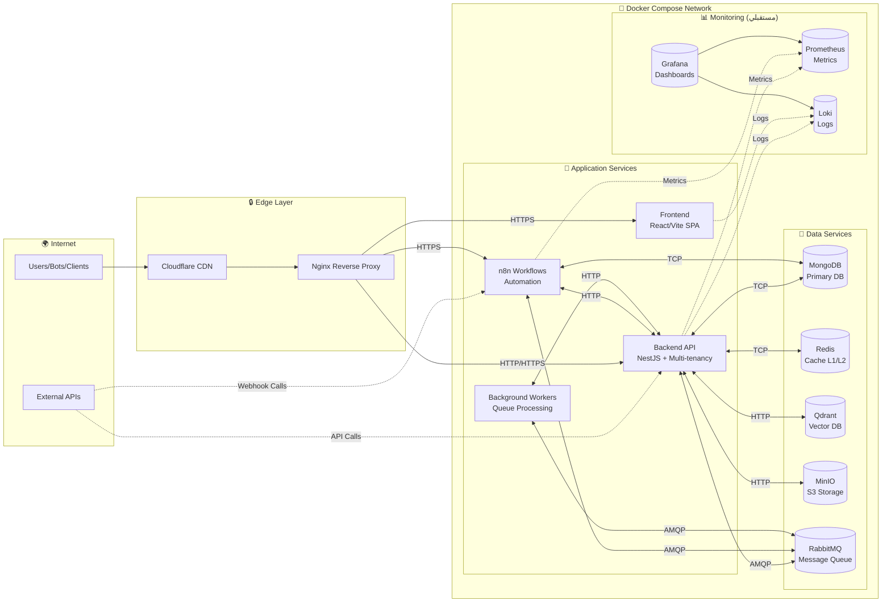
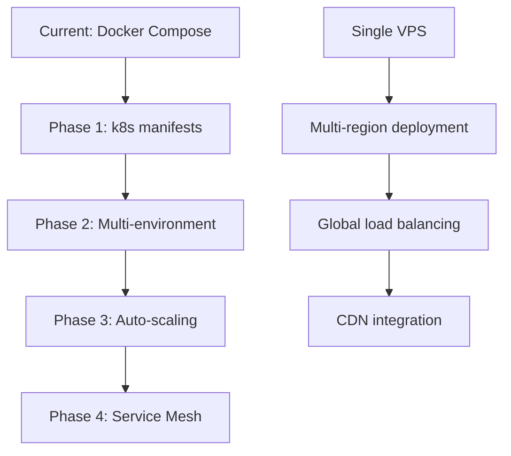

# 🌐 Network Topology (الحالي - Docker Compose)

## 🏗️ **البنية التحتية الحالية**

### Environment Setup
- **Single VPS**: Ubuntu Server مع Docker + Docker Compose
- **Domain**: `kaleem-ai.com` مع Cloudflare DNS
- **SSL/TLS**: Cloudflare SSL certificates
- **Load Balancing**: Nginx reverse proxy (single instance)

### Service Architecture
- **API Gateway**: Nginx handles routing and SSL termination
- **Service Discovery**: Docker Compose internal networking
- **Database**: MongoDB replica set (single node currently)
- **Cache**: Redis standalone instance
- **Vector DB**: Qdrant standalone instance
- **Storage**: MinIO S3-compatible storage

### Security Layers
- **Perimeter**: Cloudflare WAF + DDoS protection
- **Transport**: HTTPS/TLS encryption everywhere
- **Application**: JWT authentication + rate limiting
- **Network**: Internal Docker network isolation
- **Container**: Non-root users + minimal privileges

## 🔮 **خارطة الطريق المستقبلية**

### Kubernetes Migration

### Advanced Features
- **Multi-region**: Disaster recovery across regions
- **Auto-scaling**: HPA + VPA for dynamic scaling
- **Service Mesh**: Istio for traffic management
- **GitOps**: ArgoCD for declarative deployments
- **Policy Engine**: Kyverno for security policies
