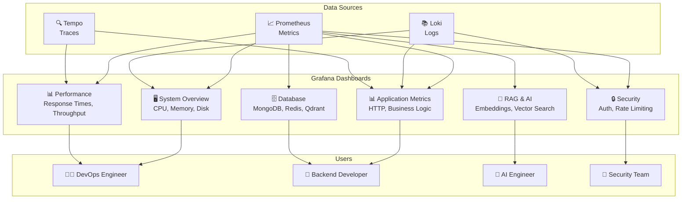

# مخطط لوحات Grafana

## 📊 مخطط لوحات Grafana

## 📋 وصف اللوحات

### مصادر البيانات (Data Sources)

- **Prometheus**: مقاييس النظام والتطبيق
- **Loki**: سجلات التطبيق والنظام
- **Tempo**: آثار التتبع الموزع

### لوحات Grafana (Grafana Dashboards)

- **System Overview**: نظرة عامة على النظام
- **Application Metrics**: مقاييس التطبيق
- **RAG & AI**: مقاييس الذكاء الاصطناعي
- **Database**: مقاييس قواعد البيانات
- **Security**: مقاييس الأمان
- **Performance**: مقاييس الأداء

### المستخدمون (Users)

- **DevOps Engineer**: مراقبة النظام والأداء
- **Backend Developer**: مراقبة التطبيق وقواعد البيانات
- **AI Engineer**: مراقبة الذكاء الاصطناعي
- **Security Team**: مراقبة الأمان

## 🔗 اللوحات الفعلية المُطبقة

| اللوحة              | الملف الفعلي                                    | المستخدم          | الحالة |
| ------------------- | ---------------------------------------------- | ----------------- | ------ |
| API Health          | `api-health.json`                             | Backend Developer | ✅ مُطبق |
| Business KPIs       | `business-kpis.json`                          | Product Manager   | ✅ مُطبق |
| System Overview     | `system-overview.json` (مستقبلاً)             | DevOps Engineer   | 🔄 مخطط |
| RAG & AI            | `ai-metrics.json` (مستقبلاً)                  | AI Engineer       | 🔄 مخطط |
| Database            | `database-metrics.json` (مستقبلاً)            | Backend Developer | 🔄 مخطط |
| Security            | `security-metrics.json` (مستقبلاً)            | Security Team     | 🔄 مخطط |

### اللوحات المُطبقة فعلياً

#### 1. API Health Dashboard
**الملف**: `api-health.json`
**المقاييس**:
- Request Rate (RPS) حسب المسار والطريقة
- Error Rate (5xx %) مع فلترة
- Latency p95 (s) حسب المسار
- DB Query p95 (s) حسب العملية والمجموعة
- Cache Hit Rate (%)
- WS Active Connections

#### 2. Business KPIs Dashboard
**الملف**: `business-kpis.json`
**المقاييس**:
- Merchants Created (معدل/5دقائق)
- n8n Workflows Created (معدل/5دقائق)
- Products Created/Updated/Deleted
- Active Merchants
- Email Verification Success/Failure
- Password Changes
