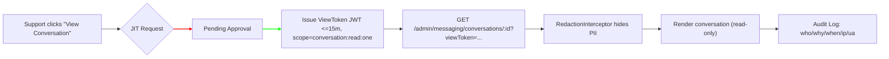

# ADMIN-DASHBOARD.md  
**لوحة تحكم الإدمن (Super Admin) لكليم – مواصفات تنفيذية شاملة**

> مستند تنفيذي مُهيّأ للتسليم والتنفيذ مباشرة على ستاككم (NestJS + Mongo/Mongoose + Redis + BullMQ + Qdrant + MinIO + n8n + Grafana/Loki/Alertmanager + React).  
> **مبدأ أساسي:** لا نكرّر المراقبة؛ نعتمد Grafana كمصدر وحيد للمقاييس، ونحترم الخصوصية: لا نعرض محتوى محادثات العملاء إلا عبر **وصول لحظي JIT** مبرّر ومُدقق ومُخفّى PII.

---

## الفهرس
1) النطاق والهدف  
2) قرار معماري: **AdminModule معزول**  
3) مبادئ التصميم (Privacy-First Ops)  
4) شجرة التنقّل (Navigation)  
5) التكامل مع المراقبة (Grafana/Loki/Alertmanager)  
6) نموذج الخصوصية للمحادثات + JIT (بمخطط Mermaid)  
7) الأدوار والصلاحيات (RBAC)  
8) الصفحات والميزات (Scope + Actions + Acceptance)  
9) العقود البرمجية (API Contracts)  
10) نماذج البيانات (Admin-side Minimal Schemas)  
11) الحراس/المُعترِضات (Guards/Interceptors) – أمثلة  
12) إعدادات ورايات (ENV + Feature Flags)  
13) أمن الواجهة الأمامية (Frontend Security)  
14) خطة الاختبارات والقبول (QA)  
15) SLIs/SLOs ومؤشرات النجاح  
16) خارطة الطريق (Roadmap)  
17) ملاحق مختصرة

---

## 1) النطاق والهدف
- مراقبة وتشغيل المنصّة متعددة المستأجرين دون كشف بيانات حساسة.
- أدوات عمليات فورية (Queues, Cache, Backups, Reindex, n8n).
- جودة الذكاء (Missing Responses) وحوكمة (Audit, Roles, JIT).
- التقارير، الفوترة، والامتثال.

**خارج النطاق:** أي واجهات تخصّ التاجر نفسه (Portal التاجر) أو واجهات العميل النهائي.

---

## 2) القرار المعماري
**نوصي ببناء `/api/admin/*` داخل** `AdminModule` **كباوندِد كونتكست مستقل (سياسات + تنسيق)** فوق خدمات الدومين الحالية.  
- يمنحنا: حوكمة موحّدة (2FA/Reason/JIT/Redaction/Audit) دون تلويث كنترولرات الدومين.  
- **ترقية مستقبلية:** يمكن فصل `AdminModule` إلى تطبيق Nest مستقل عند الحاجة.

هيكل مقترح مختصر:
```
src/modules/admin/
  auth/ (AdminJwt, TwoFactor, Roles)
  policies/ (ReasonGuard, Redaction, Audit)
  merchants/ messaging/ channels/ ops/ catalog/ automation/ observability/ billing/ reports/
```

---

## 3) مبادئ التصميم (Privacy-First Ops)
1. **تقليل البيانات:** افتراضيًا نعرض مؤشرات مجمّعة وميتا فقط.
2. **أقل صلاحية لازمة:** RBAC صارم، وإجراءات حساسة تتطلب 2FA + سبب.
3. **وصول لحظي JIT:** عرض محادثة معيّنة يحتاج طلبًا مبررًا وموافقة وصلاحية مؤقتة.
4. **مصدر مراقبة واحد:** ندمج Grafana/Loki/Alertmanager (روابط/Embed) فقط.
5. **قابلية التتبع:** Audit Log مركزي غير قابل للتلاعب (Append-only).

---

## 4) شجرة التنقّل
- **Home**  
- **Merchants** (ملف تاجر 360°)  
- **Messaging**  
  - Sessions (ميتا فقط)
  - Missing Responses Inbox
  - Channels & Webhooks
- **Automation (n8n)**
- **Catalog & Search** (Qdrant/Indexing)
- **Ops**
  - Services Health (Grafana Embed)
  - Queues (BullMQ)
  - Cache Ops
  - Backups
  - Feature Flags
- **Security & Compliance**
  - Admin Users & Roles (SSO/2FA/Passkeys)
  - Audit Logs
  - Data Requests (RTBF/Export)
- **Billing**
- **Reports**
- **Settings**

---

## 5) التكامل مع المراقبة (بدون تكرار)
- **Grafana (Read-Only):**  
  - توليد روابط عميقة مع متغيرات (`merchantId`, `service`, `channel`).  
  - أو **Embed** عبر iframe بمفتاح قراءة فقط/SSO.
- **Alertmanager:** عرض حالة التنبيهات + زر “افتح في Grafana”.
- **Loki:** روابط بحث جاهزة (لا نعرض السجلات الخام داخل الإدمن إلا عند الضرورة وبصلاحيّات).

**قبول:** لا قواعد إضافية للمقاييس داخل الإدمن. كل الرسم/التنبيه يُفتح في Grafana.

---

## 6) نموذج الخصوصية + JIT (Mermaid)

**افتراضيًا لا نعرض محتوى أي محادثة.** لا يُسمح بالتصدير. Redaction تلقائي، وAudit إلزامي.

---

## 7) الأدوار والصلاحيات (RBAC)
أدوار: `super_admin`, `ops`, `support`, `analyst`, `finance`, `read_only`.

مصفوفة مختصرة:
| ميزة | super_admin | ops | support | analyst | finance | read_only |
|---|---|---|---|---|---|---|
| عرض مؤشرات | ✔︎ | ✔︎ | ✔︎ | ✔︎ | ✔︎ | ✔︎ |
| JIT عرض محادثة | ✔︎ موافقة | ✔︎ موافقة | يطلب فقط | ❌ | ❌ | ❌ |
| Rotate Keys/Webhooks | ✔︎ | ✔︎ | ❌ | ❌ | ❌ | ❌ |
| Flush Cache/Retry Queue | ✔︎ | ✔︎ | ❌ | ❌ | ❌ | ❌ |
| n8n Run/Retry | ✔︎ | ✔︎ | ❌ | ❌ | ❌ | ❌ |
| تقارير واستخدام | ✔︎ | ✔︎ | ✔︎ محدود | ✔︎ | ✔︎ | قراءة فقط |

**إجراءات حساسة:** سبب إجباري (`x-reason`) + 2FA/Passkey.

---

## 8) الصفحات والميزات (Scope + Actions + Acceptance)

### 8.1 Home
- **Scope:** KPIs (التجار النشطون/الجدد، الرسائل اليوم/الأسبوع، زمن الرد، Missing Responses مفتوحة، أخطاء 5xx/Latency من Grafana).  
- **Actions:** روابط للتفاصيل (Grafana/صفحات داخلية).  
- **Acceptance:** لا raw logs؛ بطاقات تُحمِّل بسرعة وتفتح لوحات Grafana.

### 8.2 Merchants 360
- **Scope:** بيانات تاجر، القنوات، الاستهلاك (Requests/LLM/Storage)، أخطاء حديثة (روابط لـ Loki).  
- **Actions:** Impersonation آمن، Rotate Keys، Sync Catalog، Reindex/Embed.  
- **Acceptance:** كل إجراء حساس يسجّل بالأوديت ويتطلب سبب.

### 8.3 Messaging
- **Sessions (Meta-only):** id, channel, merchant, timestamps, state. زر “Request JIT”.  
- **Missing Responses Inbox:** تصنيف/إسناد/حل، “إضافة للمعرفة”، “Replay”.  
- **Channels & Webhooks:** حالة المفاتيح، **تبديل آمن مع فترة تداخل old+new**، اختبار توقيع Webhook.  
- **Acceptance:** لا محتوى محادثة بدون JIT؛ دوران المفاتيح لا يقطع الاستقبال.

### 8.4 Automation (n8n)
- **Scope:** قوائم التدفقات لكل تاجر (tags)، الحالة وآخر تشغيل.  
- **Actions:** Run Now/Retry/Pause/Resume (بقيود وأوديت).  
- **Acceptance:** روابط إلى n8n، وأي تشغيل يدوّن بالأوديت.

### 8.5 Catalog & Search (Qdrant)
- **Scope:** حالة الفهرسة/التضمين، أعداد المنتجات/المعرفة، آخر تحديث.  
- **Actions:** Re-index/Re-embed عبر BullMQ Jobs (سعة محدودة).  
- **Acceptance:** متابعة التقدم، فشل/نجاح، توقيت، وأرشفة نتائج.

### 8.6 Ops
- **Services Health:** Panels Grafana مضمنة (قراءة فقط).  
- **Queues:** waiting/failed/delayed + Retry/Fail.  
- **Cache:** Flush namespace/key مع سبب.  
- **Backups:** آخر نسخة، DR Drill (بيئة معملية).  
- **Feature Flags:** تمكين/تعطيل لكل تاجر أو شريحة.  
- **Acceptance:** جميع الأفعال الحساسة تتطلب `x-reason` وتُسجّل.

### 8.7 Security & Compliance
- **Admin Users & Roles:** SSO/2FA/Passkeys.  
- **Audit Logs:** بحث/فلترة/CSV تنفيذي (بدون PII).  
- **Data Requests (RTBF/Export):** عبر Jobs بموافقة التاجر وسياسة الاحتفاظ.  
- **Acceptance:** لا يمكن إتمام RTBF بدون تحقق/موافقة؛ كل شيء مُدقق.

### 8.8 Billing
- **Scope:** usage counters (requests, LLM tokens, storage) مجمّعة شهريًا، حدود وتنبيهات.  
- **Acceptance:** التطابق مع مصادر القياس (Prom/DB) بهامش معروف.

### 8.9 Reports
- **Scope:** تقارير CSV/Parquet مجدولة إلى MinIO بروابط وقتية.  
- **Acceptance:** انتهاء صلاحية الروابط، عدم تضمين PII.

---

## 9) العقود البرمجية (API Contracts) — مختصر
- `GET /admin/metrics/summary?merchantId=&channel=`  
- `GET /admin/merchants?query=&status=`  
- `GET /admin/merchants/:id`  
- `POST /admin/impersonations {merchantId, reason, ttl}` / `DELETE /admin/impersonations/:id`  
- `GET /admin/messaging/sessions?merchantId=&channel=`  
- `POST /admin/messaging/view-requests {conversationId, reason, ttl}`  
- `POST /admin/messaging/view-requests/:id/approve` → **ViewToken JWT**  
- `GET /admin/messaging/conversations/:id?viewToken=` (Redaction مفعل)  
- `POST /admin/channels/:id/rotate-key {reason}`  
- `POST /admin/catalog/:merchantId/reindex {scope}`  
- `GET /admin/observability/grafana-link?panel=&vars=`  
> جميعها خلف Guards: **AdminJwt + Roles + TwoFactor + Reason** (حسب الحاجة).

---

## 10) نماذج البيانات (Admin-side Minimal Schemas)
```ts
// audit_logs (Append-only)
{ _id, actorId, actorRole, action, resource, resourceId, reason, ip, ua, ts, payloadHash }

// view_requests (JIT)
{ _id, requestedBy, conversationId, reason, ttlMin, status: 'pending|approved|denied', approvedBy?, approvedAt?, viewTokenJti?, createdAt }

// impersonations
{ _id, adminId, merchantId, reason, expAt, active: true, createdAt, revokedAt? }

// feature_flags
{ key, value, audience: 'global|merchant:{id}|role:{name}', updatedAt }

// usage_monthly
{ merchantId, month: 'YYYY-MM', metric: 'requests|llm_tokens|storage_mb', value }
```
---

## 11) Guards/Interceptors – أمثلة مختصرة
```ts
// roles.guard.ts
@Injectable() export class RolesGuard implements CanActivate {
  canActivate(ctx: ExecutionContext) {
    const roles = ctx.switchToHttp().getRequest().user?.roles || [];
    return roles.some(r => ['super_admin','ops','support','analyst','finance','read_only'].includes(r));
  }
}

// reason.guard.ts (يلزم سببًا على الأفعال الحساسة)
@Injectable() export class ReasonGuard implements CanActivate {
  canActivate(ctx: ExecutionContext) {
    const req = ctx.switchToHttp().getRequest();
    if (['POST','PATCH','DELETE'].includes(req.method) && !req.headers['x-reason'])
      throw new ForbiddenException('Reason required');
    return true;
  }
}

// redaction.interceptor.ts (حجب PII)
@Injectable() export class RedactionInterceptor implements NestInterceptor {
  intercept(_, next: CallHandler) {
    return next.handle().pipe(map((data) => redactPII(data)));
  }
}
```

---

## 12) ENV + Feature Flags
- `ADMIN_PRIVACY_MODE=on`  
- `ADMIN_MONITORING_EMBED=on`  
- `ADMIN_GRAFANA_BASE_URL=...`  
- `ADMIN_GRAFANA_RO_API_KEY=...` (قراءة فقط)  
- `ADMIN_JIT_MAX_TTL_MIN=15`  
- `ADMIN_REDACTION_LEVEL=strict|standard|off` (strict افتراضي)

---

## 13) أمن الواجهة الأمامية
- **CSP صارمة**: `frame-ancestors 'self' https://grafana.example.com`، و`connect-src` محدود.  
- Cookies: `HttpOnly` + `Secure` + `SameSite=Lax`.  
- تعطيل رسائل خطأ تفصيلية، وتصفية Sentry/Glitchtip من PII.

---

## 14) خطة الاختبارات والقبول (QA)
- **Unit:** Roles/Reason/TwoFactor/Redaction/Audit.  
- **Integration:** BullMQ (Jobs)، MinIO (Presigned URLs)، Qdrant client.  
- **E2E (Playwright):**  
  1) JIT: طلب → موافقة → عرض مُخفّى → Audit.  
  2) Rotate Webhook Key مع فترة تداخل.  
  3) Reindex Qdrant ومتابعة التقدم.  
- **Performance (k6):** صفحات KPIs < 800ms (باستثناء تحميل iframes).

---

## 15) SLIs/SLOs
- توافر واجهات الإدمن: **≥ 99.9%**.  
- زمن استجابة صفحات المؤشرات: **P95 ≤ 800ms**.  
- وقت الموافقة على JIT: **≤ 5 دقائق**.  
- خفض Missing Responses المفتوحة أسبوعيًا: **≥ 30%** بعد أول شهر.  
- صفر تسريب PII عبر الإدمن: **0 حادث/ربع سنوي**.

---

## 16) خارطة الطريق
1) **MVP:** Home + Merchants 360 + Missing Inbox + Audit + Admin Users + Grafana Embed.  
2) **V1:** JIT + Redaction، Queue/Cache/Keys Ops، n8n Runs، Reindex Qdrant.  
3) **V2:** Feature Flags متقدمة، Data Requests، Billing أعمق، DR Drills، SSO مع Grafana (oauth2-proxy).

---

## 17) ملاحق مختصرة

### (أ) Redaction Regex (خط أولي)
```ts
const REDACT_PATTERNS = [
  /\b\+?\d[\d\s\-]{6,}\b/g,               // هواتف
  /[A-Z0-9._%+-]+@[A-Z0-9.-]+\.[A-Z]{2,}/gi, // إيميلات
  /(\b\d{4}[-\s]?){3}\d{4}\b/g,           // بطاقات
  /\b(\d{9,})\b/g                         // أرقام طويلة (مراجعة لاحقًا)
];
```

### (ب) مثال رابط Grafana
```
GET /admin/observability/grafana-link?panel=dashboardUID&vars=merchantId:123,service:webhooks
→ يعيد URL موقّع/مقيّد للعرض فقط.
```

### (ج) سياسة تبديل Webhook Key
- إنشاء key جديد (active=false)، نشره للتاجر/القناة، **فترة تداخل** حيث old+new كلاهما صالحان، ثم إبطال القديم وسَجّل بالأوديت.

---

## الخلاصة
- **AdminModule** مستقل داخل التطبيق (وقابل للفصل لاحقًا) يمنحنا طبقة سياسات وأمان موحّدة.  
- **لا تكرار للمراقبة**: Grafana/Loki/Alertmanager هي المصدر الوحيد.  
- **الخصوصية أولًا**: لا محتوى محادثة بدون JIT + Redaction + Audit.  
- معايير قبول واضحة وقابلة للقياس، وخارطة طريق عملية للوصول إلى V2 بثقة.
