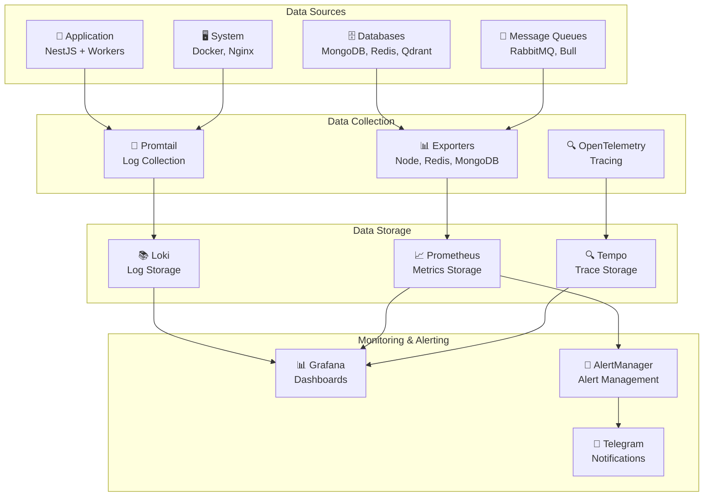

# مخطط تدفق البيانات في نظام المراقبة

## 📊 مخطط تدفق البيانات

## 📋 وصف المكونات

### مصادر البيانات (Data Sources)

- **Application**: التطبيق الرئيسي والعمال
- **Databases**: قواعد البيانات المختلفة
- **Message Queues**: طوابير الرسائل
- **System**: النظام والخدمات

### جمع البيانات (Data Collection)

- **Promtail**: جمع السجلات من الحاويات
- **Exporters**: جمع المقاييس من الخدمات
- **OpenTelemetry**: جمع الآثار الموزعة

### تخزين البيانات (Data Storage)

- **Loki**: تخزين السجلات
- **Prometheus**: تخزين المقاييس
- **Tempo**: تخزين الآثار

### المراقبة والتنبيهات (Monitoring & Alerting)

- **Grafana**: عرض البيانات واللوحات
- **AlertManager**: إدارة التنبيهات
- **Telegram**: إرسال التنبيهات
