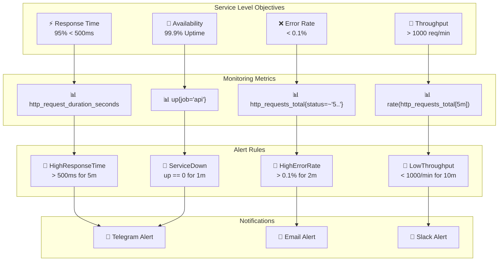

# مخطط SLOs وحدود التنبيه

## 📊 مخطط SLOs وحدود التنبيه

## 📋 وصف SLOs

### SLOs الأداء (Performance SLOs)

- **Response Time**: 95% من الطلبات < 500ms
- **Availability**: 99.9% وقت التشغيل
- **Error Rate**: < 0.1% من الطلبات
- **Throughput**: > 1000 طلب/دقيقة

### مقاييس المراقبة (Monitoring Metrics)

- **http_request_duration_seconds**: مدة استجابة الطلبات
- **up{job='api'}**: حالة الخدمة
- **http_requests_total{status=~'5..'}**: عدد الأخطاء
- **rate(http_requests_total[5m])**: معدل الطلبات

### قواعد التنبيه (Alert Rules)

- **HighResponseTime**: استجابة بطيئة > 500ms
- **ServiceDown**: توقف الخدمة
- **HighErrorRate**: معدل أخطاء عالي > 0.1%
- **LowThroughput**: إنتاجية منخفضة < 1000/min

### التنبيهات (Notifications)

- **Telegram**: تنبيهات فورية عبر Telegram
- **Email**: تنبيهات عبر البريد الإلكتروني
- **Slack**: تنبيهات عبر Slack
