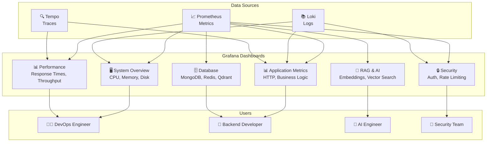

# مخطط لوحات Grafana

## 📊 مخطط لوحات Grafana

## 📋 وصف اللوحات

### مصادر البيانات (Data Sources)

- **Prometheus**: مقاييس النظام والتطبيق
- **Loki**: سجلات التطبيق والنظام
- **Tempo**: آثار التتبع الموزع

### لوحات Grafana (Grafana Dashboards)

- **System Overview**: نظرة عامة على النظام
- **Application Metrics**: مقاييس التطبيق
- **RAG & AI**: مقاييس الذكاء الاصطناعي
- **Database**: مقاييس قواعد البيانات
- **Security**: مقاييس الأمان
- **Performance**: مقاييس الأداء

### المستخدمون (Users)

- **DevOps Engineer**: مراقبة النظام والأداء
- **Backend Developer**: مراقبة التطبيق وقواعد البيانات
- **AI Engineer**: مراقبة الذكاء الاصطناعي
- **Security Team**: مراقبة الأمان

## 🔗 روابط اللوحات

| اللوحة              | الرابط                                                | المستخدم          |
| ------------------- | ----------------------------------------------------- | ----------------- |
| System Overview     | `https://grafana.kaleem-ai.com/d/system-overview`     | DevOps Engineer   |
| Application Metrics | `https://grafana.kaleem-ai.com/d/application-metrics` | Backend Developer |
| RAG & AI            | `https://grafana.kaleem-ai.com/d/rag-ai-metrics`      | AI Engineer       |
| Database            | `https://grafana.kaleem-ai.com/d/database-metrics`    | Backend Developer |
| Security            | `https://grafana.kaleem-ai.com/d/security-metrics`    | Security Team     |
| Performance         | `https://grafana.kaleem-ai.com/d/performance-metrics` | DevOps Engineer   |
