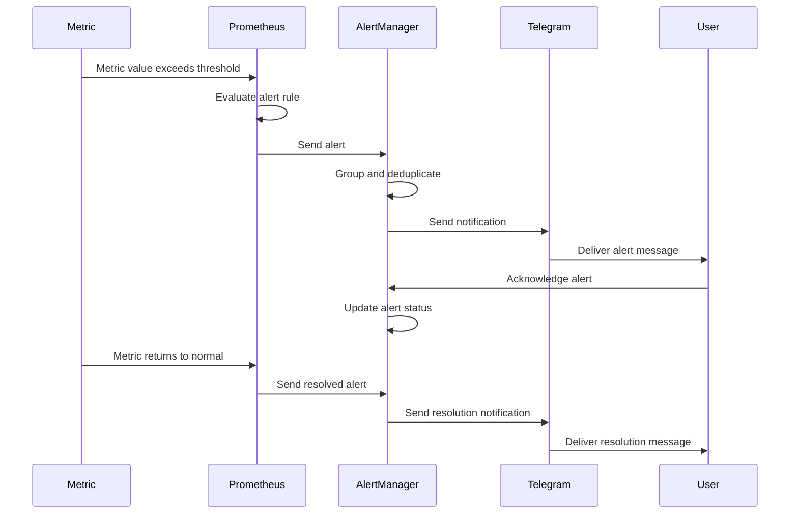

# مخطط دورة حياة التنبيه

## 🔄 مخطط دورة حياة التنبيه

## 📋 وصف دورة حياة التنبيه

### 1. اكتشاف المشكلة (Problem Detection)

- **Metric**: قيمة المقياس تتجاوز الحد المسموح
- **Prometheus**: تقييم قاعدة التنبيه
- **AlertManager**: إرسال التنبيه

### 2. معالجة التنبيه (Alert Processing)

- **Grouping**: تجميع التنبيهات المتشابهة
- **Deduplication**: إزالة التكرار
- **Routing**: توجيه التنبيه للمستقبل المناسب

### 3. إرسال التنبيه (Notification Delivery)

- **Telegram**: إرسال التنبيه عبر Telegram
- **User**: استلام التنبيه
- **Acknowledgment**: تأكيد استلام التنبيه

### 4. حل المشكلة (Problem Resolution)

- **Metric**: عودة المقياس للوضع الطبيعي
- **Prometheus**: إرسال تنبيه الحل
- **AlertManager**: معالجة تنبيه الحل
- **Resolution**: إرسال إشعار الحل

## ⏱️ الأوقات الزمنية

| المرحلة        | الوقت المتوقع | ملاحظات                 |
| -------------- | ------------- | ----------------------- |
| اكتشاف المشكلة | < 15 ثانية    | حسب تكوين Prometheus    |
| إرسال التنبيه  | < 30 ثانية    | حسب تكوين AlertManager  |
| تأكيد التنبيه  | < 5 دقائق     | حسب استجابة المستخدم    |
| حل المشكلة     | متغير         | حسب طبيعة المشكلة       |
| إشعار الحل     | < 30 ثانية    | تلقائي عند عودة المقياس |

## 🚨 أنواع التنبيهات

### تنبيهات حرجة (Critical Alerts)

- **Service Down**: توقف الخدمة
- **Database Down**: توقف قاعدة البيانات
- **High Error Rate**: معدل أخطاء عالي
- **Memory Exhaustion**: نفاد الذاكرة

### تنبيهات تحذيرية (Warning Alerts)

- **High CPU Usage**: استخدام CPU عالي
- **Slow Response Time**: استجابة بطيئة
- **Queue Backlog**: تراكم في الطوابير
- **Disk Space Low**: مساحة قرص منخفضة

### تنبيهات معلوماتية (Info Alerts)

- **Service Restart**: إعادة تشغيل الخدمة
- **Configuration Change**: تغيير في الإعدادات
- **Scheduled Maintenance**: صيانة مجدولة
