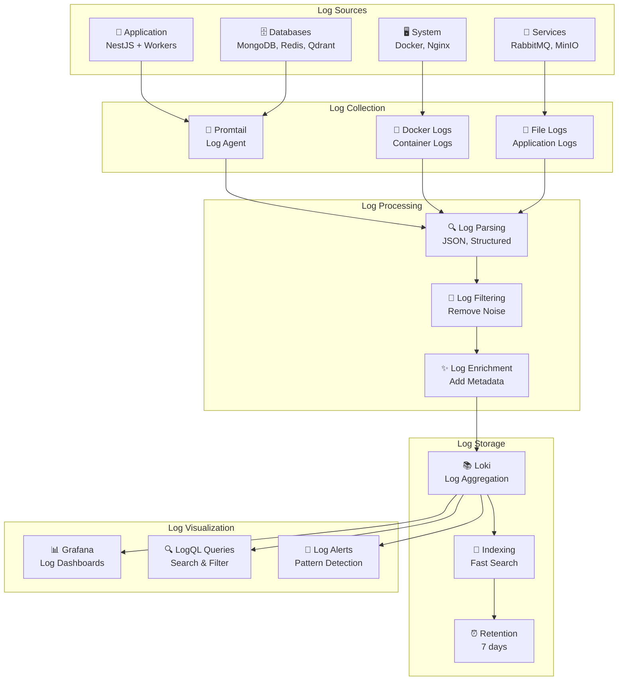

# مخطط معمارية السجلات

## 📝 مخطط معمارية السجلات



## 📋 وصف معمارية السجلات

### مصادر السجلات (Log Sources)

- **Application**: سجلات التطبيق والعمال
- **Databases**: سجلات قواعد البيانات
- **System**: سجلات النظام والخدمات
- **Services**: سجلات الخدمات المساعدة

### جمع السجلات (Log Collection)

- **Promtail**: وكيل جمع السجلات
- **Docker Logs**: سجلات الحاويات
- **File Logs**: سجلات الملفات

### معالجة السجلات (Log Processing)

- **Log Parsing**: تحليل السجلات (JSON، منظمة)
- **Log Filtering**: إزالة الضوضاء
- **Log Enrichment**: إضافة البيانات الوصفية

### تخزين السجلات (Log Storage)

- **Loki**: تجميع السجلات
- **Indexing**: فهرسة للبحث السريع
- **Retention**: الاحتفاظ لمدة 7 أيام

### عرض السجلات (Log Visualization)

- **Grafana**: لوحات السجلات
- **LogQL Queries**: البحث والتصفية
- **Log Alerts**: كشف الأنماط

## 📊 أنواع السجلات

### سجلات التطبيق (Application Logs)

```json
{
  "timestamp": "2024-12-19T10:30:00Z",
  "level": "info",
  "message": "User authentication successful",
  "userId": "user123",
  "ip": "192.168.1.100",
  "userAgent": "Mozilla/5.0...",
  "duration": 150
}
```

### سجلات قاعدة البيانات (Database Logs)

```json
{
  "timestamp": "2024-12-19T10:30:00Z",
  "level": "info",
  "message": "Query executed",
  "collection": "users",
  "operation": "find",
  "duration": 25,
  "query": "{\"status\": \"active\"}"
}
```

### سجلات النظام (System Logs)

```json
{
  "timestamp": "2024-12-19T10:30:00Z",
  "level": "info",
  "message": "Container started",
  "container": "kaleem-api",
  "image": "kaleem-api:latest",
  "status": "running"
}
```

## 🔍 استعلامات LogQL شائعة

### استعلامات الأخطاء

```logql
# أخطاء التطبيق
{job="api"} |= "error" | json | level="error"

# أخطاء قاعدة البيانات
{job="mongodb"} |= "error" | json

# أخطاء النظام
{job="system"} |= "error" | json
```

### استعلامات الأداء

```logql
# استعلامات بطيئة
{job="api"} | json | duration > 1000

# استعلامات قاعدة البيانات البطيئة
{job="mongodb"} | json | duration > 500

# استعلامات الذكاء الاصطناعي البطيئة
{job="ai"} | json | duration > 5000
```

### استعلامات الأمان

```logql
# محاولات تسجيل دخول فاشلة
{job="api"} | json | message =~ ".*authentication failed.*"

# طلبات مشبوهة
{job="api"} | json | statusCode = 403

# نشاط غير عادي
{job="api"} | json | userAgent =~ ".*bot.*"
```

## 📈 لوحات السجلات

### لوحة الأخطاء (Error Dashboard)

- **Error Rate**: معدل الأخطاء
- **Error Types**: أنواع الأخطاء
- **Error Trends**: اتجاهات الأخطاء
- **Error Sources**: مصادر الأخطاء

### لوحة الأداء (Performance Dashboard)

- **Response Times**: أوقات الاستجابة
- **Slow Queries**: استعلامات بطيئة
- **Resource Usage**: استخدام الموارد
- **Bottlenecks**: نقاط الاختناق

### لوحة الأمان (Security Dashboard)

- **Failed Logins**: محاولات تسجيل دخول فاشلة
- **Suspicious Activity**: نشاط مشبوه
- **Rate Limiting**: تحديد المعدل
- **Security Events**: أحداث الأمان
