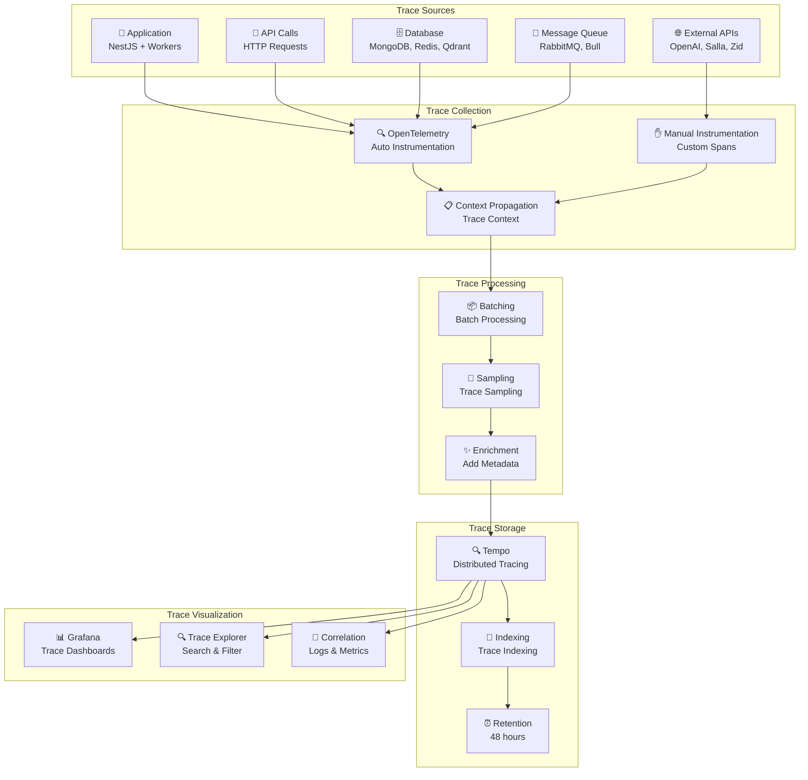

# مخطط معمارية التتبع الموزع

## 🔍 مخطط معمارية التتبع الموزع



## 📋 وصف معمارية التتبع

### مصادر الآثار (Trace Sources)

- **Application**: التطبيق الرئيسي والعمال
- **API Calls**: استدعاءات API
- **Database**: قواعد البيانات
- **Message Queue**: طوابير الرسائل
- **External APIs**: APIs خارجية

### جمع الآثار (Trace Collection)

- **OpenTelemetry**: تتبع تلقائي
- **Manual Instrumentation**: تتبع يدوي
- **Context Propagation**: نشر السياق

### معالجة الآثار (Trace Processing)

- **Batching**: معالجة مجمعة
- **Sampling**: أخذ عينات من الآثار
- **Enrichment**: إضافة البيانات الوصفية

### تخزين الآثار (Trace Storage)

- **Tempo**: تتبع موزع
- **Indexing**: فهرسة الآثار
- **Retention**: الاحتفاظ لمدة 48 ساعة

### عرض الآثار (Trace Visualization)

- **Grafana**: لوحات الآثار
- **Trace Explorer**: استكشاف الآثار
- **Correlation**: ربط السجلات والمقاييس

## 🔍 أنواع الآثار

### آثار التطبيق (Application Traces)

```json
{
  "traceId": "1234567890abcdef",
  "spanId": "abcdef1234567890",
  "parentSpanId": "0987654321fedcba",
  "operationName": "user.login",
  "startTime": "2024-12-19T10:30:00Z",
  "duration": 150,
  "tags": {
    "user.id": "user123",
    "http.method": "POST",
    "http.url": "/api/auth/login"
  }
}
```

### آثار قاعدة البيانات (Database Traces)

```json
{
  "traceId": "1234567890abcdef",
  "spanId": "fedcba0987654321",
  "parentSpanId": "abcdef1234567890",
  "operationName": "mongodb.find",
  "startTime": "2024-12-19T10:30:00Z",
  "duration": 25,
  "tags": {
    "db.system": "mongodb",
    "db.operation": "find",
    "db.collection": "users"
  }
}
```

### آثار API الخارجية (External API Traces)

```json
{
  "traceId": "1234567890abcdef",
  "spanId": "4321fedcba098765",
  "parentSpanId": "abcdef1234567890",
  "operationName": "openai.chat.completions",
  "startTime": "2024-12-19T10:30:00Z",
  "duration": 2000,
  "tags": {
    "http.method": "POST",
    "http.url": "https://api.openai.com/v1/chat/completions",
    "ai.model": "gpt-4"
  }
}
```

## 📊 لوحات التتبع

### لوحة الأداء (Performance Dashboard)

- **Response Time Distribution**: توزيع أوقات الاستجابة
- **Slow Operations**: العمليات البطيئة
- **Error Rate**: معدل الأخطاء
- **Throughput**: الإنتاجية

### لوحة قاعدة البيانات (Database Dashboard)

- **Query Performance**: أداء الاستعلامات
- **Connection Pool**: تجمع الاتصالات
- **Slow Queries**: استعلامات بطيئة
- **Database Errors**: أخطاء قاعدة البيانات

### لوحة API (API Dashboard)

- **Endpoint Performance**: أداء النقاط الطرفية
- **External API Calls**: استدعاءات API خارجية
- **Rate Limiting**: تحديد المعدل
- **API Errors**: أخطاء API

## 🔗 ربط الآثار مع السجلات والمقاييس

### ربط الآثار مع السجلات

```logql
# البحث في السجلات باستخدام traceId
{job="api"} | json | traceId="1234567890abcdef"
```

### ربط الآثار مع المقاييس

```promql
# مقاييس الأداء للآثار
histogram_quantile(0.95, rate(trace_duration_seconds_bucket[5m]))

# مقاييس الأخطاء للآثار
rate(trace_errors_total[5m])
```

## 🎯 استراتيجيات أخذ العينات

### أخذ العينات الثابت (Fixed Sampling)

```yaml
# 10% من الآثار
sampling:
  rate: 0.1
```

### أخذ العينات الديناميكي (Dynamic Sampling)

```yaml
# أخذ عينات أعلى للآثار البطيئة
sampling:
  rules:
    - condition: duration > 1000ms
      rate: 0.5
    - condition: error == true
      rate: 1.0
    - default: 0.1
```

### أخذ العينات المستند إلى التكلفة (Cost-based Sampling)

```yaml
# أخذ عينات بناءً على تكلفة المعالجة
sampling:
  cost_based:
    max_cost_per_second: 100
    cost_per_span: 1
```
