# مخطط C4 - التوزيع والنشر (Deployment Diagram) - منصة Kaleem

## 📋 نظرة عامة

هذا المخطط يوضح توزيع الخدمات على الخوادم والبنية التحتية في منصة Kaleem.

---

## 🎯 المستخدمون والأنظمة الخارجية

### المستخدمون

- **التاجر**: يدير متجره وإعداداته
- **العميل**: يتحدث مع كليم ويشتري
- **الأدمن العام**: يشرف على المنصة

### الأنظمة الخارجية

- **WhatsApp/Telegram**: قنوات التواصل
- **Salla/Zid/Shopify**: منصات التجارة الإلكترونية
- **Payment Gateway**: بوابة الدفع
- **LLM Provider**: خدمة نماذج اللغة
- **Merchant Website**: موقع التاجر

---

## 🏗️ البنية التحتية

### 1. خادم التطبيق الرئيسي (Main Application Server)

#### المواصفات التقنية

- **المعالج**: 8 cores, 3.2 GHz
- **الذاكرة**: 32 GB RAM
- **التخزين**: 500 GB SSD
- **نظام التشغيل**: Ubuntu 22.04 LTS
- **المحمل**: Nginx

#### الخدمات المستضافة

- **API الرئيسي**: NestJS Application
- **عمال الخلفية**: Background Workers
- **منسق الذكاء الاصطناعي**: n8n
- **خدمة التضمين**: Embedding Service
- **خدمة الاستخراج**: Extractor Service

### 2. خادم قاعدة البيانات (Database Server)

#### المواصفات التقنية

- **المعالج**: 4 cores, 2.8 GHz
- **الذاكرة**: 16 GB RAM
- **التخزين**: 1 TB SSD
- **نظام التشغيل**: Ubuntu 22.04 LTS

#### الخدمات المستضافة

- **MongoDB**: قاعدة البيانات الرئيسية
- **Redis**: التخزين المؤقت
- **Qdrant**: قاعدة البيانات المتجهة
- **MinIO**: تخزين الملفات
- **RabbitMQ**: طابور الرسائل

### 3. خادم المراقبة (Monitoring Server)

#### المواصفات التقنية

- **المعالج**: 4 cores, 2.4 GHz
- **الذاكرة**: 8 GB RAM
- **التخزين**: 250 GB SSD
- **نظام التشغيل**: Ubuntu 22.04 LTS

#### الخدمات المستضافة

- **Prometheus**: جمع المقاييس
- **Grafana**: لوحات المراقبة
- **Loki**: جمع السجلات
- **Tempo**: التتبع الموزع
- **AlertManager**: إدارة التنبيهات

### 4. خادم الواجهات الأمامية (Frontend Server)

#### المواصفات التقنية

- **المعالج**: 2 cores, 2.0 GHz
- **الذاكرة**: 4 GB RAM
- **التخزين**: 100 GB SSD
- **نظام التشغيل**: Ubuntu 22.04 LTS
- **المحمل**: Nginx

#### الخدمات المستضافة

- **لوحة الأدمن العام**: React Application
- **لوحة التاجر**: React Application
- **ودجت الويب شات**: JavaScript Widget
- **المتجر المصغّر**: Next.js Application

### 5. خادم التخزين الاحتياطي (Backup Server)

#### المواصفات التقنية

- **المعالج**: 2 cores, 2.0 GHz
- **الذاكرة**: 4 GB RAM
- **التخزين**: 2 TB HDD
- **نظام التشغيل**: Ubuntu 22.04 LTS

#### الخدمات المستضافة

- **نسخ احتياطية**: Automated Backups
- **أرشيف**: Long-term Storage
- **استرداد**: Disaster Recovery

---

## 🌐 الشبكة والاتصال

### 1. شبكة الإنتاج (Production Network)

- **النطاق**: 10.0.0.0/16
- **البوابة**: 10.0.0.1
- **DNS**: 10.0.0.2
- **Load Balancer**: 10.0.0.3

### 2. شبكة المراقبة (Monitoring Network)

- **النطاق**: 10.1.0.0/16
- **البوابة**: 10.1.0.1
- **مراقبة**: 10.1.0.2

### 3. شبكة التخزين (Storage Network)

- **النطاق**: 10.2.0.0/16
- **البوابة**: 10.2.0.1
- **تخزين**: 10.2.0.2

---

## 🔧 التكوين والأمان

### 1. تكوين Nginx

```nginx
# Load Balancer Configuration
upstream kaleem_api {
    server 10.0.0.10:3000;
    server 10.0.0.11:3000;
    server 10.0.0.12:3000;
}

upstream kaleem_frontend {
    server 10.0.0.20:80;
    server 10.0.0.21:80;
}

server {
    listen 80;
    server_name kaleem-ai.com;

    location /api/ {
        proxy_pass http://kaleem_api;
        proxy_set_header Host $host;
        proxy_set_header X-Real-IP $remote_addr;
    }

    location / {
        proxy_pass http://kaleem_frontend;
        proxy_set_header Host $host;
        proxy_set_header X-Real-IP $remote_addr;
    }
}
```

### 2. تكوين Docker Compose

```yaml
version: "3.8"
services:
  api:
    image: kaleem/api:latest
    ports:
      - "3000:3000"
    environment:
      - NODE_ENV=production
      - MONGODB_URI=mongodb://10.0.0.30:27017/kaleem
      - REDIS_URL=redis://10.0.0.31:6379
    networks:
      - production

  mongodb:
    image: mongo:5
    ports:
      - "27017:27017"
    volumes:
      - /data/mongodb:/data/db
    networks:
      - production
```

### 3. تكوين الأمان

- **Firewall**: UFW مع قواعد محددة
- **SSL/TLS**: شهادات Let's Encrypt
- **VPN**: OpenVPN للوصول الآمن
- **Backup**: نسخ احتياطية مشفرة

---

## 📊 مخطط التوزيع (Deployment Diagram)

```mermaid
graph TB
    %% المستخدمون والأنظمة الخارجية
    Merchant[("👨‍💼 التاجر")]
    Shopper[("🛒 العميل")]
    PlatformAdmin[("👨‍💻 الأدمن العام")]
    WhatsApp[("📱 WhatsApp")]
    Telegram[("📱 Telegram")]
    Salla[("🛍️ Salla")]
    Zid[("🛍️ Zid")]
    Shopify[("🛍️ Shopify")]
    Payment[("💳 Payment Gateway")]
    LLM[("🤖 LLM Provider")]
    MerchantSite[("🌐 Merchant Website")]

    %% الإنترنت
    Internet[("🌐 الإنترنت")]

    %% Load Balancer
    LoadBalancer[("⚖️ Load Balancer<br/>Nginx<br/>10.0.0.3")]

    %% خادم التطبيق الرئيسي
    subgraph MainServer["🖥️ خادم التطبيق الرئيسي<br/>8 cores, 32GB RAM, 500GB SSD<br/>10.0.0.10-12"]
        subgraph MainContainers["🐳 حاويات التطبيق"]
            API1["🔧 API الرئيسي<br/>NestJS<br/>Port: 3000"]
            API2["🔧 API الرئيسي<br/>NestJS<br/>Port: 3000"]
            API3["🔧 API الرئيسي<br/>NestJS<br/>Port: 3000"]
            Workers["👷 عمال الخلفية<br/>NestJS<br/>Port: 3001"]
            N8N["🤖 منسق الذكاء الاصطناعي<br/>n8n<br/>Port: 5678"]
            Embedding["🧠 خدمة التضمين<br/>FastAPI<br/>Port: 8000"]
            Extractor["📄 خدمة الاستخراج<br/>FastAPI<br/>Port: 8001"]
        end
    end

    %% خادم قاعدة البيانات
    subgraph DatabaseServer["🗄️ خادم قاعدة البيانات<br/>4 cores, 16GB RAM, 1TB SSD<br/>10.0.0.30-34"]
        subgraph DatabaseContainers["🐳 حاويات قاعدة البيانات"]
            MongoDB["🗄️ MongoDB<br/>Port: 27017"]
            Redis["⚡ Redis<br/>Port: 6379"]
            Qdrant["🔍 Qdrant<br/>Port: 6333"]
            MinIO["📁 MinIO<br/>Port: 9000"]
            RabbitMQ["📨 RabbitMQ<br/>Port: 5672"]
        end
    end

    %% خادم المراقبة
    subgraph MonitoringServer["📊 خادم المراقبة<br/>4 cores, 8GB RAM, 250GB SSD<br/>10.1.0.10-14"]
        subgraph MonitoringContainers["🐳 حاويات المراقبة"]
            Prometheus["📈 Prometheus<br/>Port: 9090"]
            Grafana["📊 Grafana<br/>Port: 3000"]
            Loki["📝 Loki<br/>Port: 3100"]
            Tempo["🔍 Tempo<br/>Port: 3200"]
            AlertManager["🚨 AlertManager<br/>Port: 9093"]
        end
    end

    %% خادم الواجهات الأمامية
    subgraph FrontendServer["🖥️ خادم الواجهات الأمامية<br/>2 cores, 4GB RAM, 100GB SSD<br/>10.0.0.20-21"]
        subgraph FrontendContainers["🐳 حاويات الواجهات"]
            AdminPortal["📊 لوحة الأدمن العام<br/>React<br/>Port: 80"]
            MerchantPortal["🏪 لوحة التاجر<br/>React<br/>Port: 80"]
            WebChat["💬 ودجت الويب شات<br/>JavaScript<br/>Port: 80"]
            Storefront["🛒 المتجر المصغّر<br/>Next.js<br/>Port: 80"]
        end
    end

    %% خادم التخزين الاحتياطي
    subgraph BackupServer["💾 خادم التخزين الاحتياطي<br/>2 cores, 4GB RAM, 2TB HDD<br/>10.2.0.10"]
        subgraph BackupContainers["🐳 حاويات النسخ الاحتياطية"]
            Backup["💾 النسخ الاحتياطية<br/>Automated Backups"]
            Archive["📦 الأرشيف<br/>Long-term Storage"]
            Recovery["🔄 الاسترداد<br/>Disaster Recovery"]
        end
    end

    %% التفاعلات الرئيسية
    PlatformAdmin --> Internet
    Merchant --> Internet
    Shopper --> Internet
    Internet --> LoadBalancer

    %% تفاعلات Load Balancer
    LoadBalancer --> API1
    LoadBalancer --> API2
    LoadBalancer --> API3
    LoadBalancer --> AdminPortal
    LoadBalancer --> MerchantPortal
    LoadBalancer --> WebChat
    LoadBalancer --> Storefront

    %% تفاعلات API مع قاعدة البيانات
    API1 --> MongoDB
    API1 --> Redis
    API1 --> Qdrant
    API1 --> MinIO
    API1 --> RabbitMQ
    API2 --> MongoDB
    API2 --> Redis
    API2 --> Qdrant
    API2 --> MinIO
    API2 --> RabbitMQ
    API3 --> MongoDB
    API3 --> Redis
    API3 --> Qdrant
    API3 --> MinIO
    API3 --> RabbitMQ

    %% تفاعلات العمال
    Workers --> RabbitMQ
    Workers --> Qdrant
    Workers --> MongoDB

    %% تفاعلات n8n
    N8N --> API1
    N8N --> API2
    N8N --> API3
    N8N --> LLM

    %% تفاعلات الخدمات
    Embedding --> API1
    Embedding --> API2
    Embedding --> API3
    Extractor --> API1
    Extractor --> API2
    Extractor --> API3

    %% تفاعلات خارجية
    WhatsApp --> LoadBalancer
    Telegram --> LoadBalancer
    Salla --> LoadBalancer
    Zid --> LoadBalancer
    Shopify --> LoadBalancer
    Payment --> LoadBalancer
    MerchantSite --> LoadBalancer

    %% تفاعلات المراقبة
    Prometheus --> API1
    Prometheus --> API2
    Prometheus --> API3
    Prometheus --> MongoDB
    Prometheus --> Redis
    Prometheus --> Qdrant
    Grafana --> Prometheus
    Grafana --> Loki
    Grafana --> Tempo

    %% تفاعلات النسخ الاحتياطية
    Backup --> MongoDB
    Backup --> Redis
    Backup --> Qdrant
    Backup --> MinIO

    %% التنسيق
    classDef userClass fill:#e1f5fe,stroke:#01579b,stroke-width:2px
    classDef externalClass fill:#fff3e0,stroke:#e65100,stroke-width:2px
    classDef serverClass fill:#f3e5f5,stroke:#7b1fa2,stroke-width:2px
    classDef containerClass fill:#e8f5e8,stroke:#2e7d32,stroke-width:2px
    classDef networkClass fill:#fff8e1,stroke:#f57c00,stroke-width:2px

    class Merchant,Shopper,PlatformAdmin userClass
    class WhatsApp,Telegram,Salla,Zid,Shopify,Payment,LLM,MerchantSite externalClass
    class MainServer,DatabaseServer,MonitoringServer,FrontendServer,BackupServer serverClass
    class API1,API2,API3,Workers,N8N,Embedding,Extractor,MongoDB,Redis,Qdrant,MinIO,RabbitMQ,Prometheus,Grafana,Loki,Tempo,AlertManager,AdminPortal,MerchantPortal,WebChat,Storefront,Backup,Archive,Recovery containerClass
    class Internet,LoadBalancer networkClass
```



---

## 🔧 التفاصيل التقنية

### 1. مواصفات الخوادم

- **خادم التطبيق الرئيسي**: 8 cores, 32GB RAM, 500GB SSD
- **خادم قاعدة البيانات**: 4 cores, 16GB RAM, 1TB SSD
- **خادم المراقبة**: 4 cores, 8GB RAM, 250GB SSD
- **خادم الواجهات الأمامية**: 2 cores, 4GB RAM, 100GB SSD
- **خادم التخزين الاحتياطي**: 2 cores, 4GB RAM, 2TB HDD

### 2. تقنيات الشبكة

- **Load Balancer**: Nginx
- **Firewall**: UFW
- **VPN**: OpenVPN
- **DNS**: Bind9

### 3. تقنيات الحاويات

- **Container Runtime**: Docker
- **Orchestration**: Docker Compose
- **Monitoring**: Prometheus + Grafana
- **Logging**: Loki + Promtail

---

## 📈 مؤشرات الأداء

### 1. مؤشرات الخوادم

- **استخدام CPU**: < 70%
- **استخدام الذاكرة**: < 80%
- **استخدام التخزين**: < 85%
- **وقت الاستجابة**: < 100ms

### 2. مؤشرات الشبكة

- **عرض النطاق**: 1 Gbps
- **زمن الوصول**: < 50ms
- **معدل الخطأ**: < 0.1%
- **الإنتاجية**: > 1000 طلب/ثانية

### 3. مؤشرات قاعدة البيانات

- **وقت الاستعلام**: < 50ms
- **معدل التوفر**: > 99.9%
- **سعة التخزين**: قابلة للتوسع
- **النسخ الاحتياطية**: يومية

---

## 🔒 الأمان

### 1. أمان الشبكة

- **Firewall**: قواعد محددة
- **VPN**: وصول آمن
- **SSL/TLS**: تشفير الاتصالات
- **DDoS Protection**: حماية من الهجمات

### 2. أمان الخوادم

- **تحديثات الأمان**: منتظمة
- **مراقبة الوصول**: مستمرة
- **نسخ احتياطية**: مشفرة
- **تشفير البيانات**: في الراحة

### 3. أمان التطبيقات

- **مصادقة قوية**: JWT
- **تفويض دقيق**: RBAC
- **تشفير البيانات**: AES-256
- **مراقبة الأمان**: مستمرة

---

## 🚀 التطوير المستقبلي

### 1. تحسينات قصيرة المدى

- تحسين أداء الخوادم
- إضافة خوادم إضافية
- تحسين الأمان

### 2. تحسينات متوسطة المدى

- دعم متعدد المناطق
- تحسين التوزيع
- إضافة مراقبة متقدمة

### 3. تحسينات طويلة المدى

- دعم Kubernetes
- ذكاء اصطناعي متقدم
- منصة قابلة للتوسع

---

## 📋 خطة الصيانة

### 1. صيانة يومية

- مراقبة الأداء
- فحص السجلات
- تحديث النسخ الاحتياطية
- مراقبة الأمان

### 2. صيانة أسبوعية

- تحديث النظام
- تنظيف البيانات
- فحص الأمان
- تحليل الأداء

### 3. صيانة شهرية

- تحديث التطبيقات
- فحص البنية التحتية
- تحليل التكاليف
- تخطيط التطوير

---

_آخر تحديث: ديسمبر 2024_  
_الإصدار: 1.0.0_
