# مخطط C4 - نظام المراقبة والمراقبة (Monitoring Diagram) - منصة Kaleem

## 📋 نظرة عامة

هذا المخطط يوضح نظام المراقبة والمراقبة الشامل في منصة Kaleem، والذي يتضمن جمع السجلات، المقاييس، التتبع الموزع، والتنبيهات.

---

## 🎯 المستخدمون والأنظمة الخارجية

### المستخدمون

- **التاجر**: يدير متجره وإعداداته
- **العميل**: يتحدث مع كليم ويشتري
- **الأدمن العام**: يشرف على المنصة
- **فريق DevOps**: يدير البنية التحتية
- **فريق التطوير**: يطور ويحسن التطبيقات
- **فريق الأمان**: يراقب الأمان والتهديدات

### الأنظمة الخارجية

- **WhatsApp/Telegram**: قنوات التواصل
- **Salla/Zid/Shopify**: منصات التجارة الإلكترونية
- **Payment Gateway**: بوابة الدفع
- **LLM Provider**: خدمة نماذج اللغة
- **Merchant Website**: موقع التاجر

---

## 🏗️ نظام المراقبة والمراقبة

### 1. طبقة جمع البيانات (Data Collection Layer)

#### أ) جمع السجلات (Log Collection)

- **Promtail**: جمع سجلات الحاويات
- **Filebeat**: جمع سجلات الملفات
- **Fluentd**: جمع سجلات التطبيقات
- **Logstash**: معالجة وتحويل السجلات

#### ب) جمع المقاييس (Metrics Collection)

- **Prometheus**: جمع المقاييس
- **Node Exporter**: مقاييس النظام
- **cAdvisor**: مقاييس الحاويات
- **Custom Exporters**: مقاييس مخصصة

#### ج) جمع التتبع (Tracing Collection)

- **OpenTelemetry**: جمع التتبع الموزع
- **Jaeger**: تتبع الموزع
- **Zipkin**: تتبع الموزع البديل
- **Custom Instrumentation**: تتبع مخصص

### 2. طبقة التخزين (Storage Layer)

#### أ) تخزين السجلات (Log Storage)

- **Loki**: تخزين السجلات
- **Elasticsearch**: تخزين السجلات البديل
- **ClickHouse**: تخزين السجلات عالي الأداء
- **S3**: تخزين السجلات طويل المدى

#### ب) تخزين المقاييس (Metrics Storage)

- **Prometheus**: تخزين المقاييس
- **InfluxDB**: تخزين المقاييس البديل
- **TimescaleDB**: تخزين المقاييس عالي الأداء
- **S3**: تخزين المقاييس طويل المدى

#### ج) تخزين التتبع (Tracing Storage)

- **Tempo**: تخزين التتبع
- **Jaeger**: تخزين التتبع البديل
- **Zipkin**: تخزين التتبع البديل
- **S3**: تخزين التتبع طويل المدى

### 3. طبقة المعالجة (Processing Layer)

#### أ) معالجة السجلات (Log Processing)

- **LogQL**: استعلامات السجلات
- **Grok**: تحليل السجلات
- **Regex**: معالجة النصوص
- **JSON Parser**: تحليل JSON

#### ب) معالجة المقاييس (Metrics Processing)

- **PromQL**: استعلامات المقاييس
- **Recording Rules**: قواعد التسجيل
- **Alerting Rules**: قواعد التنبيه
- **Aggregation**: تجميع البيانات

#### ج) معالجة التتبع (Tracing Processing)

- **Trace Analysis**: تحليل التتبع
- **Span Analysis**: تحليل الـ Spans
- **Dependency Mapping**: رسم التبعيات
- **Performance Analysis**: تحليل الأداء

### 4. طبقة العرض (Visualization Layer)

#### أ) لوحات المراقبة (Monitoring Dashboards)

- **Grafana**: لوحات المراقبة الرئيسية
- **Kibana**: لوحات السجلات
- **Jaeger UI**: واجهة التتبع
- **Custom Dashboards**: لوحات مخصصة

#### ب) التقارير (Reports)

- **Automated Reports**: تقارير تلقائية
- **Scheduled Reports**: تقارير مجدولة
- **Custom Reports**: تقارير مخصصة
- **Alert Reports**: تقارير التنبيهات

### 5. طبقة التنبيهات (Alerting Layer)

#### أ) إدارة التنبيهات (Alert Management)

- **AlertManager**: إدارة التنبيهات
- **PagerDuty**: إدارة الحوادث
- **Slack**: إشعارات الفريق
- **Email**: إشعارات البريد الإلكتروني

#### ب) قنوات التنبيه (Alert Channels)

- **Telegram**: تنبيهات Telegram
- **WhatsApp**: تنبيهات WhatsApp
- **SMS**: تنبيهات SMS
- **Webhook**: تنبيهات Webhook

---

## 🔗 التفاعلات بين المكونات

### 1. تفاعلات جمع البيانات

- **Promtail** → **Loki**: إرسال السجلات
- **Prometheus** → **Prometheus**: تخزين المقاييس
- **OpenTelemetry** → **Tempo**: إرسال التتبع
- **Node Exporter** → **Prometheus**: إرسال مقاييس النظام

### 2. تفاعلات المعالجة

- **Loki** → **Grafana**: عرض السجلات
- **Prometheus** → **Grafana**: عرض المقاييس
- **Tempo** → **Grafana**: عرض التتبع
- **AlertManager** → **Prometheus**: استقبال التنبيهات

### 3. تفاعلات التنبيهات

- **AlertManager** → **Telegram**: إرسال التنبيهات
- **AlertManager** → **Slack**: إرسال التنبيهات
- **AlertManager** → **Email**: إرسال التنبيهات
- **AlertManager** → **Webhook**: إرسال التنبيهات

---

## 📊 مخطط نظام المراقبة (Monitoring Diagram)

```mermaid
graph TB
    %% المستخدمون والأنظمة الخارجية
    Merchant[("👨‍💼 التاجر")]
    Shopper[("🛒 العميل")]
    PlatformAdmin[("👨‍💻 الأدمن العام")]
    DevOps[("🔧 فريق DevOps")]
    Developer[("👨‍💻 فريق التطوير")]
    Security[("🛡️ فريق الأمان")]
    WhatsApp[("📱 WhatsApp")]
    Telegram[("📱 Telegram")]
    Salla[("🛍️ Salla")]
    Zid[("🛍️ Zid")]
    Shopify[("🛍️ Shopify")]
    Payment[("💳 Payment Gateway")]
    LLM[("🤖 LLM Provider")]
    MerchantSite[("🌐 Merchant Website")]

    %% منصة Kaleem
    subgraph Kaleem["🏢 منصة Kaleem"]
        %% طبقة جمع البيانات
        subgraph DataCollection["📊 طبقة جمع البيانات"]
            Promtail["📝 Promtail<br/>جمع سجلات الحاويات"]
            Filebeat["📄 Filebeat<br/>جمع سجلات الملفات"]
            Fluentd["🌊 Fluentd<br/>جمع سجلات التطبيقات"]
            Logstash["⚙️ Logstash<br/>معالجة السجلات"]
            Prometheus["📈 Prometheus<br/>جمع المقاييس"]
            NodeExporter["🖥️ Node Exporter<br/>مقاييس النظام"]
            Cadvisor["🐳 cAdvisor<br/>مقاييس الحاويات"]
            CustomExporters["🔧 Custom Exporters<br/>مقاييس مخصصة"]
            OpenTelemetry["🔍 OpenTelemetry<br/>جمع التتبع"]
            Jaeger["🔍 Jaeger<br/>تتبع الموزع"]
            Zipkin["🔍 Zipkin<br/>تتبع الموزع البديل"]
            CustomInstrumentation["🔧 Custom Instrumentation<br/>تتبع مخصص"]
        end

        %% طبقة التخزين
        subgraph Storage["💾 طبقة التخزين"]
            Loki["📝 Loki<br/>تخزين السجلات"]
            Elasticsearch["🔍 Elasticsearch<br/>تخزين السجلات البديل"]
            ClickHouse["⚡ ClickHouse<br/>تخزين السجلات عالي الأداء"]
            S3Logs["☁️ S3<br/>تخزين السجلات طويل المدى"]
            PrometheusStorage["📈 Prometheus<br/>تخزين المقاييس"]
            InfluxDB["📊 InfluxDB<br/>تخزين المقاييس البديل"]
            TimescaleDB["⏰ TimescaleDB<br/>تخزين المقاييس عالي الأداء"]
            S3Metrics["☁️ S3<br/>تخزين المقاييس طويل المدى"]
            Tempo["🔍 Tempo<br/>تخزين التتبع"]
            JaegerStorage["🔍 Jaeger<br/>تخزين التتبع البديل"]
            ZipkinStorage["🔍 Zipkin<br/>تخزين التتبع البديل"]
            S3Traces["☁️ S3<br/>تخزين التتبع طويل المدى"]
        end

        %% طبقة المعالجة
        subgraph Processing["⚙️ طبقة المعالجة"]
            LogQL["📝 LogQL<br/>استعلامات السجلات"]
            Grok["🔍 Grok<br/>تحليل السجلات"]
            Regex["🔤 Regex<br/>معالجة النصوص"]
            JSONParser["📄 JSON Parser<br/>تحليل JSON"]
            PromQL["📈 PromQL<br/>استعلامات المقاييس"]
            RecordingRules["📝 Recording Rules<br/>قواعد التسجيل"]
            AlertingRules["🚨 Alerting Rules<br/>قواعد التنبيه"]
            Aggregation["📊 Aggregation<br/>تجميع البيانات"]
            TraceAnalysis["🔍 Trace Analysis<br/>تحليل التتبع"]
            SpanAnalysis["🔍 Span Analysis<br/>تحليل الـ Spans"]
            DependencyMapping["🗺️ Dependency Mapping<br/>رسم التبعيات"]
            PerformanceAnalysis["⚡ Performance Analysis<br/>تحليل الأداء"]
        end

        %% طبقة العرض
        subgraph Visualization["📊 طبقة العرض"]
            Grafana["📊 Grafana<br/>لوحات المراقبة الرئيسية"]
            Kibana["🔍 Kibana<br/>لوحات السجلات"]
            JaegerUI["🔍 Jaeger UI<br/>واجهة التتبع"]
            CustomDashboards["🔧 Custom Dashboards<br/>لوحات مخصصة"]
            AutomatedReports["📄 Automated Reports<br/>تقارير تلقائية"]
            ScheduledReports["📅 Scheduled Reports<br/>تقارير مجدولة"]
            CustomReports["🔧 Custom Reports<br/>تقارير مخصصة"]
            AlertReports["🚨 Alert Reports<br/>تقارير التنبيهات"]
        end

        %% طبقة التنبيهات
        subgraph Alerting["🚨 طبقة التنبيهات"]
            AlertManager["🚨 AlertManager<br/>إدارة التنبيهات"]
            PagerDuty["📞 PagerDuty<br/>إدارة الحوادث"]
            Slack["💬 Slack<br/>إشعارات الفريق"]
            Email["📧 Email<br/>إشعارات البريد الإلكتروني"]
            TelegramAlerts["📱 Telegram<br/>تنبيهات Telegram"]
            WhatsAppAlerts["📱 WhatsApp<br/>تنبيهات WhatsApp"]
            SMS["📱 SMS<br/>تنبيهات SMS"]
            Webhook["🔗 Webhook<br/>تنبيهات Webhook"]
        end
    end

    %% التفاعلات الرئيسية
    PlatformAdmin --> Grafana
    DevOps --> Grafana
    Developer --> Grafana
    Security --> Grafana

    %% تفاعلات جمع البيانات
    Promtail --> Loki
    Filebeat --> Elasticsearch
    Fluentd --> ClickHouse
    Logstash --> S3Logs
    Prometheus --> PrometheusStorage
    NodeExporter --> Prometheus
    Cadvisor --> Prometheus
    CustomExporters --> Prometheus
    OpenTelemetry --> Tempo
    Jaeger --> JaegerStorage
    Zipkin --> ZipkinStorage
    CustomInstrumentation --> S3Traces

    %% تفاعلات المعالجة
    Loki --> LogQL
    Elasticsearch --> Grok
    ClickHouse --> Regex
    S3Logs --> JSONParser
    PrometheusStorage --> PromQL
    InfluxDB --> RecordingRules
    TimescaleDB --> AlertingRules
    S3Metrics --> Aggregation
    Tempo --> TraceAnalysis
    JaegerStorage --> SpanAnalysis
    ZipkinStorage --> DependencyMapping
    S3Traces --> PerformanceAnalysis

    %% تفاعلات العرض
    LogQL --> Grafana
    Grok --> Kibana
    Regex --> JaegerUI
    JSONParser --> CustomDashboards
    PromQL --> AutomatedReports
    RecordingRules --> ScheduledReports
    AlertingRules --> CustomReports
    Aggregation --> AlertReports
    TraceAnalysis --> Grafana
    SpanAnalysis --> Kibana
    DependencyMapping --> JaegerUI
    PerformanceAnalysis --> CustomDashboards

    %% تفاعلات التنبيهات
    PromQL --> AlertManager
    RecordingRules --> AlertManager
    AlertingRules --> AlertManager
    Aggregation --> AlertManager
    AlertManager --> PagerDuty
    AlertManager --> Slack
    AlertManager --> Email
    AlertManager --> TelegramAlerts
    AlertManager --> WhatsAppAlerts
    AlertManager --> SMS
    AlertManager --> Webhook

    %% تفاعلات خارجية
    WhatsApp --> Promtail
    Telegram --> Promtail
    Salla --> Promtail
    Zid --> Promtail
    Shopify --> Promtail
    Payment --> Promtail
    LLM --> Promtail
    MerchantSite --> Promtail

    %% التنسيق
    classDef userClass fill:#e1f5fe,stroke:#01579b,stroke-width:2px
    classDef externalClass fill:#fff3e0,stroke:#e65100,stroke-width:2px
    classDef collectionClass fill:#e8f5e8,stroke:#2e7d32,stroke-width:2px
    classDef storageClass fill:#f3e5f5,stroke:#7b1fa2,stroke-width:2px
    classDef processingClass fill:#fff8e1,stroke:#f57c00,stroke-width:2px
    classDef visualizationClass fill:#e0f2f1,stroke:#00695c,stroke-width:2px
    classDef alertingClass fill:#ffebee,stroke:#c62828,stroke-width:2px

    class Merchant,Shopper,PlatformAdmin,DevOps,Developer,Security userClass
    class WhatsApp,Telegram,Salla,Zid,Shopify,Payment,LLM,MerchantSite externalClass
    class Promtail,Filebeat,Fluentd,Logstash,Prometheus,NodeExporter,Cadvisor,CustomExporters,OpenTelemetry,Jaeger,Zipkin,CustomInstrumentation collectionClass
    class Loki,Elasticsearch,ClickHouse,S3Logs,PrometheusStorage,InfluxDB,TimescaleDB,S3Metrics,Tempo,JaegerStorage,ZipkinStorage,S3Traces storageClass
    class LogQL,Grok,Regex,JSONParser,PromQL,RecordingRules,AlertingRules,Aggregation,TraceAnalysis,SpanAnalysis,DependencyMapping,PerformanceAnalysis processingClass
    class Grafana,Kibana,JaegerUI,CustomDashboards,AutomatedReports,ScheduledReports,CustomReports,AlertReports visualizationClass
    class AlertManager,PagerDuty,Slack,Email,TelegramAlerts,WhatsAppAlerts,SMS,Webhook alertingClass
```

---

## 🔧 التفاصيل التقنية

### 1. تقنيات جمع البيانات

- **Promtail**: جمع سجلات Docker
- **Prometheus**: جمع المقاييس
- **OpenTelemetry**: جمع التتبع الموزع
- **Custom Exporters**: مقاييس مخصصة

### 2. تقنيات التخزين

- **Loki**: تخزين السجلات
- **Prometheus**: تخزين المقاييس
- **Tempo**: تخزين التتبع
- **S3**: تخزين طويل المدى

### 3. تقنيات المعالجة

- **LogQL**: استعلامات السجلات
- **PromQL**: استعلامات المقاييس
- **Trace Analysis**: تحليل التتبع
- **Custom Processing**: معالجة مخصصة

### 4. تقنيات العرض

- **Grafana**: لوحات المراقبة
- **Kibana**: لوحات السجلات
- **Jaeger UI**: واجهة التتبع
- **Custom Dashboards**: لوحات مخصصة

### 5. تقنيات التنبيهات

- **AlertManager**: إدارة التنبيهات
- **PagerDuty**: إدارة الحوادث
- **Slack**: إشعارات الفريق
- **Telegram**: تنبيهات فورية

---

## 📈 مؤشرات الأداء

### 1. مؤشرات جمع البيانات

- **معدل الجمع**: > 1000 حدث/ثانية
- **زمن المعالجة**: < 100ms
- **معدل الخطأ**: < 0.1%
- **الذاكرة**: < 512MB

### 2. مؤشرات التخزين

- **سعة التخزين**: قابلة للتوسع
- **وقت الاستعلام**: < 1s
- **معدل التوفر**: > 99.9%
- **النسخ الاحتياطية**: يومية

### 3. مؤشرات المعالجة

- **وقت المعالجة**: < 500ms
- **معدل النجاح**: > 99%
- **الذاكرة**: < 1GB
- **CPU**: < 50%

### 4. مؤشرات العرض

- **وقت التحميل**: < 2s
- **معدل الاستجابة**: > 99%
- **تجربة المستخدم**: تقييم عالي
- **الذاكرة**: < 256MB

### 5. مؤشرات التنبيهات

- **وقت التنبيه**: < 30s
- **معدل التسليم**: > 99%
- **معدل الخطأ**: < 0.1%
- **الذاكرة**: < 128MB

---

## 🔒 الأمان

### 1. أمان جمع البيانات

- **تشفير الاتصالات**: TLS
- **مصادقة**: API Keys
- **تفويض**: RBAC
- **مراقبة**: Audit Logs

### 2. أمان التخزين

- **تشفير البيانات**: AES-256
- **النسخ الاحتياطية**: مشفرة
- **الوصول**: محدود
- **المراقبة**: مستمرة

### 3. أمان المعالجة

- **تشفير المعالجة**: في الذاكرة
- **الوصول**: محدود
- **المراقبة**: مستمرة
- **النسخ الاحتياطية**: منتظمة

### 4. أمان العرض

- **مصادقة**: SSO
- **تفويض**: RBAC
- **تشفير**: HTTPS
- **مراقبة**: مستمرة

### 5. أمان التنبيهات

- **تشفير الرسائل**: PGP
- **مصادقة**: API Keys
- **تفويض**: محدود
- **مراقبة**: مستمرة

---

## 🚀 التطوير المستقبلي

### 1. تحسينات قصيرة المدى

- تحسين أداء جمع البيانات
- إضافة لوحات جديدة
- تحسين التنبيهات
- تحسين الأمان

### 2. تحسينات متوسطة المدى

- دعم المزيد من المصادر
- تحسين المعالجة
- إضافة تحليلات متقدمة
- تحسين التخزين

### 3. تحسينات طويلة المدى

- دعم متعدد المناطق
- ذكاء اصطناعي متقدم
- منصة قابلة للتوسع
- تحليلات تنبؤية

---

## 📋 خطة الصيانة

### 1. صيانة يومية

- مراقبة الأداء
- فحص السجلات
- تحديث النسخ الاحتياطية
- مراقبة الأمان

### 2. صيانة أسبوعية

- تحديث النظام
- تنظيف البيانات
- فحص الأمان
- تحليل الأداء

### 3. صيانة شهرية

- تحديث التطبيقات
- فحص البنية التحتية
- تحليل التكاليف
- تخطيط التطوير

---

_آخر تحديث: ديسمبر 2024_  
_الإصدار: 1.0.0_
