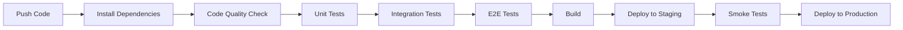

# 🚀 دليل تكامل CI/CD للاختبارات - مشروع كليم

## 🎯 الهدف
إعداد pipeline متكامل للتطوير المستمر (CI/CD) مع تركيز خاص على الاختبارات لضمان جودة عالية وتسليم سريع.

---

## 🏗️ البنية المقترحة

### 📊 **نظرة عامة على Pipeline**


---

## ⚙️ إعداد GitHub Actions

### 📝 **الملف الأساسي: `.github/workflows/ci.yml`**
```yaml
name: 🧪 Testing & Deployment Pipeline

on:
  push:
    branches: [ main, develop ]
  pull_request:
    branches: [ main, develop ]

env:
  NODE_VERSION: '18'
  CACHE_NAME: 'node-modules'

jobs:
  # ===== مرحلة التحضير =====
  setup:
    name: 📦 Setup & Cache
    runs-on: ubuntu-latest
    steps:
      - name: 📥 Checkout code
        uses: actions/checkout@v4

      - name: 📦 Setup Node.js
        uses: actions/setup-node@v4
        with:
          node-version: ${{ env.NODE_VERSION }}
          cache: 'npm'

      - name: 🏗️ Install dependencies
        run: |
          npm ci --prefer-offline --no-audit
          npm run build --if-present

      - name: 💾 Cache node_modules
        uses: actions/cache@v3
        with:
          path: node_modules
          key: ${{ env.CACHE_NAME }}-${{ hashFiles('package-lock.json') }}

  # ===== مرحلة فحص الجودة =====
  quality:
    name: 🔍 Code Quality
    runs-on: ubuntu-latest
    needs: setup
    steps:
      - uses: actions/checkout@v4
      - uses: actions/setup-node@v4
        with:
          node-version: ${{ env.NODE_VERSION }}

      - name: 📥 Restore cache
        uses: actions/cache@v3
        with:
          path: node_modules
          key: ${{ env.CACHE_NAME }}-${{ hashFiles('package-lock.json') }}

      - name: 🔍 ESLint
        run: npm run lint

      - name: 🎨 Prettier
        run: npm run format:check

      - name: 📏 TypeScript
        run: npm run type-check

  # ===== مرحلة الاختبارات =====
  test:
    name: 🧪 Tests
    runs-on: ubuntu-latest
    needs: setup
    strategy:
      matrix:
        test-type: [unit, integration]
    steps:
      - uses: actions/checkout@v4
      - uses: actions/setup-node@v4
        with:
          node-version: ${{ env.NODE_VERSION }}

      - name: 📥 Restore cache
        uses: actions/cache@v3
        with:
          path: node_modules
          key: ${{ env.CACHE_NAME }}-${{ hashFiles('package-lock.json') }}

      - name: 🧪 Run ${{ matrix.test-type }} tests
        run: |
          if [ "${{ matrix.test-type }}" = "unit" ]; then
            npm run test -- --coverage --reporter=junit --outputFile=test-results.xml
          else
            npm run test:integration
          fi

      - name: 📊 Upload coverage
        if: matrix.test-type == 'unit'
        uses: codecov/codecov-action@v3
        with:
          file: ./coverage/lcov.info
          flags: unittests
          name: codecov-umbrella

      - name: 📋 Publish test results
        uses: dorny/test-reporter@v1
        if: matrix.test-type == 'unit' && always()
        with:
          name: Unit Test Results
          path: test-results.xml
          reporter: jest-junit

  # ===== اختبارات E2E =====
  e2e:
    name: 🎭 E2E Tests
    runs-on: ubuntu-latest
    needs: [quality, test]
    if: github.event_name == 'push' && github.ref == 'refs/heads/main'
    steps:
      - uses: actions/checkout@v4
      - uses: actions/setup-node@v4
        with:
          node-version: ${{ env.NODE_VERSION }}

      - name: 📥 Restore cache
        uses: actions/cache@v3
        with:
          path: node_modules
          key: ${{ env.CACHE_NAME }}-${{ hashFiles('package-lock.json') }}

      - name: 🎭 Install Playwright
        run: npx playwright install --with-deps

      - name: 🏗️ Build application
        run: npm run build

      - name: 🚀 Start preview server
        run: npm run preview &
        
      - name: ⏳ Wait for server
        run: npx wait-on http://localhost:4173

      - name: 🎭 Run E2E tests
        run: npx playwright test

      - name: 📸 Upload screenshots
        uses: actions/upload-artifact@v3
        if: failure()
        with:
          name: playwright-screenshots
          path: test-results/

  # ===== مرحلة البناء =====
  build:
    name: 🏗️ Build
    runs-on: ubuntu-latest
    needs: [quality, test]
    steps:
      - uses: actions/checkout@v4
      - uses: actions/setup-node@v4
        with:
          node-version: ${{ env.NODE_VERSION }}

      - name: 📥 Restore cache
        uses: actions/cache@v3
        with:
          path: node_modules
          key: ${{ env.CACHE_NAME }}-${{ hashFiles('package-lock.json') }}

      - name: 🏗️ Build
        run: npm run build

      - name: 📦 Upload build artifacts
        uses: actions/upload-artifact@v3
        with:
          name: build-files
          path: dist/

  # ===== مرحلة النشر =====
  deploy-staging:
    name: 🚀 Deploy to Staging
    runs-on: ubuntu-latest
    needs: [build, e2e]
    if: github.ref == 'refs/heads/develop'
    environment: staging
    steps:
      - name: 📥 Download build artifacts
        uses: actions/download-artifact@v3
        with:
          name: build-files
          path: dist/

      - name: 🚀 Deploy to staging
        run: |
          echo "Deploying to staging..."
          # Add your staging deployment commands here

  deploy-production:
    name: 🚀 Deploy to Production
    runs-on: ubuntu-latest
    needs: [build, e2e]
    if: github.ref == 'refs/heads/main'
    environment: production
    steps:
      - name: 📥 Download build artifacts
        uses: actions/download-artifact@v3
        with:
          name: build-files
          path: dist/

      - name: 🚀 Deploy to production
        run: |
          echo "Deploying to production..."
          # Add your production deployment commands here
```

---

## 🎯 إعدادات متقدمة للاختبارات

### 📊 **ملف تكوين Pipeline: `vitest.config.ci.ts`**
```typescript
import { defineConfig } from 'vitest/config';
import baseConfig from './vitest.config';

export default defineConfig({
  ...baseConfig,
  test: {
    ...baseConfig.test,
    // إعدادات خاصة بـ CI
    reporter: ['verbose', 'junit', 'json'],
    outputFile: {
      junit: './test-results.xml',
      json: './test-results.json'
    },
    coverage: {
      ...baseConfig.test?.coverage,
      reporter: ['text', 'lcov', 'cobertura'],
      reportsDirectory: './coverage'
    },
    // تحسين الأداء في بيئة CI
    maxConcurrency: 3,
    pool: 'threads',
    poolOptions: {
      threads: {
        maxThreads: 3,
        minThreads: 1
      }
    }
  }
});
```

### 🎭 **إعداد Playwright للـ E2E: `playwright.config.ts`**
```typescript
import { defineConfig, devices } from '@playwright/test';

export default defineConfig({
  testDir: './e2e',
  fullyParallel: true,
  forbidOnly: !!process.env.CI,
  retries: process.env.CI ? 2 : 0,
  workers: process.env.CI ? 1 : undefined,
  reporter: process.env.CI ? [
    ['html'],
    ['junit', { outputFile: 'test-results/e2e-results.xml' }]
  ] : 'list',
  use: {
    baseURL: 'http://localhost:4173',
    trace: 'on-first-retry',
    screenshot: 'only-on-failure'
  },
  projects: [
    {
      name: 'chromium',
      use: { ...devices['Desktop Chrome'] },
    },
    {
      name: 'firefox',
      use: { ...devices['Desktop Firefox'] },
    },
    {
      name: 'webkit',
      use: { ...devices['Desktop Safari'] },
    },
    // Mobile viewports
    {
      name: 'Mobile Chrome',
      use: { ...devices['Pixel 5'] },
    },
  ],
  webServer: process.env.CI ? undefined : {
    command: 'npm run preview',
    port: 4173,
    reuseExistingServer: !process.env.CI
  }
});
```

---

## 📊 مراقبة ومتابعة الأداء

### 🎯 **تقرير الأداء التلقائي**
```yaml
# .github/workflows/performance-monitoring.yml
name: 📊 Performance Monitoring

on:
  schedule:
    - cron: '0 6 * * *' # يومياً في 6 صباحاً
  workflow_dispatch:

jobs:
  performance-analysis:
    name: 📊 Analyze Test Performance
    runs-on: ubuntu-latest
    steps:
      - uses: actions/checkout@v4
      - uses: actions/setup-node@v4
        with:
          node-version: '18'

      - name: 📦 Install dependencies
        run: npm ci

      - name: 🧪 Run performance tests
        run: |
          npm run test -- --reporter=json --outputFile=perf-results.json
          
      - name: 📊 Analyze results
        run: |
          node scripts/analyze-performance.js perf-results.json

      - name: 🚨 Create issue if performance degraded
        uses: actions/github-script@v6
        with:
          script: |
            const fs = require('fs');
            const results = JSON.parse(fs.readFileSync('perf-analysis.json'));
            
            if (results.degradation > 20) {
              github.rest.issues.create({
                owner: context.repo.owner,
                repo: context.repo.repo,
                title: '🐌 Test Performance Degradation Detected',
                body: `Performance has degraded by ${results.degradation}%\n\nDetails:\n${results.details}`,
                labels: ['performance', 'urgent']
              });
            }
```

### 📈 **سكريبت تحليل الأداء: `scripts/analyze-performance.js`**
```javascript
const fs = require('fs');

function analyzePerformance(resultsFile) {
  const results = JSON.parse(fs.readFileSync(resultsFile));
  const testTimes = [];
  
  // استخراج أوقات الاختبارات
  results.testResults.forEach(suite => {
    suite.assertionResults.forEach(test => {
      if (test.duration) {
        testTimes.push({
          name: `${suite.name} > ${test.title}`,
          duration: test.duration
        });
      }
    });
  });
  
  // تحليل الأداء
  const sortedTests = testTimes.sort((a, b) => b.duration - a.duration);
  const slowTests = sortedTests.filter(test => test.duration > 1000);
  const averageTime = testTimes.reduce((sum, test) => sum + test.duration, 0) / testTimes.length;
  
  const analysis = {
    totalTests: testTimes.length,
    averageTime: Math.round(averageTime),
    slowTestsCount: slowTests.length,
    slowestTests: sortedTests.slice(0, 10),
    degradation: calculateDegradation(averageTime), // مقارنة مع baseline
    timestamp: new Date().toISOString()
  };
  
  // حفظ النتائج
  fs.writeFileSync('perf-analysis.json', JSON.stringify(analysis, null, 2));
  
  console.log('📊 Performance Analysis:');
  console.log(`- Total tests: ${analysis.totalTests}`);
  console.log(`- Average time: ${analysis.averageTime}ms`);
  console.log(`- Slow tests: ${analysis.slowTestsCount}`);
  
  if (analysis.degradation > 10) {
    console.warn(`⚠️ Performance degradation detected: ${analysis.degradation}%`);
  }
}

function calculateDegradation(currentAverage) {
  const BASELINE_AVERAGE = 500; // ms - يجب تحديثه بناءً على القياسات الفعلية
  return Math.round(((currentAverage - BASELINE_AVERAGE) / BASELINE_AVERAGE) * 100);
}

// تشغيل التحليل
const resultsFile = process.argv[2];
if (resultsFile) {
  analyzePerformance(resultsFile);
} else {
  console.error('Usage: node analyze-performance.js <results-file>');
  process.exit(1);
}
```

---

## 🚨 إدارة الأخطاء والتنبيهات

### 📬 **إعداد التنبيهات: `scripts/setup-alerts.js`**
```javascript
// إعداد تنبيهات Slack/Discord
const { WebClient } = require('@slack/web-api');

const slack = new WebClient(process.env.SLACK_TOKEN);

async function sendTestAlert(type, details) {
  const messages = {
    failure: {
      emoji: '🚨',
      color: 'danger',
      title: 'Test Failure Alert'
    },
    performance: {
      emoji: '🐌',
      color: 'warning', 
      title: 'Performance Degradation'
    },
    success: {
      emoji: '✅',
      color: 'good',
      title: 'All Tests Passing'
    }
  };

  const msg = messages[type];
  
  await slack.chat.postMessage({
    channel: '#testing-alerts',
    attachments: [{
      color: msg.color,
      title: `${msg.emoji} ${msg.title}`,
      fields: [{
        title: 'Details',
        value: details,
        short: false
      }, {
        title: 'Branch',
        value: process.env.GITHUB_REF,
        short: true
      }, {
        title: 'Commit',
        value: process.env.GITHUB_SHA?.slice(0, 7),
        short: true
      }]
    }]
  });
}

module.exports = { sendTestAlert };
```

---

## 🔧 إعدادات البيئة

### 🌍 **متغيرات البيئة: `.env.ci`**
```bash
# متغيرات CI/CD
CI=true
NODE_ENV=test
VITE_API_URL=https://api-staging.kaleem-ai.com

# إعدادات الاختبار
VITEST_REPORTER=verbose
VITEST_COVERAGE=true
VITEST_MAX_WORKERS=3

# إعدادات المراقبة
PERFORMANCE_MONITORING=true
SLACK_WEBHOOK_URL=https://hooks.slack.com/services/...
DISCORD_WEBHOOK_URL=https://discord.com/api/webhooks/...

# إعدادات السلامة
TIMEOUT_FACTOR=2
MAX_TEST_DURATION=30000
FAIL_ON_COVERAGE_THRESHOLD=true
```

### 📋 **إعدادات Package.json للـ CI**
```json
{
  "scripts": {
    "test:ci": "vitest --config vitest.config.ci.ts --run",
    "test:coverage:ci": "vitest --config vitest.config.ci.ts --coverage --run",
    "test:e2e:ci": "playwright test --config playwright.config.ci.ts",
    "lint:ci": "eslint src --ext .ts,.tsx --format junit --output-file lint-results.xml",
    "build:ci": "tsc && vite build --mode production",
    "preview:ci": "vite preview --port 4173 --host",
    "performance:analyze": "node scripts/analyze-performance.js",
    "alerts:setup": "node scripts/setup-alerts.js"
  }
}
```

---

## 🎯 مقاييس النجاح والأهداف

### 📊 **KPIs للـ Pipeline**
```yaml
# أهداف الأداء
Performance_Targets:
  pipeline_duration: "<8 minutes"        # من Push إلى Deploy
  test_execution: "<3 minutes"           # جميع الاختبارات
  build_time: "<2 minutes"               # البناء
  deploy_time: "<1 minute"               # النشر

Quality_Gates:
  test_pass_rate: "100%"                 # معدل نجاح الاختبارات
  code_coverage: ">95%"                  # تغطية الكود
  lint_errors: "0"                       # أخطاء ESLint
  type_errors: "0"                       # أخطاء TypeScript

Reliability_Metrics:
  pipeline_success_rate: ">99%"          # معدل نجاح Pipeline
  false_positive_rate: "<1%"             # معدل الإنذارات الخاطئة
  recovery_time: "<5 minutes"            # وقت الإصلاح
```

### 🏆 **معايير التقييم**
```typescript
interface PipelineHealth {
  performance: {
    averageDuration: number;
    trends: 'improving' | 'stable' | 'degrading';
  };
  quality: {
    testCoverage: number;
    passRate: number;
    codeQuality: 'A+' | 'A' | 'B' | 'C' | 'D';
  };
  reliability: {
    uptime: number;
    failureRate: number;
    mttr: number; // Mean Time To Recovery
  };
}
```

---

## 🚀 تحسينات متقدمة

### ⚡ **تحسين السرعة**
```yaml
# تشغيل متوازي للاختبارات
strategy:
  matrix:
    node-version: [18]
    test-group: [auth, store, admin, landing]
    
parallel_testing:
  auth: "src/**/*auth*.test.tsx"
  store: "src/**/*store*.test.tsx" 
  admin: "src/**/*admin*.test.tsx"
  landing: "src/**/*landing*.test.tsx"
```

### 🧠 **Intelligent Test Selection**
```javascript
// تشغيل الاختبارات المتأثرة فقط
const affectedTests = await getAffectedTests(changedFiles);
if (affectedTests.length > 0) {
  await runTests(affectedTests);
} else {
  console.log('No tests affected by changes');
}
```

### 📦 **Caching Strategy**
```yaml
# تحسين التخزين المؤقت
cache_strategy:
  dependencies: 
    key: ${{ hashFiles('package-lock.json') }}
    path: node_modules
  build_cache:
    key: ${{ hashFiles('src/**') }}
    path: dist
  test_cache:
    key: ${{ hashFiles('src/**/*.test.tsx') }}
    path: coverage
```

---

## 📋 الخلاصة والتوصيات

### ✅ **فوائد هذا الإعداد**
1. **🚀 تسليم سريع** - Pipeline مُحسَّن للسرعة
2. **🛡️ جودة عالية** - اختبارات شاملة ومتعددة المستويات
3. **📊 مراقبة مستمرة** - تتبع الأداء والجودة
4. **🔔 تنبيهات ذكية** - إشعارات فورية للمشاكل
5. **🔄 أتمتة كاملة** - تقليل التدخل اليدوي

### 🎯 **الخطوات التالية**
1. **تطبيق الإعداد الأساسي** وتجربته
2. **ضبط المعايير** بناءً على النتائج الفعلية
3. **إضافة المراقبة المتقدمة** تدريجياً
4. **تحسين الأداء** باستمرار

### 📞 **الدعم والمساعدة**
- 📚 [GitHub Actions Documentation](https://docs.github.com/actions)
- 🎭 [Playwright CI Guide](https://playwright.dev/docs/ci)
- 🧪 [Vitest CI Configuration](https://vitest.dev/guide/cli.html)

---

*تم إنشاء هذا الدليل كجزء من مشروع تحسين الاختبارات. آخر تحديث: ${new Date().toLocaleDateString('ar-SA')}* 📅
