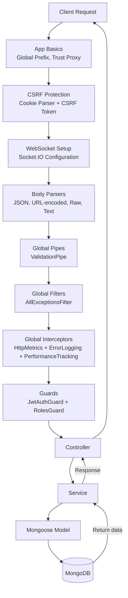

# Request Flow

This document explains how an incoming HTTP request is processed inside the application until it reaches the database. The flow applies to all API routes (e.g. `/api/users`).

## Steps

### 1. **Client Request**
The client sends an HTTP request to an API endpoint under `/api`.

### 2. **App Basics Configuration**
- Sets global prefix to 'api'
- Configures trust proxy for reverse proxy support
- Validates environment variables
- Ensures crypto.randomUUID availability

### 3. **CSRF Protection**
- Cookie parser middleware with secret
- CSRF protection middleware with token generation
- Bypasses CSRF for specific paths (webhooks, docs, health checks)

### 4. **WebSocket Setup**
- Socket.IO configuration for real-time communication
- WebSocket gateway initialization

### 5. **Body Parsers**
- **Webhooks**: JSON + URL-encoded with 2MB limit
- **Regular APIs**: JSON (5MB), URL-encoded (5MB), Raw (1MB), Text (1MB)
- Captures raw body for webhook signature verification

### 6. **Global Pipes**
- `ValidationPipe` validates and transforms incoming DTOs
- Whitelist mode enabled (reject non-whitelisted properties)
- Transform options for automatic type conversion

### 7. **Global Filters**
- `AllExceptionsFilter` handles all types of exceptions
- Converts errors to standardized API responses
- Logs errors with context information

### 8. **Global Interceptors**
- `HttpMetricsInterceptor` records Prometheus metrics
- `ErrorLoggingInterceptor` logs errors with rich context
- `PerformanceTrackingInterceptor` tracks request performance

### 9. **Guards**
- `JwtAuthGuard` verifies JWT tokens for protected routes
- `RolesGuard` checks user role permissions
- Applied to specific routes that require authentication/authorization

### 10. **Controller**
The request is routed to the appropriate controller method (e.g. `UsersController`, `ProductsController`).

### 11. **Service**
Controllers delegate business logic to services (e.g. `UsersService`, `ProductsService`).

### 12. **Mongoose Model**
Services use injected Mongoose models to execute MongoDB queries with:
- Connection pooling
- Read preferences
- Write concerns
- Automatic retry logic

### 13. **MongoDB**
The database returns the result, which flows back through the service and controller to the client.

## Notes

- **Error Handling**: Any error at any step is caught by the global filters and converted to a standardized response
- **Logging**: All requests are logged with request ID, user info, and performance metrics
- **Caching**: Services may use cache layers (L1 memory + L2 Redis) for improved performance
- **Rate Limiting**: Applied at the infrastructure level (reverse proxy)
- **Security**: CSRF protection, input validation, and authentication/authorization checks
