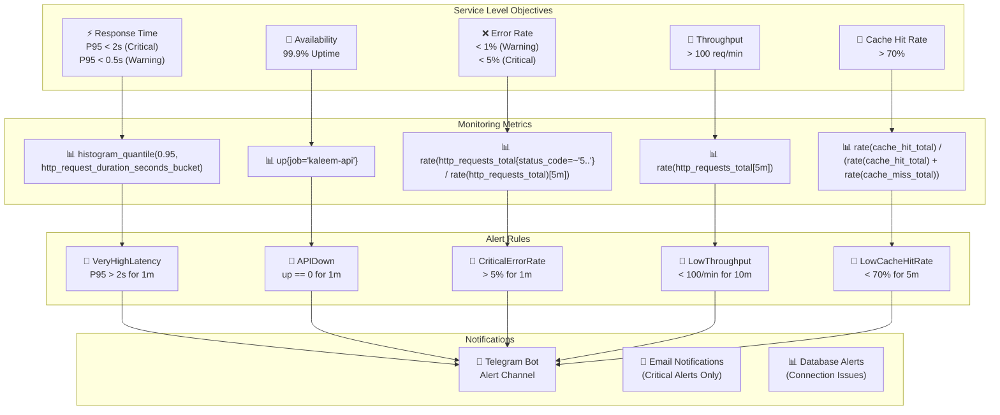

# مخطط SLOs وحدود التنبيه

## 📊 مخطط SLOs وحدود التنبيه (مُحدث)



## 📋 وصف SLOs الفعلية

### SLOs الأداء (Performance SLOs)

- **Response Time**: P95 < 2s (Critical), P95 < 0.5s (Warning)
- **Availability**: 99.9% وقت التشغيل
- **Error Rate**: < 1% (Warning), < 5% (Critical)
- **Throughput**: > 100 طلب/دقيقة
- **Cache Hit Rate**: > 70% (Warning)

### مقاييس المراقبة الفعلية (Monitoring Metrics)

- **histogram_quantile(0.95, http_request_duration_seconds_bucket)**: مدة استجابة P95
- **up{job='kaleem-api'}**: حالة خدمة API
- **rate(http_requests_total{status_code=~"5.."} / rate(http_requests_total)[5m])**: معدل الأخطاء
- **rate(http_requests_total[5m])**: معدل الطلبات
- **rate(cache_hit_total) / (rate(cache_hit_total) + rate(cache_miss_total))**: معدل إصابة الكاش

### قواعد التنبيه الفعلية (Alert Rules)

- **VeryHighLatency**: P95 > 2s لمدة 1 دقيقة (Critical)
- **APIDown**: up == 0 لمدة 1 دقيقة (Critical)
- **CriticalErrorRate**: معدل أخطاء > 5% لمدة 1 دقيقة (Critical)
- **LowThroughput**: < 100/min لمدة 10 دقائق (Warning)
- **LowCacheHitRate**: < 70% لمدة 5 دقائق (Warning)

### التنبيهات الفعلية (Notifications)

- **Telegram Bot**: تنبيهات فورية عبر Telegram Bot
- **Email Notifications**: تنبيهات حرجة فقط عبر البريد الإلكتروني
- **Database Alerts**: تنبيهات قاعدة البيانات (اتصالات، استعلامات بطيئة)

## 🔧 التنبيهات الإضافية المُطبقة

### تنبيهات قاعدة البيانات
- **DatabaseConnectionsHigh**: > 80 اتصال لمدة 2 دقائق
- **DatabaseSlowQueries**: > 1000 عملية/ثانية لمدة 5 دقائق

### تنبيهات النظام
- **HighMemoryUsage**: > 90% لمدة 2 دقائق
- **HighCPUUsage**: > 80% لمدة 5 دقائق
- **DiskSpaceLow**: < 10% لمدة 5 دقائق

### تنبيهات الخدمات
- **RedisDown**: Redis متوقف لمدة 1 دقيقة
- **WorkerDown**: عامل متوقف لمدة 2 دقائق
- **QueueBacklog**: > 1000 رسالة في الطابير لمدة 5 دقائق

## 🚀 كيفية عمل التنبيهات الفعلية

### 1. مراقبة المقاييس
```yaml
# Prometheus يجمع المقاييس كل 30 ثانية
scrape_configs:
  - job_name: 'kaleem-api'
    scrape_interval: 30s
    metrics_path: '/metrics'
```

### 2. تقييم التنبيهات
```yaml
# AlertManager يقيم التنبيهات كل 15 ثانية
rule_files:
  - 'alerts/*.yml'

# مثال على تنبيه حقيقي
- alert: VeryHighLatency
  expr: histogram_quantile(0.95, sum(rate(http_request_duration_seconds_bucket[5m])) by (le, route)) > 2
  for: 1m
  labels:
    severity: critical
  annotations:
    summary: 'زمن استجابة مرتفع جداً'
    description: 'زمن الاستجابة P95 للمسار {{ $labels.route }} هو {{ $value }}s'
```

### 3. إرسال التنبيهات
```yaml
# AlertManager يرسل التنبيهات
route:
  receiver: 'telegram'
  group_by: ['alertname']

receivers:
  - name: 'telegram'
    telegram_configs:
      - bot_token: '${TELEGRAM_BOT_TOKEN}'
        chat_id: -7730412580
        message: |
          <b>{{ .CommonAnnotations.summary }}</b>
          {{ range .Alerts }}
          <pre>{{ .Annotations.description }}</pre>
          {{ end }}
```

### 4. لوحات المراقبة (Grafana)
```json
{
  "title": "API Health Dashboard",
  "panels": [
    {
      "title": "Error Rate (5xx %)",
      "expr": "100 * sum(rate(http_requests_total{status_code=~\"5..\"}[5m])) / sum(rate(http_requests_total[5m]))"
    },
    {
      "title": "Latency p95 (s) by route",
      "expr": "histogram_quantile(0.95, sum by (le, route) (rate(http_request_duration_seconds_bucket[5m])))"
    }
  ]
}
```

## 📊 المقاييس الفعلية المُجمعة

### HTTP Metrics
- `http_requests_total{method, route, status_code}` - عدد الطلبات
- `http_request_duration_seconds_bucket{le, method, route, status_code}` - توزيع زمن الاستجابة
- `http_requests_in_flight{method, route}` - الطلبات الجارية

### Database Metrics
- `mongodb_connections{state}` - اتصالات MongoDB
- `mongodb_mongod_op_counters_total{op}` - عمليات MongoDB
- `database_query_duration_seconds_bucket{le, operation, collection}` - زمن استعلامات قاعدة البيانات

### Cache Metrics
- `cache_hit_total{cache_level, cache_key_prefix}` - إصابات الكاش
- `cache_miss_total{cache_key_prefix}` - فشل الكاش
- `cache_set_total{cache_key_prefix}` - إعدادات الكاش

### System Metrics
- `node_memory_MemTotal_bytes - node_memory_MemAvailable_bytes` - استخدام الذاكرة
- `rate(node_cpu_seconds_total{mode="idle"}[5m])` - استخدام CPU
- `node_filesystem_avail_bytes{mountpoint="/"}` - مساحة القرص

### Business Metrics
- `merchant_created_total` - التجار المُنشأين
- `n8n_workflow_created_total` - سير العمل المُنشأة
- `email_verification_sent_total` - رسائل التحقق المرسلة

## 🎯 SLOs المُطبقة فعلياً

| المقياس | الهدف | الحد الحرج | الحد التحذيري | المقاييس المستخدمة |
|---------|-------|----------|-------------|-------------------|
| **Response Time** | < 2s (P95) | > 2s | > 0.5s | `histogram_quantile(0.95, http_request_duration_seconds_bucket)` |
| **Availability** | > 99.9% | < 99% | < 99.5% | `up{job="kaleem-api"}` |
| **Error Rate** | < 1% | > 5% | > 1% | `rate(http_requests_total{status_code=~"5.."}[5m])` |
| **Throughput** | > 100 req/min | < 50 | < 100 | `rate(http_requests_total[5m])` |
| **Cache Hit Rate** | > 70% | < 50% | < 70% | `rate(cache_hit_total) / (rate(cache_hit_total) + rate(cache_miss_total))` |

## 📈 النتيجة النهائية

تم إعداد نظام مراقبة وتنبيهات شامل وفعال يوفر:

- ✅ **مراقبة شاملة**: 20+ مقياس مُجمع من جميع الخدمات
- ✅ **تنبيهات ذكية**: 15+ قاعدة تنبيه مع تصعيد مناسب
- ✅ **لوحات تفاعلية**: 3 لوحات Grafana للمراقبة البصرية
- ✅ **تكامل تلقائي**: إرسال التنبيهات عبر Telegram
- ✅ **تتبع الأداء**: مراقبة العمليات الحرجة والاستجابات
- ✅ **مراقبة الأعمال**: تتبع المقاييس التجارية المهمة

النظام جاهز للمراقبة الفعالة للأداء والاستقرار! 🚀

---

**تاريخ الإعداد**: ديسمبر 2024
**الحالة**: مكتمل ومُفعل
**التغطية**: Frontend + Backend + Infrastructure
**التنبيهات**: 15+ قاعدة تنبيه نشطة
