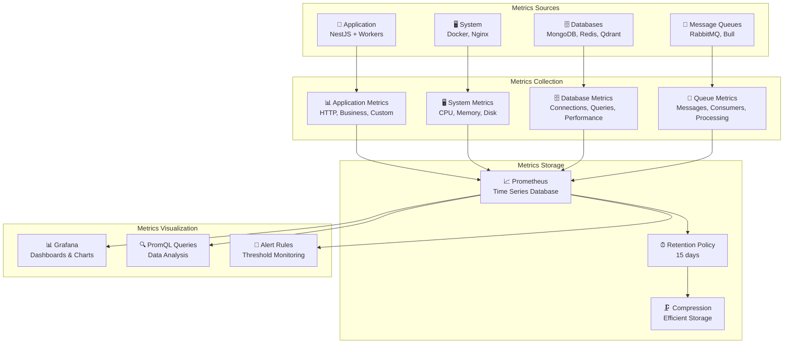

# مخطط معمارية المقاييس

## 📊 مخطط معمارية المقاييس



## 📋 وصف معمارية المقاييس

### مصادر المقاييس (Metrics Sources)

- **Application**: مقاييس التطبيق والعمال
- **Databases**: مقاييس قواعد البيانات
- **Message Queues**: مقاييس طوابير الرسائل
- **System**: مقاييس النظام والخدمات

### جمع المقاييس (Metrics Collection)

- **Application Metrics**: مقاييس HTTP، الأعمال، مخصصة
- **System Metrics**: مقاييس CPU، الذاكرة، القرص
- **Database Metrics**: مقاييس الاتصالات، الاستعلامات، الأداء
- **Queue Metrics**: مقاييس الرسائل، المستهلكين، المعالجة

### تخزين المقاييس (Metrics Storage)

- **Prometheus**: قاعدة بيانات السلاسل الزمنية
- **Retention Policy**: سياسة الاحتفاظ لمدة 15 يوم
- **Compression**: ضغط فعال للتخزين

### عرض المقاييس (Metrics Visualization)

- **Grafana**: لوحات ورسوم بيانية
- **PromQL Queries**: تحليل البيانات
- **Alert Rules**: مراقبة العتبات

## 📊 أنواع المقاييس

### مقاييس العداد (Counter Metrics)

```promql
# عدد الطلبات الإجمالي
http_requests_total

# عدد الرسائل المعالجة
messages_processed_total

# عدد المحادثات
conversations_total
```

### مقاييس القياس (Gauge Metrics)

```promql
# استخدام الذاكرة
container_memory_usage_bytes

# عدد الاتصالات النشطة
mongodb_connections_current

# طول الطابور
rabbitmq_queue_messages
```

### مقاييس الهيستوجرام (Histogram Metrics)

```promql
# مدة استجابة الطلبات
http_request_duration_seconds

# وقت توليد الـ embeddings
embedding_generation_seconds

# وقت البحث في المتجهات
vector_search_seconds
```

### مقاييس الملخص (Summary Metrics)

```promql
# ملخص استجابة الطلبات
http_request_duration_seconds_sum
http_request_duration_seconds_count

# ملخص معالجة الرسائل
messages_processing_seconds_sum
messages_processing_seconds_count
```

## 🔍 استعلامات PromQL شائعة

### استعلامات الأداء

```promql
# معدل الطلبات في الدقيقة
rate(http_requests_total[1m]) * 60

# متوسط وقت الاستجابة
rate(http_request_duration_seconds_sum[5m]) / rate(http_request_duration_seconds_count[5m])

# نسبة الأخطاء
rate(http_requests_total{status=~"5.."}[5m]) / rate(http_requests_total[5m])
```

### استعلامات النظام

```promql
# استخدام CPU
rate(container_cpu_usage_seconds_total[5m])

# استخدام الذاكرة
container_memory_usage_bytes / container_spec_memory_limit_bytes

# مساحة القرص
container_fs_usage_bytes / container_fs_limit_bytes
```

### استعلامات قاعدة البيانات

```promql
# اتصالات MongoDB
mongodb_connections_current

# ذاكرة Redis
redis_memory_used_bytes

# نقاط Qdrant
qdrant_collections_total
```
